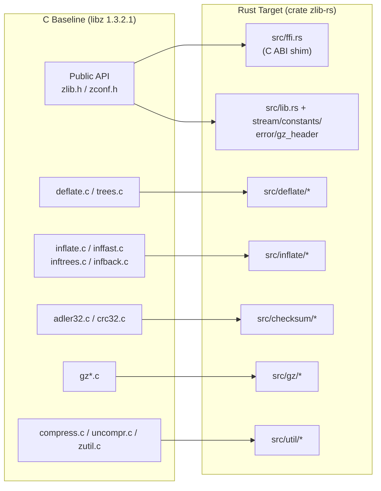
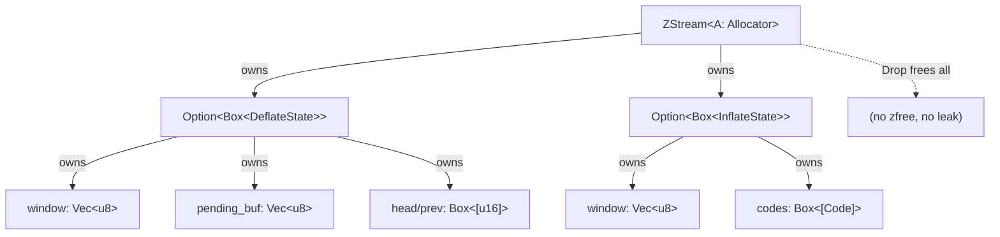

# Technical Specification

# 0. Agent Action Plan

## 0.1 Intent Clarification

### 0.1.1 Core Refactoring Objective

Based on the prompt, the Blitzy platform understands that the refactoring objective is to **produce a production-ready Rust rewrite of the zlib C compression library that replaces all manual memory management with Rust ownership semantics while maintaining full DEFLATE format compatibility and API equivalence.** The target baseline is the zlib source present in this repository, which self-identifies as version `1.3.2.1-motley` with version number `0x1321` [zlib.h:L44-L45]. The rewrite must reproduce the behavior of the 26 core C source and header files at the repository root (≈23,107 lines of C) [doc/technical-specifications.md:§0.2.2].

- **Refactoring type:** Tech stack migration (C → Rust). This is a behavior-preserving, structure-transforming language rewrite — not a feature change. The wire format and public contract are frozen; only the implementation language and memory model change.
- **Target repository:** Same repository. The Rust crate is materialized in-tree alongside (and ultimately replacing) the C baseline; the project catalog already declares `blitzy.com/language: rust` and links a "C-to-Rust Rewrite of zlib" pull request [catalog-info.yaml].

The discrete refactoring goals, restated with enhanced clarity:

- Port every core C translation unit — the DEFLATE engine, the INFLATE engine, the checksum engine, the gzip file-I/O layer, and the shared utilities — into idiomatic, memory-safe Rust modules organized as a single Cargo library crate named `zlib-rs` (import path `zlib_rs`).
- Implement DEFLATE compression and decompression such that compressed output is **byte-identical** to canonical C zlib for the same input, level, strategy, and window configuration.
- Support all three stream framings: raw DEFLATE (RFC 1951), the zlib wrapper (RFC 1950), and the gzip wrapper (RFC 1952), including the `windowBits` overloading convention that selects among them.
- Expose a **C-compatible FFI interface** whose exported symbol names and signatures match the zlib C API exactly, enabling drop-in replacement of `libz` at the binary level.
- Preserve the full compression-level configuration surface: ten levels (`Z_NO_COMPRESSION`=0 through `Z_BEST_COMPRESSION`=9, plus `Z_DEFAULT_COMPRESSION`=-1), five strategies, and seven flush modes [doc/technical-specifications.md:§5.2.1].
- Deliver a full test suite, including compatibility tests that validate output against reference zlib.

Implicit requirements surfaced from the prompt and its constraints (not stated as goals but required for correctness):

- **Binary stream compatibility in both directions** — the rewrite must not only emit zlib-readable streams but must also inflate any stream that canonical zlib can produce (preset dictionaries via `Z_NEED_DICT`, all window sizes, `inflateSync` recovery).
- **Symbol-level FFI fidelity** — matching "the zlib C API signature exactly" implies preserving the `#[repr(C)]` layout of `z_stream` and `gz_header`, the integer return-code values, and the `zalloc`/`zfree`/`opaque` allocator hooks.
- **Unsafe isolation** — "zero unsafe blocks in core compression logic" implies that `unsafe` is permitted only at the FFI boundary and in the narrow performance-critical inflate inner loop, with the entire LZ77/Huffman core remaining safe Rust.
- **Checksum semantics** — Adler-32 (modulo 65521) and CRC-32 (IEEE reflected polynomial) must match bit-for-bit, including the `*_combine` variants.

### 0.1.2 Technical Interpretation

This refactoring translates to the following technical transformation strategy: the six-layer C architecture is re-expressed as a Rust module hierarchy in which manual memory management is replaced by ownership, raw pointers by borrowed slices, integer state variables by exhaustive enums, preprocessor conditionals by Cargo features, and macros by `const`/`#[inline]` functions — while the externally observable byte stream and C ABI remain invariant.

The current-to-target architecture mapping [doc/technical-specifications.md:§5.2]:

| Current C Layer | Representative C Sources | Target Rust Module |
|-----------------|--------------------------|--------------------|
| Public API / constants | zlib.h, zconf.h, zlib.map | `src/lib.rs`, `src/constants.rs`, `src/stream.rs`, `src/gz_header.rs`, `src/error.rs`, `src/ffi.rs` |
| Deflate engine | deflate.c, deflate.h, trees.c, trees.h | `src/deflate/*.rs` |
| Inflate engine | inflate.c, inffast.c, inftrees.c, infback.c, inffixed.h | `src/inflate/*.rs` |
| Checksum engine | adler32.c, crc32.c, crc32.h | `src/checksum/*.rs` |
| Gzip file I/O | gzlib.c, gzread.c, gzwrite.c, gzclose.c, gzguts.h | `src/gz/*.rs` |
| Utilities | compress.c, uncompr.c, zutil.c, zutil.h | `src/util/*.rs` |

The transformation rules applied uniformly across all layers:

- **Manual allocation → ownership:** `ZALLOC`/`ZFREE` and `void* internal_state` become `Option<Box<DeflateState>>` / `Option<Box<InflateState>>`; window and pending buffers become owned `Vec<u8>` / `Box<[u16]>`; `deflateEnd`/`inflateEnd` become `Drop`.
- **Raw pointers → slices:** `next_in`/`next_out` pointer-plus-length pairs become `&[u8]` / `&mut [u8]` with index cursors; pointer arithmetic becomes slice indexing and `copy_within`.
- **Integer state + `switch`/`goto` → enums + `match`:** state machines become `enum DeflateStatus` and `enum InflateMode` with exhaustive matching; `goto inf_leave` becomes a labeled loop break.
- **`#ifdef` → Cargo features:** `GZIP`, `NO_GZCOMPRESS`, and `Z_SOLO` become the `gzip`, `gz-io`, and `no-std` features.
- **Macros → functions/consts:** bit-manipulation and Huffman unrolling macros become `#[inline]` functions and `const` tables.
- **Dual API surface:** an idiomatic Rust API (returning `Result`/`Option`, implementing `Read`/`Write`) sits alongside a thin `#[no_mangle] extern "C"` shim that preserves the exact C ABI [doc/technical-specifications.md:§5.2.1].




## 0.2 Scope Boundaries

### 0.2.1 Exhaustively In Scope

The following source artifacts and target deliverables are in scope. File paths were verified directly against the repository root.

**Core C sources to port (26 files at repository root)** — every file below becomes one or more Rust modules:

- Source (`.c`, 15 files): `adler32.c`, `compress.c`, `crc32.c`, `deflate.c`, `gzclose.c`, `gzlib.c`, `gzread.c`, `gzwrite.c`, `infback.c`, `inffast.c`, `inflate.c`, `inftrees.c`, `trees.c`, `uncompr.c`, `zutil.c`.
- Headers (`.h`, 11 files): `crc32.h`, `deflate.h`, `gzguts.h`, `inffast.h`, `inffixed.h`, `inflate.h`, `inftrees.h`, `trees.h`, `zconf.h`, `zlib.h`, `zutil.h`.

**Public API contract sources** — drive the public Rust surface and the FFI shim:

- `zlib.h` (2,057 LOC; ~85 public functions, all `Z_*` constants, the `z_stream` and `gz_header` structures) [doc/technical-specifications.md:§0.2.2].
- `zconf.h` (configuration constants and type aliases).
- `zlib.map` — the versioned symbol-export map (14 version nodes) that enumerates the exact set of exported C symbols the FFI layer must reproduce [zlib.map].

**Test sources to port** — into the Rust integration test suite:

- `test/example.c` → `tests/regression.rs`, `tests/round_trip.rs`, `tests/interop.rs`, `tests/checksum.rs`.
- `test/infcover.c` → `tests/inflate_coverage.rs`.
- `test/minigzip.c` → `tests/gzip_compat.rs`.

**New Rust crate artifacts to create:** `Cargo.toml`, `Cargo.lock`, `build.rs` (CRC-table generation and cbindgen C-header emission), `README.md`, `benches/{deflate_bench,inflate_bench,checksum_bench}.rs`, and `.github/workflows/ci.yml`. The complete file roster appears in §0.4.1.

**Documentation updates:** `README.md` (new build/usage instructions for the Cargo crate); references in `doc/` and `docs/` that describe the build. The `LICENSE` file is preserved verbatim.

**Rule-mandated deliverable (in scope):** a single self-contained reveal.js HTML **executive presentation**, which the "Executive Presentation" rule requires for every deliverable. This is a documentation/communication artifact for non-technical leadership and is detailed in §0.8.

### 0.2.2 Explicitly Out of Scope

The following are explicitly out of scope, drawn from the prompt's out-of-scope list and from artifacts that the migration removes rather than ports.

**Prompt-specified exclusions (verbatim):**

- bzip2, lzma, or other compression formats
- New compression algorithms
- GUI or tooling beyond the library itself

**C build system (removed, not re-ported)** — replaced by Cargo + `build.rs`: `CMakeLists.txt`, `Makefile`, `Makefile.in`, `configure`, `BUILD.bazel`, `MODULE.bazel`, `zconf.h.in`, `zlib.pc.in`, `zlibConfig.cmake.in`, `.cmake-format.yaml`.

**Legacy platform-packaging directories (obsolete, not migrated)** — verified present at root: `amiga/`, `msdos/`, `os400/`, `qnx/`, `watcom/`, `win32/`.

**Third-party language bindings and contributed examples** — the `contrib/` tree (17 sub-directories including `ada`, `blast`, `delphi`, `dotzlib`, `infback9`, `iostream`, `minizip`, `pascal`, `puff`, `testzlib`, `vstudio`, `zlib1-dll`) provides bindings and demos in other languages and is not part of the core library rewrite.

**Standalone example programs** — `examples/` utilities (`enough.c`, `fitblk.c`, `gun.c`, `gzappend.c`, `gzjoin.c`, `gzlog.c`, `gznorm.c`, `zpipe.c`, `zran.c`) are demonstration tools, not the library; they are out of scope except as REFERENCE patterns for usage documentation.

### 0.2.3 Repository State Reconciliation

A material discrepancy between the in-repository design documentation and the actual working tree must be recorded so downstream agents interpret the transformation modes correctly:

- The working tree contains **zero Rust artifacts**. A repository scan confirms no `*.rs` files, no `src/`, `tests/`, or `benches/` directories, and no `Cargo.toml`/`Cargo.lock`. The tree holds only the C baseline and the design documentation.
- The design documents describe the Rust target as substantially complete — for example, "currently 85.1% per doc/project-guide.md" with a passing test count [doc/technical-specifications.md:§1.2]. **These figures are target/design projections, not code present in the tree.**

The consequence for this Action Plan: **every Rust target file is a `CREATE`**, sourced from its corresponding C file; the only `UPDATE` is `LICENSE` (copied verbatim). The C baseline files are the SOURCE inputs, and the in-repository design documents (`doc/technical-specifications.md`, `doc/project-guide.md`, `docs/index.md`) serve as REFERENCE blueprints whose source-of-truth claims about the existing system are grounded against the actual C files throughout this plan.


## 0.3 Target Design

### 0.3.1 Refactored Crate Structure

The target is a single standalone Cargo library crate, `zlib-rs` (import path `zlib_rs`), edition 2024, with a minimum supported Rust version of 1.85.0 [doc/technical-specifications.md:§0.8.2]. The crate emits both a Rust `rlib` and C-linkable `cdylib`/`staticlib` artifacts so it can serve as a drop-in for `libz`. The complete file and folder layout (≈43–44 Rust files, ~33,724 LOC target) [doc/project-guide.md:§9.1]:

```
zlib-rs/
├── Cargo.toml                  (crate manifest; deps, [features], [lib], [[bench]])
├── Cargo.lock                  (105 packages pinned)
├── build.rs                    (CRC-32 table generation + cbindgen C-header emission)
├── LICENSE                     (zlib license, preserved verbatim)
├── README.md                   (cargo build/test/usage)
├── cbindgen.toml               (optional; C header generation config)
├── .github/workflows/ci.yml    (cargo fetch/build/clippy/fmt/test/bench)
├── src/
│   ├── lib.rs                  (crate root, re-exports, feature gates)   ← zlib.h
│   ├── error.rs                (ZlibError enum + ReturnCode)             ← zutil.h
│   ├── constants.rs            (all Z_* constants)                       ← zlib.h
│   ├── stream.rs               (ZStream<A: Allocator>, 12 fields)        ← zlib.h
│   ├── gz_header.rs            (GzHeader, 13 fields)                     ← zlib.h
│   ├── ffi.rs                  (#[no_mangle] extern "C" C-ABI shim)      ← zlib.h + zlib.map
│   ├── deflate/
│   │   ├── mod.rs    ← deflate.c        ├── state.rs   ← deflate.h
│   │   ├── trees.rs  ← trees.c          ├── strategy.rs← deflate.c
│   │   ├── fast.rs   ← deflate.c        ├── slow.rs    ← deflate.c
│   │   ├── stored.rs ← deflate.c        ├── huff.rs    ← deflate.c
│   │   └── rle.rs    ← deflate.c
│   ├── inflate/
│   │   ├── mod.rs    ← inflate.c        ├── state.rs   ← inflate.h
│   │   ├── fast.rs   ← inffast.c        ├── tables.rs  ← inftrees.c
│   │   ├── fixed.rs  ← inffixed.h       └── back.rs    ← infback.c
│   ├── checksum/
│   │   ├── mod.rs    ← zlib.h           ├── adler32.rs ← adler32.c
│   │   └── crc32.rs  ← crc32.c
│   ├── gz/
│   │   ├── mod.rs    ← gzguts.h         ├── state.rs   ← gzguts.h
│   │   ├── open.rs   ← gzlib.c          ├── read.rs    ← gzread.c
│   │   ├── write.rs  ← gzwrite.c        └── close.rs   ← gzclose.c
│   └── util/
│       ├── mod.rs    ← zutil.h          ├── compress.rs   ← compress.c
│       ├── uncompress.rs ← uncompr.c    └── version.rs    ← zutil.c
├── tests/
│   ├── regression.rs       ← test/example.c
│   ├── inflate_coverage.rs ← test/infcover.c
│   ├── round_trip.rs       ← test/example.c (quickcheck)
│   ├── interop.rs          ← test/example.c (flate2 oracle)
│   ├── gzip_compat.rs      ← test/minigzip.c
│   └── checksum.rs         ← test/example.c (KATs)
└── benches/
    ├── deflate_bench.rs    (criterion)
    ├── inflate_bench.rs    (criterion)
    └── checksum_bench.rs   (criterion)
```

The large generated CRC-32 table file `crc32.h` (9,446 LOC of pre-computed tables) [doc/technical-specifications.md:§0.2.2] is **not** hand-ported; instead `build.rs` regenerates the tables at build time, mirroring the upstream generation approach.

> Reconciliation note: the in-repository blueprint's module roster [doc/technical-specifications.md:§0.4.1] does not enumerate a dedicated `src/ffi.rs`, emphasizing the idiomatic Rust surface and stating only that the migration uses `#[no_mangle] extern "C"` exports [doc/technical-specifications.md:§5.2.1]. Because the prompt **explicitly** requires a C-compatible FFI drop-in whose signatures "match the zlib C API exactly," this plan elevates `src/ffi.rs` (plus cbindgen header generation in `build.rs`) to a first-class, prompt-mandated deliverable. See §0.6.2.

### 0.3.2 Design Pattern Applications

The following Rust patterns replace the corresponding C idioms [doc/technical-specifications.md:§0.4.3]:

- **RAII / `Drop`** — replaces `deflateEnd`, `inflateEnd`, and `gzclose`. `ZStream` owns `Option<Box<DeflateState | InflateState>>`; working buffers are owned `Vec<u8>` / `Box<[u16]>`; teardown is deterministic and leak-free.
- **State-machine enums with exhaustive `match`** — `enum DeflateStatus` (header-emission states) and `enum InflateMode` (30+ decode modes) replace integer state plus `switch`; `goto inf_leave` becomes a labeled `'inf: loop { … break 'inf; }`.
- **Strategy dispatch** — the per-level `configuration_table` becomes `const CONFIG_TABLE: [CompressionConfig; 10]`; the `deflate_fast`/`deflate_slow`/`deflate_stored`/`deflate_rle`/`deflate_huff` functions become modules selected by level.
- **Builder / typed initialization** — `deflateInit2_` / `inflateInit2_` become constructors that validate `windowBits`, `memLevel`, `level`, and `strategy` up front.
- **`Result` / `Option` error handling** — the idiomatic API returns `Result<_, ZlibError>`; the FFI shim converts these into the integer return codes (`Z_OK`=0 … `Z_VERSION_ERROR`=-6).
- **Trait abstractions** — `impl Read/Write/BufRead/Seek` for the gzip layer; an `Allocator` trait, generic on `ZStream<A>`, preserves the `zalloc`/`zfree` semantics and supports `no_std`.
- **Cargo features replace `#ifdef`** — `std`, `gzip`, `gz-io`, `no-std`, `simd`.
- **`const` / `#[inline]` replace macros** — the Adler-32 `DO1`/`DO8`/`DO16` unrolling and the inflate `BITS`/`DROPBITS`/`PULLBYTE` bit macros become inline functions and const tables.
- **`#[repr(C)]`** on `z_stream`, `gz_header`, and `Code` guarantees C-compatible memory layout at the FFI boundary.

### 0.3.3 Reference Implementations and Research

Research recorded in the blueprint [doc/technical-specifications.md:§0.4.2], confirmed and extended during this analysis:

- **zlib-rs (v0.6.0, Trifecta Tech Foundation)** — a ~12K-SLoC safe-Rust port usable as a `flate2` backend; the closest precedent for a byte-compatible, FFI-capable rewrite.
- **miniz_oxide (v0.9.0)** — a pure safe-Rust DEFLATE implementation; useful as a structural reference for the encoder/decoder split.
- **flate2** — high-level `Read`/`Write` wrappers; used here as a **development-only reference oracle** that links canonical C zlib for byte-for-byte validation.
- **FFI tooling — cbindgen (v0.28.0):** the standard tool for generating C/C++ headers from a Rust library that exposes a public C API. It parses `pub extern "C"` functions annotated `#[no_mangle]` and `#[repr(C)]` types and emits matching C declarations, and can be invoked from `build.rs`. `#[no_mangle]` prevents symbol-name mangling so the exported names match the C source, and `extern "C"` enforces the C calling convention. C-linkable artifacts are produced via `crate-type = ["lib", "cdylib", "staticlib"]`.
- **Toolchain currency:** the Rust 2024 edition was stabilized in Rust 1.85.0 (February 2025), which the crate adopts as its MSRV [doc/project-guide.md:§6.1].


## 0.4 Transformation Mapping

### 0.4.1 File-by-File Transformation Plan

Every target Rust file is mapped to its source C file below. Transformation modes: **CREATE** (new file), **UPDATE** (modify existing), **REFERENCE** (use as a pattern). Because the working tree contains no Rust files (§0.2.3), all Rust files are CREATE; `LICENSE` is the sole UPDATE; benches have no C source and use the criterion harness as REFERENCE.

| Target File | Transformation | Source File | Key Changes |
|-------------|---------------|-------------|-------------|
| `Cargo.toml` | CREATE | `CMakeLists.txt` (+`configure`) | Declare crate `zlib-rs`, edition 2024, deps, `[features]`, `[lib] crate-type=["lib","cdylib","staticlib"]`, `[[bench]]` |
| `Cargo.lock` | CREATE | — | Pin 105 packages (6 direct + 99 transitive) [doc/project-guide.md:§6.3] |
| `build.rs` | CREATE | `crc32.h` | Generate CRC-32 tables at build; invoke cbindgen to emit the C header |
| `LICENSE` | UPDATE | `LICENSE` | Preserve the zlib license verbatim |
| `README.md` | CREATE | `README` / `README-cmake.md` | Cargo build/test/usage instructions |
| `.github/workflows/ci.yml` | CREATE | (6 C workflows) | cargo fetch/build/clippy/fmt/test/bench matrix |
| `src/lib.rs` | CREATE | `zlib.h` | Crate root, module declarations, public re-exports, feature gates |
| `src/error.rs` | CREATE | `zutil.h` | `ZlibError` enum + `ReturnCode` (`Z_OK` … `Z_VERSION_ERROR`) |
| `src/constants.rs` | CREATE | `zlib.h` | All `Z_*` constants (flush/level/strategy/method/return codes) |
| `src/stream.rs` | CREATE | `zlib.h` | `ZStream<A: Allocator>` (12 fields), field accessors |
| `src/gz_header.rs` | CREATE | `zlib.h` | `GzHeader` (13 fields, `Option<String>` for text fields) |
| `src/ffi.rs` | CREATE | `zlib.h` + `zlib.map` | `#[no_mangle] pub extern "C"` shims over `#[repr(C)] z_stream`; designated unsafe boundary |
| `src/deflate/mod.rs` | CREATE | `deflate.c` | `deflate()`/`deflateInit2_`/`deflateEnd` orchestration |
| `src/deflate/state.rs` | CREATE | `deflate.h` | `DeflateState` (internal_state ~80 fields → `Vec`/`Box`) |
| `src/deflate/trees.rs` | CREATE | `trees.c` | Huffman tree build/emit; `STATIC_LTREE`/`STATIC_DTREE` |
| `src/deflate/{strategy,fast,slow,stored,huff,rle}.rs` | CREATE | `deflate.c` | Per-level compress functions + `CONFIG_TABLE` dispatch |
| `src/inflate/mod.rs` | CREATE | `inflate.c` | `inflate()`/`inflateInit2_`/`inflateEnd` + `InflateMode` machine |
| `src/inflate/state.rs` | CREATE | `inflate.h` | `InflateState` + `InflateMode` enum (30+ modes) |
| `src/inflate/fast.rs` | CREATE | `inffast.c` | `inflate_fast` hot loop (sole core unsafe site) |
| `src/inflate/tables.rs` | CREATE | `inftrees.c` | `inflate_table()` + `Code{op,bits,val}` |
| `src/inflate/fixed.rs` | CREATE | `inffixed.h` | `LENFIX`/`DISTFIX` fixed Huffman tables |
| `src/inflate/back.rs` | CREATE | `infback.c` | `inflateBack` callback decompression |
| `src/checksum/mod.rs` | CREATE | `zlib.h` | Checksum re-exports |
| `src/checksum/adler32.rs` | CREATE | `adler32.c` | `adler32`/`adler32_z`/`adler32_combine` (BASE=65521, NMAX=5552) |
| `src/checksum/crc32.rs` | CREATE | `crc32.c` | `crc32`/`crc32_z`/`crc32_combine`; SIMD via crc32fast |
| `src/gz/mod.rs` | CREATE | `gzguts.h` | gz module re-exports |
| `src/gz/state.rs` | CREATE | `gzguts.h` | `GzFile` (File + buffers + mode flags GZ_READ=7247/GZ_WRITE=31153) |
| `src/gz/open.rs` | CREATE | `gzlib.c` | `gzopen`/`gzdopen`/`gzbuffer`/`gzsetparams` |
| `src/gz/read.rs` | CREATE | `gzread.c` | `gzread`/`gzgetc`/`gzgets`/`gzungetc` (LOOK/COPY/GZIP substates) |
| `src/gz/write.rs` | CREATE | `gzwrite.c` | `gzwrite`/`gzprintf`/`gzputs`/`gzflush` |
| `src/gz/close.rs` | CREATE | `gzclose.c` | `gzclose`/`gzclose_r`/`gzclose_w` |
| `src/util/mod.rs` | CREATE | `zutil.h` | Util re-exports, `zError` |
| `src/util/compress.rs` | CREATE | `compress.c` | `compress`/`compress2`/`compressBound` |
| `src/util/uncompress.rs` | CREATE | `uncompr.c` | `uncompress`/`uncompress2` |
| `src/util/version.rs` | CREATE | `zutil.c` | `zlibVersion`/`zlibCompileFlags`/`zError` tables |
| `tests/regression.rs` | CREATE | `test/example.c` | 10 baseline regression cases |
| `tests/inflate_coverage.rs` | CREATE | `test/infcover.c` | 6 coverage-harness cases |
| `tests/round_trip.rs` | CREATE | `test/example.c` | quickcheck property round-trips |
| `tests/interop.rs` | CREATE | `test/example.c` | flate2 (C zlib) byte-identical oracle |
| `tests/gzip_compat.rs` | CREATE | `test/minigzip.c` | gzip file-format compatibility |
| `tests/checksum.rs` | CREATE | `test/example.c` | Adler-32 / CRC-32 known-answer tests |
| `benches/{deflate,inflate,checksum}_bench.rs` | CREATE | — (REFERENCE: criterion) | Performance harnesses (gates ≥80% / ≥ / ≥3×) |

### 0.4.2 Cross-File Dependencies

C `#include` relationships collapse into Rust's module tree; cross-translation-unit `extern` declarations become `use` paths. The header-to-module rewrites [doc/technical-specifications.md:§0.5.2]:

- `deflate.h` → `use crate::deflate::state::DeflateState`
- `inflate.h` → `use crate::inflate::state::{InflateState, InflateMode}`
- `zutil.h` → `use crate::error::ZlibError` + `use crate::constants::*`
- `gzguts.h` → `use crate::gz::state::GzState`
- `inftrees.h` → `use crate::inflate::tables::{inflate_table, Code}`
- `inffast.h` → `use crate::inflate::fast::inflate_fast`
- `trees.h` → `use crate::deflate::trees::{StaticTreeDesc, STATIC_LTREE, STATIC_DTREE}`
- `inffixed.h` → `use crate::inflate::fixed::{LENFIX, DISTFIX}`
- `crc32.h` → `use crate::checksum::crc32::CRC_TABLE` (build.rs-generated)
- `zlib.h` public symbols → `zlib_rs` re-exports plus the `src/ffi.rs` `extern "C"` surface

Representative import transformation:

```
// C
#include "deflate.h"
// Rust
use crate::deflate::state::DeflateState;
```

External-reference updates accompany the module rewrites: `Cargo.toml` (`[dependencies]`, `[features]`, `[lib]`), `README.md` (usage: `use zlib_rs::{compress, uncompress};`), and `.github/workflows/ci.yml` (cargo commands). The C header/source split is eliminated — there is no separate declaration file per module.

### 0.4.3 Wildcard Patterns

Where a whole module directory is affected, the following **trailing-only** wildcard patterns apply (never leading patterns):

- `src/deflate/*.rs`
- `src/inflate/*.rs`
- `src/checksum/*.rs`
- `src/gz/*.rs`
- `src/util/*.rs`
- `tests/*.rs`
- `benches/*.rs`

### 0.4.4 One-Phase Execution

The entire refactor is executed by Blitzy in a **single phase**. All ~43–44 Rust files are created together in one cycle; the crate must compile, link (producing the `lib` + `cdylib` + `staticlib` artifacts), and pass the full test suite as one complete unit [doc/technical-specifications.md:§0.5.4]. The work is **not** split into multiple phases.


## 0.5 Dependency Inventory

### 0.5.1 Key Packages

All versions below are the resolved versions produced by `cargo fetch` (105 packages total: 6 direct + 99 transitive) [doc/project-guide.md:§6.3]; where the manifest declares a caret range, both the declared range and the resolved version are shown.

| Registry | Crate | Version | Class | Purpose |
|----------|-------|---------|-------|---------|
| crates.io | `crc32fast` | 1.5.0 | Runtime | SIMD-accelerated CRC-32 (IEEE); backs `src/checksum/crc32.rs`; `no_std`-capable; gated by `simd` |
| crates.io | `cfg-if` | 1.0.4 (manifest `^1.0.0`) | Runtime | Ergonomic `cfg` branching for feature/arch gates |
| crates.io | `cbindgen` | 0.28.0 | Build | Generate the C header (zlib.h-equivalent) from `src/ffi.rs` during `build.rs` |
| crates.io | `criterion` | 0.5.1 | Dev | Statistical benchmarking (`benches/*`) for the performance gates |
| crates.io | `flate2` | 1.1.9 (manifest `^1.1.1`) | Dev | Reference oracle linking canonical C zlib for byte-identical interop validation |
| crates.io | `quickcheck` | 1.1.0 (manifest `^1.0.3`) | Dev | Property-based round-trip testing |
| crates.io | `rand` | 0.9.2 (manifest `^0.9.0`) | Dev | Randomized test-data generation |

Standard-library usage (no external crate): `std::io::{Read, Write, BufRead, Seek}`, `std::fs::File` (gzip I/O), `std::fmt` (error `Display`), and `std::alloc` (allocator). Under the `no-std` feature these are gated off, analogous to the C `Z_SOLO` build.

Toolchain: edition 2024, MSRV Rust 1.85.0; `[lib] crate-type = ["lib", "cdylib", "staticlib"]` so the crate produces both the Rust `rlib` and the C-linkable `.so`/`.a` required for the drop-in.

### 0.5.2 Dependency Changes and Feature Flags

The C zlib library has **zero external library dependencies** (it is self-contained C). The Rust target therefore introduces a small, deliberate dependency set rather than modifying an existing one:

- **Added (runtime):** `crc32fast`, `cfg-if` — two small, widely used crates.
- **Added (build):** `cbindgen` — used only at build time to generate the C header.
- **Added (dev-only):** `criterion`, `flate2`, `quickcheck`, `rand` — never linked into the shipping artifact.

The prompt's "zero unsafe blocks in core compression logic" and the implicit "no C dependency in the shipped library" are both preserved: `flate2` (which links C zlib) is **development-only**. Because no Rust manifest exists yet, there are no dependency removals or upgrades to an existing manifest — `Cargo.toml` is a greenfield CREATE.

Feature flags replace the C preprocessor conditionals [doc/technical-specifications.md:§0.6.3]:

| Cargo Feature | Default | Replaces C Conditional |
|---------------|---------|------------------------|
| `std` | on | default C build (heap + I/O) |
| `gzip` | on | `#ifdef GZIP` |
| `gz-io` | on | `#ifndef NO_GZCOMPRESS` / `NO_GZIP` (implies `std` + `gzip`) |
| `no-std` | off | `Z_SOLO` (mutually exclusive with `std`) |
| `simd` | on | enables `crc32fast` SIMD acceleration |

### 0.5.3 Import Refactoring Rules

- C `#include "x.h"` becomes Rust `use crate::<module>::…` (see the header-to-module table in §0.4.2).
- Files requiring import wiring (trailing wildcards): `src/deflate/*.rs`, `src/inflate/*.rs`, `src/checksum/*.rs`, `src/gz/*.rs`, `src/util/*.rs`, `tests/*.rs`, `benches/*.rs`.
- External-reference updates: `Cargo.toml` (`[dependencies]`/`[features]`/`[lib]`), `README.md` (public-usage examples), `.github/workflows/ci.yml` (cargo commands).
- No legacy "`from big_module import *`"-style consolidation applies, because the Rust crate is greenfield and the module boundaries are defined from the outset.


## 0.6 Special Analysis

This section captures in-depth migration analyses driven by the prompt's four constraints — binary stream compatibility, exact FFI signatures, zero unsafe in the core, and passing the official test vectors — mapped to the C structures they derive from [doc/technical-specifications.md:§0.7].

### 0.6.1 State-Machine Translation

- The deflate header-emission state machine has eight states with their canonical sentinel values: `INIT_STATE`=42, `GZIP_STATE`=57, `EXTRA_STATE`=69, `NAME_STATE`=73, `COMMENT_STATE`=91, `HCRC_STATE`=103, `BUSY_STATE`=113, and `FINISH_STATE`=666 [doc/technical-specifications.md:§5.2.2]. These become an `enum DeflateStatus` evaluated with exhaustive `match`.
- The inflate state machine has 30+ modes (`HEAD` → `FLAGS`/`DICTID`/`TYPE` → `STORED`/`LEN_`/`TABLE` → … → `CHECK` → `LENGTH`/`DONE`, with `BAD` mapping to `Z_DATA_ERROR`) [doc/technical-specifications.md:§5.2.3]. These become an `enum InflateMode` with zero-based discriminants.
- C control flow that relies on `goto inf_leave` and `switch` fall-through is re-expressed with a labeled loop: each `case` becomes a `match` arm, and early exits become `break 'inf`. State lives on the heap-owned state struct rather than being reached through a raw struct pointer.

### 0.6.2 Unsafe and FFI Boundary

The core compression and decompression logic is **100% safe Rust**, satisfying the constraint "zero unsafe blocks in core compression logic." `unsafe` is confined to exactly two zones [doc/technical-specifications.md:§5.2.3]:

- `src/inflate/fast.rs` — the `inflate_fast` inner loop performs bounded window/output copies where eliding bounds checks is performance-critical.
- `src/ffi.rs` — the C-ABI shims dereference raw `*mut z_stream` pointers and marshal C strings.

Target metrics: 47 `unsafe` occurrences across 9 files, 43 carrying `// SAFETY:` comments, and >98% safe Rust by line [doc/project-guide.md:§8.4]. C pointer patterns translate to safe constructs as follows:

| C pattern | Safe Rust equivalent |
|-----------|----------------------|
| `next_in`/`next_out` raw pointer + `avail_*` | `&[u8]` / `&mut [u8]` slices with index cursors |
| `window` / `pending_buf` heap blocks | owned `Vec<u8>` / `Box<[u8]>` |
| `void* state` | `Option<Box<DeflateState | InflateState>>` |
| pointer arithmetic / `memcpy` | slice indexing, `copy_from_slice`, `copy_within` |

**FFI exactness (prompt-critical):** the shim exports `#[no_mangle] pub extern "C"` functions named identically to the zlib C API (`deflateInit_`, `deflate`, `deflateEnd`, `inflate`, `inflateEnd`, `crc32`, `adler32`, `compress2`, `uncompress`, and the rest of the symbol set enumerated in `zlib.map` [zlib.map]) operating over a `#[repr(C)] z_stream` and returning C `int` codes. cbindgen regenerates the C header from these signatures during `build.rs`, so the published ABI tracks the Rust source automatically.

### 0.6.3 Memory Ownership Model

`ZStream` owns `Option<Box<State>>`; all working buffers are owned `Vec`/`Box`; `Drop` replaces `deflateEnd`/`inflateEnd`/`gzclose` with a deterministic, leak-free teardown path. The `zalloc`/`zfree`/`opaque` allocator hooks are preserved at the FFI layer through an `Allocator` trait, so C callers that supply custom allocators continue to work while pure-Rust callers use the global allocator. Double-free and use-after-free are unrepresentable in the safe core because ownership is enforced by the borrow checker.



### 0.6.4 Bit Manipulation and Endianness

The bit accumulator (`hold: u32`/`u64` plus `bits: u32`) is ported directly. The C macros `PULLBYTE`, `NEEDBITS`, `BITS(n)` (= `hold & ((1 << n) - 1)`), `DROPBITS(n)`, and `BYTEBITS` become `#[inline]`/`const fn` helpers. Multi-byte fields are encoded/decoded with `to_le_bytes`/`from_le_bytes` for DEFLATE's LSB-first bit order and big-endian routines for the zlib/gzip header check fields. The behavior is endianness-independent, matching the portable C implementation.

### 0.6.5 Huffman Tables

The `ct_data` union from `deflate.h` becomes `struct HuffmanNode { freq_or_code: u16, dad_or_len: u16 }`; the heap is sized `HEAP_SIZE` = 573 = 2·`L_CODES` + 1. `STATIC_LTREE`/`STATIC_DTREE` are `const` arrays. The decode-side `Code { op: u8, bits: u8, val: u16 }` is `#[repr(C)]`, and the table-build sizing constants `ENOUGH` = 2048 (lengths) / 592 (distances) are preserved exactly so the constructed tables are identical to C. The fixed Huffman tables (`inffixed.h` `LENFIX`/`DISTFIX`) are ported as `const` arrays in `src/inflate/fixed.rs` [doc/technical-specifications.md:§0.7.5].

### 0.6.6 Compression-Level Configuration

`const CONFIG_TABLE: [CompressionConfig; 10]` mirrors the `deflate.c` `configuration_table`: each level 0–9 maps to `(good_length, max_lazy, nice_length, max_chain, compress_fn)`. Level 0 is stored (store-only), levels 1–3 use `deflate_fast`, and levels 4–9 use `deflate_slow` (lazy matching). `Z_DEFAULT_COMPRESSION` (-1) resolves to level 6. Preserving these parameters verbatim guarantees identical LZ77 match decisions [doc/technical-specifications.md:§0.7.6].

### 0.6.7 Bit-Exact Parity and Test-Vector Strategy

Byte-identical output (the binary-compatibility constraint) requires preserving four behaviors precisely:

- LZ77 match selection — lazy-match thresholds, `good_length`/`nice_length`/`max_chain`, and hash-chain insertion order.
- Huffman code construction — frequency counting, canonical code assignment, and tie-breaking.
- Block-boundary and flush decisions across the seven flush modes.
- Stored-vs-static-vs-dynamic block-type selection.

The official-test-vector requirement is satisfied through layered validation: `tests/interop.rs` compares `zlib-rs` output to `flate2` (canonical C zlib) byte-for-byte; `tests/regression.rs` ports the 10 cases in `test/example.c`; `tests/inflate_coverage.rs` ports the 6 cases in `test/infcover.c`; `tests/gzip_compat.rs` exercises the `minigzip` patterns; and `tests/checksum.rs` carries Adler-32/CRC-32 known-answer tests [doc/technical-specifications.md:§6.6]. Decompression must additionally accept any RFC 1951 stream that canonical zlib can produce — covering the `windowBits` overloading ranges (8–15 zlib, −8…−15 raw, 24–31 gzip, 40–47 auto-detect), preset dictionaries signaled by `Z_NEED_DICT`, and `inflateSync` recovery.

### 0.6.8 Open Items and Ambiguities to Flag

- **Dedicated FFI module:** the in-repository blueprint does not enumerate `src/ffi.rs`, but the prompt's explicit C-ABI drop-in requirement mandates it. This plan treats `src/ffi.rs` + cbindgen header generation as required deliverables (§0.3.1, §0.6.2).
- **Document-vs-tree state:** the design documents report substantial Rust completion, yet the working tree contains zero Rust files; all Rust targets are therefore CREATE (§0.2.3).


## 0.7 Refactoring Rules and Constraints

### 0.7.1 Behavior-Preservation Rules

The refactor must preserve the following observable behaviors exactly [doc/technical-specifications.md:§0.8.1]:

- **Byte-identical compressed output** to C zlib for the same input/level/strategy/window — identical LZ77 match decisions, Huffman codes, and block boundaries.
- **RFC conformance** — RFC 1950 (zlib), RFC 1951 (DEFLATE), and RFC 1952 (gzip).
- **All seven flush modes** — `Z_NO_FLUSH`, `Z_PARTIAL_FLUSH`, `Z_SYNC_FLUSH`, `Z_FULL_FLUSH`, `Z_FINISH`, `Z_BLOCK`, `Z_TREES`.
- **`windowBits` overloading** — 8–15 (zlib), −8…−15 (raw), 24–31 (gzip), 40–47 (auto-detect on inflate).
- **Ten compression levels** 0–9 plus `Z_DEFAULT_COMPRESSION` (-1 → level 6), and **five strategies** (`Z_DEFAULT_STRATEGY`, `Z_FILTERED`, `Z_HUFFMAN_ONLY`, `Z_RLE`, `Z_FIXED`).
- **Preset dictionaries** and the `Z_NEED_DICT` handshake; **`inflateSync`** error recovery.
- **Memory bounds** — approximately 256 KB per deflate stream at the default `windowBits`=15/`memLevel`=8, and ~7 KB of inflate state plus a window of at most 32 KB [doc/technical-specifications.md:§5.2.2].
- **`compressBound` formula** — `sourceLen + (sourceLen >> 12) + (sourceLen >> 14) + (sourceLen >> 25) + 13`.

### 0.7.2 Special Instructions and Constraints

The prompt's explicit constraints are preserved verbatim and carried into implementation:

- **User Constraint:** "Output must be binary-compatible with zlib-produced streams"
- **User Constraint:** "FFI layer must match the zlib C API signature exactly"
- **User Constraint:** "Zero unsafe blocks in core compression logic"
- **User Constraint:** "Must pass the official zlib test vectors"

Additional engineering constraints established by the blueprint [doc/technical-specifications.md:§0.8.2]:

- Greater than 98% safe Rust by line count, with a `// SAFETY:` comment on every `unsafe` block.
- Edition 2024 / MSRV Rust 1.85.0; `no_std` support via the `no-std` feature.
- **Zero C dependency** in the shipping crate (`flate2` is development-only).
- Idiomatic public API — `Result`/`Option` returns, `impl Read`/`Write` for streaming, with `///` doc comments and examples.
- Testing parity — the 10 regression functions and 6 coverage functions are fully ported.
- `cargo clippy --all-targets -- -D warnings` and `cargo fmt -- --check` pass clean.

The refactor is **behavior-preserving**: no public API contract may be broken, all existing functionality is retained, and the migration stays within the same repository (no separate-repository migration).

### 0.7.3 Performance Targets

The blueprint sets the following performance gates, validated by the criterion benches [doc/technical-specifications.md:§0.8.3, doc/technical-specifications.md:§6.6]:

| Operation | Target relative to C zlib |
|-----------|---------------------------|
| Compression throughput | ≥ 80% of C zlib |
| Decompression throughput | ≥ C zlib (parity or better) |
| CRC-32 (SIMD path) | ≥ 3× the scalar implementation |
| Memory footprint | ≤ C zlib |


## 0.8 Executive Presentation Design System Compliance

The user-specified "Executive Presentation" rule mandates that every deliverable include an executive summary as a single self-contained reveal.js HTML file, built to the **Blitzy reveal.js design system**. This sub-section catalogs that design system and documents the compliance requirements for the downstream agent that generates the presentation. The presentation is a documentation/communication artifact for non-technical leadership and is distinct from the library's (absent) user interface — Section 7 of this specification confirms "No user interface required" for the library itself [doc/technical-specifications.md:§6.6].

### 0.8.1 System Identification

- **Design system:** Blitzy reveal.js theme (brand tokens, typography, slide-type and component classes).
- **Runtime libraries (CDN, pinned):** reveal.js 5.1.0, Mermaid 11.4.0, Lucide 0.460.0.
- **Status:** To-be-added (embedded inline). The rule cites a canonical theme file at `blitzy-deck/references/blitzy-reveal-theme.css`; this file **does not exist in the repository** (verified — no `blitzy-deck/` directory and no `.css` files present). It is an external reference; the full theme must therefore be embedded inline in a `<style>` block per the rule.
- **Source:** the rule specification (inline `:root` token block, class list, and CDN pins); canonical file `blitzy-deck/references/blitzy-reveal-theme.css` (external to this repo, REFERENCE only).

### 0.8.2 Slide-Type and Component Mapping

Every visual element maps to a Blitzy theme class; raw, unstyled markup is not permitted.

| Presentation Element | Theme Class / Mechanism | Notes |
|----------------------|-------------------------|-------|
| Title slide | `section.slide-title` | Hero gradient background, white text, Fira Code teal eyebrow |
| Section divider | `section.slide-divider` | Dark purple `#2D1C77` or gradient, large centered heading, thematic Lucide icon |
| Content slide | `section` (default) | Max 4 bullets, ≤40 words body, ≥1 non-text visual |
| Closing slide | `section.slide-closing` | Navy `#1A105F`, 3–6 word takeaway, ≤3 bullets, brand lockup, gradient accent bar |
| KPI summary | `kpi-grid` › `kpi-card` (`kpi-value`, `kpi-label`, `kpi-icon`) | For headline metrics (e.g., >98% safe Rust, ≥80% throughput) |
| Eyebrow label | `eyebrow` | Fira Code |
| Accent bar | `accent-bar` | Gradient `linear-gradient(90deg, #5B39F3 0%, #94FAD5 100%)` |
| Brand lockup | `brand-lockup` | Closing slide |
| Hero / row icons | `hero-icon`, `icon-row` | Lucide SVG via `<i data-lucide="icon-name"></i>` |
| Architecture diagram | `<pre class="mermaid">` | Raw Mermaid; `startOnLoad: false` |

### 0.8.3 Design Token Mapping

No Figma attachments were provided, so there is no external design to snap to system tokens; the design values are the brand tokens defined by the rule. Every CSS value in the presentation must resolve to one of these custom properties — no hardcoded values (other than `0`, `none`, `auto`, `inherit`, `currentColor`, `transparent`).

| Category | Token | Value |
|----------|-------|-------|
| Color | `--blitzy-primary` | `#5B39F3` |
| Color | `--blitzy-primary-dark` | `#2D1C77` |
| Color | `--blitzy-primary-navy` | `#1A105F` |
| Color | `--blitzy-primary-light` | `#7A6DEC` |
| Color | `--blitzy-primary-deep` | `#4101DB` |
| Color | `--blitzy-accent-teal` | `#94FAD5` |
| Surface | `--blitzy-surface-0…3` | `#FFFFFF`, `#F4EFF6`, `#F2F0FE`, `#F5F5F5` |
| Border | `--blitzy-border` | `#D9D9D9` |
| Text | `--blitzy-text` / `--blitzy-text-muted` | `#333333` / `#999999` |
| Font | `--ff-body` / `--ff-display` / `--ff-mono` | Inter / Space Grotesk / Fira Code |
| Gradient | `--gradient-hero` | `linear-gradient(68deg, #7A6DEC 15.56%, #5B39F3 62.74%, #4101DB 84.44%)` |
| Gradient | `--gradient-divider` | `linear-gradient(135deg, #2D1C77 0%, #5B39F3 100%)` |

Mermaid theme variables must be initialized to: `primaryColor: '#F2F0FE'`, `primaryTextColor: '#333333'`, `primaryBorderColor: '#5B39F3'`, `lineColor: '#999999'`, `secondaryColor: '#F4EFF6'`.

### 0.8.4 Technical Delivery Requirements

- Single self-contained HTML file, no build steps, no local file dependencies; fonts loaded via Google Fonts `<link>`.
- reveal.js configuration: `hash: true`, `transition: 'slide'`, `controlsTutorial: false`, `width: 1920`, `height: 1080`.
- Mermaid: initialize with `startOnLoad: false`; call `mermaid.run()` after the reveal.js `ready` event and on every `slidechanged` event.
- Lucide: call `lucide.createIcons()` after `ready` and on every `slidechanged` event.
- 12–18 `<section>` slides (target 16); every slide contains at least one non-text visual; zero emoji; no fenced code blocks inside slides (inline Fira Code only for short expressions).

### 0.8.5 Content Outline (scoped to the C-to-Rust migration)

Following the rule's slide-ordering convention, scoped to a tech-stack migration (which warrants before/after architecture views and mapping summaries):

- Title — "C-to-Rust Rewrite of zlib," scope and audience framing.
- Content — headline KPIs (memory safety, >98% safe Rust, byte-identical output, drop-in FFI).
- Content — before/after architecture overview (Mermaid: C layers → Rust modules).
- Divider + Content — Why: business value (memory-safety risk reduction, maintainability).
- Divider + Content — What changed: the six-layer module mapping summary.
- Divider + Content — Risk and mitigation (bit-exact parity via the flate2 oracle; unsafe confined to the FFI/inflate boundary).
- Divider + Content — Onboarding and continued development (Cargo workflow, test/bench gates).
- Closing — key takeaway, next steps, brand lockup, gradient accent bar.

### 0.8.6 Gaps Inventory

- **Canonical theme file absent:** `blitzy-deck/references/blitzy-reveal-theme.css` is not in the repository. **Resolution:** embed the full Blitzy theme inline in a `<style>` block using the `:root` token set above (the rule explicitly requires inline embedding), so the deliverable remains self-contained with no missing dependency.
- No other gaps: all required slide types, component classes, and tokens are fully specified by the rule, and all three runtime libraries are available via pinned CDN versions.

### 0.8.7 Compliance Summary

The Blitzy reveal.js design system fully covers the executive-presentation requirements: the four slide-type classes (`slide-title`, `slide-divider`, default content, `slide-closing`) and the component classes (`kpi-card`/`kpi-grid`/`kpi-value`/`kpi-label`/`kpi-icon`, `eyebrow`, `accent-bar`, `brand-lockup`, `hero-icon`, `icon-row`, plus the mermaid container) map every visual element, and the `:root` custom-property set covers every color, surface, border, typography, and gradient value. Exactly **one gap** exists — the absent canonical CSS file — resolved by inline embedding as the rule directs. The only dependencies the deliverable adds are three pinned CDN libraries (reveal.js 5.1.0, Mermaid 11.4.0, Lucide 0.460.0); it requires no build step and no local files.


## 0.9 Attachments

No attachments were provided with this project. The `review_attachments` check returned no files, and there are no Figma frames or URLs to incorporate. Consequently:

- There are no PDF, image, or document attachments to summarize.
- There are no Figma screens (frame names or URLs) to map to components, and no design-to-system token snapping is required (see §0.8.3).

The only external reference cited by the user's rules — the canonical theme file `blitzy-deck/references/blitzy-reveal-theme.css` — is not present in the repository and is treated as an external REFERENCE specification; its tokens and classes are embedded inline per §0.8. All other inputs to this Action Plan derive from the user's prompt, the user's "Executive Presentation" rule, the in-repository C source baseline, and the in-repository design documentation (`doc/technical-specifications.md`, `doc/project-guide.md`, `docs/index.md`).


