# Technical Specification

# 1. Introduction

## 1.1 Executive Summary

### 1.1.1 Project Overview

**zlib** is a general-purpose, lossless data-compression library written in C, created by Jean-loup Gailly (compression) and Mark Adler (decompression). First released in May 1995, zlib has evolved over three decades into one of the most widely deployed software libraries in computing history. The version documented in this specification is **1.3.2.1** (version string `"1.3.2.1-motley"`, `VERNUM 0x1321`), building upon the public 1.3.2 release dated February 17, 2026, as defined in `zlib.h` lines 1–29 and `CMakeLists.txt` lines 1–8.

| Attribute | Details |
|---|---|
| **Project Name** | zlib |
| **Version** | 1.3.2.1-motley (`VERNUM`: `0x1321`) |
| **Language** | C (ANSI C compliant) |
| **Authors** | Jean-loup Gailly, Mark Adler |
| **Copyright** | 1995–2026 |

The library implements the DEFLATE compressed data format (RFC 1951) and provides compression and decompression through three container formats: the zlib format (RFC 1950), the gzip format (RFC 1952), and raw deflate streams. As stated in its public header `zlib.h`, zlib provides "in-memory compression and decompression functions, including integrity checks of the uncompressed data."

### 1.1.2 Core Problem Domain

zlib addresses the fundamental software engineering challenge of efficient, reliable, and portable data compression. It enables applications to reduce data size for storage and transmission while guaranteeing lossless round-trip fidelity—every byte decompressed is identical to the original input. The library solves this problem with the following design guarantees, as documented in `zlib.h` lines 51–83:

- **Data integrity**: Built-in Adler-32 and CRC-32 checksum engines verify uncompressed data consistency.
- **Robustness**: The decoder validates compressed data consistency, ensuring the library should never crash even when processing corrupted input.
- **Streaming capability**: Compression and decompression can operate in a single step or incrementally via repeated calls, enabling processing of arbitrarily large (or infinite) data streams.
- **Thread safety**: All library code is thread-safe when user-supplied custom memory allocators (`zalloc`, `zfree`) are themselves thread-safe.
- **No side effects**: The library does not install any signal handlers, preserving application control.

### 1.1.3 Key Stakeholders and Users

zlib's permissive license, minimal footprint, and broad platform support make it a foundational dependency for an exceptionally diverse user base. Based on the API surface in `zlib.h`, contributed bindings in `contrib/`, and platform-specific build files, the following stakeholder groups are identified:

| Stakeholder Group | Primary Interface | Evidence |
|---|---|---|
| **C/C++ Application Developers** | `zlib.h` public API | Core streaming and utility functions |
| **Operating System / Kernel Developers** | Static/shared library linkage | Linux, macOS, BSD kernel-level usage |
| **Windows Application Developers** | DLL (`zlib1.dll`) | `win32/zlib.def`, `win32/zlib1.rc` |
| **Ada Developers** | Ada bindings | `contrib/ada/` |
| **Pascal / Delphi Developers** | Pascal bindings | `contrib/pascal/`, `contrib/delphi/` |
| **.NET Developers** | Managed C# wrapper | `contrib/dotzlib/`, `contrib/nuget/` |
| **IBM i (RPG/ILE) Developers** | RPG bindings | `os400/` |
| **Embedded / Legacy Platform Developers** | Platform-specific builds | `amiga/`, `watcom/` |

Beyond direct consumers, zlib serves as a transitive dependency for thousands of projects. zlib is "something of a de facto standard, to the point that zlib and DEFLATE are often used interchangeably in standards documents, with thousands of applications relying on it for compression, either directly or indirectly." Notable downstream consumers include the Linux kernel (compressed network protocols, file systems, kernel image decompression) and libpng (the reference PNG implementation), as well as cURL, OpenSSH, OpenSSL/GnuTLS, FFmpeg, rsync, and Git.

### 1.1.4 Value Proposition and Impact

zlib's enduring value rests on a combination of technical and licensing attributes that are unmatched in the compression library ecosystem:

- **Patent-free**: zlib is "designed to be a free, general-purpose, legally unencumbered -- that is, not covered by any patents -- lossless data-compression library for use on virtually any computer hardware and operating system."
- **Permissive licensing**: Distributed under the zlib License, which permits free use—including commercial applications—with only three restrictions: no misrepresentation of origin, altered sources must be marked, and the copyright notice must be retained (as documented in `LICENSE`).
- **Portable data format**: The zlib data format is itself portable across platforms.
- **Predictable memory usage**: zlib's memory footprint is "independent of the input data and can be reduced, if necessary, at some cost in compression."
- **Superior expansion behavior**: Unlike the LZW compression method used in Unix `compress(1)` and the GIF image format, the compression method in zlib "essentially never expands the data."
- **Standards-based**: The library implements three IETF RFCs (1950, 1951, 1952) that achieved official Internet RFC status in May 1996, as documented in the `doc/` folder containing the full specification texts.

---

## 1.2 System Overview

### 1.2.1 Project Context

#### Business Context and Market Positioning

zlib occupies a unique position in the software ecosystem as foundational infrastructure. zlib is "a crucial component of many software platforms, including Linux, macOS, and iOS." It has also been used in gaming consoles such as the PlayStation 4, PlayStation 3, Wii U, Wii, Xbox One, and Xbox 360. The deflate and zlib specifications achieved official Internet RFC status in May 1996, and zlib was adopted in version 1.1 of the Java Development Kit (JDK).

The library continues active development. Version 1.3.2, released February 17, 2026, addressed the findings of a 7ASecurity audit, completely rewrote CMake support, and added support for non-blocking devices in the gz* functions. The repository version 1.3.2.1-motley documented here represents ongoing development beyond that release.

#### Competitive Landscape

While zlib remains the canonical DEFLATE implementation, several forks target specialized performance improvements. These include Intel's high-performance fork, Cloudflare's fork with performance improvements, and zlib-ng as a "next generation" replacement. zlib's continued relevance is sustained by its standards compliance, minimal API surface, proven reliability over three decades, and ubiquitous deployment as the reference implementation.

#### Integration with Existing Ecosystem

zlib is available as a dependency across virtually every major programming language runtime and package ecosystem, including Java (`java.util.zip`), Python (`zlib` module), Perl (`IO::Compress`), and .NET (via `contrib/dotzlib` and NuGet). Its symbol versioning scheme in `zlib.map` spans 14 version tags from `ZLIB_1.2.0` through `ZLIB_1.3.2`, ensuring backward-compatible API evolution for shared library consumers.

### 1.2.2 High-Level Description

#### Primary System Capabilities

The zlib library provides four primary capability domains, each served by dedicated source modules:

1. **Stream Compression** (`deflate.c`, `trees.c`): DEFLATE-based compression with configurable levels (0–9), strategies (`Z_DEFAULT_STRATEGY`, `Z_FILTERED`, `Z_RLE`, `Z_HUFFMAN_ONLY`, `Z_FIXED`), and window sizes (8–15 bits).
2. **Stream Decompression** (`inflate.c`, `inffast.c`, `inftrees.c`, `infback.c`): DEFLATE decompression with automatic format detection (zlib/gzip/raw), fast-path decoding, and callback-driven `inflateBack` for memory-constrained environments.
3. **Checksum Computation** (`adler32.c`, `crc32.c`): Adler-32 and CRC-32 integrity verification engines, including combinatorial functions for parallel checksum merging.
4. **Gzip File I/O** (`gzclose.c`, `gzlib.c`, `gzread.c`, `gzwrite.c`): A `stdio`-like interface for reading and writing `.gz` files, including seek, tell, printf, and character-level operations.

#### Major System Components

The following diagram illustrates the high-level architecture of zlib and the relationships between its principal modules:

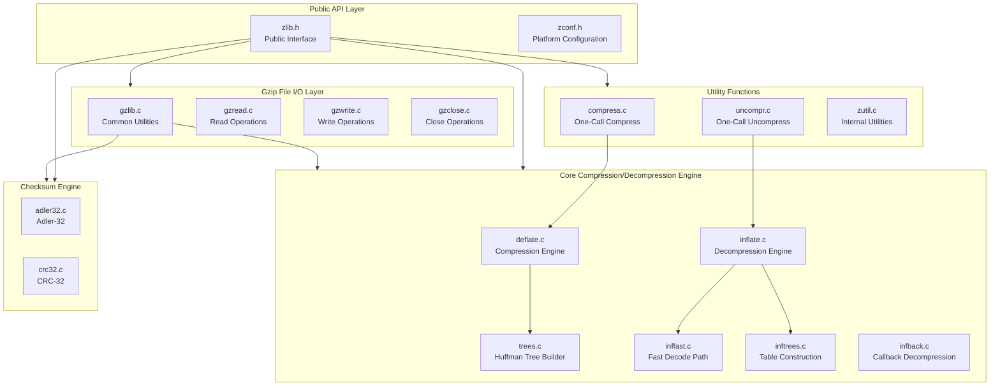

#### Core Technical Approach

The compression algorithm at the heart of zlib is DEFLATE, which combines two complementary techniques as documented in `doc/algorithm.txt`:

1. **LZ77 (Lempel-Ziv 1977)**: Identifies and eliminates repeated byte sequences by replacing duplicates with back-references (distance, length pairs) into a sliding window.
2. **Huffman Coding**: Encodes the resulting literal bytes and back-reference symbols using variable-length codes, with shorter codes assigned to more frequent symbols. zlib supports both static (pre-defined) and dynamic (per-block optimized) Huffman trees.

The library wraps compressed DEFLATE bitstreams in one of three container formats:

| Format | RFC | Header Size | Checksum | Use Case |
|---|---|---|---|
| **zlib** | 1950 | 2 bytes + optional | Adler-32 | In-memory / network |
| **gzip** | 1952 | 10+ bytes | CRC-32 | File system storage |
| **Raw deflate** | 1951 | None | None | Embedded in other formats |

### 1.2.3 Success Criteria

#### Measurable Objectives

Given zlib's role as foundational infrastructure, its success criteria center on correctness, compatibility, and performance:

| Objective | Metric | Verification Method |
|---|---|---|
| **Lossless fidelity** | 100% round-trip data preservation | `test/example.c` regression suite |
| **Standards compliance** | Full RFC 1950/1951/1952 conformance | Interoperability with gzip, PNG, HTTP |
| **Crash resilience** | No crashes on any input (including corrupted data) | `test/infcover.c`, OSS-Fuzz |
| **Cross-platform builds** | Successful compilation on 15+ OS/architecture combinations | CI matrix across 7 workflow files |

#### Critical Success Factors

- **API stability**: The symbol versioning map (`zlib.map`) tracks every public symbol across 14 version milestones from `ZLIB_1.2.0` through `ZLIB_1.3.2`, ensuring downstream consumers can rely on backward compatibility.
- **Minimal dependencies**: zlib depends only on a standard C library, requiring no external libraries for its core functionality.
- **Memory predictability**: Compression memory usage is bounded by configurable `windowBits` (8–15) and `memLevel` (1–9) parameters, as documented in `deflateInit2` within `zlib.h`.

#### Key Performance Indicators

| KPI | Description |
|---|---|
| **Compression ratio** | Competitive with DEFLATE-class compressors across levels 0–9 |
| **Throughput** | Validated via `contrib/testzlib` benchmarking utility |
| **Code coverage** | Exhaustive inflate path coverage via `test/infcover.c` with memory tracking |
| **Fuzz resilience** | Continuous OSS-Fuzz integration (`.github/workflows/fuzz.yml`, 300s per fuzzer) |
| **CI pass rate** | Green builds across Linux, macOS, Windows, FreeBSD, OpenBSD, NetBSD, DragonFlyBSD, Solaris, and OmniOS |

---

## 1.3 Scope

### 1.3.1 In-Scope

#### Core Features and Functionalities

The following capabilities are implemented within the zlib codebase and constitute the documented scope of this specification:

**Must-Have Capabilities:**

| Capability | Source Files | Description |
|---|---|---|
| DEFLATE compression | `deflate.c`, `trees.c` | Levels 0–9, five strategies, configurable window/memory |
| DEFLATE decompression | `inflate.c`, `inffast.c`, `inftrees.c` | Auto-detection of zlib/gzip/raw, fast-path decode |
| Callback decompression | `infback.c` | Memory-efficient `inflateBack` for constrained environments |
| Checksum computation | `adler32.c`, `crc32.c` | Adler-32 and CRC-32 with combine/generate operations |
| Gzip file I/O | `gzlib.c`, `gzread.c`, `gzwrite.c`, `gzclose.c` | `stdio`-like API for `.gz` file read/write/seek |
| One-call compression | `compress.c`, `uncompr.c` | `compress()` / `uncompress()` convenience wrappers |

**Primary User Workflows:**

- Stream-oriented compression: `deflateInit` → repeated `deflate()` → `deflateEnd`
- Stream-oriented decompression: `inflateInit` → repeated `inflate()` → `inflateEnd`
- Single-call compression/decompression via `compress()` / `uncompress()`
- File-based gzip operations via `gzopen()` → `gzread()` / `gzwrite()` → `gzclose()`
- Preset dictionary usage for improved compression of domain-specific data
- Dynamic parameter adjustment during compression via `deflateParams()`
- Error recovery in corrupted streams via `inflateSync()`

**Essential Integrations (Contributed Extensions):**

| Extension | Location | Description |
|---|---|---|
| **minizip** | `contrib/minizip/` | ZIP archive read/write with Zip64 and BZip2 support |
| **blast** | `contrib/blast/` | Self-contained PKWare decompressor |
| **puff** | `contrib/puff/` | Standalone portable inflate implementation |
| **infback9** | `contrib/infback9/` | Deflate64 inflateBack support |

**Key Technical Requirements:**

- ANSI C compliance (C89 through C2x, validated via `c-std.yml` CI workflow)
- CMake 3.12+ as primary build system, with Autotools fallback
- Large file support (64-bit offsets via `z_off_t`, made 64-bit by default since version 1.3.1.2)
- Symbol prefixing via `Z_PREFIX` for namespace isolation in embedding scenarios
- Custom memory allocation hooks (`zalloc` / `zfree` function pointers)

#### Implementation Boundaries

**System Boundaries:**

The zlib library boundary encompasses all source files in the repository root directory. Contributed extensions in `contrib/` are classified as unsupported third-party contributions, as noted in the project README. The `test/` and `examples/` directories provide verification and reference implementations respectively, but are not part of the distributed library.

**Platform Coverage:**

| Platform Family | Specific Coverage | Build System |
|---|---|---|
| **Linux** | x86, x64, ARM (v5-v7), AArch64, PPC, PPC64, S390X | CMake, configure |
| **macOS** | Apple Silicon, x64 | CMake, configure |
| **Windows** | MSVC, MinGW, MSYS2, Cygwin | CMake, MSVC projects |
| **BSD** | FreeBSD, OpenBSD, NetBSD, DragonFlyBSD | CMake |
| **Unix** | Solaris, OmniOS | CMake |
| **Legacy/Embedded** | Amiga (SAS/C), DOS (OpenWatcom), IBM i (OS/400) | Platform-specific |

**Data Domains:**

- Binary data compression/decompression (arbitrary byte streams)
- Text and binary file classification heuristic (documented in `doc/txtvsbin.txt`)
- Gzip file format metadata (timestamps, filenames, comments, extra fields)
- ZIP archive metadata (via minizip contrib)

**Language Bindings Included:**

Ada (`contrib/ada/`), Pascal (`contrib/pascal/`), Delphi (`contrib/delphi/`), .NET/C# (`contrib/dotzlib/`), C++ iostream (`contrib/iostream/`, `contrib/iostream2/`, `contrib/iostream3/`), RPG/ILE (`os400/`).

### 1.3.2 Out-of-Scope

The following capabilities are explicitly **not** provided by the zlib library and fall outside the boundaries of this specification:

| Exclusion | Rationale |
|---|---|
| **Encryption / cryptographic operations** | Not part of compression scope; minizip offers only basic legacy encryption |
| **Alternative compression algorithms** (Brotli, Zstandard, LZMA, BZip2) | zlib implements DEFLATE only; BZip2 appears only as an optional minizip dependency |
| **Network protocol implementation** | zlib provides compression primitives, not transport-layer protocols |
| **File system operations** (beyond `.gz` I/O) | No directory traversal, archive management, or file metadata beyond gzip headers |
| **High-level archive management** (tar, full ZIP creation) | minizip provides basic ZIP support; comprehensive archive tools are external |
| **Graphical user interfaces** | Library is headless; all interaction is via C API |
| **Database integration** | No built-in database adapters or storage engines |
| **Logging / monitoring / observability** | No telemetry, metrics collection, or structured logging |
| **Hardware-accelerated compression dispatch** | Platform-specific optimizations exist in `contrib/` (e.g., S390X vector CRC in `contrib/crc32vx/`, AMD64 assembler match in `contrib/gcc_gvmat64/`) but are contributed, not core |

**Future Phase Considerations:**

The `zlib.h` header notes that "other algorithms will be added later and will have the same stream interface," indicating that the streaming API was designed with extensibility in mind, though only DEFLATE has been implemented since the library's inception in 1995.

**Unsupported Use Cases:**

- Parallel / multi-threaded compression within a single stream (each `z_stream` must be used by one thread at a time)
- Direct hardware offload (no GPU, FPGA, or QAT integration in the core library)
- Compression of structured/columnar data with schema awareness
- Adaptive algorithm selection based on data characteristics (strategy selection is manual via `deflateInit2`)

---

#### References

- `zlib.h` — Primary public API header; version constants, all function declarations, type definitions, return codes, flush modes, compression strategies, and behavioral documentation
- `zconf.h` — Platform detection, symbol renaming (`Z_PREFIX`), FAR-pointer handling, large-file aliasing configuration
- `LICENSE` — zlib License text, copyright notice (1995–2026), and usage terms
- `CMakeLists.txt` — Primary CMake build configuration; feature detection, target definitions, build options
- `README-cmake.md` — CMake build options documentation, imported target names, usage instructions
- `zlib.map` — GNU version script; complete symbol export history across 14 version milestones
- `treebuild.xml` — Package manifest with source file dependency relationships
- `deflate.c`, `trees.c` — DEFLATE compression engine and Huffman tree construction
- `inflate.c`, `inffast.c`, `inftrees.c`, `infback.c` — DEFLATE decompression with fast paths and callback-driven streaming
- `adler32.c`, `crc32.c` — Adler-32 and CRC-32 checksum engines
- `gzclose.c`, `gzlib.c`, `gzread.c`, `gzwrite.c` — Gzip file I/O (`stdio`-like interface)
- `compress.c`, `uncompr.c`, `zutil.c` — One-call compress/uncompress, internal utilities
- `doc/` — RFC specification texts (`rfc1950.txt`, `rfc1951.txt`, `rfc1952.txt`), `algorithm.txt`, `txtvsbin.txt`
- `test/` — Regression suite (`example.c`), inflate coverage harness (`infcover.c`), reference gzip tool (`minigzip.c`)
- `examples/` — Tutorial and reference programs (`zpipe.c`, `zran.c`, `gun.c`, `gzlog.c`, etc.)
- `contrib/` — 18 contributed extension modules (minizip, blast, puff, infback9, language bindings, platform optimizations)
- `win32/` — Windows DLL export definitions (`zlib.def`), resource metadata (`zlib1.rc`)
- `os400/` — IBM i build scripts and RPG bindings
- `amiga/` — Amiga SAS/C build support
- `watcom/` — DOS OpenWatcom build support
- `.github/workflows/` — 7 CI/CD workflow definitions (c-std, cmake, configure, contribs, fuzz, msys-cygwin, others)
- https://zlib.net/ — Official zlib home page (market context, design rationale)
- https://en.wikipedia.org/wiki/Zlib — Adoption data, downstream consumer information
- https://github.com/madler/zlib/releases — Release history, version 1.3.2 release notes

# 2. Product Requirements

This section defines the complete set of product requirements for the zlib compression library (version 1.3.2.1-motley, `VERNUM 0x1321`). All features, functional requirements, and implementation considerations documented here are grounded in the public API defined in `zlib.h`, the core source modules, contributed extensions, build infrastructure, and test suites present in the repository. This section builds upon the system context established in Sections 1.1 through 1.3 and serves as the authoritative reference for testable, traceable requirements.

---

## 2.1 Feature Catalog

### 2.1.1 Feature Summary

The zlib library comprises fourteen discrete features organized across six categories. Each feature has been identified from the repository's source code, public API header (`zlib.h`), build system (`CMakeLists.txt`), contributed extensions (`contrib/`), and CI workflows (`.github/workflows/`).

| Feature ID | Feature Name | Category |
|---|---|---|
| F-001 | Stream Compression (DEFLATE) | Core Engine |
| F-002 | Stream Decompression (INFLATE) | Core Engine |
| F-003 | Callback-Based Decompression | Core Engine |
| F-004 | One-Call Compression/Decompression | Utility |
| F-005 | Checksum Computation | Data Integrity |
| F-006 | Gzip File I/O Layer | File I/O |
| F-007 | Platform Configuration & Portability | Infrastructure |
| F-008 | Version Management & API Stability | Infrastructure |
| F-009 | ZIP Archive Support (minizip) | Contributed Extension |
| F-010 | Standalone Decompression Utilities | Contributed Extension |
| F-011 | Language Bindings | Contributed Extension |
| F-012 | Platform-Specific Optimizations | Contributed Extension |
| F-013 | Cross-Platform Build & CI/CD | Quality Assurance |
| F-014 | Testing & Verification Suite | Quality Assurance |

| Feature ID | Priority | Status |
|---|---|---|
| F-001 | Critical | Completed |
| F-002 | Critical | Completed |
| F-003 | High | Completed |
| F-004 | High | Completed |
| F-005 | Critical | Completed |
| F-006 | High | Completed |
| F-007 | Critical | Completed |
| F-008 | High | Completed |
| F-009 | Medium | Completed |
| F-010 | Medium | Completed |
| F-011 | Medium | Completed |
| F-012 | Low | Completed |
| F-013 | High | Completed |
| F-014 | High | Completed |

---

### 2.1.2 Core Compression & Decompression Features

#### Feature F-001: Stream Compression (DEFLATE)

| Attribute | Value |
|---|---|
| **Feature ID** | F-001 |
| **Category** | Core Compression Engine |
| **Priority** | Critical |
| **Status** | Completed |
| **Source Files** | `deflate.c`, `trees.c`, `deflate.h` |

**Overview:** F-001 implements the DEFLATE compression algorithm (RFC 1951), combining LZ77 sliding-window matching with Huffman coding. It provides the primary compression capability of the entire library and supports three output container formats: zlib (RFC 1950), gzip (RFC 1952), and raw deflate, selectable via the `windowBits` parameter in `deflateInit2()`.

**Business Value:** As documented in Section 1.1.4, zlib is patent-free and provides predictable memory usage independent of input data. The compression engine enables applications to reduce data size for storage and transmission while guaranteeing lossless fidelity—the foundational value proposition of the library.

**User Benefits:** Developers obtain fine-grained control over the compression process through nine compression levels (0–9), five compression strategies (`Z_DEFAULT_STRATEGY`, `Z_FILTERED`, `Z_HUFFMAN_ONLY`, `Z_RLE`, `Z_FIXED`), configurable window sizes (8–15 bits, representing 256 bytes to 32 KB), and configurable memory levels (1–9), all defined in `zlib.h` lines 232–856. Dynamic parameter switching mid-stream via `deflateParams()` allows adapting to changing data characteristics without reinitializing.

**Technical Context:** The compression engine operates as a state machine managed via the `z_stream` structure (defined in `zlib.h` lines 90–120). The primary workflow follows `deflateInit`/`deflateInit2` → repeated `deflate()` with flush modes → `deflateEnd`. Seven flush modes control output granularity: `Z_NO_FLUSH` (0), `Z_PARTIAL_FLUSH` (1), `Z_SYNC_FLUSH` (2), `Z_FULL_FLUSH` (3), `Z_FINISH` (4), `Z_BLOCK` (5), and `Z_TREES` (6), as enumerated in `zlib.h` lines 172–178. The complete API surface includes `deflateSetDictionary()`, `deflateGetDictionary()`, `deflateCopy()`, `deflateReset()`, `deflateTune()`, `deflateBound()`, `deflatePending()`, `deflateUsed()`, `deflatePrime()`, and `deflateSetHeader()`.

**Dependencies:**

| Dependency Type | Dependency |
|---|---|
| Prerequisite Features | F-007 (Platform Config for types) |
| System Dependencies | F-005 (Adler-32 for zlib format, CRC-32 for gzip format) |
| External Dependencies | Standard C library only |
| Integration Requirements | F-008 (version validation via `deflateInit_` wrapper) |

---

#### Feature F-002: Stream Decompression (INFLATE)

| Attribute | Value |
|---|---|
| **Feature ID** | F-002 |
| **Category** | Core Decompression Engine |
| **Priority** | Critical |
| **Status** | Completed |
| **Source Files** | `inflate.c`, `inffast.c`, `inffast.h`, `inftrees.c`, `inftrees.h`, `inflate.h`, `inffixed.h` |

**Overview:** F-002 implements full DEFLATE decompression with automatic format detection across zlib, gzip, and raw deflate streams. The engine is structured as a state machine with over 30 internal modes (defined in `inflate.h`) including HEAD, FLAGS, TYPE, STORED, TABLE, LENLENS, CODELENS, LEN, DIST, MATCH, CHECK, DONE, BAD, and SYNC states. A dedicated fast-path decoder in `inffast.c` accelerates the critical inner loop.

**Business Value:** As stated in Section 1.1.2, the decompression engine guarantees that the decoder validates compressed data consistency, ensuring the library should never crash even when processing corrupted input. This crash resilience is critical for applications operating on untrusted data.

**User Benefits:** Format auto-detection eliminates the need for callers to determine stream format in advance. Setting `windowBits` to 32+ in `inflateInit2()` enables automatic detection of zlib or gzip streams. Error recovery via `inflateSync()` allows finding the next valid synchronization point in corrupted streams by seeking the `00 00 FF FF` byte pattern. The `inflateCopy()` function enables state duplication for random access patterns, while `inflateMark()` reports the current decode position for bookmark support.

**Technical Context:** The API follows the streaming pattern: `inflateInit`/`inflateInit2` → repeated `inflate()` → `inflateEnd`. Additional functions include `inflateSetDictionary()`, `inflateGetDictionary()`, `inflateReset()`, `inflateReset2()`, `inflatePrime()`, and `inflateGetHeader()` for gzip metadata retrieval. The sliding window supports up to 32 KB for back-reference resolution. Gzip header/trailer parsing is enabled by default when `GUNZIP` is defined.

**Dependencies:**

| Dependency Type | Dependency |
|---|---|
| Prerequisite Features | F-007 (Platform Config) |
| System Dependencies | F-005 (checksum verification) |
| External Dependencies | Standard C library only |
| Integration Requirements | F-008 (version validation via `inflateInit_` wrapper) |

---

#### Feature F-003: Callback-Based Decompression (inflateBack)

| Attribute | Value |
|---|---|
| **Feature ID** | F-003 |
| **Category** | Core Decompression Engine |
| **Priority** | High |
| **Status** | Completed |
| **Source Files** | `infback.c` |

**Overview:** F-003 provides a memory-efficient decompression variant that uses caller-supplied I/O callback functions (`in_func` and `out_func`) instead of pre-allocated input/output buffers. It operates on raw deflate streams only (no zlib or gzip headers) and uses the caller-supplied window buffer directly as output, avoiding internal buffer copies.

**Business Value:** This feature serves constrained environments where pre-allocating large output buffers is impractical, as identified in Section 1.3.1. It is specifically designed for file I/O applications that can stream data directly to storage.

**User Benefits:** The callback-driven model decouples decompression from buffer management, enabling efficient direct-to-file or direct-to-network decompression without intermediate memory allocation.

**Technical Context:** The API consists of three functions: `inflateBackInit()` to initialize with a caller-supplied window, `inflateBack()` to decompress via callbacks, and `inflateBackEnd()` to free allocated state (`zlib.h` lines 1112–1214). The implementation shares Huffman table construction code with `inftrees.c` and state structures from `inflate.h`.

**Dependencies:**

| Dependency Type | Dependency |
|---|---|
| Prerequisite Features | F-002 (shares `inflate.h` structures, `inftrees.c`) |
| System Dependencies | F-007 (Platform Config) |
| External Dependencies | Standard C library only |
| Integration Requirements | Caller must supply `in_func` / `out_func` callbacks |

---

### 2.1.3 Utility & Data Integrity Features

#### Feature F-004: One-Call Compression/Decompression Utilities

| Attribute | Value |
|---|---|
| **Feature ID** | F-004 |
| **Category** | Utility Functions |
| **Priority** | High |
| **Status** | Completed |
| **Source Files** | `compress.c`, `uncompr.c` |

**Overview:** F-004 provides convenience functions for buffer-to-buffer compression and decompression in a single function call, wrapping the streaming API internally. The implementation handles chunked processing for large buffers, capping at `max uInt` per iteration to ensure correct operation on platforms where `uInt` is smaller than `size_t`. Size_t-aware variants (suffixed `_z`) were added in `ZLIB_1.3.2` to address 64-bit safety, particularly important on Windows where `unsigned long` is 32-bit.

**Business Value:** Simplifies the most common use case—compress an entire buffer in one step—reducing integration time and potential for API misuse.

**User Benefits:** Single function call replaces the `init` → loop → `end` pattern. The `compressBound()` function allows callers to pre-allocate correctly sized output buffers using the formula: `sourceLen + (sourceLen >> 12) + (sourceLen >> 14) + (sourceLen >> 25) + 13`.

**Technical Context:** Functions include `compress()`, `compress_z()`, `compress2()`, `compress2_z()`, `compressBound()`, `compressBound_z()`, `uncompress()`, `uncompress_z()`, `uncompress2()`, and `uncompress2_z()`, documented in `zlib.h` lines 1271–1343. Input validation returns `Z_STREAM_ERROR` for null pointers in `compress.c`; `uncompr.c` maps inflate error codes to appropriate return values.

**Dependencies:**

| Dependency Type | Dependency |
|---|---|
| Prerequisite Features | F-001 (wraps deflate), F-002 (wraps inflate) |
| System Dependencies | F-007 (Platform Config for `z_size_t`) |
| External Dependencies | None beyond core zlib |

---

#### Feature F-005: Checksum Computation (Adler-32 & CRC-32)

| Attribute | Value |
|---|---|
| **Feature ID** | F-005 |
| **Category** | Data Integrity |
| **Priority** | Critical |
| **Status** | Completed |
| **Source Files** | `adler32.c`, `crc32.c`, `crc32.h` |

**Overview:** F-005 provides two integrity verification algorithms essential to the compression formats: Adler-32 (used in zlib-format streams, RFC 1950) and CRC-32 (used in gzip-format streams, RFC 1952). Both include combine functions enabling checksum merging for parallel or concatenated stream processing.

**Business Value:** Data integrity verification is a design guarantee of the library (Section 1.1.2). Without reliable checksums, decompressed data cannot be verified against the original, undermining the fundamental promise of lossless fidelity.

**User Benefits:** Streaming checksum computation allows incremental updates without buffering entire datasets. Combine operations (`adler32_combine`, `crc32_combine`) allow independent segments to be checksummed in parallel and merged, and `crc32_combine_gen()`/`crc32_combine_op()` precompute combination operators for repeated use at the same length.

**Technical Context:**

- **Adler-32** (`adler32.c`): Uses prime modulus BASE=65521, with NMAX=5552 for deferred modular reduction. Loop-unrolled with `DO16` macros. An optional `NO_DIVIDE` path replaces division with shift-and-add reduction.
- **CRC-32** (`crc32.c`): Implements multiple optimization paths: braided computation (configurable width N=1–6, default 5, word size W=4/8), ARM CRC32 hardware instructions (AArch64 inline assembly), and S390X vector extensions (via `contrib/crc32vx/`). Tables can be generated dynamically (`DYNAMIC_CRC_TABLE`) or statically (`MAKECRCH`).

API functions include `adler32()`, `adler32_z()`, `adler32_combine()`, `crc32()`, `crc32_z()`, `crc32_combine()`, `crc32_combine_gen()`, and `crc32_combine_op()`, documented in `zlib.h` lines 1809–1895.

**Dependencies:**

| Dependency Type | Dependency |
|---|---|
| Prerequisite Features | F-007 (Platform Config for `z_crc_t`, `z_word_t`) |
| System Dependencies | None |
| External Dependencies | Standard C library only |
| Integration Requirements | Used by F-001, F-002, F-006 |

---

### 2.1.4 File I/O Features

#### Feature F-006: Gzip File I/O Layer

| Attribute | Value |
|---|---|
| **Feature ID** | F-006 |
| **Category** | File I/O |
| **Priority** | High |
| **Status** | Completed |
| **Source Files** | `gzlib.c`, `gzread.c`, `gzwrite.c`, `gzclose.c`, `gzguts.h` |

**Overview:** F-006 provides a `stdio`-like interface for reading and writing `.gz` files, supporting concatenated gzip streams, transparent reading of non-gzip files (auto-detect by magic bytes), and non-blocking I/O support (mode flag `'N'` with `EAGAIN`/`EWOULDBLOCK` handling). The default internal buffer size is 8192 bytes, configurable via `gzbuffer()`.

**Business Value:** The gzip file format is the de facto standard for compressed file storage on Unix-like systems. Providing a familiar `stdio`-like interface lowers the barrier to adoption for file-oriented compression tasks.

**User Benefits:** Rich API including formatted output (`gzprintf`), string I/O (`gzputs`/`gzgets`), character I/O (`gzputc`/`gzgetc`/`gzungetc`), seeking (`gzseek`), and position reporting (`gztell`/`gzoffset`). Mode flags support level selection (`'0'`–`'9'`), strategy selection (`'f'`, `'h'`, `'R'`, `'F'`), transparent write (`'T'`), exclusive create (`'x'`), close-on-exec (`'e'`), and non-blocking (`'N'`).

**Technical Context:** The LSEEK abstraction in `gzlib.c` handles platform variance: `llseek` (DJGPP), `_lseeki64` (Win32), `lseek64` (LARGEFILE64), and plain `lseek`. The API spans `zlib.h` lines 1345–1797 and includes `gzopen()`, `gzopen64()`, `gzdopen()`, `gzbuffer()`, `gzsetparams()`, `gzread()`, `gzfread()`, `gzwrite()`, `gzfwrite()`, `gzprintf()`, `gzputs()`, `gzgets()`, `gzputc()`, `gzgetc()`, `gzungetc()`, `gzflush()`, `gzseek()`, `gzrewind()`, `gztell()`, `gzoffset()`, `gzeof()`, `gzdirect()`, `gzclose()`, `gzclose_r()`, `gzclose_w()`, `gzerror()`, and `gzclearerr()`.

**Dependencies:**

| Dependency Type | Dependency |
|---|---|
| Prerequisite Features | F-001, F-002 (core compression/decompression) |
| System Dependencies | F-005 (CRC-32 for gzip trailer) |
| External Dependencies | Platform `stdio`, file descriptor operations |
| Integration Requirements | F-007 (LSEEK abstraction, large file support) |

---

### 2.1.5 Infrastructure & Platform Features

#### Feature F-007: Platform Configuration & Portability

| Attribute | Value |
|---|---|
| **Feature ID** | F-007 |
| **Category** | Infrastructure |
| **Priority** | Critical |
| **Status** | Completed |
| **Source Files** | `zconf.h`, `CMakeLists.txt`, `zutil.c`, `zutil.h` |

**Overview:** F-007 ensures zlib compiles and operates correctly across a wide range of platforms and compilers. It provides type detection (`Z_U4`, `z_crc_t`, `z_word_t`, `z_size_t`), DLL/shared library linkage control (`ZLIB_DLL`, `ZLIB_INTERNAL`, `ZEXPORT`), `Z_PREFIX` namespace isolation for embedding, large file support (64-bit offsets via `z_off_t`/`z_off64_t`), custom memory allocator hooks (`zalloc`/`zfree`/`opaque`), `FAR` pointer support for 16-bit systems, and Windows CE compatibility. The `zlibCompileFlags()` function in `zutil.c` returns a 28-bit flag field for runtime introspection of compile-time options.

**Business Value:** Cross-platform portability is identified in Section 1.2.1 as a critical success factor—zlib must compile on 15+ OS/architecture combinations. The `Z_PREFIX` mechanism enables embedding within larger libraries without symbol collisions.

**Technical Context:** The CMake build system (`CMakeLists.txt`) supports CMake 3.12–3.31 with options `ZLIB_BUILD_TESTING`, `ZLIB_BUILD_SHARED`, `ZLIB_BUILD_STATIC`, `ZLIB_INSTALL`, and `ZLIB_PREFIX`. Feature detection includes `off64_t`, `fseeko`, `stdarg.h`, `unistd.h`, and symbol visibility. Generated artifacts include `zconf.h` (from template) and `zlib.pc` (pkg-config).

**Dependencies:**

| Dependency Type | Dependency |
|---|---|
| Prerequisite Features | None (foundational) |
| System Dependencies | Target platform C compiler and standard library |
| External Dependencies | CMake 3.12+ (primary), Autotools (fallback) |
| Integration Requirements | Required by all other features |

---

#### Feature F-008: Version Management & API Stability

| Attribute | Value |
|---|---|
| **Feature ID** | F-008 |
| **Category** | Infrastructure |
| **Priority** | High |
| **Status** | Completed |
| **Source Files** | `zlib.h`, `zlib.map`, `zutil.c` |

**Overview:** F-008 manages API compatibility across zlib releases through runtime version checking, compile-time version macros, and shared library symbol versioning. The `zlibVersion()` function returns the runtime version string, while macro wrappers on `deflateInit_` and `inflateInit_` pass `ZLIB_VERSION` and `sizeof(z_stream)` at compile time for binary compatibility validation.

**Business Value:** As documented in Section 1.2.3, the symbol versioning map (`zlib.map`) tracks every public symbol across 14 version milestones from `ZLIB_1.2.0` through `ZLIB_1.3.2`, ensuring backward-compatible API evolution. This protects the thousands of downstream consumers who depend on zlib's interface stability.

**Technical Context:** The `zlib.map` GNU version script defines 14 version nodes with progressive symbol additions. Local (hidden) symbols include `deflate_copyright`, `inflate_copyright`, `inflate_fast`, `inflate_table`, `zcalloc`, `zcfree`, `z_errmsg`, `gz_error`, `gz_intmax`, and all `_*` prefixed symbols. The most recent symbol additions in `ZLIB_1.3.2` include the `_z` size_t-aware variants: `compressBound_z`, `deflateBound_z`, `compress_z`, `compress2_z`, `uncompress_z`, and `uncompress2_z`.

**Dependencies:**

| Dependency Type | Dependency |
|---|---|
| Prerequisite Features | F-007 (Platform Config for visibility) |
| System Dependencies | GNU ld or compatible linker (for `zlib.map`) |
| External Dependencies | None |
| Integration Requirements | Consumed by F-001, F-002 initialization macros |

---

### 2.1.6 Contributed Extension Features

#### Feature F-009: ZIP Archive Support (minizip)

| Attribute | Value |
|---|---|
| **Feature ID** | F-009 |
| **Category** | Contributed Extension |
| **Priority** | Medium |
| **Status** | Completed |
| **Source Files** | `contrib/minizip/` (21 files) |

**Overview:** F-009 provides full ZIP archive read and write capabilities with Zip64 support, optional BZip2 compression (via libbz2), PKWARE legacy encryption (`crypt.h`), customizable file I/O callbacks (`ioapi.h`/`ioapi.c`, Win32 variant `iowin32.h`/`iowin32.c`), and filename deduplication via a skiplist data structure (`skipset.h`). Central directory management and EOCD/Zip64 record handling are implemented. CLI tools `minizip` and `miniunz` provide command-line archive creation and extraction.

**Technical Context:** Build toggles include `MINIZIP_BUILD_TESTING` and `ZLIB_BUILD_MINIZIP`. A repair utility (`mztools.c`) provides `unzRepair` for corrupted archives. The minizip extension is classified as a contributed, unsupported component per Section 1.3.1.

**Dependencies:**

| Dependency Type | Dependency |
|---|---|
| Prerequisite Features | F-001, F-002, F-005 (zlib core as backend) |
| External Dependencies | Optional: libbz2 (BZip2 support) |
| Integration Requirements | pkg-config via `minizip.pc.txt` |

---

#### Feature F-010: Standalone Decompression Utilities

| Attribute | Value |
|---|---|
| **Feature ID** | F-010 |
| **Category** | Contributed Extension |
| **Priority** | Medium |
| **Status** | Completed |
| **Source Files** | `contrib/blast/`, `contrib/puff/`, `contrib/infback9/` |

**Overview:** F-010 comprises three independent decompression utilities: **blast** (self-contained PKWare Data Compression Library decompressor), **puff** (standalone portable inflate implementation with coverage instrumentation via `puft`), and **infback9** (Deflate64 inflateBack support extending zlib to handle the Deflate64 variant). Each has independent CMake/Makefile build support, install targets, and test harnesses.

**Dependencies:**

| Dependency Type | Dependency |
|---|---|
| Prerequisite Features | F-002 (puff/infback9 related), none (blast is self-contained) |
| External Dependencies | Standard C library only |

---

#### Feature F-011: Language Bindings

| Attribute | Value |
|---|---|
| **Feature ID** | F-011 |
| **Category** | Contributed Extension |
| **Priority** | Medium |
| **Status** | Completed |
| **Source Files** | `contrib/ada/`, `contrib/pascal/`, `contrib/delphi/`, `contrib/dotzlib/`, `contrib/iostream/`, `contrib/iostream2/`, `contrib/iostream3/`, `os400/`, `contrib/nuget/` |

**Overview:** F-011 provides bindings for Ada (thin and thick interfaces, GNAT build support), Pascal (Borland makefile), Delphi/C++Builder (ZLib.pas with streams and error handling), .NET/C# (managed wrapper with P/Invoke, NUnit tests), C++ iostream (`gzifstream`/`gzofstream` with manipulators), RPG/ILE for IBM i (`os400/`), and NuGet packaging for .NET (multi-RID native assets via MSBuild integration). These enable the stakeholder groups identified in Section 1.1.3 to consume zlib in their native development environments.

**Dependencies:**

| Dependency Type | Dependency |
|---|---|
| Prerequisite Features | F-001 through F-006 (wraps core API) |
| External Dependencies | Target language runtime/compiler |

---

#### Feature F-012: Platform-Specific Optimizations

| Attribute | Value |
|---|---|
| **Feature ID** | F-012 |
| **Category** | Contributed Extension |
| **Priority** | Low |
| **Status** | Completed |
| **Source Files** | `contrib/crc32vx/`, `contrib/gcc_gvmat64/` |

**Overview:** F-012 provides hardware-accelerated implementations for performance-critical paths: **S390X Vector CRC** (`contrib/crc32vx/`) using IBM S390X Vector Extension instructions with runtime detection via `getauxval`, and **AMD64 Assembler Match** (`contrib/gcc_gvmat64/`) providing an AMD64 assembler `longest_match` replacement (`gvmat64.S`) with register-saving and loop heuristics. As noted in Section 1.3.2, these are contributed extensions and not part of the core library.

**Dependencies:**

| Dependency Type | Dependency |
|---|---|
| Prerequisite Features | F-005 (CRC-32 extended), F-001 (longest_match extended) |
| External Dependencies | Target hardware (S390X / AMD64) |

---

### 2.1.7 Quality Assurance Features

#### Feature F-013: Cross-Platform Build & CI/CD

| Attribute | Value |
|---|---|
| **Feature ID** | F-013 |
| **Category** | Quality Assurance |
| **Priority** | High |
| **Status** | Completed |
| **Source Files** | `.github/workflows/` (7 workflow files) |

**Overview:** F-013 provides comprehensive automated build and test verification across seven CI/CD workflows: **c-std.yml** (C standard compliance matrix from C89 through gnu2x on Linux/macOS/Windows/ARM64), **cmake.yml** (15 OS/compiler configurations), **configure.yml** (native and cross-compilation for ARM, AArch64, PPC, S390X via QEMU), **contribs.yml** (Ada, Blast, Iostream3, Minizip, Puff, all-contribs), **fuzz.yml** (OSS-Fuzz integration, 300 seconds per fuzzer), **msys-cygwin.yml** (MSYS2 and Cygwin variants), and **others.yml** (DragonFlyBSD, FreeBSD, NetBSD, OmniOS, OpenBSD, Solaris via vmactions).

**Technical Context:** Platform coverage spans Linux (x86/x64/ARM/AArch64/PPC/S390X), macOS (Apple Silicon/x64), Windows (MSVC/MinGW/MSYS2/Cygwin), BSD family, and Unix (Solaris/OmniOS), as documented in Section 1.3.1.

**Dependencies:**

| Dependency Type | Dependency |
|---|---|
| Prerequisite Features | All features (validates entire codebase) |
| External Dependencies | GitHub Actions, QEMU, vmactions, OSS-Fuzz |

---

#### Feature F-014: Testing & Verification Suite

| Attribute | Value |
|---|---|
| **Feature ID** | F-014 |
| **Category** | Quality Assurance |
| **Priority** | High |
| **Status** | Completed |
| **Source Files** | `test/example.c`, `test/infcover.c`, `test/minigzip.c`, `test/CMakeLists.txt` |

**Overview:** F-014 provides the test infrastructure: **example.c** is the canonical regression driver exercising virtually every API (compress/uncompress, gz I/O, deflate/inflate parameter juggling, flush/sync recovery, preset-dictionary flows) across 13+ test helper functions. **infcover.c** is an exhaustive inflate/inflateBack coverage harness with a custom memory allocator tracking system (`mem_item`/`mem_zone` with alloc/free/setup/limit/used/high/done callbacks) and hex fixture decoding for forced path coverage. **minigzip.c** is a feature-complete gzip/gunzip/zcat analog with mmap acceleration and option parsing. Build fixtures include install tests and `find_package`/`add_subdirectory` matrix verification.

**Dependencies:**

| Dependency Type | Dependency |
|---|---|
| Prerequisite Features | F-001 through F-006 (tests core features) |
| External Dependencies | gcov/llvm_cov (coverage), OSS-Fuzz (fuzzing) |

---

## 2.2 Functional Requirements

### 2.2.1 Stream Compression Requirements (F-001)

#### Requirement Details

| Req ID | Description | Priority |
|---|---|---|
| F-001-RQ-001 | Initialize a compression stream with configurable level, strategy, window size, and memory level via `deflateInit2()` | Must-Have |
| F-001-RQ-002 | Perform incremental compression via `deflate()` supporting all seven flush modes | Must-Have |
| F-001-RQ-003 | Support compression levels 0 (none) through 9 (best), with level 6 as default | Must-Have |
| F-001-RQ-004 | Support five compression strategies selectable via `deflateInit2()` or `deflateParams()` | Must-Have |
| F-001-RQ-005 | Produce output in zlib, gzip, or raw deflate format based on `windowBits` parameter | Must-Have |
| F-001-RQ-006 | Calculate worst-case compressed output size via `deflateBound()` | Should-Have |

| Req ID | Description | Priority |
|---|---|---|
| F-001-RQ-007 | Support preset dictionary injection via `deflateSetDictionary()` and retrieval via `deflateGetDictionary()` | Should-Have |
| F-001-RQ-008 | Allow dynamic level/strategy switching mid-stream via `deflateParams()` without data loss | Should-Have |
| F-001-RQ-009 | Duplicate full compression state via `deflateCopy()` for checkpoint/restore patterns | Could-Have |
| F-001-RQ-010 | Fine-tune internal match parameters (good_length, max_lazy, nice_length, max_chain) via `deflateTune()` | Could-Have |

#### Acceptance Criteria

| Req ID | Acceptance Criteria |
|---|---|
| F-001-RQ-001 | Returns `Z_OK` on valid parameters; returns `Z_STREAM_ERROR` on invalid level, `Z_MEM_ERROR` on allocation failure, `Z_VERSION_ERROR` on header/struct mismatch |
| F-001-RQ-002 | Produces valid DEFLATE bitstream decodable by any RFC 1951–compliant decompressor; returns `Z_STREAM_END` when `Z_FINISH` flush completes |
| F-001-RQ-003 | Level 0 produces stored (uncompressed) blocks; level 9 achieves maximum compression ratio; default level `Z_DEFAULT_COMPRESSION` (-1) maps to level 6 |
| F-001-RQ-004 | `Z_FILTERED` optimizes for filtered data; `Z_HUFFMAN_ONLY` disables LZ77; `Z_RLE` limits to run-length; `Z_FIXED` uses fixed Huffman tables |
| F-001-RQ-005 | windowBits 8–15: zlib format; windowBits +16: gzip format; negative windowBits: raw deflate |
| F-001-RQ-006 | Returned bound ≥ actual compressed size for all inputs; formula: `sourceLen + (sourceLen >> 12) + (sourceLen >> 14) + (sourceLen >> 25) + 13` |

#### Technical Specifications

| Req ID | Input Parameters | Output/Response |
|---|---|---|
| F-001-RQ-001 | `z_stream*`, level (0–9 or -1), method (8), windowBits (-15..15 or +16..31), memLevel (1–9), strategy (0–4) | Initialized `z_stream` with allocated internal state |
| F-001-RQ-002 | `z_stream*` with `next_in`/`avail_in` set, flush mode (0–6) | Updated `next_out`/`avail_out`/`total_out`; return code |
| F-001-RQ-005 | windowBits parameter value | Container format selection (zlib/gzip/raw) |

| Req ID | Performance Criteria | Complexity |
|---|---|---|
| F-001-RQ-001 | Initialization completes in O(1) time relative to data size | Low |
| F-001-RQ-002 | Streaming; memory bounded by windowBits and memLevel | High |
| F-001-RQ-003 | Level 1–3: fast path; Level 4–9: lazy/optimal matching | Medium |

#### Validation Rules

| Req ID | Business Rules |
|---|---|
| F-001-RQ-001 | Method must equal `Z_DEFLATED` (8); no other compression methods are supported |
| F-001-RQ-002 | `next_in` must be non-null when `avail_in > 0`; `next_out` must always be non-null |
| F-001-RQ-005 | Gzip format requires valid `gz_header` if custom header is set via `deflateSetHeader()` |
| F-001-RQ-008 | `deflateParams()` may trigger a partial flush if level changes between incompatible ranges |

---

### 2.2.2 Stream Decompression Requirements (F-002)

#### Requirement Details

| Req ID | Description | Priority |
|---|---|---|
| F-002-RQ-001 | Initialize a decompression stream with configurable window size and format via `inflateInit2()` | Must-Have |
| F-002-RQ-002 | Perform incremental decompression via `inflate()` producing original data byte-for-byte | Must-Have |
| F-002-RQ-003 | Auto-detect zlib or gzip format when windowBits is set to 32 or higher | Must-Have |
| F-002-RQ-004 | Recover from stream errors by seeking next valid sync point via `inflateSync()` | Should-Have |
| F-002-RQ-005 | Retrieve gzip header metadata (name, comment, time, extra fields) via `inflateGetHeader()` | Should-Have |

#### Acceptance Criteria

| Req ID | Acceptance Criteria |
|---|---|
| F-002-RQ-001 | Returns `Z_OK` on success; `Z_MEM_ERROR` on allocation failure; `Z_VERSION_ERROR` on mismatch |
| F-002-RQ-002 | Decompressed output is byte-identical to original input; returns `Z_STREAM_END` on completion; returns `Z_DATA_ERROR` on corrupt input without crashing |
| F-002-RQ-003 | Correctly identifies and decompresses both zlib-wrapped and gzip-wrapped streams without caller intervention |
| F-002-RQ-004 | Successfully skips to next `00 00 FF FF` sync marker in corrupted stream; returns `Z_OK` on sync found, `Z_DATA_ERROR` on failure |
| F-002-RQ-005 | Populates `gz_header` structure with all available gzip metadata; sets `done` flag when header parsing is complete |

#### Technical Specifications

| Req ID | Input Parameters | Output/Response |
|---|---|---|
| F-002-RQ-001 | `z_stream*`, windowBits (-15..15, +16..31, or +32..47) | Initialized `z_stream` with allocated internal state |
| F-002-RQ-002 | `z_stream*` with `next_in`/`avail_in`, flush mode | Decompressed data in `next_out`; updated counters |
| F-002-RQ-003 | windowBits ≥ 32 | Auto-detection of zlib or gzip by header bytes |

| Req ID | Performance Criteria | Complexity |
|---|---|---|
| F-002-RQ-001 | O(1) initialization | Low |
| F-002-RQ-002 | Fast-path in `inffast.c` for speed-critical inner loop; sliding window up to 32 KB | High |
| F-002-RQ-004 | Linear scan for sync marker; worst case: full stream scan | Medium |

#### Validation Rules

| Req ID | Data Validation |
|---|---|
| F-002-RQ-002 | Validates Adler-32 checksum (zlib format) or CRC-32 checksum (gzip format) against decompressed data |
| F-002-RQ-002 | Returns `Z_NEED_DICT` if stream requires preset dictionary; caller must supply via `inflateSetDictionary()` |
| F-002-RQ-003 | Rejects streams that do not match expected format signatures (zlib: `0x78` first byte; gzip: `0x1f 0x8b` magic) |

---

### 2.2.3 Callback Decompression Requirements (F-003)

#### Requirement Details

| Req ID | Description | Priority |
|---|---|---|
| F-003-RQ-001 | Initialize callback decompression with caller-supplied window buffer via `inflateBackInit()` | Must-Have |
| F-003-RQ-002 | Decompress raw deflate stream using caller-provided `in_func` and `out_func` callbacks | Must-Have |
| F-003-RQ-003 | Release allocated state via `inflateBackEnd()` | Must-Have |

#### Acceptance Criteria

| Req ID | Acceptance Criteria |
|---|---|
| F-003-RQ-001 | Accepts window buffer of `(1 << windowBits)` bytes from caller; returns `Z_OK` on success |
| F-003-RQ-002 | Produces byte-identical output to `inflate()` for the same raw deflate input; returns `Z_STREAM_END` on successful completion |
| F-003-RQ-003 | Frees all internally allocated resources; returns `Z_OK` |

#### Technical Specifications

| Req ID | Input Parameters | Output/Response |
|---|---|---|
| F-003-RQ-001 | `z_stream*`, windowBits (8–15), caller-allocated window buffer | Initialized state |
| F-003-RQ-002 | `z_stream*`, `in_func` callback, `in_desc` opaque, `out_func` callback, `out_desc` opaque | Decompressed data via `out_func` |

---

### 2.2.4 One-Call Utility Requirements (F-004)

#### Requirement Details

| Req ID | Description | Priority |
|---|---|---|
| F-004-RQ-001 | Compress entire buffer in single call via `compress()` / `compress2()` with specified level | Must-Have |
| F-004-RQ-002 | Decompress entire buffer in single call via `uncompress()` / `uncompress2()` | Must-Have |
| F-004-RQ-003 | Calculate worst-case compressed size via `compressBound()` | Must-Have |

#### Acceptance Criteria

| Req ID | Acceptance Criteria |
|---|---|
| F-004-RQ-001 | Returns `Z_OK` on success; `Z_MEM_ERROR` on allocation failure; `Z_BUF_ERROR` if output buffer too small; `Z_STREAM_ERROR` for invalid parameters |
| F-004-RQ-002 | Returns `Z_OK` with decompressed data byte-identical to original; `Z_DATA_ERROR` on corrupt input; `Z_BUF_ERROR` if output too small |
| F-004-RQ-003 | Returned value is always ≥ actual compressed size for any input at any compression level |

#### Technical Specifications

| Req ID | Input Parameters | Output/Response |
|---|---|---|
| F-004-RQ-001 | `dest*`, `destLen*`, `source*`, `sourceLen`, optional `level` | Compressed data in `dest`; actual size in `destLen` |
| F-004-RQ-002 | `dest*`, `destLen*`, `source*`, `sourceLen*` | Decompressed data in `dest`; consumed bytes in `sourceLen` (uncompress2) |
| F-004-RQ-003 | `sourceLen` (size_t) | Upper bound (size_t) |

---

### 2.2.5 Checksum Computation Requirements (F-005)

#### Requirement Details

| Req ID | Description | Priority |
|---|---|---|
| F-005-RQ-001 | Compute streaming Adler-32 checksum via `adler32()` / `adler32_z()` | Must-Have |
| F-005-RQ-002 | Compute streaming CRC-32 checksum via `crc32()` / `crc32_z()` | Must-Have |
| F-005-RQ-003 | Combine independent checksums for parallel streams via `adler32_combine()` and `crc32_combine()` | Should-Have |
| F-005-RQ-004 | Precompute CRC-32 combination operator via `crc32_combine_gen()` for repeated use | Could-Have |

#### Acceptance Criteria

| Req ID | Acceptance Criteria |
|---|---|
| F-005-RQ-001 | Initial call with `adler=1, buf=Z_NULL, len=0` returns 1; incremental updates produce correct Adler-32 per RFC 1950 |
| F-005-RQ-002 | Initial call with `crc=0, buf=Z_NULL, len=0` returns 0; incremental updates produce correct CRC-32 per ISO 3309 |
| F-005-RQ-003 | `combine(checksum1, checksum2, len2)` equals checksum of concatenated data |
| F-005-RQ-004 | `crc32_combine_op(crc1, crc2, op)` with `op = crc32_combine_gen(len2)` equals `crc32_combine(crc1, crc2, len2)` |

#### Technical Specifications

| Req ID | Performance Criteria |
|---|---|
| F-005-RQ-001 | Loop-unrolled with DO16 macros; NMAX=5552 deferred reduction; optional NO_DIVIDE path |
| F-005-RQ-002 | Braided computation (N=1–6, W=4/8); ARM CRC32 hardware on AArch64; S390X vector extension via `contrib/crc32vx/` |
| F-005-RQ-003 | O(log n) combination via matrix exponentiation for CRC-32 |

---

### 2.2.6 Gzip File I/O Requirements (F-006)

#### Requirement Details

| Req ID | Description | Priority |
|---|---|---|
| F-006-RQ-001 | Open gzip files by path or file descriptor via `gzopen()` / `gzdopen()` with mode string | Must-Have |
| F-006-RQ-002 | Read and decompress data via `gzread()` / `gzfread()` supporting concatenated gzip streams | Must-Have |
| F-006-RQ-003 | Compress and write data via `gzwrite()` / `gzfwrite()` producing valid gzip files | Must-Have |
| F-006-RQ-004 | Support seek, tell, and rewind operations on the uncompressed stream | Should-Have |
| F-006-RQ-005 | Support non-blocking I/O via mode flag `'N'` with EAGAIN/EWOULDBLOCK handling | Should-Have |

#### Acceptance Criteria

| Req ID | Acceptance Criteria |
|---|---|
| F-006-RQ-001 | Returns valid `gzFile` handle on success; `NULL` on failure; supports mode flags for level, strategy, transparent, exclusive, non-blocking |
| F-006-RQ-002 | Multi-member gzip streams read seamlessly; transparent fallback for non-gzip files when auto-detect enabled |
| F-006-RQ-003 | Produced files are decompressible by standard `gzip -d`; CRC-32 and size fields in trailer are correct |
| F-006-RQ-004 | `gzseek()` supports `SEEK_SET` and `SEEK_CUR` for reading; forward seek for writing; `gztell()` returns correct uncompressed offset |
| F-006-RQ-005 | Returns `Z_OK` with zero bytes read/written on EAGAIN instead of treating as error |

#### Technical Specifications

| Req ID | Input Parameters | Output/Response |
|---|---|---|
| F-006-RQ-001 | `path` (string) or `fd` (int), `mode` (string) | `gzFile` opaque handle |
| F-006-RQ-002 | `gzFile`, `buf*`, `len` | Bytes read (int or size_t) |
| F-006-RQ-003 | `gzFile`, `buf*`, `len` | Bytes written (int or size_t) |

| Req ID | Validation Rules |
|---|---|
| F-006-RQ-002 | Verifies CRC-32 trailer on each gzip member boundary |
| F-006-RQ-003 | `gzprintf()` output limited to buffer size minus 1 (default 8191 bytes) |
| F-006-RQ-001 | `gzbuffer()` must be called before any read/write operation |

---

### 2.2.7 Platform Configuration Requirements (F-007)

#### Requirement Details

| Req ID | Description | Priority |
|---|---|---|
| F-007-RQ-001 | Detect and configure platform-appropriate types (`Z_U4`, `z_crc_t`, `z_word_t`, `z_size_t`, `z_off_t`) | Must-Have |
| F-007-RQ-002 | Support `Z_PREFIX` symbol prefixing for namespace isolation | Must-Have |
| F-007-RQ-003 | Provide large file support (64-bit offsets) transparently | Must-Have |
| F-007-RQ-004 | Support custom memory allocator hooks via `zalloc` / `zfree` function pointers | Must-Have |

#### Acceptance Criteria

| Req ID | Acceptance Criteria |
|---|---|
| F-007-RQ-001 | Correct type sizes detected on all supported platforms; `zlibCompileFlags()` reports accurate 28-bit flag field |
| F-007-RQ-002 | All exported symbols prefixed with `z_` when `Z_PREFIX` defined; no symbol collisions in embedding scenarios |
| F-007-RQ-003 | `z_off_t` is 64-bit by default (since 1.3.1.2); 64-bit variants (`gzopen64`, `gzseek64`, etc.) available |
| F-007-RQ-004 | Custom allocators used for all internal memory allocation; default to `calloc`/`free` when set to `Z_NULL` |

---

### 2.2.8 Version Management Requirements (F-008)

#### Requirement Details

| Req ID | Description | Priority |
|---|---|---|
| F-008-RQ-001 | Report runtime library version via `zlibVersion()` | Must-Have |
| F-008-RQ-002 | Validate compile-time / run-time version compatibility on stream initialization | Must-Have |
| F-008-RQ-003 | Maintain GNU symbol versioning across all public symbols | Should-Have |

#### Acceptance Criteria

| Req ID | Acceptance Criteria |
|---|---|
| F-008-RQ-001 | Returns string matching `ZLIB_VERSION` macro (e.g., `"1.3.2.1-motley"`) |
| F-008-RQ-002 | Returns `Z_VERSION_ERROR` if the version of `zlib.h` used at compile time differs incompatibly from the linked library version, or if `sizeof(z_stream)` differs |
| F-008-RQ-003 | All 14 version nodes from `ZLIB_1.2.0` through `ZLIB_1.3.2` correctly tag their respective symbols in `zlib.map` |

---

### 2.2.9 ZIP Archive Support Requirements (F-009)

#### Requirement Details

| Req ID | Description | Priority |
|---|---|---|
| F-009-RQ-001 | Create and extract ZIP archives with Zip64 support for large files | Must-Have |
| F-009-RQ-002 | Support PKWARE legacy encryption for archive entries | Should-Have |
| F-009-RQ-003 | Provide customizable file I/O callbacks via `ioapi` interface | Should-Have |

#### Acceptance Criteria

| Req ID | Acceptance Criteria |
|---|---|
| F-009-RQ-001 | Archives are compatible with standard ZIP tools; Zip64 records present for entries > 4 GB or archives with > 65535 entries |
| F-009-RQ-002 | Encrypted entries using CRC32-based key evolution in `crypt.h` are extractable by compatible tools |
| F-009-RQ-003 | Custom I/O callbacks replace default stdio operations; Win32 variant (`iowin32`) supports Windows handles |

---

### 2.2.10 Standalone Decompression Requirements (F-010)

#### Requirement Details

| Req ID | Description | Priority |
|---|---|---|
| F-010-RQ-001 | Decompress PKWare DCL format via self-contained `blast` implementation | Must-Have |
| F-010-RQ-002 | Decompress DEFLATE streams via minimal `puff` implementation | Must-Have |
| F-010-RQ-003 | Decompress Deflate64 streams via `infback9` | Must-Have |

#### Acceptance Criteria

| Req ID | Acceptance Criteria |
|---|---|
| F-010-RQ-001 | `blast()` decompresses all valid PKWare DCL streams; self-contained with no zlib core dependency |
| F-010-RQ-002 | `puff()` produces byte-identical output to `inflate()` for RFC 1951 streams; coverage instrumentation via `puft` achieves full path coverage |
| F-010-RQ-003 | `inflateBack9()` handles Deflate64's 64 KB window and extended match lengths |

---

### 2.2.11 Language Binding Requirements (F-011)

| Req ID | Description | Priority |
|---|---|---|
| F-011-RQ-001 | Provide functionally complete bindings for each supported language that expose the core zlib API | Must-Have |
| F-011-RQ-002 | Include build system integration for each binding (GNAT, Borland, Visual Studio, MSBuild, NUnit) | Should-Have |

---

### 2.2.12 Platform Optimization Requirements (F-012)

| Req ID | Description | Priority |
|---|---|---|
| F-012-RQ-001 | Provide S390X Vector CRC-32 hardware acceleration with runtime detection via `getauxval` | Could-Have |
| F-012-RQ-002 | Provide AMD64 assembler `longest_match` replacement with performance superior to C implementation | Could-Have |

---

### 2.2.13 CI/CD Requirements (F-013)

#### Requirement Details

| Req ID | Description | Priority |
|---|---|---|
| F-013-RQ-001 | Validate compilation across C standard versions from C89 through gnu2x on all primary platforms | Must-Have |
| F-013-RQ-002 | Verify build and test pass on at least 15 OS/compiler configurations | Must-Have |
| F-013-RQ-003 | Execute continuous fuzz testing via OSS-Fuzz integration | Should-Have |

#### Acceptance Criteria

| Req ID | Acceptance Criteria |
|---|---|
| F-013-RQ-001 | All C standard variants compile without errors or warnings on Linux, macOS, Windows, and ARM64 (per `c-std.yml`) |
| F-013-RQ-002 | Green builds on Ubuntu gcc/clang, macOS Apple/GCC, Windows MSVC/GCC, MSYS2 variants, Cygwin, and BSD/Unix targets |
| F-013-RQ-003 | Each fuzzer runs for at least 300 seconds; no crash findings remain unaddressed |

---

### 2.2.14 Testing & Verification Requirements (F-014)

#### Requirement Details

| Req ID | Description | Priority |
|---|---|---|
| F-014-RQ-001 | Regression suite exercises all public API functions including error paths | Must-Have |
| F-014-RQ-002 | Inflate coverage harness achieves complete state machine transition coverage | Must-Have |
| F-014-RQ-003 | Reference gzip tool validates compatibility with standard gzip format | Should-Have |

#### Acceptance Criteria

| Req ID | Acceptance Criteria |
|---|---|
| F-014-RQ-001 | `test/example.c` passes all 13+ test functions covering compress, uncompress, gz I/O, deflate/inflate params, flush/sync, and dictionary flows |
| F-014-RQ-002 | `test/infcover.c` covers every inflate state machine mode (30+ modes) with custom allocator tracking reporting allocation high-water marks |
| F-014-RQ-003 | `test/minigzip.c` round-trip compresses and decompresses files identically to GNU gzip |

---

## 2.3 Feature Relationships

### 2.3.1 Feature Dependency Map

The following diagram illustrates the dependency relationships between all fourteen features. Solid arrows represent runtime dependencies (data flow or functional wrapping), and dashed arrows represent infrastructure or validation relationships.

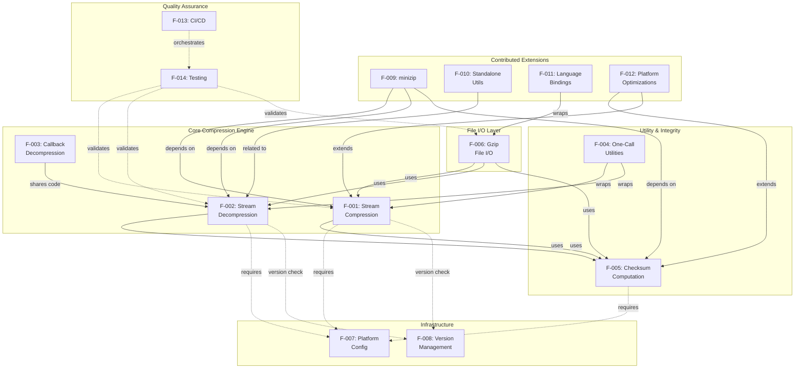

### 2.3.2 Integration Points

The following table documents the key integration boundaries between features, grounded in observed source code dependencies.

| Integration Point | Features | Mechanism |
|---|---|---|
| Checksum injection | F-001 ↔ F-005 | `deflate.c` calls `adler32()` for zlib format, `crc32()` for gzip format during compression |
| Checksum verification | F-002 ↔ F-005 | `inflate.c` computes running checksum and validates against trailer on `Z_STREAM_END` |
| Huffman table sharing | F-003 ↔ F-002 | `infback.c` reuses `inftrees.c` table builder and `inflate.h` state structures |
| Streaming wrapper | F-004 → F-001, F-002 | `compress.c` creates internal `z_stream`, calls `deflateInit`/`deflate`/`deflateEnd`; `uncompr.c` wraps inflate |
| Gzip engine | F-006 → F-001, F-002 | `gzwrite.c` invokes deflate engine; `gzread.c` invokes inflate engine |
| Gzip trailer | F-006 → F-005 | `gzwrite.c` / `gzread.c` use CRC-32 for gzip trailer generation and verification |
| Platform types | F-007 → All | `zconf.h` provides `z_crc_t`, `z_size_t`, `z_off_t`, `Bytef`, `uLongf` to all modules |
| Version validation | F-008 → F-001, F-002 | `deflateInit_()` and `inflateInit_()` macros embed compile-time `ZLIB_VERSION` and `sizeof(z_stream)` |
| ZIP backend | F-009 → F-001, F-002 | minizip uses zlib deflate/inflate as compression method for ZIP entries |

### 2.3.3 Shared Components & Common Services

Three shared components serve as common infrastructure across the entire library:

**`zutil.c` / `zutil.h` — Internal Utilities:** Provides error message table (`z_errmsg[]`), runtime version string (`zlibVersion()`), compile flags introspection (`zlibCompileFlags()`), default memory allocation wrappers (`zcalloc`/`zcfree`), and debug macros. Used by all core features (F-001 through F-006).

**`zconf.h` — Platform Configuration Header:** Provides all platform-specific type definitions, macro expansions, `Z_PREFIX` renaming, DLL linkage control, large file aliasing, and `FAR` pointer definitions. Required by every compilation unit in the library.

**`zlib.h` — Public API Header:** Defines the complete public interface including all function declarations, type definitions (`z_stream`, `gz_header`), return codes, flush modes, compression strategies, and compile-time version macros. Serves as the contract between the library and all consumers, including features F-009 through F-012 and all language bindings in F-011.

---

## 2.4 Implementation Considerations

### 2.4.1 Technical Constraints

| Constraint | Details | Evidence |
|---|---|---|
| Single compression method | Only `Z_DEFLATED` (8) is supported; the `method` parameter in `deflateInit2()` must be 8 | `zlib.h` method constant |
| Window size range | 256 bytes (windowBits=8, effective minimum 9) to 32 KB (windowBits=15) | `deflate.h`, `inflate.h` |
| Maximum match length | 258 bytes (`MAX_MATCH`); minimum match 3 bytes (`MIN_MATCH`); lookahead = MAX_MATCH + MIN_MATCH + 1 = 262 | `deflate.h` constants |
| Memory level range | 1 (minimum memory) to 9 (maximum memory, default 8) | `zlib.h` `deflateInit2` docs |
| gzprintf output limit | Limited to buffer size minus 1 (default 8191 bytes) | `gzwrite.c` implementation |
| No signal handlers | Library does not install signal handlers; application retains full control | `zlib.h` line 73 |
| ANSI C compliance | Library targets C89 through C2x; no C++ or platform-specific language extensions in core | `c-std.yml` CI validation |

### 2.4.2 Performance Requirements

| Aspect | Requirement | Mechanism |
|---|---|---|
| Compression speed/ratio | Levels 0–9 provide configurable tradeoff; level 0 stores uncompressed | Three internal compression approaches: stored (level 0), fast (1–3), slow/lazy (4–9) |
| Decompression throughput | Fast-path decode for common cases | `inffast.c` dedicated hot loop |
| Adler-32 throughput | Batch computation with deferred reduction | DO16 unrolling, NMAX=5552 batch size |
| CRC-32 throughput | Multiple hardware/software paths | Braided (N=1–6), ARM CRC32 instructions, S390X vector extensions |
| Checksum combination | Efficient for parallel workloads | O(log n) matrix exponentiation for CRC-32; algebraic formula for Adler-32 |
| Memory predictability | Fixed memory footprint per stream | Bounded by `windowBits` and `memLevel` parameters; independent of input data |

### 2.4.3 Scalability Considerations

| Aspect | Design Decision | Impact |
|---|---|---|
| Arbitrarily large data | Streaming API via `z_stream` | No limit on total data size; bounded memory per stream |
| Parallel processing | Checksum combine functions | Segments processed independently, checksums merged via `adler32_combine`/`crc32_combine` |
| Minimal builds | `Z_SOLO` compile flag | Removes stdio dependency and gzip file functions; enables kernel/embedded deployment |
| Buffer sizing | `gzbuffer()` customization | Applications tune internal buffer sizes based on available memory and I/O patterns |
| 64-bit safety | `_z` function variants | `compress_z`, `uncompress_z`, `adler32_z`, `crc32_z` accept `size_t` lengths for >4GB buffers |

### 2.4.4 Security Implications

| Concern | Mitigation | Evidence |
|---|---|---|
| Corrupted input handling | Inflate validates all compressed data fields; state machine returns `Z_DATA_ERROR` on invalid data without crashing | `inflate.c` BAD/MEM states; `test/infcover.c` exhaustive path coverage |
| Memory safety | Custom allocator tracking in test harness; allocation failure paths exercised | `test/infcover.c` `mem_zone` infrastructure |
| Fuzz testing | Continuous OSS-Fuzz integration | `.github/workflows/fuzz.yml` (300s per fuzzer) |
| Decompression bombs | Callers control output buffer size; streaming API provides natural backpressure via `avail_out` | `z_stream` design |
| minizip encryption | Legacy PKWARE encryption only (CRC32-based key); not considered cryptographically secure | `contrib/minizip/crypt.h` |
| Thread safety | Thread-safe when custom allocators (`zalloc`/`zfree`) are thread-safe; no global mutable state in core library | `zlib.h` documentation |

### 2.4.5 Maintenance Requirements

| Aspect | Requirement | Mechanism |
|---|---|---|
| Backward compatibility | Maintain ABI compatibility across releases | `zlib.map` symbol versioning with 14 version nodes |
| Regression prevention | Automated test suite on every change | `test/example.c`, `test/infcover.c`, CI matrix |
| Code coverage | Inflate path coverage tracking | `test/infcover.c` with gcov/llvm_cov integration |
| Cross-platform validation | Build verification on 15+ configurations | 7 CI workflow files covering Linux, macOS, Windows, BSD, Unix |
| Contributed extension health | Separate CI validation for contribs | `.github/workflows/contribs.yml` |
| API documentation | Complete function documentation in public header | `zlib.h` (~2000 lines of declarations and documentation) |

---

## 2.5 Assumptions and Constraints

### 2.5.1 Assumptions

| ID | Assumption |
|---|---|
| A-001 | The target platform provides a conforming ANSI C (C89 or later) compiler and standard library |
| A-002 | Custom memory allocators, if provided, are thread-safe when the application uses zlib from multiple threads |
| A-003 | Each `z_stream` instance is accessed by only one thread at a time (no built-in locking) |
| A-004 | Contributed extensions in `contrib/` are unsupported third-party contributions and may not meet the same quality bar as core library code |
| A-005 | Applications using `Z_SOLO` mode accept that gzip file I/O functions (F-006) are unavailable |
| A-006 | The DEFLATE algorithm (RFC 1951) is the only compression method and no alternative algorithms will be added to the core library |

### 2.5.2 Constraints

| ID | Constraint |
|---|---|
| C-001 | Only the DEFLATE method (`Z_DEFLATED = 8`) is implemented; the API reserves the method parameter for future expansion that has not materialized since 1995 |
| C-002 | The library is single-threaded per stream; no internal parallelism or multi-threading |
| C-003 | No encryption or cryptographic operations in core library (minizip legacy encryption is the only exception) |
| C-004 | No hardware-accelerated compression dispatch in core; contributed optimizations (F-012) are optional and unsupported |
| C-005 | No adaptive algorithm selection; compression strategy and level are manually configured by the caller |

---

## 2.6 Traceability Matrix

### 2.6.1 Feature-to-Source Traceability

| Feature ID | Primary Source Files | Test Coverage |
|---|---|---|
| F-001 | `deflate.c`, `trees.c`, `deflate.h` | `test/example.c`, CI matrix |
| F-002 | `inflate.c`, `inffast.c`, `inftrees.c`, `inflate.h` | `test/example.c`, `test/infcover.c`, OSS-Fuzz |
| F-003 | `infback.c` | `test/infcover.c` |
| F-004 | `compress.c`, `uncompr.c` | `test/example.c` |
| F-005 | `adler32.c`, `crc32.c`, `crc32.h` | `test/example.c` |
| F-006 | `gzlib.c`, `gzread.c`, `gzwrite.c`, `gzclose.c` | `test/example.c`, `test/minigzip.c` |
| F-007 | `zconf.h`, `CMakeLists.txt`, `zutil.c` | `c-std.yml`, `cmake.yml` CI |
| F-008 | `zlib.h`, `zlib.map`, `zutil.c` | `test/example.c` version check |

| Feature ID | Primary Source Files | Test Coverage |
|---|---|---|
| F-009 | `contrib/minizip/` (21 files) | `contribs.yml` CI |
| F-010 | `contrib/blast/`, `contrib/puff/`, `contrib/infback9/` | `contribs.yml` CI, per-contrib tests |
| F-011 | `contrib/ada/`, `contrib/pascal/`, `contrib/delphi/`, `contrib/dotzlib/`, `contrib/iostream*/`, `os400/` | `contribs.yml` CI (Ada, Iostream3) |
| F-012 | `contrib/crc32vx/`, `contrib/gcc_gvmat64/` | Platform-specific CI |
| F-013 | `.github/workflows/` (7 files) | Self-validating (CI infrastructure) |
| F-014 | `test/example.c`, `test/infcover.c`, `test/minigzip.c` | CI execution on all platforms |

### 2.6.2 Requirement-to-Feature Traceability

| Requirement Range | Feature | Category |
|---|---|---|
| F-001-RQ-001 through F-001-RQ-010 | F-001: Stream Compression | Core Engine |
| F-002-RQ-001 through F-002-RQ-005 | F-002: Stream Decompression | Core Engine |
| F-003-RQ-001 through F-003-RQ-003 | F-003: Callback Decompression | Core Engine |
| F-004-RQ-001 through F-004-RQ-003 | F-004: One-Call Utilities | Utility |
| F-005-RQ-001 through F-005-RQ-004 | F-005: Checksum Computation | Data Integrity |
| F-006-RQ-001 through F-006-RQ-005 | F-006: Gzip File I/O | File I/O |
| F-007-RQ-001 through F-007-RQ-004 | F-007: Platform Configuration | Infrastructure |
| F-008-RQ-001 through F-008-RQ-003 | F-008: Version Management | Infrastructure |
| F-009-RQ-001 through F-009-RQ-003 | F-009: minizip | Contributed Extension |
| F-010-RQ-001 through F-010-RQ-003 | F-010: Standalone Utils | Contributed Extension |
| F-011-RQ-001 through F-011-RQ-002 | F-011: Language Bindings | Contributed Extension |
| F-012-RQ-001 through F-012-RQ-002 | F-012: Platform Optimizations | Contributed Extension |
| F-013-RQ-001 through F-013-RQ-003 | F-013: CI/CD | Quality Assurance |
| F-014-RQ-001 through F-014-RQ-003 | F-014: Testing Suite | Quality Assurance |

### 2.6.3 Cross-Reference to Technical Specification Sections

| Topic | Reference |
|---|---|
| Project overview and stakeholders | Section 1.1 (Executive Summary) |
| System architecture and component diagram | Section 1.2.2 (High-Level Description) |
| Success criteria and KPIs | Section 1.2.3 (Success Criteria) |
| In-scope features and platform coverage | Section 1.3.1 (In-Scope) |
| Out-of-scope capabilities | Section 1.3.2 (Out-of-Scope) |

---

## 2.7 References

#### Source Files

- `zlib.h` — Complete public API header (lines 1–2000); all function declarations, type definitions, constants, macros, and behavioral documentation
- `zconf.h` — Platform detection, symbol prefixing (`Z_PREFIX`), type definitions, large file support, DLL linkage control
- `deflate.c`, `deflate.h`, `trees.c` — DEFLATE compression engine with LZ77 matching and Huffman tree construction
- `inflate.c`, `inflate.h`, `inffast.c`, `inffast.h`, `inftrees.c`, `inftrees.h`, `inffixed.h` — DEFLATE decompression engine with state machine, fast-path decoder, and table construction
- `infback.c` — Callback-based decompression engine
- `compress.c` — One-call compression utility
- `uncompr.c` — One-call decompression utility
- `adler32.c` — Adler-32 checksum implementation with loop unrolling and combine functions
- `crc32.c`, `crc32.h` — CRC-32 implementation with braided, ARM, and S390X paths; combine and precompute functions
- `gzlib.c`, `gzread.c`, `gzwrite.c`, `gzclose.c`, `gzguts.h` — Gzip file I/O layer with LSEEK abstraction
- `zutil.c`, `zutil.h` — Internal utilities: version reporting, compile flags, error messages, allocator hooks
- `zlib.map` — GNU symbol versioning script (14 version nodes: ZLIB_1.2.0 through ZLIB_1.3.2)
- `CMakeLists.txt` — Primary CMake build configuration with feature detection and options
- `LICENSE` — zlib License text (permissive, 1995–2026)

#### Directories

- `contrib/minizip/` — ZIP archive library (21 files): read/write, Zip64, encryption, I/O callbacks, CLI tools
- `contrib/blast/` — Self-contained PKWare DCL decompressor
- `contrib/puff/` — Standalone portable inflate implementation with coverage instrumentation
- `contrib/infback9/` — Deflate64 inflateBack support
- `contrib/ada/`, `contrib/pascal/`, `contrib/delphi/`, `contrib/dotzlib/`, `contrib/iostream/`, `contrib/iostream2/`, `contrib/iostream3/` — Language bindings
- `contrib/nuget/` — .NET NuGet packaging
- `contrib/crc32vx/` — S390X Vector CRC-32 hardware acceleration
- `contrib/gcc_gvmat64/` — AMD64 assembler longest_match replacement
- `os400/` — IBM i RPG/ILE bindings and build scripts
- `test/` — Regression suite (`example.c`), inflate coverage harness (`infcover.c`), reference gzip tool (`minigzip.c`)
- `examples/` — Reference programs demonstrating major API patterns
- `.github/workflows/` — 7 CI/CD workflow files (c-std, cmake, configure, contribs, fuzz, msys-cygwin, others)
- `doc/` — RFC specification texts (1950, 1951, 1952), algorithm description, text-vs-binary heuristics

#### Technical Specification Cross-References

- Section 1.1 (Executive Summary) — Project overview, stakeholders, value proposition
- Section 1.2 (System Overview) — Architecture diagram, capability domains, success criteria
- Section 1.3 (Scope) — In-scope/out-of-scope boundaries, platform coverage, implementation boundaries

# 3. Technology Stack

This section defines the complete technology stack for the zlib compression library (version 1.3.2.1-motley, `VERNUM 0x1321`). zlib is a foundational C library with a deliberately minimal dependency footprint—its core implementation requires only a conforming ANSI C compiler and the standard C library. The technology choices documented here reflect three decades of design decisions prioritizing maximum portability, zero external dependencies, and universal platform support.

> **Note on Default Stack Inapplicability:** The default technology stack template (Python/Flask, React, MongoDB, AWS, Docker, Terraform, Auth0, etc.) does not apply to this repository. zlib is a pure C compression library distributed as source code. The subsections below document only the technologies actually present in and relevant to the zlib codebase.

---

## 3.1 PROGRAMMING LANGUAGES

### 3.1.1 Primary Language: C (ANSI C89 through C2x)

The zlib library is written entirely in C, targeting ANSI C (C89) as the baseline standard with validated compatibility through the most recent C2x draft standard. This language choice is the cornerstone of zlib's portability and ubiquity.

| Attribute | Details | Evidence |
|---|---|---|
| **Language** | C (ANSI C compliant) | `CMakeLists.txt` line 5: `LANGUAGES C` |
| **Minimum Standard** | C89 (ANSI C) | Assumption A-001: "The target platform provides a conforming ANSI C (C89 or later) compiler" |
| **Maximum Validated** | C2x / gnu2x | `.github/workflows/c-std.yml` CI matrix |
| **Core Extensions** | None — no C++ or platform-specific language extensions in core | Constraint per Section 2.4.1 |

#### Selection Criteria and Justification

C was selected as the implementation language for the following reasons, each verified against the codebase and documentation:

1. **Universal Platform Support**: As documented in Section 1.3.1, zlib compiles on Linux (x86/x64/ARM/AArch64/PPC/S390X), macOS, Windows (MSVC/MinGW/MSYS2/Cygwin), BSD family (FreeBSD/OpenBSD/NetBSD/DragonFlyBSD), Unix (Solaris/OmniOS), and legacy platforms (Amiga, DOS, IBM i). No other systems language offers comparable breadth.

2. **Minimal Footprint**: As stated in Section 1.2.3, "zlib depends only on a standard C library, requiring no external libraries for its core functionality." The standard C headers used are limited to `stddef.h`, `string.h`, and `stdlib.h` (as observed in `zutil.h` lines 24–30).

3. **FFI Compatibility**: C's calling convention is the universal foreign function interface for virtually every other language. This enables the contributed bindings in `contrib/` (Ada, Pascal, Delphi, .NET, C++ iostream, RPG/ILE) and native integration with language runtimes (Java `java.util.zip`, Python `zlib` module, Perl `IO::Compress`).

4. **Kernel and Embedded Deployment**: The `Z_SOLO` compile flag removes all `stdio` dependencies, enabling zlib to compile for bare-metal and kernel environments. This is critical for Linux kernel integration (compressed filesystems, network protocols, kernel image decompression).

5. **Deterministic Memory Management**: C's explicit memory model allows zlib to offer custom allocator hooks (`zalloc`/`zfree` function pointers on `z_stream`) and guarantee predictable memory footprints bounded by `windowBits` and `memLevel` parameters, as documented in Section 2.4.2.

#### C Standard Compliance Matrix

The `.github/workflows/c-std.yml` workflow validates compilation across the following C standard variants:

| Standard | GCC Flag | Clang Flag | Platforms Tested |
|---|---|---|---|
| C89 | `-std=c89` | `-std=c89` | Linux, macOS, Windows, ARM64 |
| GNU89 | `-std=gnu89` | `-std=gnu89` | Linux, macOS, Windows, ARM64 |
| C99 | `-std=c99` | `-std=c99` | Linux, macOS, Windows, ARM64 |
| GNU99 | `-std=gnu99` | `-std=gnu99` | Linux, macOS, Windows, ARM64 |
| C11 | `-std=c11` | `-std=c11` | Linux, macOS, Windows, ARM64 |
| GNU11 | `-std=gnu11` | `-std=gnu11` | Linux, macOS, Windows, ARM64 |
| C17 | `-std=c17` | `-std=c17` | Linux, macOS, Windows, ARM64 |
| GNU17 | `-std=gnu17` | `-std=gnu17` | Linux, macOS, Windows, ARM64 |
| C2x | `-std=c2x` | `-std=c2x` | Linux, macOS, Windows, ARM64 |
| GNU2x | `-std=gnu2x` | `-std=gnu2x` | Linux, macOS, Windows, ARM64 |

### 3.1.2 Contributed Language Bindings

While the core library is exclusively C, contributed extensions provide bindings for additional languages. As documented in Feature F-011, these are classified as unsupported third-party contributions per Assumption A-004.

| Language | Location | Build Toolchain | Purpose |
|---|---|---|---|
| Ada | `contrib/ada/` | GNAT | Thin and thick Ada interface bindings |
| Pascal | `contrib/pascal/` | Borland Makefile | Pascal language binding |
| Delphi / C++ Builder | `contrib/delphi/` | Borland tools | ZLib.pas with streams and error handling |
| .NET / C# | `contrib/dotzlib/`, `contrib/nuget/` | MSBuild, NUnit | Managed wrapper with P/Invoke |
| C++ iostream | `contrib/iostream/`, `contrib/iostream2/`, `contrib/iostream3/` | CMake | `gzifstream`/`gzofstream` stream adapters |
| RPG / ILE (IBM i) | `os400/` | OS/400 build scripts (`make.sh`) | IBM i native integration |

### 3.1.3 Assembly Language (Contributed Optimizations)

Two contributed extensions use platform-specific assembly for performance-critical paths, classified under Feature F-012:

| Platform | Location | Language | Purpose |
|---|---|---|---|
| AMD64 | `contrib/gcc_gvmat64/` | x86-64 GAS Assembly | `longest_match` replacement (`gvmat64.S`) |
| S390X | `contrib/crc32vx/` | S390X Vector Instructions | Hardware-accelerated CRC-32 via `getauxval` runtime detection |

Per Constraint C-004, these optimizations are "optional and unsupported" and are not part of the core library.

---

## 3.2 FRAMEWORKS AND LIBRARIES

### 3.2.1 Runtime Framework: Standard C Library

zlib's sole runtime dependency is the standard C library. This is a deliberate architectural constraint central to the library's design philosophy.

| Dependency | Headers Used | Purpose | Evidence |
|---|---|---|---|
| Standard C Library | `stddef.h`, `string.h`, `stdlib.h` | Core types, memory operations, allocation | `zutil.h` lines 24–30 |
| Standard C Library | `stdio.h` | Gzip file I/O (F-006), excluded in `Z_SOLO` mode | `gzguts.h` |
| Standard C Library | `stdarg.h` | Variable argument support for `gzprintf` | CMake detection in `CMakeLists.txt` line 89 |
| POSIX (optional) | `unistd.h` | File descriptor operations | CMake detection in `CMakeLists.txt` line 94 |

#### Z_SOLO Mode

When compiled with `Z_SOLO` defined, zlib eliminates all `stdio` dependencies, producing a minimal binary suitable for kernel and bare-metal environments. In this mode, Feature F-006 (Gzip File I/O) is entirely excluded, as documented in Assumption A-005.

### 3.2.2 Build System Framework: CMake

CMake serves as the primary build system framework, with Autotools (`configure`/`make`) retained as a fallback for legacy compatibility.

| Component | Version | Purpose | Evidence |
|---|---|---|---|
| **CMake** | 3.12 – 3.31 | Primary build configuration and generation | `CMakeLists.txt` line 1: `cmake_minimum_required(VERSION 3.12...3.31)` |
| **CPack** | Bundled with CMake | Binary and source packaging | `CMakeLists.txt` line 42: `include(CPack)` |
| **GNUInstallDirs** | Bundled with CMake | Standardized install directory layout | `CMakeLists.txt` line 43: `include(GNUInstallDirs)` |
| **Autotools** | N/A (version-agnostic) | Fallback build system | `Makefile` routes to `Makefile.in`; validated in `.github/workflows/configure.yml` |

#### CMake Module Dependencies

The following CMake modules are used for platform feature detection and build configuration (sourced from `CMakeLists.txt` lines 37–43):

| Module | Purpose |
|---|---|
| `CheckCSourceCompiles` | Compile-time feature probing |
| `CheckFunctionExists` | Runtime function availability (`fseeko`) |
| `CheckIncludeFile` | Header availability (`stdarg.h`, `unistd.h`) |
| `CheckTypeSize` | Type size detection (`off64_t`) |
| `CMakePackageConfigHelpers` | CMake package config file generation |
| `CPack` | Distribution packaging |
| `GNUInstallDirs` | GNU-standard install paths |

#### CMake Feature Detection

The CMake build performs compile-time feature detection to adapt to platform capabilities:

| Feature | Detection Method | Impact | Evidence |
|---|---|---|---|
| `off64_t` type | `CheckTypeSize` | Enables large file support (64-bit offsets) | `CMakeLists.txt` line 78 |
| `fseeko` function | `CheckFunctionExists` | 64-bit file seeking | `CMakeLists.txt` line 84 |
| `stdarg.h` header | `CheckIncludeFile` | Variable argument functions | `CMakeLists.txt` line 89 |
| `unistd.h` header | `CheckIncludeFile` | POSIX file operations | `CMakeLists.txt` line 94 |
| `__attribute__((visibility("hidden")))` | `CheckCSourceCompiles` | Symbol visibility control for shared libraries | `CMakeLists.txt` lines 105–111 |

#### CMake Build Options

| Option | Default | Description | Evidence |
|---|---|---|---|
| `ZLIB_BUILD_TESTING` | ON | Build test suite | `CMakeLists.txt` lines 22–27 |
| `ZLIB_BUILD_SHARED` | ON | Build shared library (`.so`/`.dylib`/`.dll`) | `CMakeLists.txt` lines 22–27 |
| `ZLIB_BUILD_STATIC` | ON | Build static library (`.a`/`.lib`) | `CMakeLists.txt` lines 22–27 |
| `ZLIB_INSTALL` | ON | Generate install targets | `CMakeLists.txt` lines 22–27 |
| `ZLIB_PREFIX` | OFF | Enable `Z_PREFIX` namespace isolation | `CMakeLists.txt` lines 22–27 |

### 3.2.3 Technology Stack Architecture

The following diagram illustrates the complete technology stack layers, from the application interface down to the platform layer:

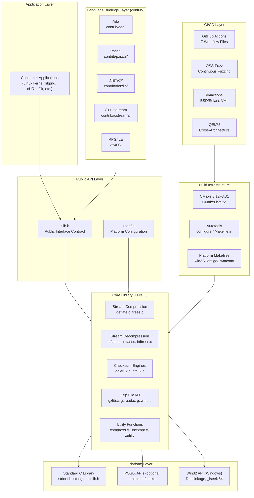

---

## 3.3 OPEN SOURCE DEPENDENCIES

### 3.3.1 Core Library Dependencies

The zlib core library has **zero external open-source dependencies**. This is a fundamental design invariant, as established in Section 1.2.3: "zlib depends only on a standard C library, requiring no external libraries for its core functionality." There is no package manager, no dependency registry, and no transitive dependency chain. zlib is distributed exclusively as source code.

| Component | External Dependencies | Evidence |
|---|---|---|
| Core Library (all `.c`/`.h` in root) | **None** — Standard C library only | Section 1.2.3; Constraint C-003; `zutil.h` includes |
| Gzip File I/O (`gz*.c`) | **None** — Standard C `stdio` only | `gzguts.h` includes |
| Test Suite (`test/`) | **None** — Built-in assertions | `test/CMakeLists.txt` |

### 3.3.2 Contributed Extension Dependencies

A single optional external dependency exists within the contributed extensions:

| Dependency | Version | Component | Purpose | Package | Evidence |
|---|---|---|---|---|---|
| **libbz2** (BZip2) | System package | `contrib/minizip/` (F-009) | Optional BZip2 compression in ZIP archives | `libbz2-dev` (Ubuntu/Debian) | `.github/workflows/cmake.yml` lines 16–17: `-DMINIZIP_ENABLE_BZIP2=ON` |

No other contributed extension requires external libraries beyond the standard C library and the zlib core itself.

### 3.3.3 Build-Time Dependencies

The following tools are required for compilation but are not runtime dependencies:

| Dependency | Minimum Version | Purpose | Required/Optional |
|---|---|---|---|
| C Compiler (GCC, Clang, MSVC, or equivalent) | C89-capable | Source compilation | **Required** |
| CMake | 3.12+ | Primary build configuration | **Required** (or use Autotools) |
| Autotools (configure/make) | Any | Alternative build system | **Optional** (fallback) |
| Ninja | Any | Alternative CMake generator | **Optional** |
| pkg-config | Any | Library discovery metadata | **Optional** (for consumers) |

### 3.3.4 Dependency Architecture

The zero-dependency design is illustrated by the contrast between zlib's core and its contributed ecosystem:

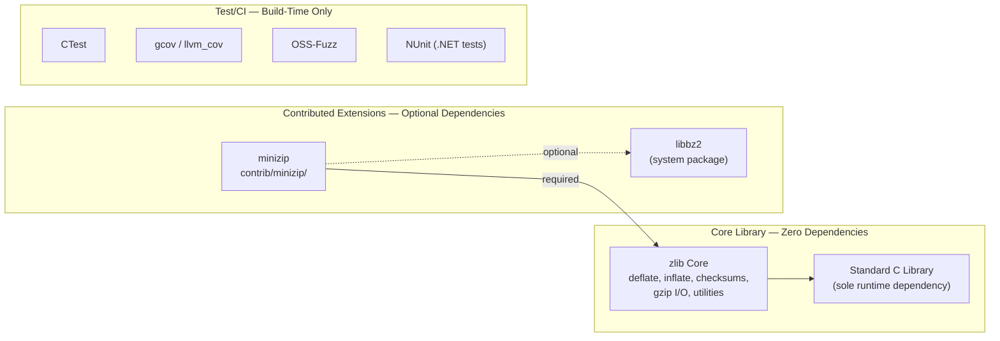

---

## 3.4 THIRD-PARTY SERVICES

### 3.4.1 Overview

As a compression library with no runtime service dependencies, zlib does not integrate with any external APIs, authentication services, monitoring tools, or cloud platforms at runtime. All third-party service integrations are limited to the CI/CD pipeline for build verification, testing, and cross-platform validation.

| Category | Applicability | Rationale |
|---|---|---|
| External APIs | **Not Applicable** | zlib processes in-memory data; no network communication |
| Authentication Services | **Not Applicable** | No user authentication layer; Constraint C-003 excludes cryptographic operations |
| Monitoring / Observability | **Not Applicable** | Section 1.3.2 explicitly excludes "Logging / monitoring / observability" |
| Cloud Services | **Not Applicable** | Distributed as source code; no cloud platform dependency |

### 3.4.2 CI/CD Service Integrations

The following third-party services are integrated exclusively within the GitHub Actions CI/CD pipeline:

| Service | Purpose | Integration Mechanism | Evidence |
|---|---|---|---|
| **GitHub Actions** | CI/CD orchestration platform | `.github/workflows/` (7 YAML files) | Feature F-013 |
| **Google OSS-Fuzz** | Continuous fuzz testing | `google/oss-fuzz/infra/cifuzz/actions/build_fuzzers@master` | `.github/workflows/fuzz.yml` |
| **vmactions** | BSD and Solaris VM provisioning | Various vmactions GitHub Actions | `.github/workflows/others.yml` |
| **QEMU** | Cross-architecture emulation | ARM, AArch64, PPC, S390X cross-compilation | `.github/workflows/configure.yml` |
| **MSYS2** | Windows MinGW/Cygwin environment | `msys2/setup-msys2@v2` | `.github/workflows/msys-cygwin.yml` |

### 3.4.3 GitHub Actions Dependency Matrix

The following GitHub Actions marketplace actions are consumed across the CI workflows:

| Action | Version | Used In | Purpose |
|---|---|---|---|
| `actions/checkout` | `@v4`, `@v6` | All workflows | Repository checkout |
| `actions/upload-artifact` | `@v6` | Multiple workflows | CI artifact upload |
| `google/oss-fuzz/.../build_fuzzers` | `@master` | `fuzz.yml` | Build fuzz targets |
| `google/oss-fuzz/.../run_fuzzers` | `@master` | `fuzz.yml` | Execute fuzzers (300s per fuzzer) |
| `msys2/setup-msys2` | `@v2` | `msys-cygwin.yml` | MSYS2 environment setup |
| vmactions (BSD/Solaris VMs) | Various | `others.yml` | DragonFlyBSD, FreeBSD, NetBSD, OmniOS, OpenBSD, Solaris |

---

## 3.5 DATABASES AND STORAGE

### 3.5.1 Applicability Statement

**This subsection is not applicable.** zlib is a compression library, not an application with data persistence requirements. As documented in Section 1.3.2, database integration is explicitly out of scope.

| Category | Status | Rationale |
|---|---|---|
| Primary / Secondary Databases | **Not Applicable** | No application state to persist |
| Data Persistence Strategies | **Not Applicable** | Data processed in-memory via `z_stream` or gzip file I/O to caller-managed files |
| Caching Solutions | **Not Applicable** | No caching layer; internal hash tables in `deflate.c` are per-stream, not shared |
| Storage Services | **Not Applicable** | No cloud or object storage integration |

All data handling in zlib is transient and stream-oriented. The `z_stream` structure processes data through caller-supplied input/output buffers (`next_in`/`avail_in`, `next_out`/`avail_out`), and gzip file I/O operates directly on file descriptors. The library maintains no persistent state between API sessions.

---

## 3.6 DEVELOPMENT AND DEPLOYMENT

### 3.6.1 Build System

#### Primary Build: CMake

CMake 3.12–3.31 serves as the primary, fully-featured build system for zlib, providing cross-platform generation of native build files.

| Aspect | Details | Evidence |
|---|---|---|
| **Minimum Version** | 3.12 | `CMakeLists.txt` line 1 |
| **Maximum Tested** | 3.31 | `CMakeLists.txt` line 1 |
| **Project Declaration** | `zlib VERSION 1.3.2.1 LANGUAGES C` | `CMakeLists.txt` lines 5–6 |
| **Generators Supported** | Unix Makefiles, Ninja, Visual Studio, Xcode | CI matrix in `.github/workflows/cmake.yml` |
| **Build Targets** | `zlib` (shared), `zlibstatic` (static) | Configurable via `ZLIB_BUILD_SHARED`/`ZLIB_BUILD_STATIC` |

**Generated Artifacts:**

| Artifact | Purpose | Evidence |
|---|---|---|
| `zlib.pc` | pkg-config metadata for library consumers | Generated from `zlib.pc.cmakein`; `CMakeLists.txt` line 115 |
| `ZLIBConfig.cmake` | CMake `find_package(ZLIB)` support | `CMakePackageConfigHelpers` module |
| `ZLIBConfigVersion.cmake` | Version compatibility for `find_package` | `CMakePackageConfigHelpers` module |
| `zconf.h` | Platform-adapted configuration header | Generated from template |

#### Fallback Build: Autotools

The traditional `configure`/`make` build system is retained for environments where CMake is unavailable or where legacy build scripts depend on the Autotools workflow.

| Aspect | Details | Evidence |
|---|---|---|
| **Entry Point** | `./configure && make` | `Makefile` routes to `Makefile.in` |
| **CI Validation** | Native and cross-compilation | `.github/workflows/configure.yml` |
| **Cross-Compilation** | ARM, AArch64, PPC, PPC64, PPC64LE, S390X via QEMU | `.github/workflows/configure.yml` |

#### Platform-Specific Build Systems

| Platform | Build File | Toolchain | Evidence |
|---|---|---|---|
| Windows (MSVC) | `win32/Makefile.msc` (historical) | MSVC `cl.exe` | `win32/` directory |
| Amiga | `amiga/Makefile.pup`, `amiga/Makefile.sas` | SAS/C | `amiga/` directory |
| DOS | `watcom/watcom_l.mak`, `watcom/watcom_f.mak` | OpenWatcom | `watcom/` directory |
| IBM i (OS/400) | `os400/make.sh` | ILE C | `os400/` directory |

### 3.6.2 Compiler Support Matrix

The CI pipeline validates compilation across the following compiler families:

| Compiler | Versions Tested | Platforms | Evidence |
|---|---|---|---|
| **GCC** | 13, 14, 15 (macOS); system default (Linux/BSD) | Linux, macOS, Windows (MinGW), BSD, Solaris | `cmake.yml`, `configure.yml`, `others.yml` |
| **Clang** | System default; Apple Clang (macOS) | Linux, macOS, Windows (MSYS2 Clang64/ClangARM64) | `cmake.yml`, `msys-cygwin.yml` |
| **MSVC** | Visual Studio (cl.exe) | Windows (Win32, x64, ARM64) | `cmake.yml` |
| **SAS/C** | Legacy | Amiga (68k) | `amiga/Makefile.sas` |
| **OpenWatcom** | Legacy | DOS (x86) | `watcom/` |
| **ILE C** | System | IBM i (POWER) | `os400/make.sh` |

### 3.6.3 CI/CD Infrastructure

#### GitHub Actions Workflow Architecture

Seven GitHub Actions workflow files provide comprehensive automated validation across platforms, architectures, compilers, and C standards:

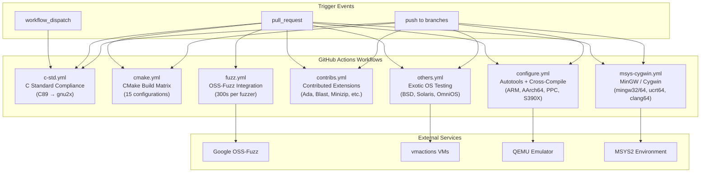

#### Workflow Detail Matrix

| Workflow | File | Trigger | Scope | Key Configurations |
|---|---|---|---|---|
| **C Standard** | `c-std.yml` | push, PR, dispatch | C89 through gnu2x compliance | Linux/macOS/Windows/ARM64 × GCC/Clang × 10 standards |
| **CMake** | `cmake.yml` | push, PR | Primary build validation | 15 OS/compiler configs: Ubuntu GCC/Clang, macOS (GCC 13–15), Windows MSVC |
| **Configure** | `configure.yml` | push, PR | Autotools + cross-compilation | Native Linux + ARM v5/v6/v7, AArch64, PPC, PPC64, PPC64LE, S390X via QEMU |
| **Contribs** | `contribs.yml` | push, PR | Contributed extensions | Ada, Blast, Iostream3, Minizip, Puff, all-contribs |
| **Fuzz** | `fuzz.yml` | PR only | Security fuzzing | CIFuzz with 300-second timeout per fuzzer |
| **MSYS/Cygwin** | `msys-cygwin.yml` | push, PR | Windows alternative toolchains | mingw32, mingw64, ucrt64, clang64, clangarm64, Cygwin |
| **Others** | `others.yml` | push, PR | Exotic OS validation | DragonFlyBSD, FreeBSD, NetBSD, OmniOS, OpenBSD, Solaris |

### 3.6.4 Platform Build Matrix

The combined CI coverage validates the following platform × architecture combinations:

| Platform Family | Architectures | Build System | Compilers | CI Workflow |
|---|---|---|---|---|
| **Linux** | x86, x64, ARM v5–v7, AArch64, PPC, PPC64, PPC64LE, S390X | CMake, configure | GCC, Clang | `cmake.yml`, `configure.yml`, `c-std.yml` |
| **macOS** | Apple Silicon (AArch64), x64 | CMake, configure | Apple Clang, GCC 13–15 | `cmake.yml`, `c-std.yml` |
| **Windows** | Win32, x64, ARM64 | CMake | MSVC (cl), GCC, Clang | `cmake.yml`, `c-std.yml` |
| **Windows (MSYS2)** | mingw32, mingw64, ucrt64, clang64, clangarm64 | CMake (Unix Makefiles) | GCC, Clang | `msys-cygwin.yml` |
| **Windows (Cygwin)** | x64 | CMake (Ninja) | GCC | `msys-cygwin.yml` |
| **FreeBSD** | Multi-arch | CMake | GCC | `others.yml` |
| **OpenBSD** | x64 | CMake | GCC | `others.yml` |
| **NetBSD** | x64 | CMake | GCC | `others.yml` |
| **DragonFlyBSD** | x64 | CMake | GCC | `others.yml` |
| **Solaris** | x64 | CMake | GCC | `others.yml` |
| **OmniOS** | x64 | CMake | GCC | `others.yml` |
| **Amiga** | 68k | SAS/C Makefile | SAS/C | Manual (legacy) |
| **DOS** | x86 | OpenWatcom Makefile | OpenWatcom | Manual (legacy) |
| **IBM i (OS/400)** | POWER | Shell script (`make.sh`) | ILE C | Manual (legacy) |

### 3.6.5 Testing Infrastructure

| Tool | Purpose | Integration Point | Evidence |
|---|---|---|---|
| **CTest** | Test execution and reporting | `enable_testing()` in `CMakeLists.txt` line 306 | Built into CMake build |
| **gcov** | C code coverage analysis | Coverage builds of `test/infcover.c` | Feature F-014 |
| **llvm_cov** | Alternative code coverage (LLVM) | Alternative to gcov for Clang builds | Feature F-014 |
| **OSS-Fuzz / CIFuzz** | Continuous fuzz testing | `.github/workflows/fuzz.yml` | 300s per fuzzer per PR |
| **Custom allocator tracking** | Memory leak detection | `mem_item`/`mem_zone` infrastructure in `test/infcover.c` | Feature F-014 |
| **NUnit** | .NET binding test framework | `contrib/dotzlib/` unit tests | Feature F-011 |

### 3.6.6 Packaging and Distribution

zlib is distributed as source code with multiple packaging and integration mechanisms. Notably, there is **no containerization** (no Docker, no container images) — this is consistent with zlib's nature as a C library, not a deployable application.

| Distribution Method | Mechanism | Evidence |
|---|---|---|
| **CMake `find_package(ZLIB)`** | `ZLIBConfig.cmake` and `ZLIBConfigVersion.cmake` generated at build time | `CMakePackageConfigHelpers` in `CMakeLists.txt` |
| **pkg-config** | `zlib.pc` generated from `zlib.pc.cmakein` template | `CMakeLists.txt` line 115 |
| **GNU Symbol Versioning** | `zlib.map` with 14 version nodes (`ZLIB_1.2.0` through `ZLIB_1.3.2`) | `zlib.map` (Feature F-008) |
| **CPack** | Source and binary distribution packaging | `CMakeLists.txt` line 42: `include(CPack)` |
| **NuGet** | .NET package distribution | `contrib/nuget/` — multi-RID native assets via MSBuild |
| **Windows DLL** | Binary distribution with export definitions | `win32/zlib.def` exports, `win32/zlib1.rc` version metadata |
| **Source tarball** | Traditional source distribution | Release archives on zlib.net |

---

## 3.7 SECURITY CONSIDERATIONS

### 3.7.1 Security Posture of Technology Choices

The technology stack choices carry specific security implications, all of which are addressed through design decisions and verification processes:

| Concern | Risk | Mitigation | Evidence |
|---|---|---|---|
| **C memory safety** | Buffer overflows, use-after-free | Continuous OSS-Fuzz testing (300s/fuzzer per PR); custom allocator tracking in `test/infcover.c`; validate all input fields in `inflate.c` | `.github/workflows/fuzz.yml`; Section 2.4.4 |
| **Corrupted input** | Crash or undefined behavior on malformed data | Inflate state machine validates all compressed data fields; returns `Z_DATA_ERROR` without crashing via BAD/MEM states | `inflate.c`; Section 1.1.2 |
| **Decompression bombs** | Excessive memory/CPU consumption | Callers control output buffer size via `avail_out`; streaming API provides natural backpressure | `z_stream` design; Section 2.4.4 |
| **Thread safety** | Data races in multi-threaded use | Thread-safe when allocators are thread-safe; no global mutable state; Assumption A-003 documents per-stream single-thread access requirement | `zlib.h` documentation |
| **minizip encryption** | Weak encryption gives false sense of security | Legacy PKWARE encryption only (CRC32-based key); explicitly not considered cryptographically secure | `contrib/minizip/crypt.h`; Section 2.4.4 |
| **Supply chain** | Compromised dependencies | Zero external runtime dependencies; only standard C library | Section 1.2.3 |

### 3.7.2 CI/CD Security Measures

| Measure | Description | Evidence |
|---|---|---|
| **Fuzz testing on PRs** | OSS-Fuzz runs on every pull request, preventing introduction of crash-inducing inputs | `.github/workflows/fuzz.yml` (PR-only trigger) |
| **Multi-platform validation** | Cross-platform CI catches platform-specific undefined behavior | 7 workflow files covering 15+ OS/architecture combinations |
| **C standard sweep** | Compilation from C89 through C2x catches standard-specific issues | `.github/workflows/c-std.yml` |

---

## 3.8 VERSION SUMMARY

### 3.8.1 Library Version Information

| Component | Version | Constant | Evidence |
|---|---|---|---|
| **zlib library** | 1.3.2.1-motley | `ZLIB_VERSION` | `zlib.h` line 44 |
| **Version number (hex)** | 0x1321 | `ZLIB_VERNUM` | `zlib.h` line 45 |
| **Major version** | 1 | `ZLIB_VER_MAJOR` | `zlib.h` line 46 |
| **Minor version** | 3 | `ZLIB_VER_MINOR` | `zlib.h` line 47 |
| **Revision** | 2 | `ZLIB_VER_REVISION` | `zlib.h` line 48 |
| **Subrevision** | 1 | `ZLIB_VER_SUBREVISION` | `zlib.h` line 49 |
| **CMake project version** | 1.3.2.1 | `PROJECT_VERSION` | `CMakeLists.txt` line 6 |
| **Base release** | 1.3.2 (February 17, 2026) | — | Section 1.1.1 |

### 3.8.2 Build Tool Versions

| Tool | Version Range | Constraint Type |
|---|---|---|
| CMake | 3.12 – 3.31 | Specified in `cmake_minimum_required` |
| C Compiler | C89-capable (any) | Minimum standard requirement |
| GitHub Actions `actions/checkout` | v4, v6 | Pinned in workflow files |
| GitHub Actions `actions/upload-artifact` | v6 | Pinned in workflow files |
| `msys2/setup-msys2` | v2 | Pinned in workflow files |
| OSS-Fuzz actions | `@master` | Tracks latest OSS-Fuzz infrastructure |

### 3.8.3 Symbol Version History

The `zlib.map` GNU version script defines 14 version nodes tracking the evolution of the public API:

| Version Node | Significance |
|---|---|
| `ZLIB_1.2.0` | Baseline public API |
| `ZLIB_1.2.0.2` – `ZLIB_1.2.7.1` | Incremental symbol additions |
| `ZLIB_1.2.9` | Additional API functions |
| `ZLIB_1.2.12` – `ZLIB_1.2.13` | Continued evolution |
| `ZLIB_1.3.1` | Pre-release additions |
| `ZLIB_1.3.1.1` | Maintenance additions |
| `ZLIB_1.3.2` | Latest milestone — includes `_z` size_t-aware variants (`compress_z`, `compress2_z`, `uncompress_z`, `uncompress2_z`, `compressBound_z`, `deflateBound_z`) |

---

#### References

- `CMakeLists.txt` — Primary CMake build configuration; version declaration, feature detection, build options, target definitions, install rules, CTest integration
- `zlib.h` — Public API header; version constants (`ZLIB_VERSION`, `ZLIB_VERNUM`, `ZLIB_VER_MAJOR/MINOR/REVISION/SUBREVISION`), all function declarations, type definitions, and behavioral documentation
- `zconf.h` — Platform configuration header; `Z_PREFIX` symbol renaming, `FAR` pointer handling, large-file aliasing, DLL linkage macros
- `zutil.h` — Internal interface; standard C header includes (`stddef.h`, `string.h`, `stdlib.h`), platform detection macros, type definitions
- `zlib.map` — GNU symbol versioning script; 14 version nodes from `ZLIB_1.2.0` through `ZLIB_1.3.2`
- `zlib.pc.cmakein` — pkg-config template for generated `zlib.pc`
- `.github/workflows/c-std.yml` — C standard compliance CI workflow (C89 through gnu2x)
- `.github/workflows/cmake.yml` — CMake build matrix CI workflow (15 OS/compiler configurations)
- `.github/workflows/configure.yml` — Autotools and cross-compilation CI workflow (ARM, AArch64, PPC, S390X via QEMU)
- `.github/workflows/contribs.yml` — Contributed extensions CI workflow (Ada, Blast, Iostream3, Minizip, Puff)
- `.github/workflows/fuzz.yml` — OSS-Fuzz integration CI workflow (300s per fuzzer)
- `.github/workflows/msys-cygwin.yml` — MSYS2 and Cygwin CI workflow (mingw32/64, ucrt64, clang64, clangarm64)
- `.github/workflows/others.yml` — Exotic OS CI workflow (DragonFlyBSD, FreeBSD, NetBSD, OmniOS, OpenBSD, Solaris)
- `win32/zlib.def` — Windows DLL export definitions
- `win32/zlib1.rc` — Windows DLL version resource metadata
- `contrib/minizip/` — ZIP archive contributed extension (sole component with optional external dependency: libbz2)
- `contrib/dotzlib/` — .NET/C# managed wrapper with NUnit tests
- `contrib/nuget/` — NuGet packaging for .NET distribution
- `contrib/ada/` — Ada language bindings
- `contrib/pascal/`, `contrib/delphi/` — Pascal/Delphi language bindings
- `contrib/iostream3/` — C++ iostream adapter
- `contrib/crc32vx/` — S390X Vector CRC-32 hardware acceleration
- `contrib/gcc_gvmat64/` — AMD64 assembler `longest_match` optimization
- `os400/` — IBM i RPG/ILE bindings and build scripts
- `amiga/` — Amiga SAS/C build support
- `watcom/` — DOS OpenWatcom build support
- `test/example.c` — Canonical regression test driver
- `test/infcover.c` — Exhaustive inflate path coverage harness with custom allocator tracking
- `test/minigzip.c` — Feature-complete gzip/gunzip reference tool
- `LICENSE` — zlib License text (permissive, 1995–2026)

# 4. Process Flowchart

This section documents the complete set of process flows, state machines, and workflow diagrams for the zlib compression library (version 1.3.2.1-motley). All diagrams and accompanying descriptions are grounded in the source code implementations found in the repository's core modules (`deflate.c`, `inflate.c`, `gzread.c`, `gzwrite.c`, `compress.c`, `uncompr.c`, `adler32.c`, `crc32.c`), the public API header (`zlib.h`), and the internal state definitions (`deflate.h`, `inflate.h`, `gzguts.h`). Each workflow captures start and end points, decision logic, system boundaries, error states, and validation checkpoints.

---

## 4.1 High-Level System Workflows

### 4.1.1 System Process Overview

The zlib library organizes its functionality into four primary capability domains—Stream Compression, Stream Decompression, Gzip File I/O, and Checksum Computation—served by a layered architecture. Applications interact exclusively through the public API defined in `zlib.h`, which delegates to the core engine layer for DEFLATE processing and the checksum engine for data integrity verification. A utility layer provides simplified one-call wrappers over the streaming interface.

The following diagram illustrates the high-level data flow through all major system components, showing how user data traverses the API boundaries, engine processing, and container format selection before producing output.

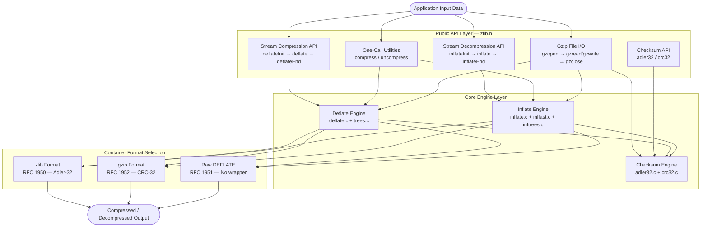

### 4.1.2 Primary User Workflow Summary

The library exposes seven primary user workflows, each following a consistent lifecycle pattern. All workflows share the common contract of operating through the `z_stream` structure (`zlib.h` lines 90–120) or opaque `gzFile` handle.

| Workflow | Entry Point | Lifecycle Pattern | Feature |
|----------|-------------|-------------------|---------|
| Stream Compression | `deflateInit2()` | Init → Repeat `deflate()` → `deflateEnd()` | F-001 |
| Stream Decompression | `inflateInit2()` | Init → Repeat `inflate()` → `inflateEnd()` | F-002 |
| Callback Decompression | `inflateBackInit()` | Init → `inflateBack()` → `inflateBackEnd()` | F-003 |
| One-Call Compress | `compress2()` | Single function call (wraps F-001 internally) | F-004 |
| One-Call Decompress | `uncompress2()` | Single function call (wraps F-002 internally) | F-004 |
| Gzip File Read | `gzopen()` | Open → Repeat `gzread()` → `gzclose()` | F-006 |
| Gzip File Write | `gzopen()` | Open → Repeat `gzwrite()` → `gzclose()` | F-006 |

### 4.1.3 Container Format Selection Logic

A critical decision point shared by both compression and decompression initialization is the selection of container format, governed entirely by the `windowBits` parameter passed to `deflateInit2()` or `inflateInit2()`. This parameter simultaneously controls the sliding window size (lower 4 bits) and the wrapper format (sign and offset), as implemented in `deflate.c` lines 422–433 and `inflate.c` lines 506–553.

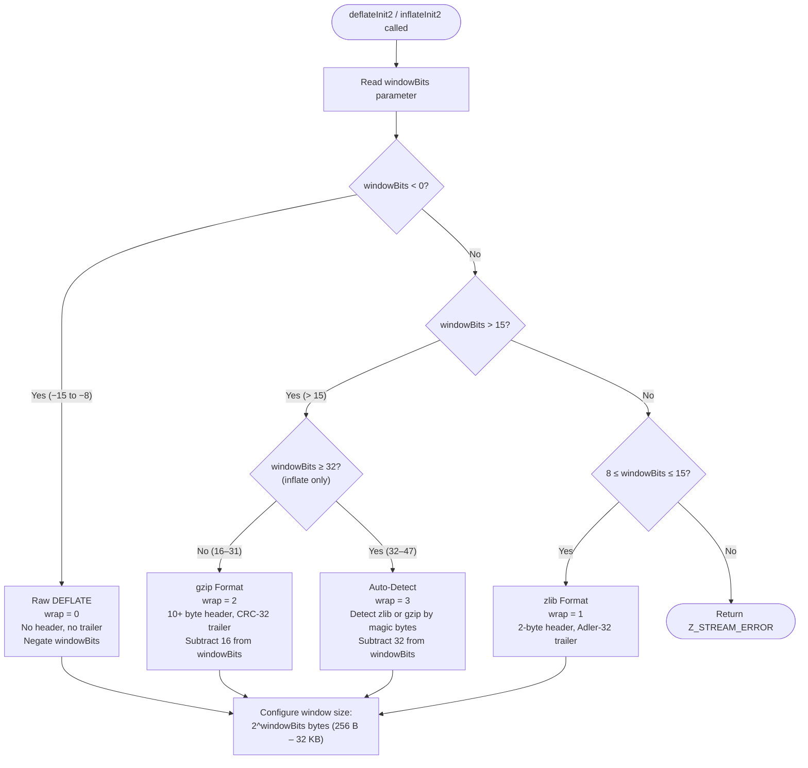

| windowBits Range | Format | Header | Trailer | Checksum |
|------------------|--------|--------|---------|----------|
| 8 to 15 | zlib (RFC 1950) | 2 bytes (CMF + FLG) | 4-byte Adler-32 | Adler-32 |
| −8 to −15 | Raw DEFLATE (RFC 1951) | None | None | None |
| 24 to 31 (+16) | gzip (RFC 1952) | 10+ bytes | 4-byte CRC-32 + 4-byte length | CRC-32 |
| 40 to 47 (+32) | Auto-detect (inflate only) | Detected at runtime | Detected at runtime | Format-dependent |

---

## 4.2 Stream Compression (Deflate) Process Flows

### 4.2.1 Deflate State Transition Diagram

The deflate engine in `deflate.c` operates as a linear state machine with eight discrete states, defined as integer constants in `deflate.h` lines 58–67. The state machine governs the sequential writing of format headers, the main compression phase, and the trailer output. State transitions are driven by calls to `deflate()` and are irreversible under normal operation; the only mechanism for returning to the initial state is `deflateReset()`.

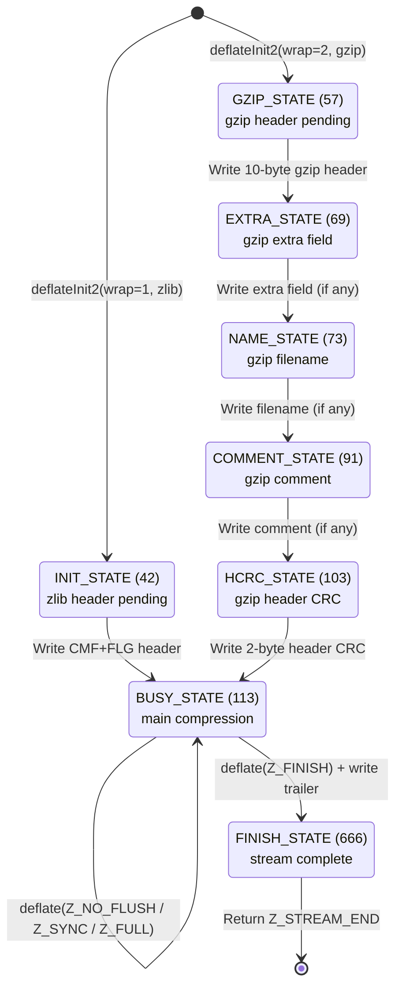

| State | Numeric Value | Purpose | Trigger to Next State |
|-------|--------------|---------|----------------------|
| `INIT_STATE` | 42 | Awaiting zlib header output | First `deflate()` call writes CMF+FLG |
| `GZIP_STATE` | 57 | Awaiting gzip header output | First `deflate()` call writes 10-byte header |
| `EXTRA_STATE` | 69 | Writing gzip extra field | Extra data flushed or absent |
| `NAME_STATE` | 73 | Writing gzip filename | Null-terminated name written or absent |
| `COMMENT_STATE` | 91 | Writing gzip comment | Null-terminated comment written or absent |
| `HCRC_STATE` | 103 | Writing gzip header CRC | 2-byte CRC16 of header emitted |
| `BUSY_STATE` | 113 | Active compression | `deflate()` called with `Z_FINISH` |
| `FINISH_STATE` | 666 | Compression complete | Terminal — `deflateEnd()` to free |

### 4.2.2 Deflate Initialization Process

The `deflateInit2_()` function in `deflate.c` lines 387–500 performs a multi-step initialization sequence with rigorous parameter validation. Every validation failure produces a specific error return code, enabling callers to diagnose exactly what went wrong.

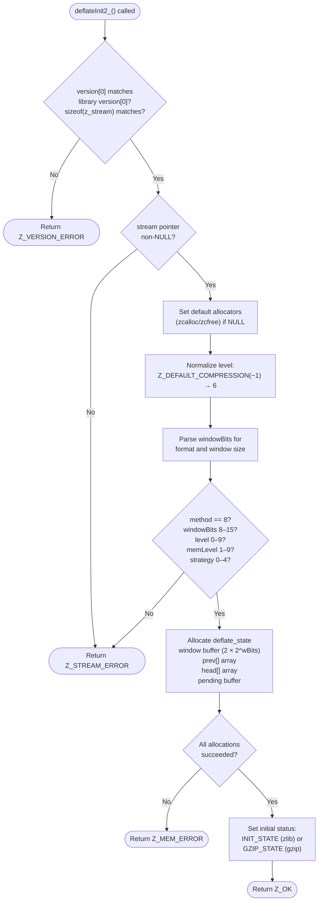

#### Initialization Validation Rules

| Checkpoint | Condition | Error Code | Evidence |
|------------|-----------|------------|----------|
| Version compatibility | `version[0]` must match library's compiled version | `Z_VERSION_ERROR` | `deflate.c` line 393 |
| Struct size match | `sizeof(z_stream)` must equal compile-time value | `Z_VERSION_ERROR` | `deflate.c` line 395 |
| Non-null stream | Stream pointer must not be NULL | `Z_STREAM_ERROR` | `deflate.c` line 399 |
| Method parameter | Must be `Z_DEFLATED` (8); no other methods supported | `Z_STREAM_ERROR` | `deflate.c` line 437 |
| Window bits range | Effective value must be 8–15 after format parsing | `Z_STREAM_ERROR` | `deflate.c` line 438 |
| Memory level range | Must be 1–9 | `Z_STREAM_ERROR` | `deflate.c` line 439 |
| Strategy range | Must be 0–4 | `Z_STREAM_ERROR` | `deflate.c` line 440 |
| Memory allocation | All buffers must allocate successfully | `Z_MEM_ERROR` | `deflate.c` lines 453–476 |

### 4.2.3 Main Deflate Processing Loop

The `deflate()` function (`deflate.c` lines 981–1290) implements the main compression loop. Each invocation processes available input data, selects the appropriate compression strategy, and manages flush behavior. The function returns control to the caller whenever output buffer space is exhausted or the requested flush operation completes.

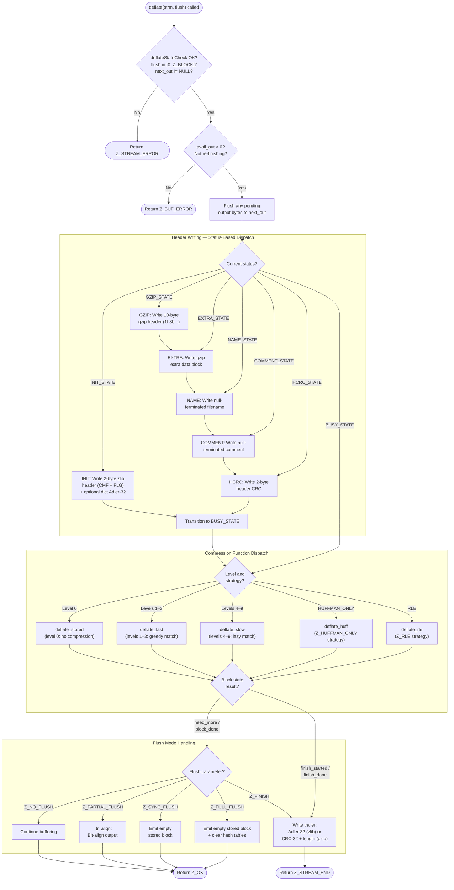

### 4.2.4 Compression Function Selection and Flush Behavior

The compression function is selected from a configuration table (`deflate.c` lines 112–124) that maps compression levels to internal algorithms. Each algorithm reflects a different trade-off between compression speed and ratio, as documented in the `configuration_table[]` array.

| Level | Internal Function | Matching Strategy | Performance Profile |
|-------|-------------------|-------------------|---------------------|
| 0 | `deflate_stored` | No matching — raw storage | Fastest; output ≥ input |
| 1–3 | `deflate_fast` | Greedy (first sufficient match) | Fast; lower ratio |
| 4–9 | `deflate_slow` | Lazy evaluation (compare current vs. next match) | Slower; higher ratio |
| Any | `deflate_huff` | Huffman-only (no LZ77) | Strategy `Z_HUFFMAN_ONLY` |
| Any | `deflate_rle` | Run-length encoding only | Strategy `Z_RLE` |

Each function returns one of four block state values that determine control flow: `need_more` (continue processing), `block_done` (block boundary reached), `finish_started` (final block initiated), and `finish_done` (trailer written, stream complete).

#### Flush Mode Behavior

Flush modes, defined in `zlib.h` lines 172–178, provide callers with fine-grained control over output timing and synchronization.

| Flush Mode | Value | Deflate Behavior | Primary Use Case |
|------------|-------|------------------|------------------|
| `Z_NO_FLUSH` | 0 | Buffer data; compress when internal buffers fill | Normal streaming operation |
| `Z_PARTIAL_FLUSH` | 1 | Align to bit boundary via `_tr_align()` | Legacy compatibility |
| `Z_SYNC_FLUSH` | 2 | Emit empty stored block as sync marker | Network protocol sync points |
| `Z_FULL_FLUSH` | 3 | Sync flush plus clear hash history | Error recovery insertion points |
| `Z_FINISH` | 4 | Complete stream; write trailer bytes | End of compression session |
| `Z_BLOCK` | 5 | Stop at next deflate block boundary | Fine-grained streaming control |
| `Z_TREES` | 6 | Stop after emitting dynamic tree header | Advanced compression analysis |

---

## 4.3 Stream Decompression (Inflate) Process Flows

### 4.3.1 Inflate State Transition Overview

The inflate engine in `inflate.c` is implemented as a large state machine with over thirty distinct modes, defined as an enumeration in `inflate.h` lines 20–78. States are organized into four logical phases: header parsing, block decoding, code decoding, and trailer verification, plus two error states (`BAD` and `MEM`) and a synchronization-seeking state (`SYNC`).

The following diagram presents the inflate state transitions organized by phase, showing the major pathways through which compressed data is processed. Each phase is enclosed in a system boundary, and transitions between phases represent key decision points.

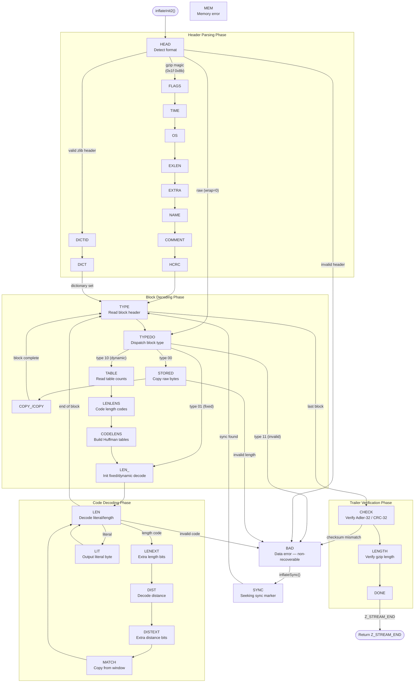

#### Inflate State Summary by Phase

| Phase | States | Purpose |
|-------|--------|---------|
| Header Parsing | HEAD, FLAGS, TIME, OS, EXLEN, EXTRA, NAME, COMMENT, HCRC, DICTID, DICT | Identify format; parse gzip/zlib headers; handle dictionary requirement |
| Block Decoding | TYPE, TYPEDO, STORED, COPY_, COPY, TABLE, LENLENS, CODELENS, LEN_ | Read block headers; build Huffman tables; dispatch to correct decoder |
| Code Decoding | LEN, LENEXT, DIST, DISTEXT, MATCH, LIT | Decode literal/length/distance codes; copy back-references from window |
| Trailer Verification | CHECK, LENGTH, DONE | Validate checksum (Adler-32 or CRC-32); verify gzip uncompressed length |
| Error States | BAD, MEM, SYNC | Handle corrupt data, memory failures, and sync-point seeking |

### 4.3.2 Inflate Main Processing Loop

The `inflate()` function (`inflate.c` lines 474–1153) implements its state machine as an infinite `for`-loop with a `switch` on `state->mode`. The loop exits via the `inf_leave` label, which updates the sliding window, computes running checksums, and returns the appropriate status code.

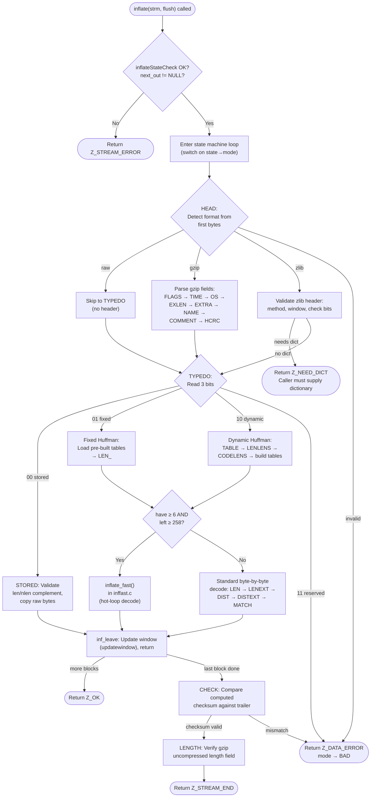

### 4.3.3 Fast-Path Decompression

The `inflate_fast()` function in `inffast.c` provides a performance-optimized inner decoding loop that is invoked when sufficient input (`have >= 6` bytes) and output (`left >= 258` bytes) are available. This fast path avoids per-byte input/output boundary checks, operating directly on the bit accumulator with minimal branching. It processes literal bytes, length-distance pairs, and end-of-block markers in a tight loop, falling back to the standard state machine only when buffer boundaries are reached or an unusual code is encountered.

The fast-path entry conditions ensure that the inner loop can process a complete length-distance copy (maximum match length of 258 bytes per `MAX_MATCH` in `deflate.h`) and consume the longest possible Huffman code (up to 48 bits, requiring 6 input bytes) without boundary checks within the loop body.

---

## 4.4 Gzip File I/O Workflows

### 4.4.1 Gzip Read Pipeline

The gzip read pipeline in `gzread.c` employs a three-mode internal state machine controlled by the `how` field of `gz_state` (`gzguts.h` lines 170–203). This state machine automatically detects whether the input file contains gzip-compressed data or plain text, enabling transparent reading of both formats. On reaching the end of a gzip member, the state machine resets to `LOOK` to detect concatenated gzip streams.

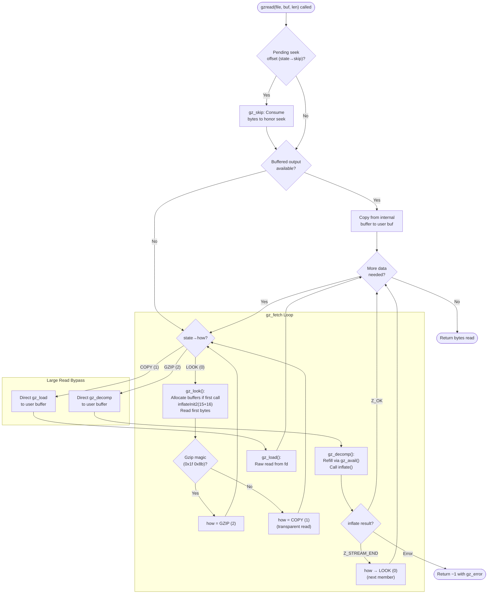

| Read Mode | Value | Behavior | Transition Trigger |
|-----------|-------|----------|--------------------|
| `LOOK` | 0 | Allocate buffers; detect format by inspecting header bytes | First read or end of gzip member |
| `COPY` | 1 | Pass-through transparent read via raw `read()` calls | Non-gzip file detected |
| `GZIP` | 2 | Decompress via inflate engine with CRC-32 verification | Gzip magic bytes detected |

### 4.4.2 Gzip Write Pipeline

The gzip write pipeline in `gzwrite.c` implements lazy initialization and a dual-path buffering strategy that optimizes for both small incremental writes and large bulk writes. The internal `gz_comp()` function handles the actual deflate compression loop and flushes compressed chunks to the file descriptor.

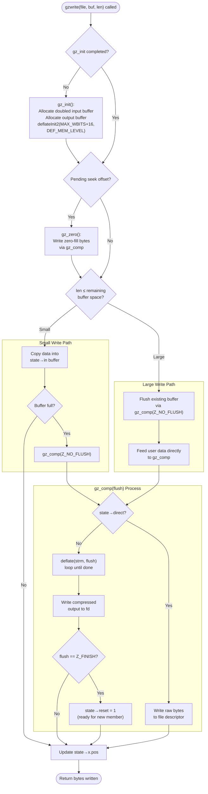

### 4.4.3 Gzip File Close Process

The `gzclose()` function in `gzclose.c` dispatches to mode-specific close handlers based on whether the file was opened for reading or writing. This dispatch is necessary because the write path must flush any pending compressed data and write the gzip trailer before releasing resources.

| Operation | Handler | Actions |
|-----------|---------|---------|
| Read close | `gzclose_r()` | Free inflate state, free internal buffers, close file descriptor |
| Write close | `gzclose_w()` | Flush pending data via `gz_comp(Z_FINISH)`, write CRC-32 + length trailer, free deflate state, close file descriptor |
| Invalid handle | — | Returns `Z_STREAM_ERROR` |

---

## 4.5 Utility and Integration Workflows

### 4.5.1 One-Call Compression and Decompression

The one-call utilities in `compress.c` and `uncompr.c` (Feature F-004) wrap the streaming API to provide single-function-call compression and decompression. Both internally manage `z_stream` initialization, iterative processing with chunk-size limits (capped at `max uInt` per iteration for platforms where `uInt < size_t`), and cleanup.

```mermaid
flowchart TD
    subgraph CompressFlow["compress2_z(dest, destLen, source, sourceLen, level)"]
        C_Entry(["Called"])
        C_Validate{"dest, destLen,<br/>source all non-NULL?"}
        C_Init["deflateInit(stream, level)"]
        C_InitOK{"Init OK?"}
        C_Loop["Feed chunks to deflate():<br/>Cap at max uInt per call<br/>Use Z_NO_FLUSH while data remains<br/>Use Z_FINISH for final chunk"]
        C_LoopOK{"err == Z_OK?"}
        C_Record["Record output size<br/>in *destLen"]
        C_End["deflateEnd(stream)"]
        C_MapOK["Map Z_STREAM_END → Z_OK"]
        C_RetOK(["Return Z_OK"])
        C_RetErr(["Return error code"])
    end

    subgraph DecompFlow["uncompress2_z(dest, destLen, source, sourceLen)"]
        U_Entry(["Called"])
        U_Validate{"dest, destLen,<br/>source all non-NULL?"}
        U_Init["inflateInit(stream)"]
        U_InitOK{"Init OK?"}
        U_Loop["Feed chunks to inflate():<br/>Cap at max uInt per call<br/>Use Z_NO_FLUSH throughout"]
        U_LoopOK{"err == Z_OK?"}
        U_Record["Record consumed input<br/>and produced output"]
        U_End["inflateEnd(stream)"]
        U_MapErr["Map Z_NEED_DICT → Z_DATA_ERROR<br/>Map Z_BUF_ERROR(len=0) → Z_DATA_ERROR<br/>Map Z_STREAM_END → Z_OK"]
        U_RetOK(["Return Z_OK"])
        U_RetErr(["Return error code"])
    end

    C_Entry --> C_Validate
    C_Validate -->|"No"| C_RetErr
    C_Validate -->|"Yes"| C_Init
    C_Init --> C_InitOK
    C_InitOK -->|"No"| C_RetErr
    C_InitOK -->|"Yes"| C_Loop
    C_Loop --> C_LoopOK
    C_LoopOK -->|"Yes"| C_Loop
    C_LoopOK -->|"No (Z_STREAM_END)"| C_Record
    C_Record --> C_End
    C_End --> C_MapOK --> C_RetOK

    U_Entry --> U_Validate
    U_Validate -->|"No"| U_RetErr
    U_Validate -->|"Yes"| U_Init
    U_Init --> U_InitOK
    U_InitOK -->|"No"| U_RetErr
    U_InitOK -->|"Yes"| U_Loop
    U_Loop --> U_LoopOK
    U_LoopOK -->|"Yes"| U_Loop
    U_LoopOK -->|"No"| U_Record
    U_Record --> U_End
    U_End --> U_MapErr
    U_MapErr --> U_RetOK
```

### 4.5.2 Dictionary-Based Compression and Decompression Sequence

Preset dictionaries allow applications to seed the compressor's sliding window with domain-specific data, improving compression ratios for small payloads with known patterns. The following sequence diagram illustrates the complete round-trip flow between an application, the deflate engine, the inflate engine, and the checksum engine. The key handshake is the `Z_NEED_DICT` return during decompression, which signals the caller to supply the same dictionary used during compression, identified by its Adler-32 checksum.

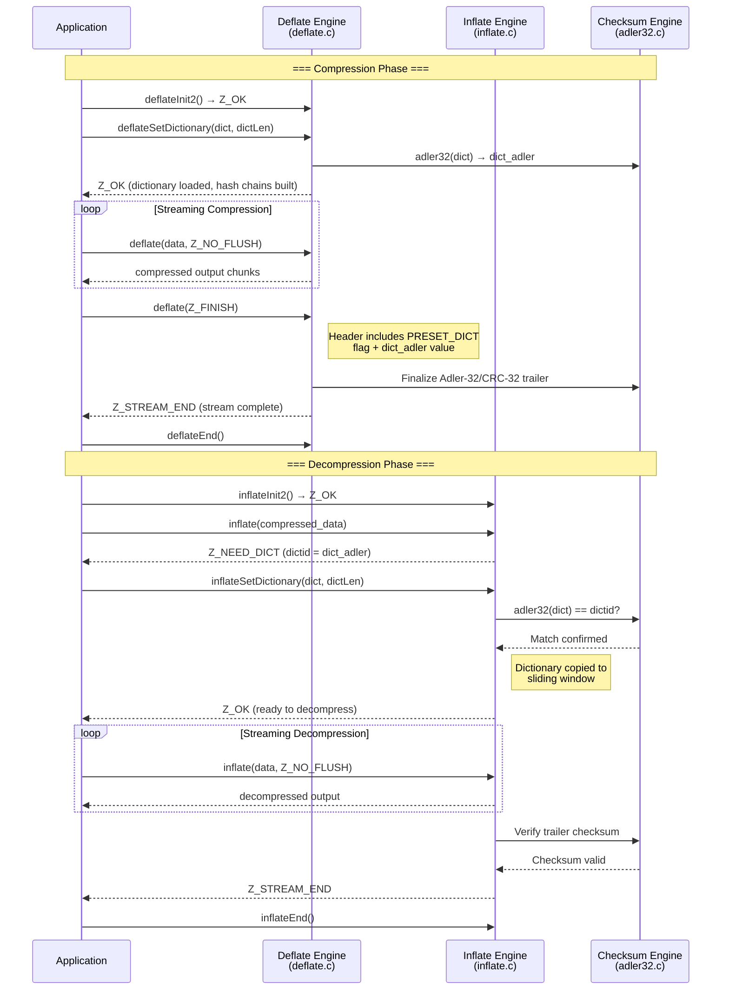

#### Dictionary Workflow Validation Rules

| Checkpoint | Validation | Error on Failure |
|------------|-----------|------------------|
| `deflateSetDictionary()` call timing | State must be `INIT_STATE` for zlib format | `Z_STREAM_ERROR` |
| Dictionary length | Must fit within window size | Truncated to window size silently |
| `inflateSetDictionary()` Adler-32 match | Adler-32 of supplied dictionary must match `dictid` from stream header | `Z_DATA_ERROR` |
| `inflateSetDictionary()` call timing | State must be `DICT` (after `Z_NEED_DICT` return) | `Z_STREAM_ERROR` |

### 4.5.3 Mid-Stream Parameter Change

The `deflateParams()` function (`deflate.c` lines 774–816) allows applications to change the compression level and strategy mid-stream without reinitializing. This is particularly useful when data characteristics change (for example, switching from text to binary data within a single stream).

The process involves:

1. **Validation** — Verify stream state is valid and parameters are within acceptable ranges.
2. **Strategy change detection** — If the compression function would change (as determined by the `configuration_table` lookup), the current pending block must be flushed by calling `deflate(strm, Z_BLOCK)`.
3. **Flush completion check** — If unflushed data remains after the flush attempt (output buffer was too small), `Z_BUF_ERROR` is returned; the caller must provide more output space and retry.
4. **Level transition handling** — When transitioning from level 0 (stored) to any compression level, the hash tables are initialized via `slide_hash()` or `CLEAR_HASH`; the reverse transition does not require hash clearing.
5. **Parameter update** — New level, strategy, and associated match parameters (`good_length`, `max_lazy`, `nice_length`, `max_chain`) are applied from `configuration_table`.

---

## 4.6 Error Handling and Recovery Processes

### 4.6.1 Error Code Taxonomy and Decision Paths

All zlib functions communicate status through a unified set of return codes defined in `zlib.h` lines 181–189. Each code has specific semantics regarding recoverability and recommended caller action. The `strm->msg` field provides a human-readable error description when non-NULL.

| Code | Value | Meaning | Recoverable | Caller Action |
|------|-------|---------|-------------|---------------|
| `Z_OK` | 0 | Operation in progress / success | N/A | Continue processing |
| `Z_STREAM_END` | 1 | Compression or decompression complete | N/A | Call `*End()` to release resources |
| `Z_NEED_DICT` | 2 | Preset dictionary required for decompression | Yes | Call `inflateSetDictionary()` with matching dictionary |
| `Z_ERRNO` | −1 | Underlying file system error (gzip I/O) | Depends | Check `errno` for specifics |
| `Z_STREAM_ERROR` | −2 | Invalid parameter, inconsistent state, or NULL pointer | Yes | Fix parameter values; check API usage |
| `Z_DATA_ERROR` | −3 | Corrupted or invalid compressed data | Partial | Try `inflateSync()` for partial recovery |
| `Z_MEM_ERROR` | −4 | Insufficient memory for allocation | Yes | Free memory elsewhere, retry |
| `Z_BUF_ERROR` | −5 | No progress possible (output full or input exhausted) | Yes | Provide more output/input buffer space |
| `Z_VERSION_ERROR` | −6 | Library version incompatible with caller's header | No | Rebuild application against correct library |

### 4.6.2 Error Detection and Handling Flow

The following diagram illustrates the unified error handling flow that applies across all major zlib operations. Each entry point validates state via `deflateStateCheck()` or `inflateStateCheck()`, and errors cascade through the `ERR_RETURN(strm, code)` macro, which sets `strm->msg` before returning the error code.

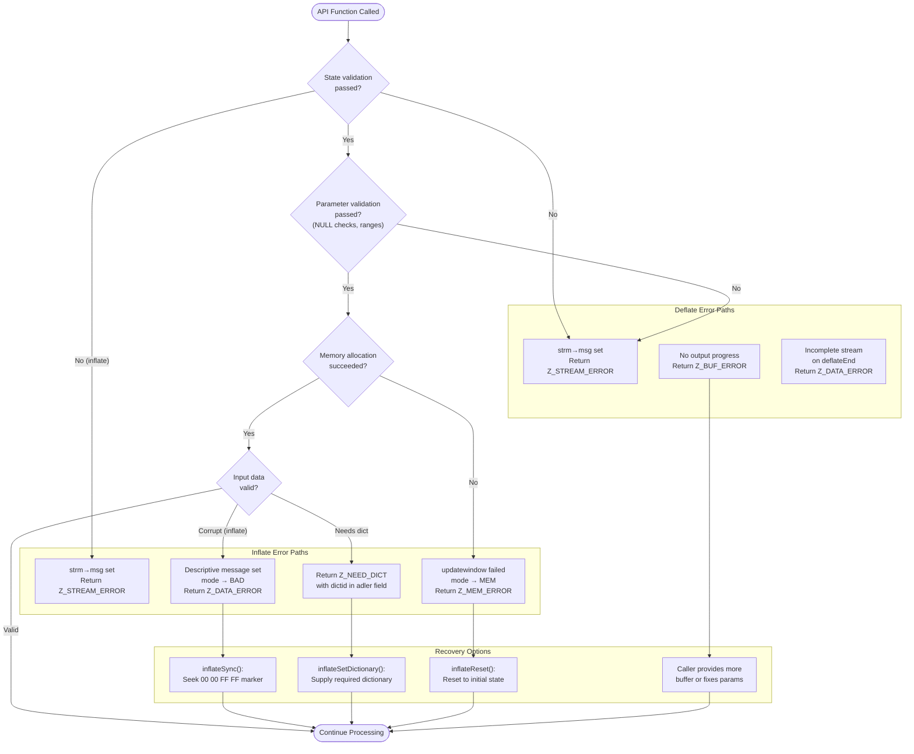

#### Inflate Error Messages

The inflate engine provides detailed diagnostic messages stored in `strm->msg` for every error condition. These messages, defined as string literals in `inflate.c`, enable precise identification of the failure point:

| Error Message | State | Meaning |
|---------------|-------|---------|
| `"incorrect header check"` | HEAD | zlib header CMF/FLG check byte mismatch |
| `"unknown compression method"` | HEAD | Method field is not `Z_DEFLATED` (8) |
| `"invalid window size"` | HEAD | Window size in header exceeds configured maximum |
| `"invalid block type"` | TYPEDO | Block type bits are `11` (reserved/invalid) |
| `"invalid stored block lengths"` | STORED | Stored block length does not match one's complement |
| `"too many length or distance symbols"` | TABLE | Count of Huffman symbols exceeds specification limit |
| `"invalid code lengths set"` | CODELENS | Huffman table construction failed |
| `"invalid literal/length code"` | LEN | Decoded code has no valid mapping |
| `"invalid distance code"` | LEN | Distance code exceeds table bounds |
| `"invalid distance too far back"` | MATCH | Back-reference distance exceeds available window data |
| `"incorrect data check"` | CHECK | Computed checksum does not match trailer value |
| `"incorrect length check"` | LENGTH | Gzip uncompressed length field mismatch |
| `"header crc mismatch"` | HCRC | Gzip header CRC does not match computed value |

### 4.6.3 Error Recovery via inflateSync

The `inflateSync()` function (`inflate.c` lines 1264–1310) provides the primary mechanism for recovering from data corruption in compressed streams. It searches forward through the input for a four-byte sync marker pattern (`00 00 FF FF`) that marks the beginning of a stored block boundary — these are inserted by `Z_SYNC_FLUSH` or `Z_FULL_FLUSH` during compression.

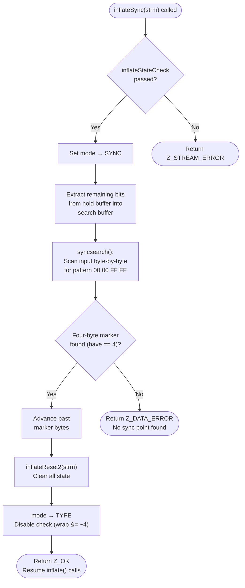

**Important limitations of `inflateSync()` recovery:**

- Recovery is only possible if the compressor inserted sync points using `Z_SYNC_FLUSH` or `Z_FULL_FLUSH` flush modes.
- After successful sync recovery, checksum verification is disabled (`wrap &= ~4`) because the intervening data was lost, making the running checksum invalid.
- Data between the corruption point and the sync marker is permanently lost; the application must tolerate this gap.
- The `syncsearch()` helper function in `inflate.c` performs a linear byte-by-byte scan, making worst-case recovery time proportional to the remaining input size.

---

## 4.7 Checksum and Data Integrity Workflows

### 4.7.1 Checksum Computation Process

Both checksum algorithms operate incrementally via repeated calls with data chunks, accumulating a running checksum that can be finalized at any point. The initial seed value differs by algorithm: Adler-32 starts with `1L`, while CRC-32 starts with `0L`.

#### Adler-32 Computation (adler32.c)

The Adler-32 algorithm maintains two 16-bit accumulators (`sum1` and `sum2`) using modular arithmetic with a prime base of 65521. The implementation in `adler32.c` employs three optimization tiers:

1. **Single-byte hot path** — When `len == 1`, a direct inline update avoids loop overhead.
2. **Short buffer path** — For `len < 16`, a simple byte-by-byte loop with deferred modular reduction (using `MOD28` macro).
3. **Long buffer path** — For `len >= 16`, processes data in `NMAX`-sized blocks (5552 bytes), where each block uses a 16-fold unrolled `DO16` macro for accumulation. The `NMAX` value of 5552 is the largest `n` such that `255n(n+1)/2 + (n+1)(BASE-1) < 2^32`, ensuring no overflow before the modular reduction step.

#### CRC-32 Computation (crc32.c)

The CRC-32 implementation dispatches to multiple optimized code paths depending on the target platform:

1. **ARM CRC32** — On AArch64 platforms with hardware CRC support, inline assembly (`crc32b`/`crc32x` instructions) performs batch computation directly in hardware.
2. **Braided computation** — The default software path processes `N` words simultaneously (configurable N=1–6, default 5, with word size W=4 or 8 bytes) using interleaved table lookups to exploit instruction-level parallelism.
3. **Byte-wise fallback** — A single-byte table lookup path for platforms without word-level optimization support.

### 4.7.2 Checksum Combine for Parallel Processing

The `crc32_combine()` and `adler32_combine()` functions enable merging independently computed checksums without access to the original data. This capability supports parallel compression workflows where data segments are processed concurrently.

The CRC-32 combine operation uses O(log n) matrix exponentiation: `x2nmodp()` builds a "zeros operator" representing the effect of appending `len2` zero bytes, and `multmodp()` applies this operator to `crc1` before XORing with `crc2`. The precomputed operator can be cached via `crc32_combine_gen()` and reapplied via `crc32_combine_op()` for repeated combinations at the same length.

---

## 4.8 Build and CI/CD Workflows

### 4.8.1 Build System Process Flow

The zlib library supports two build systems: CMake (primary, `CMakeLists.txt`) and GNU Autotools-style configure/make (fallback). The CMake build follows a standard detection-configuration-generation-compilation pipeline.

| Phase | CMake Actions | Configure/Make Actions |
|-------|---------------|----------------------|
| Configuration | Feature detection (`off64_t`, `fseeko`, `stdarg.h`, `unistd.h`, visibility); option processing (`ZLIB_BUILD_TESTING`, `ZLIB_BUILD_SHARED`, `ZLIB_BUILD_STATIC`) | Platform detection via shell tests; set `CC`, `CFLAGS` |
| Generation | Generate `zconf.h` from template; generate `zlib.pc` (pkg-config) | Generate `zconf.h`; configure Makefile |
| Compilation | Build targets: `zlib` (shared), `zlibstatic`, `example`, `minigzip`; optional `ZLIB_BUILD_MINIZIP` | `make` — compile all `.c` files; link `libz.a` / `libz.so` |
| Testing | `ctest` execution of `example` and `minigzip` tests | `make test` — run `example` and `minigzip` |
| Installation | Headers, libraries, pkg-config, CMake exports | `make install` |

### 4.8.2 CI/CD Pipeline Matrix

The seven CI/CD workflow files in `.github/workflows/` provide comprehensive automated verification across operating systems, compilers, and architectures. All workflows trigger on push and pull request events (except `fuzz.yml`, which triggers on PR only).

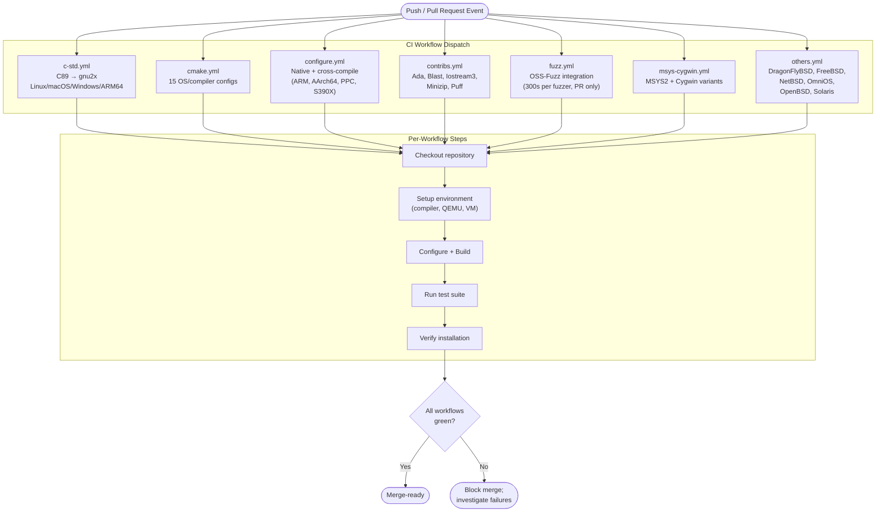

### 4.8.3 Test Execution Sequence

The canonical test driver `test/example.c` exercises the library's API in a prescribed sequence that validates each core workflow and its integration points. The tests are ordered to progressively exercise increasingly complex functionality:

| Order | Test Function | Validates | Features Exercised |
|-------|--------------|-----------|-------------------|
| 1 | `test_compress()` | One-call round-trip | F-004: `compress()` → `uncompress()` |
| 2 | `test_gzio()` | Gzip file I/O pipeline | F-006: `gzopen` → `gzwrite` → `gzread` → `gzseek` → `gzungetc` → `gzclose` |
| 3 | `test_deflate()` | Streaming compression | F-001: `deflateInit` → `deflate(Z_FINISH)` → `deflateEnd` |
| 4 | `test_inflate()` | Streaming decompression | F-002: `inflateInit` → `inflate()` → `inflateEnd` |
| 5 | `test_large_deflate()` | Large data with parameter changes | F-001: `deflateParams()` mid-stream level/strategy switch |
| 6 | `test_large_inflate()` | Large data decompression | F-002: Multi-block inflate |
| 7 | `test_flush()` | Sync flush mechanism | F-001: `Z_SYNC_FLUSH` behavior |
| 8 | `test_sync()` | Error recovery | F-002: `inflateSync()` on corrupted stream |
| 9 | `test_dict_deflate()` | Dictionary compression | F-001: `deflateSetDictionary()` |
| 10 | `test_dict_inflate()` | Dictionary decompression | F-002: `Z_NEED_DICT` → `inflateSetDictionary()` |

The supplementary coverage harness `test/infcover.c` extends validation with exhaustive inflate state machine coverage using a custom memory allocator tracking system (`mem_item`/`mem_zone`) that verifies every allocation is properly freed and exercises allocation failure paths.

---

## 4.9 References

#### Source Files

- `deflate.c` — Deflate engine implementation: initialization (lines 387–500), main processing loop (lines 981–1290), state machine transitions, header/trailer writing, `deflateParams()` (lines 774–816), `deflateSetDictionary()` (lines 559–622)
- `deflate.h` — Deflate state constants (lines 58–67: INIT_STATE through FINISH_STATE), internal_state structure, configuration types (lines 63–68, 112–124)
- `inflate.c` — Inflate engine implementation: main state machine (lines 474–1153), `inflateSync()` (lines 1264–1310), `syncsearch()`, `inflateSetDictionary()` (lines 1187–1217), error message strings
- `inflate.h` — Inflate state machine enumeration (lines 20–78: 30+ modes), `inflate_state` structure definition (lines 82–126)
- `inffast.c` — Fast-path decode loop for performance-critical inner decompression
- `inftrees.c` — Huffman table construction for inflate
- `trees.c` — Huffman tree builder for deflate compression
- `compress.c` — One-call compression wrapper (lines 24–99)
- `uncompr.c` — One-call decompression wrapper (lines 29–101)
- `gzguts.h` — Gzip internal state structure (`gz_state`), mode constants (GZ_READ/GZ_WRITE), buffer defaults (lines 170–203)
- `gzread.c` — Gzip read pipeline: `gz_read()`, `gz_fetch()`, `gz_look()`, `gz_decomp()`, `gz_load()`
- `gzwrite.c` — Gzip write pipeline: `gz_write()`, `gz_init()`, `gz_comp()`, `gz_zero()`
- `gzlib.c` — Gzip common utilities: `gz_open()`, seek, tell, rewind, reset, error management
- `gzclose.c` — Mode-based close dispatch: `gzclose_r()`, `gzclose_w()`
- `adler32.c` — Streaming Adler-32 with NMAX batching, DO16 unrolling, combine operations
- `crc32.c` — Multi-path CRC-32 (braided, ARM, S390X), table generation, combine via matrix exponentiation
- `zlib.h` — Public API header: `z_stream` structure (lines 90–120), `gz_header` structure, return codes (lines 181–189), flush modes (lines 172–178), compression levels and strategies
- `zutil.c` — Internal utilities: error message table, `zlibVersion()`, `zlibCompileFlags()`, default allocators
- `infback.c` — Callback-based decompression state machine
- `CMakeLists.txt` — Primary CMake build configuration, feature detection, target definitions
- `zlib.map` — GNU symbol versioning script (14 version nodes)

#### Folders

- `test/` — Test suite: `example.c` (regression driver), `infcover.c` (inflate coverage harness), `minigzip.c` (gzip reference tool)
- `.github/workflows/` — Seven CI/CD workflow files: `c-std.yml`, `cmake.yml`, `configure.yml`, `contribs.yml`, `fuzz.yml`, `msys-cygwin.yml`, `others.yml`
- `contrib/minizip/` — ZIP archive implementation (21 files): `zip.c`, `unzip.c`, `ioapi.c`, `crypt.h`, `skipset.h`

#### Technical Specification Cross-References

- Section 1.1 — Executive Summary: project context and design guarantees
- Section 1.2 — System Overview: architecture diagram, capability domains, container formats
- Section 1.3 — Scope: in-scope features, platform coverage, primary user workflows
- Section 2.1 — Feature Catalog: features F-001 through F-014 with dependencies
- Section 2.2 — Functional Requirements: detailed requirements for all features
- Section 2.3 — Feature Relationships: dependency map, integration points, shared components
- Section 2.4 — Implementation Considerations: technical constraints, performance, security
- Section 2.5 — Assumptions and Constraints: DEFLATE-only constraint, single-thread per stream
- Section 2.6 — Traceability Matrix: feature-to-source mapping
- Section 3.7 — Security Considerations: corrupted input handling, fuzz testing, thread safety

# 5. System Architecture

## 5.1 HIGH-LEVEL ARCHITECTURE

### 5.1.1 System Overview

The zlib library (version 1.3.2.1-motley, `VERNUM 0x1321`) implements a **layered library architecture** designed for maximum portability, minimal footprint, and deterministic behavior. Written entirely in ANSI C (C89 baseline, validated through C2x per `.github/workflows/c-std.yml`), zlib provides in-memory compression and decompression through the DEFLATE algorithm (RFC 1951) wrapped in three container formats: zlib (RFC 1950), gzip (RFC 1952), and raw deflate streams.

The architectural style is that of a **stateless, in-process function library** — there is no networking, inter-process communication, daemon lifecycle, or persistent storage in the core. All operations are synchronous function calls operating on caller-managed buffers. This design was chosen explicitly to maximize the library's deployment envelope, which ranges from bare-metal embedded systems to operating system kernels to user-space applications.

#### Key Architectural Principles

The following principles govern the entire design, as documented in `zlib.h` lines 51–83 and evidenced across the codebase:

- **Streaming-first design**: All core processing operates through the `z_stream` structure (`zlib.h` lines 90–110), enabling incremental processing of arbitrarily large (or infinite) data streams with bounded memory consumption.
- **State machine internals**: Both the deflate engine (8 explicit states in `deflate.h` lines 58–67) and the inflate engine (30+ modes in `inflate.h` lines 20–53) are implemented as deterministic state machines, enabling clean suspend/resume semantics and rigorous error recovery.
- **Opaque internal state**: The `struct internal_state` is forward-declared but never exposed to consumers, preserving encapsulation and enabling internal evolution without breaking the ABI.
- **No global mutable state**: Thread safety is achieved by design — all mutable state is scoped to individual `z_stream` instances, with no shared globals, making the library thread-safe when user-supplied memory allocators (`zalloc`/`zfree`) are themselves thread-safe (Assumption A-003).
- **Crash resilience**: The library is designed to never crash even when processing corrupted input; instead, it returns `Z_DATA_ERROR` with a diagnostic message in `strm->msg`.
- **Zero external dependencies**: The core library depends solely on the standard C library (`stddef.h`, `string.h`, `stdlib.h` per `zutil.h` lines 24–30), eliminating all supply-chain risk.
- **No side effects**: The library installs no signal handlers, preserving full application control over the execution environment.

#### System Boundaries

The system boundary is defined precisely by the public header `zlib.h` and its companion `zconf.h`. All consumer interaction passes through this single interface contract. Internal implementation details — state structures, hash tables, Huffman tables, sliding windows — are entirely hidden behind opaque pointers. The only optional boundary extension is the Gzip File I/O layer, which introduces a dependency on platform `stdio` and file descriptor operations; this layer is excluded entirely when the `Z_SOLO` compile flag is active, producing a minimal build suitable for kernel and embedded deployment.

### 5.1.2 Core Components

The zlib architecture comprises twelve discrete components organized across six architectural layers. The following tables summarize each component's role and dependencies.

#### Component Responsibility Summary

| Component | Primary Responsibility | Source Files |
|---|---|---|
| **Public API** | Unified interface contract for all consumers | `zlib.h`, `zconf.h` |
| **Deflate Engine** | DEFLATE compression (RFC 1951) with LZ77 + Huffman coding | `deflate.c`, `deflate.h`, `trees.c`, `trees.h` |
| **Inflate Engine** | DEFLATE decompression with fast-path optimization | `inflate.c`, `inflate.h`, `inffast.c`, `inftrees.c` |
| **Callback Decompressor** | Memory-efficient decompression via I/O callbacks | `infback.c` |
| **Adler-32 Engine** | Checksum for zlib-format streams (RFC 1950) | `adler32.c` |
| **CRC-32 Engine** | Checksum for gzip-format streams (RFC 1952) | `crc32.c`, `crc32.h` |
| **Gzip File I/O** | stdio-like `.gz` file read/write with format auto-detection | `gzlib.c`, `gzread.c`, `gzwrite.c`, `gzclose.c`, `gzguts.h` |
| **One-Call Utilities** | Buffer-to-buffer compress/uncompress wrappers | `compress.c`, `uncompr.c` |
| **Internal Utilities** | Error messages, default allocators, compile flags introspection | `zutil.c`, `zutil.h` |
| **Platform Configuration** | Type detection, visibility control, large file support | `zconf.h` |
| **Symbol Versioning** | Shared library ABI evolution across 14 version nodes | `zlib.map` |
| **Contributed Extensions** | ZIP archives, language bindings, hardware optimizations | `contrib/` (18 subdirectories) |

#### Component Dependency Map

| Component | Key Dependencies | Integration Points |
|---|---|---|
| **Deflate Engine** | `trees.c`, Adler-32 (zlib format), CRC-32 (gzip format) | `z_stream` buffer interface |
| **Inflate Engine** | `inffast.c`, `inftrees.c`, Adler-32, CRC-32 | `z_stream` buffer interface |
| **Callback Decompressor** | `inftrees.c`, `inflate.h` structures | `in_func`/`out_func` callbacks |
| **Gzip File I/O** | Deflate Engine, Inflate Engine, CRC-32, OS file descriptors | Opaque `gzFile` handle |
| **One-Call Utilities** | Wraps Deflate Engine (compress) and Inflate Engine (uncompress) | Simple buffer pointers |
| **Checksum Engines** | None — fully standalone | Called by all compression/decompression paths |
| **Platform Configuration** | Build system (CMake/Autotools) | Required by every module |

### 5.1.3 Data Flow Architecture

Data flows through zlib along a well-defined pipeline that passes from the application through the public API, into the core processing engine, and back out through the container format layer. The container format — zlib, gzip, or raw deflate — is selected at initialization time via the `windowBits` parameter, which simultaneously controls both the sliding window size (lower 4 bits, range 8–15, yielding 256 bytes to 32 KB) and the wrapper format (sign and offset).

#### Primary Data Flows

1. **Compression path**: Application input → `z_stream.next_in` → LZ77 sliding-window matching (Deflate Engine) → Huffman encoding (`trees.c`) → Container header/trailer wrapping → Checksum computation → `z_stream.next_out` → Application output.
2. **Decompression path**: Compressed input → `z_stream.next_in` → Container header parsing (Inflate Engine) → Huffman decoding → LZ77 back-reference resolution → Checksum verification → `z_stream.next_out` → Decompressed output.
3. **Gzip File I/O path**: Application → `gzFile` handle → Internal buffering (default 8192 bytes, configurable via `gzbuffer()`) → Core engine delegation → OS file descriptor I/O.
4. **One-Call utility path**: Application buffer → Internal `z_stream` creation → Chunked delegation to core engine (capped at `max uInt` per iteration) → Result buffer.

#### Container Format Selection

The `windowBits` parameter overloading constitutes a central architectural mechanism, implemented in `deflateInit2()` (`deflate.c` lines 422–433) and `inflateInit2()` (`inflate.c` lines 506–553):

| windowBits Range | Container Format | Checksum |
|---|---|---|
| 8 to 15 | zlib (RFC 1950) — 2-byte header + Adler-32 trailer | Adler-32 |
| −8 to −15 | Raw DEFLATE (RFC 1951) — No wrapper | None |
| 24 to 31 (+16) | gzip (RFC 1952) — 10+ byte header + CRC-32/length trailer | CRC-32 |
| 40 to 47 (+32) | Auto-detect (inflate only) — runtime format detection | Format-dependent |

The following diagram illustrates the complete layered architecture with data flow dependencies between components:

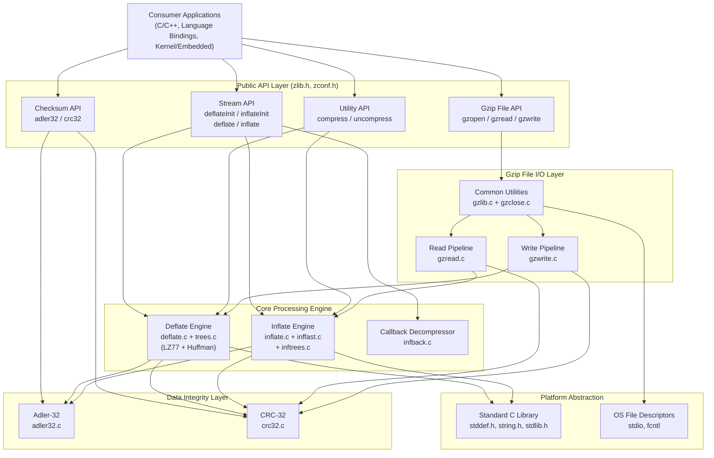

### 5.1.4 External Dependencies and Integration

As a deliberately self-contained library, zlib maintains the absolute minimum number of external dependencies. This is a core architectural constraint (Section 2.5, Constraint C-004) that maximizes portability and eliminates supply-chain risk.

| Dependency | Integration Type | Data Exchange |
|---|---|---|
| **Standard C Library** | Compile-time + runtime linkage | Memory allocation (`malloc`/`free`), string operations, type definitions |
| **OS File I/O** (Gzip layer only) | Runtime system calls | File descriptors via `open`/`read`/`write`/`lseek` (excluded in `Z_SOLO` mode) |
| **CMake 3.12+** (primary build) | Build-time tool | Feature detection, configuration generation, compilation orchestration |
| **GNU Autotools** (fallback build) | Build-time tool | `configure` script for legacy/non-CMake environments |

No network services, databases, message queues, or third-party runtime libraries are used. The library's sole runtime dependency is a conforming ANSI C standard library (Assumption A-001).

---

## 5.2 COMPONENT DETAILS

### 5.2.1 Public API Layer

#### Purpose and Responsibilities

The public API layer, defined in `zlib.h` (~2000 lines of declarations and documentation) and `zconf.h`, serves as the sole entry point for all consumer interaction. It defines:

- The `z_stream` structure (`zlib.h` lines 90–110): the central data exchange mechanism containing input/output buffer pointers (`next_in`/`avail_in`/`next_out`/`avail_out`), running checksum (`adler`), custom allocator hooks (`zalloc`/`zfree`/`opaque`), and an opaque `internal_state` pointer.
- The `gz_header` structure: metadata for gzip headers including timestamp, OS, filename, comment, and extra fields.
- Seven primary API surface groups: Stream Compression (F-001), Stream Decompression (F-002), Callback Decompression (F-003), One-Call Utilities (F-004), Checksum Computation (F-005), Gzip File I/O (F-006), and Version/Introspection.
- Return code constants (`Z_OK` through `Z_VERSION_ERROR`, `zlib.h` lines 181–189) providing a unified error taxonomy across all operations.
- Flush mode constants (`Z_NO_FLUSH` through `Z_TREES`, `zlib.h` lines 172–178) controlling output granularity.

#### Platform Configuration (`zconf.h`)

The `zconf.h` header provides the platform abstraction layer through compile-time detection and configuration:

- **Type system**: `Z_U4` (unsigned 32-bit), `z_crc_t` (CRC accumulator type), `z_word_t` (native word), `z_size_t` (size type), `z_off_t`/`z_off64_t` (file offset types).
- **Visibility control**: `ZEXPORT` (public symbols), `ZLIB_INTERNAL` (`__attribute__((visibility("hidden")))` on supported compilers), `ZLIB_DLL` (Windows DLL import/export).
- **Namespace isolation**: The `Z_PREFIX` mechanism renames all public symbols (e.g., `deflate` → `z_deflate`) to prevent collisions when embedding zlib within larger libraries.
- **Large file support**: Detection and configuration of 64-bit file offset types via `fseeko` and `off64_t`.
- **Legacy compatibility**: `FAR` pointer support for 16-bit systems, `OF()` prototype macro for pre-ANSI compilers.

### 5.2.2 Deflate Compression Engine

#### Purpose and Responsibilities

The deflate engine (`deflate.c`, `deflate.h`, `trees.c`, `trees.h`) implements the complete DEFLATE compression algorithm (RFC 1951), combining LZ77 sliding-window matching with Huffman coding. It is the primary compression facility of the library and supports output in all three container formats.

#### Internal State Architecture

The `internal_state` structure (defined in `deflate.h` lines 104–200+) encapsulates all compression state:

- **Stream pointer and status**: References to the parent `z_stream` plus an 8-state status field (INIT=42, GZIP=57, EXTRA=69, NAME=73, COMMENT=91, HCRC=103, BUSY=113, FINISH=666).
- **Sliding window**: A buffer of size `2 × 2^windowBits` bytes holding both the search window and the lookahead buffer. Maximum match length is 258 bytes (`MAX_MATCH`), minimum is 3 bytes (`MIN_MATCH`), with a lookahead requirement of 262 bytes.
- **Hash tables**: `head[]` and `prev[]` arrays implementing hash chains for LZ77 string matching, with chain length controlled by the `max_chain_length` configuration parameter.
- **Pending output buffer**: Accumulates encoded bytes before flushing to `z_stream.next_out`.
- **Compression parameters**: Level (0–9), strategy, and the derived configuration from `configuration_table[]` (`deflate.c` lines 112–124): `good_length`, `max_lazy`, `nice_length`, `max_chain`.

#### Compression Function Dispatch

Five internal compression functions are dispatched based on the configured level and strategy, each representing a different speed/ratio tradeoff:

| Function | Trigger | Strategy |
|---|---|---|
| `deflate_stored` | Level 0 | No compression — raw byte storage |
| `deflate_fast` | Levels 1–3 | Greedy matching — accept first sufficient match |
| `deflate_slow` | Levels 4–9 | Lazy evaluation — compare current vs. next match position |
| `deflate_huff` | `Z_HUFFMAN_ONLY` strategy | Huffman-only encoding, no LZ77 matching |
| `deflate_rle` | `Z_RLE` strategy | Run-length encoding only |

#### Deflate State Machine

The deflate engine progresses through a linear state machine governing header output, compression, and trailer writing. State transitions are irreversible under normal operation; only `deflateReset()` returns to the initial state.

```mermaid
stateDiagram-v2
    [*] --> INIT_STATE : deflateInit2(wrap=1, zlib format)
    [*] --> GZIP_STATE : deflateInit2(wrap=2, gzip format)

    INIT_STATE --> BUSY_STATE : Write 2-byte CMF+FLG header

    GZIP_STATE --> EXTRA_STATE : Write 10-byte gzip header
    EXTRA_STATE --> NAME_STATE : Output extra field (if present)
    NAME_STATE --> COMMENT_STATE : Output filename (if present)
    COMMENT_STATE --> HCRC_STATE : Output comment (if present)
    HCRC_STATE --> BUSY_STATE : Output 2-byte header CRC

    BUSY_STATE --> BUSY_STATE : deflate() with Z_NO_FLUSH / Z_SYNC / Z_FULL
    BUSY_STATE --> FINISH_STATE : deflate(Z_FINISH) + write trailer

    FINISH_STATE --> [*] : Return Z_STREAM_END
```

#### Memory Allocation Profile

All memory is allocated during initialization and bounded by two parameters:

| Parameter | Range | Controls |
|---|---|---|
| `windowBits` | 8–15 (default 15) | Window buffer size: `2 × 2^windowBits` bytes |
| `memLevel` | 1–9 (default 8) | Hash table and pending buffer sizes |

The total memory footprint is fixed for the lifetime of the stream and is independent of input data characteristics, as documented in `zlib.h`. Typical memory usage at default settings (windowBits=15, memLevel=8) is approximately 256 KB.

### 5.2.3 Inflate Decompression Engine

#### Purpose and Responsibilities

The inflate engine (`inflate.c`, `inflate.h`, `inffast.c`, `inffast.h`, `inftrees.c`, `inftrees.h`) implements complete DEFLATE decompression with automatic format detection, fast-path optimization for common decode cases, and robust error recovery.

#### State Machine Architecture

The inflate engine is organized as a single large state machine with over 30 modes defined in `inflate.h` lines 20–53, organized into five logical phases:

| Phase | States | Purpose |
|---|---|---|
| Header Parsing | HEAD, FLAGS, TIME, OS, EXLEN, EXTRA, NAME, COMMENT, HCRC, DICTID, DICT | Detect format; parse headers; handle dictionary requirements |
| Block Decoding | TYPE, TYPEDO, STORED, COPY_, COPY, TABLE, LENLENS, CODELENS, LEN_ | Read block headers; build Huffman tables; dispatch to decoder |
| Code Decoding | LEN, LENEXT, DIST, DISTEXT, MATCH, LIT | Decode literal/length/distance codes; resolve back-references |
| Trailer Verification | CHECK, LENGTH, DONE | Validate checksum; verify gzip uncompressed length |
| Error Handling | BAD, MEM, SYNC | Handle data corruption, memory failures, sync-point seeking |

The `inflate_state` structure (~7 KB excluding the sliding window) maintains: the current mode, wrap flags (bit 0 = zlib, bit 1 = gzip, bit 2 = validate checksum), the sliding window (up to 32 KB), a bit accumulator (`hold`/`bits`), and Huffman code tables (`codes[ENOUGH]`, `lens[320]`, `work[288]`).

#### Fast-Path Decompression

The `inflate_fast()` function in `inffast.c` provides a performance-critical inner decoding loop invoked when sufficient input (`have ≥ 6` bytes) and output (`left ≥ 258` bytes) are available. This threshold ensures the loop can process a complete length-distance copy (maximum 258 bytes per `MAX_MATCH`) and consume the longest possible Huffman code (up to 48 bits, requiring 6 input bytes) without per-byte boundary checks. The fast path falls back to the standard state machine when buffer boundaries are reached or unusual codes are encountered.

#### Format Auto-Detection

When `windowBits` is set to 32+ (`+32` offset), the inflate engine automatically detects whether the input is a zlib or gzip stream by examining the first bytes. The `wrap` field uses bit flags: bit 0 enables zlib detection, bit 1 enables gzip detection. This eliminates the need for callers to determine the stream format in advance.

### 5.2.4 Checksum Engines

#### Adler-32 (`adler32.c`)

The Adler-32 engine computes integrity checksums for zlib-format streams using a dual-accumulator algorithm with prime modulus BASE=65521. Three optimization tiers are employed:

- **Single-byte hot path**: When `len == 1`, a direct inline update avoids all loop overhead.
- **Short buffer path**: For `len < 16`, a simple byte-by-byte loop with deferred modular reduction (`MOD28` macro).
- **Long buffer path**: For `len ≥ 16`, data is processed in NMAX-sized blocks (5552 bytes) using a 16-fold unrolled `DO16` macro. The NMAX value of 5552 is the largest `n` such that `255n(n+1)/2 + (n+1)(BASE-1) < 2^32`, guaranteeing no overflow before the reduction step. An optional `NO_DIVIDE` path replaces division with shift-and-add reduction.

#### CRC-32 (`crc32.c`, `crc32.h`)

The CRC-32 engine computes integrity checksums for gzip-format streams, with multiple platform-optimized code paths:

- **ARM CRC32 hardware**: On AArch64 platforms, inline assembly (`crc32b`/`crc32x` instructions) performs batch computation directly in hardware.
- **Braided computation**: The default software path processes N words simultaneously (configurable N=1–6, default 5, word size W=4 or 8 bytes) using interleaved table lookups to exploit instruction-level parallelism.
- **Byte-wise fallback**: A single-byte table lookup for platforms without word-level optimization.
- **S390X vector extensions**: Contributed hardware acceleration via `contrib/crc32vx/` using `getauxval` runtime detection.

Both engines provide combine functions (`adler32_combine()`, `crc32_combine()`) that merge independently computed checksums using O(log n) matrix exponentiation (CRC-32) or algebraic formulas (Adler-32), enabling parallel processing workflows.

### 5.2.5 Gzip File I/O Layer

#### Purpose and Responsibilities

The Gzip File I/O layer (`gzlib.c`, `gzread.c`, `gzwrite.c`, `gzclose.c`, with internal structures in `gzguts.h`) provides a `stdio`-like interface for reading and writing `.gz` files. It internally manages buffering, format detection, and delegation to the core compression/decompression engines.

#### Internal State Architecture

The `gz_state` structure (`gzguts.h` lines 169–180+) encapsulates the file I/O state:

- **Mode tracking**: `mode` field distinguishes read (GZ_READ=7247), write (GZ_WRITE=31153), and append (GZ_APPEND=1) operations.
- **Read pipeline modes**: The `how` field implements a three-mode auto-detection state machine: LOOK (0) detects format, COPY (1) performs transparent pass-through for non-gzip files, and GZIP (2) decompresses via the inflate engine.
- **Buffering**: Default buffer size of `GZBUFSIZE = 8192` bytes, configurable via `gzbuffer()`. The write pipeline uses a dual-path strategy — small writes are buffered, while large writes bypass the internal buffer and feed directly to the deflate engine.
- **Platform abstraction**: The `LSEEK` macro in `gzguts.h` handles platform-specific seek operations: `llseek` (DJGPP), `_lseeki64` (Win32), `lseek64` (LARGEFILE64), and `lseek` (default POSIX).

#### Non-Blocking I/O and Special Modes

The gzip layer supports non-blocking I/O via the mode flag `'N'`, handling `EAGAIN`/`EWOULDBLOCK` return values from underlying file operations. Additional mode flags include transparent write (`'T'`), exclusive create (`'x'`), and close-on-exec (`'e'`). The entire Gzip File I/O layer is excluded when `Z_SOLO` is defined, removing all `stdio` dependency for bare-metal deployment.

### 5.2.6 Utility and Platform Layers

#### One-Call Utilities (`compress.c`, `uncompr.c`)

The one-call utilities wrap the streaming API into single-function-call operations for the most common use case: compress or decompress an entire buffer at once. Internally, they create a transient `z_stream`, process data in chunks capped at `max uInt` per iteration (ensuring correct operation on platforms where `uInt < size_t`), and clean up automatically. The `compressBound()` function enables callers to pre-allocate correctly sized output buffers using the formula: `sourceLen + (sourceLen >> 12) + (sourceLen >> 14) + (sourceLen >> 25) + 13`. Size_t-aware `_z` variants (added in `ZLIB_1.3.2`) address 64-bit safety for buffers exceeding 4 GB.

#### Internal Utilities (`zutil.c`, `zutil.h`)

The `zutil.c` module provides shared infrastructure: the `z_errmsg[]` array mapping return codes to human-readable strings, the `zlibCompileFlags()` function returning a 28-bit flag field for runtime introspection of compile-time options, and default memory allocators (`zcalloc()`/`zcfree()`) used when callers do not supply custom allocators. The `zutil.h` header defines the `local` macro (aliasing `static`), `ZLIB_INTERNAL` visibility attribute, standard C library includes, and internal type definitions.

### 5.2.7 Key Component Interactions

The following sequence diagrams illustrate the two primary interaction flows through the architecture: stream compression and stream decompression.

#### Stream Compression Flow

```mermaid
sequenceDiagram
    participant App as Application
    participant API as zlib.h API
    participant Def as Deflate Engine
    participant Trees as Huffman Coder (trees.c)
    participant Chk as Checksum Engine

    App->>API: deflateInit2(strm, level, method, windowBits, memLevel, strategy)
    API->>Def: Allocate internal_state, window, hash tables
    Def-->>API: Z_OK
    API-->>App: Z_OK

    loop While input data available
        App->>API: deflate(strm, Z_NO_FLUSH)
        API->>Def: LZ77 match in sliding window
        Def->>Trees: Encode literals + back-references
        Trees-->>Def: Huffman-coded blocks
        Def->>Chk: Update Adler-32 or CRC-32
        Def-->>API: Z_OK
        API-->>App: Z_OK (provide more input or output space)
    end

    App->>API: deflate(strm, Z_FINISH)
    API->>Def: Flush final block + write format trailer
    Def->>Chk: Finalize checksum value
    Def-->>API: Z_STREAM_END
    API-->>App: Z_STREAM_END

    App->>API: deflateEnd(strm)
    API->>Def: Free all allocated memory
    Def-->>API: Z_OK
    API-->>App: Z_OK
```

#### Stream Decompression Flow

```mermaid
sequenceDiagram
    participant App as Application
    participant API as zlib.h API
    participant Inf as Inflate Engine
    participant Fast as Fast Decoder (inffast.c)
    participant Chk as Checksum Engine

    App->>API: inflateInit2(strm, windowBits)
    API->>Inf: Allocate inflate_state and window buffer
    Inf-->>API: Z_OK
    API-->>App: Z_OK

    loop While compressed data available
        App->>API: inflate(strm, Z_NO_FLUSH)
        API->>Inf: Enter state machine (switch on mode)
        Note over Inf: Parse header then decode blocks then verify trailer
        alt Sufficient buffers (have >= 6, left >= 258)
            Inf->>Fast: inflate_fast() hot loop
            Fast-->>Inf: Decoded literals and matches
        else Boundary conditions
            Note over Inf: Byte-by-byte decode fallback
        end
        Inf->>Chk: Update running checksum
        Inf-->>API: Z_OK or Z_STREAM_END
        API-->>App: Status code
    end

    App->>API: inflateEnd(strm)
    API->>Inf: Free state and window
    Inf-->>API: Z_OK
    API-->>App: Z_OK
```

---

## 5.3 TECHNICAL DECISIONS

### 5.3.1 Architecture Style Decisions

The fundamental architectural decisions in zlib were driven by a core set of requirements: universal platform portability, minimal resource consumption, embeddability in diverse runtime environments (from kernels to user-space applications), and long-term ABI stability. The following decision tree illustrates how these requirements guided each major design choice:

```mermaid
flowchart TD
    REQ["Design Requirements<br/>Portable · Efficient · Embeddable<br/>Reliable · Zero Dependencies"]

    Q1{"Universal platform<br/>support needed?"}
    D1["ADR-1: Pure C — C89 baseline<br/>Enables kernel, embedded,<br/>and FFI deployment"]

    Q2{"Handle data larger<br/>than available memory?"}
    D2["ADR-2: Streaming z_stream API<br/>Bounded memory, arbitrary<br/>data sizes"]

    Q3{"Support incremental<br/>and resumable processing?"}
    D3["ADR-3: State machine internals<br/>8 deflate states,<br/>30+ inflate states"]

    Q4{"Eliminate supply-chain<br/>risk entirely?"}
    D4["ADR-4: Zero external dependencies<br/>Only standard C library"]

    Q5{"Deploy in kernel and<br/>custom allocator contexts?"}
    D5["ADR-5: Custom allocator hooks<br/>zalloc / zfree / opaque<br/>on z_stream"]

    Q6{"Support multiple container<br/>formats without API bloat?"}
    D6["ADR-6: windowBits overloading<br/>zlib / gzip / raw via<br/>single parameter"]

    REQ --> Q1
    Q1 -->|Yes| D1
    D1 --> Q2
    Q2 -->|Yes| D2
    D2 --> Q3
    Q3 -->|Yes| D3
    D3 --> Q4
    Q4 -->|Yes| D4
    D4 --> Q5
    Q5 -->|Yes| D5
    D5 --> Q6
    Q6 -->|Yes| D6
```

#### Architecture Decision Records

| ADR | Decision | Tradeoff | Evidence |
|---|---|---|---|
| ADR-1 | Pure C (C89 baseline) | Sacrifices modern language features for universal portability and FFI compatibility | `CMakeLists.txt` line 5, `.github/workflows/c-std.yml` |
| ADR-2 | Streaming `z_stream` API | Requires caller to manage buffer loops, but enables bounded memory and infinite data | `zlib.h` lines 90–110 |
| ADR-3 | Explicit state machines | Increased implementation complexity, but enables clean suspend/resume and error recovery | `deflate.h` lines 58–67, `inflate.h` lines 20–53 |
| ADR-4 | Zero external dependencies | Limits access to higher-level abstractions, but eliminates all supply-chain risk | `zutil.h` lines 24–30 |
| ADR-5 | Custom allocator hooks | Adds API surface, but enables kernel/embedded deployment and memory tracking | `z_stream.zalloc`/`zfree`/`opaque` |
| ADR-6 | `windowBits` overloading | Unintuitive parameter semantics, but avoids separate init functions per format | `deflateInit2()`/`inflateInit2()` |

#### Architectural Constraints

The following constraints are permanent design boundaries documented in Section 2.5:

- **C-001**: Only the DEFLATE method (`Z_DEFLATED = 8`) is implemented; the `method` parameter is reserved but has never expanded since 1995.
- **C-002**: The library is single-threaded per stream with no internal parallelism; concurrent processing requires independent `z_stream` instances.
- **C-003**: No encryption or cryptographic operations in the core library.
- **C-004**: No hardware-accelerated compression dispatch in the core; hardware optimizations exist only as contributed extensions.
- **C-005**: No adaptive algorithm selection; the caller manually configures strategy and level.

### 5.3.2 Communication and Interface Patterns

All communication in zlib follows the **in-process synchronous function call** pattern. There is no networking, IPC, RPC, or asynchronous processing of any kind.

#### Buffer-Based Data Exchange

The primary communication mechanism is the `z_stream` structure's four-field buffer interface:

- `next_in` / `avail_in`: Pointer and byte count for input data, managed by the caller.
- `next_out` / `avail_out`: Pointer and byte count for output space, managed by the caller.

This design decouples the library from any specific I/O model. The same streaming interface works for in-memory buffers, file I/O, network sockets, or any other data source/sink — the library is completely agnostic to where data originates or terminates.

#### Callback Pattern

The `inflateBack()` function (`infback.c`) provides an alternative communication pattern using caller-supplied callbacks (`in_func` and `out_func`) instead of pre-allocated buffers. This is designed for memory-constrained environments where pre-allocating large output buffers is impractical, enabling direct-to-file or direct-to-network decompression. It operates on raw deflate streams only (no container format headers).

#### Opaque Handle Pattern

The Gzip File I/O layer uses the opaque `gzFile` handle pattern, presenting a `stdio`-like interface that hides all internal buffering, format detection, and compression/decompression state from the caller.

### 5.3.3 Memory Management Strategy

Memory management in zlib follows a **bounded, deterministic** model:

- **All memory is allocated during initialization**: `deflateInit2()` and `inflateInit2()` allocate all required buffers (window, hash tables, pending buffer, Huffman tables) in a single initialization phase. No further allocations occur during processing.
- **Fixed footprint**: Memory consumption is fully determined by `windowBits` and `memLevel` parameters and is independent of input data size or characteristics.
- **Custom allocator hooks**: The `zalloc`/`zfree` function pointers on `z_stream`, combined with the `opaque` context pointer, enable callers to substitute custom memory allocators. This is critical for kernel environments (which cannot use `malloc`), embedded systems with pre-allocated memory pools, and testing harnesses that track allocation patterns (as demonstrated by the `mem_item`/`mem_zone` infrastructure in `test/infcover.c`).
- **Default allocators**: When callers leave `zalloc`/`zfree` as NULL, the internal `zcalloc()`/`zcfree()` functions in `zutil.c` delegate to the standard C library `malloc()`/`free()`.
- **No caching**: The library maintains no internal caches. Callers are fully responsible for their own buffer management, I/O scheduling, and data caching strategies.

### 5.3.4 Security Architecture

As a C library processing potentially untrusted data, security is addressed through architectural design rather than runtime security frameworks. The library contains no authentication, authorization, or encryption mechanisms in its core.

| Security Concern | Architectural Mitigation | Evidence |
|---|---|---|
| Buffer overflows / memory corruption | Continuous OSS-Fuzz testing (300s per fuzzer per PR); custom allocator tracking in test harness | `.github/workflows/fuzz.yml`, `test/infcover.c` |
| Corrupted or malicious input | Inflate state machine validates every compressed data field; returns `Z_DATA_ERROR` via BAD/MEM states without crashing | `inflate.c` state validation |
| Decompression bombs (zip bombs) | Caller controls output buffer size via `avail_out`; streaming API provides natural backpressure | `z_stream` design pattern |
| Thread safety races | No global mutable state; per-stream single-thread access model (Assumption A-003) | `zlib.h` documentation |
| Supply chain compromise | Zero external runtime dependencies; only standard C library | `zutil.h` includes |
| Weak encryption exposure | Legacy PKWARE encryption in minizip only; explicitly not cryptographically secure | `contrib/minizip/crypt.h` |

Security verification is enforced through the CI/CD pipeline: OSS-Fuzz integration runs on every pull request, C standard compliance is validated from C89 through C2x, and cross-platform CI catches platform-specific undefined behavior across 15+ OS/architecture combinations.

---

## 5.4 CROSS-CUTTING CONCERNS

### 5.4.1 Error Handling Framework

#### Unified Return Code Taxonomy

All zlib functions communicate status through a unified set of integer return codes defined in `zlib.h` lines 181–189. The `strm->msg` field provides a human-readable error description when non-NULL.

| Code | Value | Meaning | Recoverable |
|---|---|---|---|
| `Z_OK` | 0 | Success / operation in progress | N/A |
| `Z_STREAM_END` | 1 | Compression or decompression complete | N/A |
| `Z_NEED_DICT` | 2 | Preset dictionary required | Yes |
| `Z_ERRNO` | −1 | Underlying file system error (gzip I/O) | Depends |
| `Z_STREAM_ERROR` | −2 | Invalid parameter or inconsistent state | Yes |
| `Z_DATA_ERROR` | −3 | Corrupted or invalid compressed data | Partial |
| `Z_MEM_ERROR` | −4 | Insufficient memory for allocation | Yes |
| `Z_BUF_ERROR` | −5 | No progress possible (buffers exhausted) | Yes |
| `Z_VERSION_ERROR` | −6 | Library version incompatible with caller header | No |

#### Error Detection Pattern

Every API function follows a consistent three-tier validation pattern:

1. **State validation**: `deflateStateCheck()` or `inflateStateCheck()` verifies the `z_stream` pointer is non-NULL, the internal state is non-NULL, and the state's back-pointer to the stream is consistent.
2. **Parameter validation**: Range checks on all input parameters (NULL pointers, value ranges, valid flush modes).
3. **Runtime validation**: Memory allocation results, data integrity during processing, checksum verification in trailers.

Errors cascade through the `ERR_RETURN(strm, code)` macro, which sets `strm->msg` to a descriptive string before returning the error code. The inflate engine defines 13+ specific error messages (e.g., "incorrect header check", "invalid block type", "invalid distance too far back") enabling precise identification of failure points.

#### Error Handling and Recovery Flow

```mermaid
flowchart TD
    Entry["API Function Invoked"]

    SCheck{"State Validation<br/>deflateStateCheck /<br/>inflateStateCheck"}
    SCheck -->|Fail| SE["Z_STREAM_ERROR<br/>strm->msg set via ERR_RETURN"]

    SCheck -->|Pass| PCheck{"Parameter Validation<br/>NULL checks, value ranges,<br/>valid flush modes"}
    PCheck -->|Fail| SE

    PCheck -->|Pass| ACheck{"Memory Allocation<br/>Succeeded?"}
    ACheck -->|Fail| ME["Z_MEM_ERROR<br/>mode set to MEM (inflate)"]

    ACheck -->|Pass| DCheck{"Data Integrity<br/>Valid?"}
    DCheck -->|Valid| OK["Continue Processing<br/>Return Z_OK / Z_STREAM_END"]
    DCheck -->|Corrupt| DE["Z_DATA_ERROR<br/>mode set to BAD (inflate)"]
    DCheck -->|Dict needed| ND["Z_NEED_DICT<br/>dictid stored in strm->adler"]

    subgraph RecoveryMechanisms["Recovery Mechanisms"]
        R1["inflateSync: Scan forward<br/>for 00 00 FF FF marker"]
        R2["inflateReset: Reset<br/>to initial state"]
        R3["inflateSetDictionary:<br/>Supply required dictionary"]
        R4["Provide additional buffer<br/>space and retry call"]
    end

    DE --> R1
    ME --> R2
    ND --> R3
    SE --> R4

    R1 --> OK
    R2 --> OK
    R3 --> OK
    R4 --> OK
```

#### inflateSync Recovery

The `inflateSync()` function (`inflate.c` lines 1264–1310) provides the primary mechanism for recovering from data corruption. It performs a linear byte-by-byte scan of the input for the four-byte marker pattern `00 00 FF FF`, which is inserted at sync flush and full flush boundaries during compression. Upon finding the marker, it resets the inflate state and disables checksum verification (`wrap &= ~4`) since the running checksum is invalidated by the skipped data. Recovery is only possible if the compressor inserted sync points using `Z_SYNC_FLUSH` or `Z_FULL_FLUSH` flush modes.

### 5.4.2 Version Management and API Stability

The zlib architecture incorporates a multi-layered version management system that has maintained backward compatibility across three decades of evolution:

- **Version macros**: `ZLIB_VERSION` (string: `"1.3.2.1-motley"`) and `ZLIB_VERNUM` (hex: `0x1321`) defined in `zlib.h` lines 44–49.
- **Runtime version checking**: The `zlibVersion()` function returns the runtime library version string, enabling detection of header/library version mismatches.
- **Compile-time guards**: The `deflateInit_` and `inflateInit_` macro wrappers automatically pass `ZLIB_VERSION` and `sizeof(z_stream)` at compile time. The library validates these against its own compiled values, returning `Z_VERSION_ERROR` on mismatch — catching ABI incompatibilities before any data processing occurs.
- **GNU symbol versioning**: The `zlib.map` version script defines 14 version nodes from `ZLIB_1.2.0` through `ZLIB_1.3.2`, with progressive symbol additions at each milestone. Internal symbols (`deflate_copyright`, `inflate_fast`, `inflate_table`, `zcalloc`, `zcfree`, `z_errmsg`, `gz_error`, and all `_*` prefixed symbols) are marked as local (hidden), preventing accidental linkage to implementation details.
- **64-bit safety evolution**: The most recent symbol additions in `ZLIB_1.3.2` include `_z` suffixed variants (`compress_z`, `compress2_z`, `uncompress_z`, `uncompress2_z`, `compressBound_z`, `deflateBound_z`) that accept `size_t` lengths for safe operation with buffers exceeding 4 GB.

### 5.4.3 Performance Architecture

Performance in zlib is achieved through tiered optimization strategies that span the compression, decompression, and checksum subsystems, all without sacrificing portability.

#### Compression Performance

- **Nine compression levels (0–9)** map to three internal algorithms via the `configuration_table[]` array in `deflate.c`: stored (level 0, no compression), fast/greedy matching (levels 1–3), and slow/lazy match evaluation (levels 4–9). This provides a caller-controlled spectrum from maximum throughput to maximum compression ratio.
- **Five strategies** (`Z_DEFAULT_STRATEGY`, `Z_FILTERED`, `Z_HUFFMAN_ONLY`, `Z_RLE`, `Z_FIXED`) allow callers to hint at data characteristics. `Z_RLE` and `Z_HUFFMAN_ONLY` bypass LZ77 matching entirely for specific use cases.
- **Mid-stream parameter changes** via `deflateParams()` enable adapting compression strategy without reinitializing the stream when data characteristics change.

#### Decompression Performance

- **Fast-path decode** (`inffast.c`): A dedicated inner loop handles the common case (sufficient input and output) with minimal branching, avoiding per-byte boundary checks. The entry threshold (6 bytes input, 258 bytes output) guarantees the loop can process any valid code sequence without interruption.
- **Pre-built fixed Huffman tables** (`inffixed.h`): Static tables for fixed-Huffman blocks are compiled in, avoiding runtime construction for the most common block type.

#### Checksum Performance

- **Adler-32**: DO16 unrolled loop, NMAX=5552 batch processing, optional NO_DIVIDE path.
- **CRC-32**: Braided computation (N=1–6), ARM CRC32 hardware instructions, S390X vector extensions. Tables can be static or dynamically generated.
- **Combine operations**: O(log n) matrix exponentiation for `crc32_combine()` and algebraic formulas for `adler32_combine()` enable parallel checksum merging. The `crc32_combine_gen()`/`crc32_combine_op()` pair allows precomputation of combination operators for repeated use at the same segment length.

#### Scalability

- **No data size limit**: The streaming API imposes no upper bound on total data processed; memory consumption remains fixed.
- **Parallel-ready**: Independent `z_stream` instances can operate concurrently, with checksum combine functions merging results.
- **Minimal builds**: `Z_SOLO` removes the Gzip File I/O layer, producing a minimal library with no `stdio` dependency.
- **Buffer sizing**: The Gzip layer's `gzbuffer()` function allows applications to tune internal buffer sizes to their I/O patterns.

### 5.4.4 Platform Portability and Build Architecture

#### Platform Abstraction Mechanisms

The zlib architecture achieves cross-platform portability through several abstraction layers:

- **Type abstraction** (`zconf.h`): Platform-independent type definitions (`Z_U4`, `z_crc_t`, `z_word_t`, `z_size_t`, `z_off_t`) insulate the codebase from platform-specific integer sizes.
- **File I/O abstraction** (`gzguts.h`): The `LSEEK` macro dispatches to the correct seek function for each platform (`llseek` on DJGPP, `_lseeki64` on Win32, `lseek64` with LARGEFILE64, plain `lseek` otherwise). Platform-specific includes (`<io.h>` on Windows/Turbo-C, `<fcntl.h>` for POSIX) and `WIDECHAR` support for Win32 wide-character file names are handled conditionally.
- **Visibility control**: `ZLIB_INTERNAL` maps to `__attribute__((visibility("hidden")))` on GCC/Clang, ensuring internal symbols are not exported from shared libraries.
- **Runtime introspection**: `zlibCompileFlags()` returns a 28-bit flag field exposing compile-time options (type sizes, compiler features, library options) for runtime diagnostics.

#### Build System Architecture

Two build systems are maintained in parallel:

| Build System | Configuration | Platforms |
|---|---|---|
| **CMake 3.12–3.31** (primary) | `CMakeLists.txt` with options: `ZLIB_BUILD_TESTING`, `ZLIB_BUILD_SHARED`, `ZLIB_BUILD_STATIC`, `ZLIB_INSTALL`, `ZLIB_PREFIX` | All modern platforms |
| **GNU Autotools** (fallback) | `configure` + `Makefile.in` | Legacy Unix systems |
| **Platform-specific** | `win32/`, `amiga/`, `watcom/` | Legacy Windows, Amiga, Watcom C |

The CMake build performs feature detection for `off64_t`, `fseeko`, `stdarg.h`, `unistd.h`, and symbol visibility, generating `zconf.h` from a template and producing `zlib.pc` for pkg-config consumers. Build outputs include shared libraries (`.so`/`.dylib`/`.dll`), static libraries (`.a`/`.lib`), and optional test/benchmark executables. Contributed extensions are governed by `contrib/CMakeLists.txt` using the `zlib_add_contrib_lib` and `zlib_add_contrib_feature` macros, maintaining architectural separation from the core library.

#### Contributed Extensions Architecture

The `contrib/` directory contains 18 subdirectories with independent build systems, architecturally separated from the core library per Assumption A-004. Notable extensions include:

- **minizip** (`contrib/minizip/`): Full ZIP archive read/write with Zip64, optional BZip2, and PKWARE legacy encryption.
- **blast** (`contrib/blast/`): Self-contained PKWare Data Compression Library decompressor.
- **puff** (`contrib/puff/`): Standalone portable inflate with coverage instrumentation.
- **infback9** (`contrib/infback9/`): Deflate64 support extending the core inflate.
- **Language bindings**: Ada (`contrib/ada/`), Pascal (`contrib/pascal/`), Delphi (`contrib/delphi/`), .NET (`contrib/dotzlib/`, `contrib/nuget/`), C++ iostream (`contrib/iostream3/`), RPG/ILE (`os400/`).
- **Hardware optimizations**: S390X CRC (`contrib/crc32vx/`), AMD64 assembler match (`contrib/gcc_gvmat64/`).

These extensions depend on the core library but are not dependencies of it, maintaining a strict one-directional dependency relationship.

#### CI/CD Verification Matrix

Architectural integrity is continuously validated through seven CI workflow files in `.github/workflows/`, covering:

| Workflow | Validation Scope |
|---|---|
| `c-std.yml` | C standard compliance matrix (C89 through gnu2x) on Linux, macOS, Windows, ARM64 |
| `cmake.yml` | 15 OS/compiler configurations |
| `configure.yml` | Native and cross-compilation (ARM, AArch64, PPC, S390X via QEMU) |
| `contribs.yml` | Contributed extension build and test validation |
| `fuzz.yml` | OSS-Fuzz integration (300 seconds per fuzzer, PR-only) |
| `msys-cygwin.yml` | MSYS2 and Cygwin build variants |
| `others.yml` | DragonFlyBSD, FreeBSD, NetBSD, OmniOS, OpenBSD, Solaris via vmactions |

The test suite in `test/` provides regression coverage (`example.c` with 13+ test helpers exercising virtually every API function), exhaustive inflate path coverage (`infcover.c` with custom allocator tracking), and a feature-complete gzip utility analog (`minigzip.c`).

---

## 5.5 References

#### Source Files Examined

- `zlib.h` — Public API interface, version definitions, `z_stream` structure, `gz_header_s`, return codes, flush modes, and complete function documentation (~2000 lines)
- `zconf.h` — Platform configuration, type detection, visibility control, namespace isolation, large file support
- `deflate.h` — Internal compression state machine definition, `internal_state` structure, hash table layout, compression parameters
- `deflate.c` — Deflate engine implementation, compression functions (`deflate_stored`, `deflate_fast`, `deflate_slow`, `deflate_huff`, `deflate_rle`), `configuration_table[]`
- `trees.c`, `trees.h` — Huffman tree construction and encoding
- `inflate.h` — Decompression state machine (30+ modes), `inflate_state` structure, state transition documentation
- `inflate.c` — Inflate engine implementation, state machine main loop, header/trailer parsing
- `inffast.c`, `inffast.h` — Fast-path decompression inner loop
- `inftrees.c`, `inftrees.h` — Huffman decode table construction
- `infback.c` — Callback-based decompression (`inflateBack`)
- `adler32.c` — Adler-32 checksum computation with tiered optimization
- `crc32.c`, `crc32.h` — CRC-32 computation with multiple platform-optimized paths
- `gzlib.c`, `gzread.c`, `gzwrite.c`, `gzclose.c` — Gzip File I/O layer implementation
- `gzguts.h` — Gzip internal state structure, platform seek abstraction, buffer configuration
- `compress.c` — One-call compression wrapper with chunked processing
- `uncompr.c` — One-call decompression wrapper with error mapping
- `zutil.c`, `zutil.h` — Internal utilities, error messages, default allocators, compile flags introspection
- `zlib.map` — GNU version script with 14 symbol version nodes

#### Directories Examined

- Root directory — Complete file inventory (33 files, 9 directories)
- `contrib/` — 18 subdirectories of contributed extensions with `CMakeLists.txt` integration
- `test/` — Test suite (`example.c`, `infcover.c`, `minigzip.c`, `CMakeLists.txt`)
- `.github/workflows/` — 7 CI/CD workflow files

#### Technical Specification Sections Referenced

- Section 1.1 (Executive Summary) — Project overview, version, value proposition, design guarantees
- Section 1.2 (System Overview) — Architecture diagrams, capability domains, technology approach
- Section 2.1 (Feature Catalog) — 14 features (F-001 through F-014) with dependencies
- Section 2.4 (Implementation Considerations) — Technical constraints, performance requirements, scalability
- Section 2.5 (Assumptions and Constraints) — 6 assumptions (A-001 through A-006), 5 constraints (C-001 through C-005)
- Section 3.1 (Programming Languages) — C89–C2x compliance, language bindings, assembly optimizations
- Section 3.7 (Security Considerations) — Security posture, CI/CD security measures
- Section 4.1 (High-Level System Workflows) — Data flow, lifecycle patterns, container format selection
- Section 4.2 (Stream Compression Process Flows) — Deflate state transitions, initialization, compression loop
- Section 4.3 (Stream Decompression Process Flows) — Inflate state machine, fast-path decode
- Section 4.4 (Gzip File I/O Workflows) — Read/write pipelines, close process
- Section 4.5 (Utility and Integration Workflows) — One-call utilities, dictionary workflows, mid-stream parameter changes
- Section 4.6 (Error Handling and Recovery) — Return code taxonomy, error detection flow, inflateSync recovery
- Section 4.7 (Checksum and Data Integrity Workflows) — Adler-32/CRC-32 algorithms, combine operations
- Section 4.8 (Build and CI/CD Workflows) — Build system pipeline, CI matrix, test execution sequence

# 6. SYSTEM COMPONENTS DESIGN

## 6.1 Core Services Architecture

#### INFRASTRUCTURE AND DEPLOYMENT

## 6.1 Core Services Architecture

### 6.1.1 Applicability Statement

**Core Services Architecture is not applicable for this system.** The zlib library (version 1.3.2.1-motley, `VERNUM 0x1321`) is architected as a **stateless, in-process function library** written in ANSI C (C89 baseline). It contains no microservices, no distributed components, no networking capabilities, and no distinct service boundaries of any kind. Every concept associated with service-oriented architecture — service discovery, load balancing, circuit breakers, inter-service communication, auto-scaling, failover, and disaster recovery — is fundamentally inapplicable to this system.

As documented in Section 5.1 of this specification, the architectural style is that of a "stateless, in-process function library — there is no networking, inter-process communication, daemon lifecycle, or persistent storage in the core." All operations are synchronous function calls operating on caller-managed buffers, and the library's sole runtime dependency is a conforming ANSI C standard library (`stddef.h`, `string.h`, `stdlib.h` per `zutil.h` lines 24–30).

This section provides a detailed architectural rationale for this non-applicability, documents how the concerns typically addressed by service architectures are handled through library-level design patterns, and serves as the definitive reference for stakeholders evaluating zlib's operational characteristics.

---

### 6.1.2 Architectural Rationale

#### 6.1.2.1 System Classification

zlib is classified as an **embedded library component**, not a deployable service or application. The following table contrasts the fundamental properties of service-oriented systems with zlib's actual architecture.

| Architectural Property | Service-Oriented System | zlib Library |
|---|---|---|
| Execution model | Independent process/container | In-process function calls |
| Communication | Network (HTTP, gRPC, MQ) | Direct C function invocation |
| State management | Distributed, persistent | Caller-owned, transient |
| Deployment unit | Container image or binary | Source code / `.so` / `.a` / `.dll` |

| Architectural Property | Service-Oriented System | zlib Library |
|---|---|---|
| Lifecycle management | Orchestrator-managed | Linked at compile/load time |
| Discovery mechanism | Registry (Consul, DNS) | Symbol resolution by linker |
| Scaling unit | Service replica | Independent `z_stream` instance |
| Failure domain | Network partition | Caller process boundary |

This classification is evidenced by the library's distribution method: zlib is packaged as source code, shared libraries (`.so`/`.dylib`/`.dll`), static libraries (`.a`/`.lib`), and build-system metadata (`zlib.pc`, `ZLIBConfig.cmake`) — with explicitly no containerization, no Docker images, and no service deployment manifests, as confirmed in Section 3.6.6.

#### 6.1.2.2 Design Intent

The decision to implement zlib as a pure in-process library was deliberate and driven by the requirement to maximize the library's deployment envelope. As documented in Section 5.3.1 (Architecture Decision Records), the six foundational architecture decisions — pure C implementation (ADR-1), streaming `z_stream` API (ADR-2), explicit state machines (ADR-3), zero external dependencies (ADR-4), custom allocator hooks (ADR-5), and `windowBits` overloading (ADR-6) — are all predicated on the library being invoked as direct function calls within the consumer's address space, with no service intermediation.

This design enables deployment across an exceptionally wide range of environments:

- **Bare-metal embedded systems** (via `Z_SOLO` minimal builds)
- **Operating system kernels** (via custom `zalloc`/`zfree` allocators)
- **User-space applications** (via standard `malloc`/`free` delegation)
- **Language runtime bindings** (Ada, Pascal, Delphi, .NET, C++ iostream, RPG/ILE)

None of these deployment targets involve service orchestration, container runtimes, or network-accessible endpoints.

---

### 6.1.3 Service Architecture Concepts — Non-Applicability Analysis

The following subsections systematically address each service architecture concept specified in the section prompt, documenting why each is inapplicable and how the underlying concern is resolved through zlib's library-level design patterns.

#### 6.1.3.1 Service Components

```mermaid
flowchart LR
    subgraph ConsumerProcess["Consumer Process Address Space"]
        App["Application Code"]
        API["zlib Public API<br/>(zlib.h)"]
        Core["Core Engine<br/>(deflate.c, inflate.c,<br/>trees.c, inffast.c)"]
        Chk["Checksum Engines<br/>(adler32.c, crc32.c)"]
        Util["Utilities<br/>(zutil.c, compress.c,<br/>uncompr.c)"]
    end

    App -->|"Direct C function call"| API
    API -->|"In-process dispatch"| Core
    API -->|"In-process dispatch"| Chk
    API -->|"In-process dispatch"| Util
    Core -->|"Internal call"| Chk
```

| Service Concept | Status | Library-Level Equivalent |
|---|---|---|
| Service boundaries | Not Applicable | Module boundaries defined by C source files and opaque internal state |
| Inter-service communication | Not Applicable | `z_stream` buffer interface (`next_in`/`avail_in`/`next_out`/`avail_out`) for all data exchange |
| Service discovery | Not Applicable | Symbol resolution by the system linker at compile or load time |

| Service Concept | Status | Library-Level Equivalent |
|---|---|---|
| Load balancing | Not Applicable | No network endpoints; consumers invoke functions directly |
| Circuit breaker patterns | Not Applicable | Error return codes (`Z_DATA_ERROR`, `Z_MEM_ERROR`, etc.) signal failures to callers |
| Retry / fallback mechanisms | Not Applicable | Caller controls retry by re-invoking streaming API; `inflateSync()` provides corruption recovery |

**Evidence — Communication pattern (Section 5.3.2):** All communication in zlib follows the in-process synchronous function call pattern. There is no networking, IPC, RPC, or asynchronous processing of any kind. The `z_stream` structure's buffer interface decouples the library from any specific I/O model, making it completely agnostic to where data originates or terminates.

**Evidence — Module boundaries (Section 5.1.2):** The library comprises 12 discrete components across 6 architectural layers — Public API, Deflate Engine, Inflate Engine, Callback Decompressor, Checksum Engines, and Gzip File I/O — all implemented as in-process C modules linked into a single shared or static library artifact.

#### 6.1.3.2 Scalability Design

| Scalability Concept | Status | Library-Level Equivalent |
|---|---|---|
| Horizontal scaling | Not Applicable | Independent `z_stream` instances can operate concurrently across threads |
| Vertical scaling | Not Applicable | Memory footprint configured per-stream via `windowBits` and `memLevel` parameters |
| Auto-scaling triggers | Not Applicable | No deployable service instances to scale |

| Scalability Concept | Status | Library-Level Equivalent |
|---|---|---|
| Resource allocation | Not Applicable | Bounded, deterministic allocation at `deflateInit2()`/`inflateInit2()` time only |
| Performance optimization | Not Applicable (as a service concern) | Multi-tier algorithmic optimization (fast-path decode, unrolled checksums, hardware CRC) |
| Capacity planning | Not Applicable | Fixed memory footprint independent of input data size |

**Evidence — Concurrency model (Section 2.5):** Constraint C-002 establishes that the library is single-threaded per stream with no internal parallelism. Assumption A-003 specifies that each `z_stream` instance is accessed by only one thread at a time. However, this design enables effective parallel processing: independent `z_stream` instances can operate concurrently across multiple threads, and checksum combine functions (`crc32_combine()`, `adler32_combine()`) enable merging results from parallel processing segments using O(log n) algorithms.

**Evidence — Memory model (Section 5.3.3):** All memory is allocated during initialization and bounded by two parameters: `windowBits` (range 8–15, controlling window buffer size) and `memLevel` (range 1–9, controlling hash table sizes). No further allocations occur during processing, and memory consumption is fully independent of input data characteristics.

The following diagram illustrates how scalability is achieved at the library level through independent stream instances, contrasted with the inapplicable service-level scaling model:

```mermaid
flowchart TB
    subgraph LibraryScaling["zlib Library-Level Parallelism"]
        T1["Thread 1"]
        T2["Thread 2"]
        T3["Thread N"]
        S1["z_stream Instance A<br/>(Independent State)"]
        S2["z_stream Instance B<br/>(Independent State)"]
        S3["z_stream Instance N<br/>(Independent State)"]
        Combine["Checksum Combine<br/>crc32_combine() /<br/>adler32_combine()"]

        T1 --> S1
        T2 --> S2
        T3 --> S3
        S1 --> Combine
        S2 --> Combine
        S3 --> Combine
    end

    subgraph NotApplicable["Service-Level Scaling (NOT Applicable)"]
        LB["Load Balancer ✗"]
        R1["Service Replica 1 ✗"]
        R2["Service Replica 2 ✗"]
        R3["Service Replica N ✗"]
        SD["Service Discovery ✗"]

        LB -.->|"N/A"| R1
        LB -.->|"N/A"| R2
        LB -.->|"N/A"| R3
        SD -.->|"N/A"| LB
    end
```

#### 6.1.3.3 Resilience Patterns

| Resilience Concept | Status | Library-Level Equivalent |
|---|---|---|
| Fault tolerance | Not Applicable (as service pattern) | Crash resilience via defensive validation; never crashes on corrupted input |
| Disaster recovery | Not Applicable | No persistent state; all data is transient and caller-managed |
| Data redundancy | Not Applicable | Integrity ensured via Adler-32 and CRC-32 checksums, not replication |

| Resilience Concept | Status | Library-Level Equivalent |
|---|---|---|
| Failover configurations | Not Applicable | No service instances to fail over; error codes returned to caller |
| Service degradation | Not Applicable | No tiered service offerings; library either succeeds or returns an error code |

**Evidence — Error handling (Section 5.4.1):** The library communicates all status through a unified set of integer return codes (`Z_OK` through `Z_VERSION_ERROR`) defined in `zlib.h` lines 181–189. Every API function follows a consistent three-tier validation pattern: state validation, parameter validation, and runtime validation. Errors cascade through the `ERR_RETURN(strm, code)` macro, which sets `strm->msg` to a descriptive string before returning the error code.

**Evidence — Crash resilience (Section 5.1.1):** The library is designed to never crash even when processing corrupted input; instead, it returns `Z_DATA_ERROR` with a diagnostic message. The inflate state machine validates every compressed data field, transitioning to the `BAD` state on corruption rather than invoking undefined behavior.

**Evidence — Recovery mechanisms (Section 5.4.1):** The `inflateSync()` function provides the primary mechanism for recovering from data corruption, scanning forward for the `00 00 FF FF` marker pattern inserted at sync flush and full flush boundaries during compression. Additional recovery paths include `inflateReset()` (return to initial state) and `inflateSetDictionary()` (supply a required preset dictionary).

The following diagram contrasts the inapplicable service-level resilience patterns with zlib's actual library-level error handling and resilience architecture:

```mermaid
flowchart TD
    subgraph LibraryResilience["zlib Library-Level Resilience"]
        Entry["API Function Invoked"]
        StateVal{"State Validation<br/>(deflateStateCheck /<br/>inflateStateCheck)"}
        ParamVal{"Parameter Validation<br/>(NULL checks, ranges)"}
        Processing["Core Processing<br/>(deflate / inflate)"]
        DataCheck{"Data Integrity<br/>Valid?"}

        Entry --> StateVal
        StateVal -->|"Pass"| ParamVal
        StateVal -->|"Fail"| StreamErr["Z_STREAM_ERROR<br/>strm→msg set"]
        ParamVal -->|"Pass"| Processing
        ParamVal -->|"Fail"| StreamErr
        Processing --> DataCheck
        DataCheck -->|"Valid"| Success["Z_OK / Z_STREAM_END"]
        DataCheck -->|"Corrupt"| DataErr["Z_DATA_ERROR<br/>mode → BAD"]
        DataErr --> Recovery["inflateSync() /<br/>inflateReset()"]
        Recovery --> Success
    end

    subgraph NotApplicableResilience["Service-Level Resilience (NOT Applicable)"]
        CB["Circuit Breaker ✗"]
        FO["Failover ✗"]
        DR["Disaster Recovery ✗"]
        HM["Health Monitoring ✗"]

        CB -.->|"N/A"| FO
        FO -.->|"N/A"| DR
        HM -.->|"N/A"| CB
    end
```

---

### 6.1.4 Excluded Infrastructure Capabilities

The following infrastructure capabilities, typically associated with service architectures, are explicitly absent from zlib and documented as out-of-scope across multiple sections of this specification.

| Capability | Section Reference | Documented Status |
|---|---|---|
| Network protocol implementation | Section 1.3.2 (Out-of-Scope) | "zlib provides compression primitives, not transport-layer protocols" |
| Database integration | Section 3.5.1 | "This subsection is not applicable. zlib is a compression library" |
| Monitoring / observability | Section 1.3.2 (Out-of-Scope) | "No telemetry, metrics collection, or structured logging" |

| Capability | Section Reference | Documented Status |
|---|---|---|
| External API integrations | Section 3.4.1 | "zlib processes in-memory data; no network communication" |
| Authentication services | Section 3.4.1 | "No user authentication layer" |
| Cloud service dependencies | Section 3.4.1 | "Distributed as source code; no cloud platform dependency" |
| Containerization | Section 3.6.6 | "No Docker, no container images" |

**Evidence — Persistent state (Section 3.5.1):** All data handling in zlib is transient and stream-oriented. The `z_stream` structure processes data through caller-supplied input/output buffers, and the library maintains no persistent state between API sessions.

**Evidence — External dependencies (Section 5.1.4):** No network services, databases, message queues, or third-party runtime libraries are used. The library's sole runtime dependency is a conforming ANSI C standard library.

---

### 6.1.5 Architectural Constraints Confirming Non-Service Nature

The following formally documented constraints and assumptions from Section 2.5 independently confirm that zlib operates outside the domain of service architecture:

| ID | Constraint / Assumption | Implication for Services |
|---|---|---|
| A-001 | Target platform provides a conforming ANSI C compiler and standard library | No service runtime (JVM, CLR, Node.js) required or assumed |
| A-003 | Each `z_stream` instance accessed by only one thread at a time | No built-in locking — concurrency via independent instances, not service replicas |
| C-001 | Only DEFLATE method implemented | Single-algorithm library, not a pluggable service |

| ID | Constraint / Assumption | Implication for Services |
|---|---|---|
| C-002 | Single-threaded per stream; no internal parallelism | No thread pool, worker model, or request queue |
| C-003 | No encryption or cryptographic operations in core | No TLS, mTLS, or service mesh security |
| C-004 | No hardware-accelerated compression dispatch in core | No runtime service adaptation or resource negotiation |

---

### 6.1.6 Summary

The zlib compression library is a self-contained, stateless C library that operates entirely within the caller's process address space through synchronous function calls. It has no networking layer, no inter-process communication, no daemon lifecycle, no persistent storage, no containerization, and no external runtime service dependencies. All concerns typically addressed by service architectures — fault tolerance, scalability, resilience, communication, and discovery — are handled through fundamentally different library-level mechanisms: error return codes for fault signaling, independent `z_stream` instances for parallel processing, deterministic memory allocation for resource management, and symbol resolution by the system linker for component integration.

Stakeholders requiring service-oriented infrastructure should look to the **consuming application** that embeds zlib, not to zlib itself. The library's design as a minimal, portable, in-process component is precisely what enables its adoption across the broadest possible range of deployment targets — from embedded firmware to operating system kernels to cloud-native applications — without imposing any service infrastructure requirements.

---

#### References

- `zlib.h` — Public API header; defines `z_stream` structure, return codes, flush modes, version constants, and all function declarations; primary evidence for in-process function call architecture
- `zconf.h` — Platform configuration header; type definitions, visibility control, namespace isolation via `Z_PREFIX`
- `zutil.h` (lines 1–30) — Internal utility header; confirms standard C library as the sole dependency (`stddef.h`, `string.h`, `stdlib.h`)
- `deflate.c` — Deflate compression engine; evidences in-process state machine architecture
- `inflate.c` — Inflate decompression engine; 30+ state mode machine demonstrating library-level resilience
- `inffast.c` — Fast-path decompression; library-level performance optimization in lieu of service scaling
- `adler32.c`, `crc32.c` — Checksum engines; data integrity via algorithmic verification rather than service-level redundancy
- `gzlib.c`, `gzread.c`, `gzwrite.c`, `gzclose.c` — Gzip File I/O layer; file access pattern, not network service
- `compress.c`, `uncompr.c` — One-call utility wrappers; demonstrates transient `z_stream` lifecycle
- `zutil.c` — Internal utilities; default allocators (`zcalloc`/`zcfree`) confirming no service dependencies
- `CMakeLists.txt` — Build configuration; library target definitions, no service deployment manifests
- `zlib.map` — GNU symbol versioning; shared library ABI evolution, not service API versioning
- `contrib/` — 18 contributed extension directories; all in-process modules, no service components
- **Section 1.1** — Executive Summary confirming zlib as a general-purpose C compression library
- **Section 1.3** — Scope defining explicit out-of-scope items including networking, databases, and monitoring
- **Section 2.5** — Assumptions and Constraints documenting single-threaded per-stream model and zero external dependencies
- **Section 3.4** — Third-Party Services confirming no runtime service integrations
- **Section 3.5** — Databases and Storage confirming explicit non-applicability
- **Section 3.6** — Development and Deployment confirming source code distribution with no containerization
- **Section 5.1** — High-Level Architecture providing primary evidence of stateless, in-process function library design
- **Section 5.2** — Component Details confirming all 12 components as in-process C modules
- **Section 5.3** — Technical Decisions confirming all communication as in-process synchronous function calls
- **Section 5.4** — Cross-Cutting Concerns documenting error handling via return codes and library-level performance architecture

## 6.2 Database Design

### 6.2.1 Applicability Statement

**Database Design is not applicable to this system.** The zlib library (version 1.3.2.1-motley, `VERNUM 0x1321`) is a general-purpose, lossless data-compression library written in ANSI C. It is architected as a **stateless, in-process function library** that performs synchronous compression and decompression operations on caller-managed memory buffers. The library contains no database engine, no ORM layer, no persistent storage mechanism, no schema definitions, and no data retention infrastructure of any kind.

As formally documented in Section 3.5.1 of this specification: *"This subsection is not applicable. zlib is a compression library, not an application with data persistence requirements."* Section 1.3.2 further reinforces this by listing **Database integration** as an explicit out-of-scope exclusion with the rationale: *"No built-in database adapters or storage engines."*

This section provides the formal non-applicability determination, documents the architectural evidence supporting that determination, describes how data is actually handled within zlib's transient processing model, and offers guidance for stakeholders whose consuming applications may require database design.

---

### 6.2.2 Non-Applicability Evidence

#### 6.2.2.1 Architectural Classification

The zlib library operates entirely within the caller's process address space through direct C function calls. As documented in Section 5.1.1, the architectural style is that of a "stateless, in-process function library — there is no networking, inter-process communication, daemon lifecycle, or persistent storage in the core." This fundamental design precludes any concept of database interaction, schema management, or persistent data storage.

The following table summarizes the database design categories specified by this section's prompt and their applicability status, consistent with the formal determination in Section 3.5.1.

| Design Category | Status | Rationale |
|---|---|---|
| Schema Design | **Not Applicable** | No entities, relationships, or persistent data models exist |
| Data Management | **Not Applicable** | No migrations, versioning, or archival; all state is transient |
| Compliance Considerations | **Not Applicable** | No data retained; no audit trail or access control layer |
| Performance Optimization | **Not Applicable** | No queries, connection pools, or read/write paths to optimize |

#### 6.2.2.2 Cross-Specification Corroboration

The non-applicability of database design is independently confirmed across multiple sections of this Technical Specification, establishing a consistent and unambiguous determination.

| Specification Section | Relevant Finding |
|---|---|
| **Section 1.3.2** (Out-of-Scope) | "Database integration" listed with rationale: "No built-in database adapters or storage engines" |
| **Section 3.5.1** (Databases and Storage) | Explicit statement: "This subsection is not applicable" |
| **Section 5.1.1** (High-Level Architecture) | "No persistent storage in the core"; sole runtime dependency is ANSI C standard library |

| Specification Section | Relevant Finding |
|---|---|
| **Section 5.1.4** (External Dependencies) | "No network services, databases, message queues, or third-party runtime libraries are used" |
| **Section 6.1.4** (Excluded Capabilities) | Database integration listed as excluded with reference to Section 3.5.1 |

#### 6.2.2.3 Repository Evidence

A comprehensive examination of the zlib repository confirms the complete absence of database-related artifacts:

| Artifact Type | Search Method | Result |
|---|---|---|
| Schema files (`.sql`, `.prisma`, `.schema`) | File system search | Zero files found |
| Database files (`.db`, `.sqlite`) | File system search | Zero files found |
| Migration files (`.migration`) | File system search | Zero files found |
| Database-related source content | Semantic search for "database storage persistence SQL schema migration" | Zero results |

The repository root contains exclusively compression-related C source files (`deflate.c`, `inflate.c`, `adler32.c`, `crc32.c`, etc.), build system files (`CMakeLists.txt`, `Makefile`), headers (`zlib.h`, `zconf.h`), and documentation. Subdirectories (`contrib/`, `doc/`, `examples/`, `test/`, `win32/`, `os400/`, `amiga/`, `watcom/`) contain platform support, contributed extensions, and testing infrastructure — none of which involve database components.

---

### 6.2.3 Data Handling Architecture

While zlib does not interact with any database, the library does process data through well-defined mechanisms. Understanding these mechanisms clarifies why database design is structurally incompatible with zlib's architecture and provides essential context for stakeholders.

#### 6.2.3.1 Transient Stream Processing Model

All data in zlib flows through the `z_stream` structure, which provides a caller-owned buffer interface. As documented in Section 3.5.1, "The `z_stream` structure processes data through caller-supplied input/output buffers (`next_in`/`avail_in`, `next_out`/`avail_out`), and gzip file I/O operates directly on file descriptors. The library maintains no persistent state between API sessions."

The following diagram illustrates zlib's transient data processing model, contrasted with the database-oriented patterns that are not applicable.

```mermaid
flowchart TD
    subgraph ZlibDataModel["zlib Transient Data Model (Actual)"]
        CallerIn["Caller-Supplied<br/>Input Buffer<br/>(next_in / avail_in)"]
        StreamProc["z_stream Processing<br/>(Compress or Decompress)"]
        InternalState["Transient Internal State<br/>(Hash Tables, Huffman Tables,<br/>Sliding Window)"]
        CallerOut["Caller-Supplied<br/>Output Buffer<br/>(next_out / avail_out)"]
        Cleanup["deflateEnd() / inflateEnd()<br/>All State Freed"]

        CallerIn --> StreamProc
        StreamProc --> CallerOut
        StreamProc --- InternalState
        CallerOut --> Cleanup
    end

    subgraph NotApplicableDB["Database Patterns (NOT Applicable)"]
        DBSchema["Schema / Tables ✗"]
        DBIndex["Indexes ✗"]
        DBQuery["Queries ✗"]
        DBPersist["Persistent Storage ✗"]

        DBSchema -.->|"N/A"| DBIndex
        DBIndex -.->|"N/A"| DBQuery
        DBQuery -.->|"N/A"| DBPersist
    end
```

#### 6.2.3.2 Data Flow Characteristics

The four data flow paths through zlib — as documented in Section 5.1.3 — are all transient, in-memory operations with no persistence layer.

| Data Flow Path | Mechanism | Persistence |
|---|---|---|
| Stream Compression | `z_stream` buffers → LZ77 + Huffman → Output buffer | None — caller manages all buffers |
| Stream Decompression | `z_stream` buffers → Huffman decode → LZ77 resolve → Output buffer | None — caller manages all buffers |
| Gzip File I/O | `gzFile` handle → Internal 8 KB buffer → OS file descriptor | File I/O only — no database; excluded under `Z_SOLO` |
| One-Call Utilities | Caller buffer → Transient `z_stream` → Result buffer | None — internal stream created and destroyed per call |

#### 6.2.3.3 Internal Data Structures

zlib's internal data structures are frequently mischaracterized as storage mechanisms. The following table documents each internal structure, its purpose, and its lifecycle to clarify that none constitute persistent storage.

| Internal Structure | Source File | Purpose | Lifecycle |
|---|---|---|---|
| Hash tables (`head[]`, `prev[]`) | `deflate.c` | LZ77 string matching during compression | Allocated at `deflateInit()`; freed at `deflateEnd()` |
| Huffman code tables | `trees.c`, `inftrees.c` | Encoding/decoding of compressed symbols | Per-stream; rebuilt for each deflate block |
| Sliding window buffer | `deflate.c`, `inflate.c` | LZ77 back-reference resolution | Sized by `windowBits` parameter; per-stream transient |
| CRC-32 lookup table | `crc32.c` (`crc_table`) | Precomputed polynomial remainders for CRC calculation | Compile-time constant or one-time computed; read-only |

All mutable internal state is scoped to individual `z_stream` instances. As confirmed in Section 5.1.1, zlib follows the principle of "No global mutable state" — thread safety is achieved by design, with all mutable state scoped to individual stream instances. No state persists between API sessions.

```mermaid
flowchart LR
    subgraph StreamLifecycle["z_stream Instance Lifecycle"]
        Init["deflateInit2() /<br/>inflateInit2()<br/>(Memory Allocated)"]
        Process["deflate() / inflate()<br/>(Repeated Calls)<br/>State: TRANSIENT"]
        Cleanup2["deflateEnd() /<br/>inflateEnd()<br/>(Memory Freed)"]

        Init --> Process
        Process -->|"More Data"| Process
        Process -->|"Z_STREAM_END<br/>or Error"| Cleanup2
    end

    subgraph NoDBState["No Persistent State"]
        NoPersist["No data written to<br/>any database or<br/>persistent store<br/>at any lifecycle stage"]
    end

    Cleanup2 -.->|"All state destroyed"| NoPersist
```

---

### 6.2.4 Inapplicable Database Design Categories

The following subsections systematically address each database design category required by the section prompt, documenting the specific reason for non-applicability in the context of zlib's architecture.

#### 6.2.4.1 Schema Design

| Schema Design Element | Status | Explanation |
|---|---|---|
| Entity relationships | **Not Applicable** | No entities or domain objects requiring relational modeling |
| Data models and structures | **Not Applicable** | Internal structures (`z_stream`, `internal_state`) are algorithmic, not data models |
| Indexing strategy | **Not Applicable** | Internal hash tables in `deflate.c` serve LZ77 matching, not data retrieval |
| Partitioning approach | **Not Applicable** | No dataset to partition; data processed as transient byte streams |
| Replication configuration | **Not Applicable** | No data store to replicate; integrity ensured via Adler-32 and CRC-32 checksums |
| Backup architecture | **Not Applicable** | No persistent state requiring backup; all state is caller-managed and transient |

#### 6.2.4.2 Data Management

| Data Management Element | Status | Explanation |
|---|---|---|
| Migration procedures | **Not Applicable** | No schema or persistent data requiring migration |
| Versioning strategy | **Not Applicable** | ABI versioning is managed through `zlib.map` symbol versioning, not data versioning |
| Archival policies | **Not Applicable** | No data accumulated or retained by the library |
| Data storage and retrieval | **Not Applicable** | Data is transformed in-place through caller-supplied buffers, not stored or retrieved |
| Caching policies | **Not Applicable** | No caching layer; per Section 3.5.1, "internal hash tables in `deflate.c` are per-stream, not shared" |

#### 6.2.4.3 Compliance Considerations

| Compliance Element | Status | Explanation |
|---|---|---|
| Data retention rules | **Not Applicable** | Library retains no data beyond the scope of a single `z_stream` session |
| Backup and fault tolerance | **Not Applicable** | No persistent state; fault tolerance via error return codes and `inflateSync()` recovery |
| Privacy controls | **Not Applicable** | No user data collected, stored, or transmitted; library is data-agnostic |
| Audit mechanisms | **Not Applicable** | No logging, telemetry, or structured auditing (confirmed out-of-scope in Section 1.3.2) |
| Access controls | **Not Applicable** | No authentication layer; access governed by the host application's process security model |

#### 6.2.4.4 Performance Optimization

| Optimization Element | Status | Explanation |
|---|---|---|
| Query optimization patterns | **Not Applicable** | No queries; performance optimized through algorithmic means (fast-path decode in `inffast.c`, unrolled checksums) |
| Caching strategy | **Not Applicable** | No data to cache; CRC-32 lookup table in `crc32.c` is a compile-time constant, not a cache |
| Connection pooling | **Not Applicable** | No connections; all interaction is via direct C function calls within the process |
| Read/write splitting | **Not Applicable** | No data store with read/write paths; compression and decompression are independent code paths by design |
| Batch processing approach | **Not Applicable** | Processing is inherently streaming; one-call utilities (`compress()`, `uncompress()`) handle single-buffer operations |

---

### 6.2.5 Guidance for Consuming Applications

While database design is not applicable to the zlib library itself, applications that embed zlib may have their own database requirements. The following considerations are relevant to stakeholders designing systems that incorporate zlib as a compression component.

#### 6.2.5.1 Compressed Data Storage Patterns

Applications storing compressed data in databases should consider:

| Consideration | Recommendation |
|---|---|
| Column data type | Use binary/BLOB types for compressed data; zlib output is arbitrary binary |
| Original size tracking | Store the uncompressed size separately; required by `uncompress()` for buffer allocation |
| Compression metadata | Store `windowBits`, compression level, and strategy if reproducibility is required |
| Checksum storage | Consider storing Adler-32 or CRC-32 values for independent integrity verification |

#### 6.2.5.2 Integration Boundary

The boundary between zlib and any consuming application's database layer is clearly defined by the `z_stream` buffer interface. zlib operates exclusively on in-memory byte arrays provided by the caller. The responsibility for persisting, indexing, querying, and managing compressed data belongs entirely to the consuming application, not to zlib.

```mermaid
flowchart LR
    subgraph AppDomain["Application Domain (Consumer Responsibility)"]
        AppDB["Application<br/>Database"]
        AppLogic["Application<br/>Logic"]
        BufMgmt["Buffer<br/>Management"]
    end

    subgraph ZlibDomain["zlib Domain (Library Scope)"]
        ZlibAPI["zlib Public API<br/>(zlib.h)"]
        Engine["Compression /<br/>Decompression<br/>Engine"]
    end

    AppDB -->|"Read compressed<br/>data"| AppLogic
    AppLogic -->|"Provide buffers"| BufMgmt
    BufMgmt -->|"next_in / next_out"| ZlibAPI
    ZlibAPI --> Engine
    Engine -->|"Transformed bytes"| ZlibAPI
    ZlibAPI -->|"Output buffer"| BufMgmt
    BufMgmt -->|"Processed data"| AppLogic
    AppLogic -->|"Write results"| AppDB
```

---

### 6.2.6 Summary

Database Design is definitively not applicable to the zlib compression library. This determination is grounded in the library's fundamental architecture as a stateless, in-process function library that maintains no persistent state, contains no database engine or storage adapter, and processes all data through transient, caller-owned memory buffers. This non-applicability is formally documented in Sections 1.3.2, 3.5.1, 5.1.1, 5.1.4, and 6.1.4 of this specification, and is further confirmed by the complete absence of any database-related artifacts in the repository.

All twelve components of the zlib library — from the Public API layer through the Deflate and Inflate engines, checksum computations, Gzip File I/O, and contributed extensions — operate exclusively as in-process C modules performing algorithmic data transformation. Internal data structures such as hash tables, Huffman trees, and sliding windows are transient, per-stream, and algorithmic in nature, serving compression mechanics rather than data persistence.

Stakeholders requiring database design should direct their attention to the **consuming application** that embeds zlib, where the integration boundary is clearly defined by the `z_stream` buffer interface. Subsection 6.2.5 provides initial guidance for such scenarios.

---

#### References

- `zlib.h` — Public API header defining `z_stream` structure, buffer interface (`next_in`/`avail_in`/`next_out`/`avail_out`), return codes, and all function declarations; primary evidence for transient data processing model
- `zconf.h` — Platform configuration header; type definitions and compile-time configuration confirming no database dependencies
- `deflate.c` — Deflate compression engine; contains internal hash tables (`head[]`, `prev[]`) used for LZ77 string matching — algorithmic, not persistent
- `inflate.c` — Inflate decompression engine; 30+ state machine modes, all transient per-stream
- `trees.c` — Huffman tree construction; per-block encoding tables rebuilt during compression
- `inftrees.c` — Huffman decoding table generator; transient per-stream structures
- `inffast.c` — Fast-path decompression; performance optimization demonstrating algorithmic approach over data caching
- `adler32.c` — Adler-32 checksum engine; running integrity computation, not stored data
- `crc32.c` — CRC-32 checksum engine; compile-time lookup table is a constant, not a database cache
- `gzlib.c`, `gzread.c`, `gzwrite.c`, `gzclose.c` — Gzip File I/O layer; operates on OS file descriptors, not database connections
- `compress.c`, `uncompr.c` — One-call utility wrappers; transient `z_stream` lifecycle per invocation
- `zutil.c` — Internal utilities; default memory allocators confirming no external storage dependencies
- `zlib.map` — GNU symbol versioning script; ABI evolution mechanism, not data schema versioning
- `CMakeLists.txt` — Build configuration; library targets only, no database migration or schema tooling
- **Section 1.1** (Executive Summary) — Project identity as a general-purpose C compression library
- **Section 1.3** (Scope) — Database integration explicitly listed as out-of-scope
- **Section 3.5** (Databases and Storage) — Formal "Not Applicable" determination with full rationale
- **Section 5.1** (High-Level Architecture) — "No persistent storage in the core"; zero external runtime dependencies
- **Section 5.2** (Component Details) — All 12 components confirmed as in-process C modules with no database interaction
- **Section 6.1** (Core Services Architecture) — Database integration listed in "Excluded Infrastructure Capabilities" table

## 6.3 Integration Architecture

### 6.3.1 Applicability Statement

**Integration Architecture is not applicable for this system.** The zlib library (version 1.3.2.1-motley, `VERNUM 0x1321`) is architected as a **stateless, in-process function library** written in ANSI C (C89 baseline). It contains no network endpoints, no API gateways, no message queues, no external service integrations, and no inter-process communication mechanisms of any kind. Every concept associated with integration architecture — REST/gRPC APIs, authentication protocols, message brokers, event buses, external system connectors, and service contracts — is fundamentally inapplicable to this system.

As documented in Section 5.1.1 of this specification, the architectural style is that of a "stateless, in-process function library — there is no networking, inter-process communication, daemon lifecycle, or persistent storage in the core." All operations are synchronous C function calls operating on caller-managed buffers, and the library's sole runtime dependency is a conforming ANSI C standard library (`stddef.h`, `string.h`, `stdlib.h` per `zutil.h` lines 24–30).

Section 3.4.1 independently confirms: "zlib does not integrate with any external APIs, authentication services, monitoring tools, or cloud platforms at runtime. All third-party service integrations are limited to the CI/CD pipeline for build verification, testing, and cross-platform validation."

This determination is consistent with the non-applicability findings in Section 6.1 (Core Services Architecture) and Section 6.2 (Database Design), forming a coherent architectural characterization of zlib as an embedded library component that operates entirely within the consumer's process address space.

This section provides a detailed architectural rationale for this non-applicability, systematically addresses each integration architecture concept specified in the prompt, documents how the underlying concerns are resolved through library-level mechanisms, and offers guidance for consuming applications that embed zlib within systems that do require integration architecture.

---

### 6.3.2 Architectural Rationale

#### 6.3.2.1 System Classification

Integration architecture governs the interactions between independently deployed services, systems, and external providers — coordinating protocol negotiation, message exchange, authentication, and data contract enforcement across process or network boundaries. zlib operates in a fundamentally different domain: it is an **embedded library component** that is linked directly into the consumer's binary and invoked through in-process C function calls within a single address space.

The following table contrasts integration architecture concepts with zlib's actual design.

| Integration Property | Service-Oriented System | zlib Library |
|---|---|---|
| Communication boundary | Network / process boundary | Single process address space |
| Data exchange protocol | HTTP, gRPC, AMQP, etc. | `z_stream` buffer interface |
| Authentication | OAuth, JWT, mTLS, API keys | None — caller invokes directly |

| Integration Property | Service-Oriented System | zlib Library |
|---|---|---|
| Service discovery | DNS, Consul, Eureka | Linker symbol resolution |
| Message format | JSON, Protobuf, Avro | Raw byte arrays via C pointers |
| Error signaling | HTTP status codes, exceptions | Integer return codes (`Z_OK` – `Z_VERSION_ERROR`) |

This classification is evidenced by the library's distribution method: zlib is packaged as source code, shared libraries (`.so`/`.dylib`/`.dll`), static libraries (`.a`/`.lib`), and build-system metadata (`zlib.pc`, `ZLIBConfig.cmake`). As confirmed in Section 3.6.6 and Section 6.1.2.1, there are no Docker images, container manifests, API specification files, or service deployment artifacts of any kind.

#### 6.3.2.2 Design Intent

The six foundational Architecture Decision Records documented in Section 5.3.1 — pure C implementation (ADR-1), streaming `z_stream` API (ADR-2), explicit state machines (ADR-3), zero external dependencies (ADR-4), custom allocator hooks (ADR-5), and `windowBits` overloading (ADR-6) — are all predicated on the library being invoked as direct function calls within the consumer's address space, with no service intermediation or external system interaction.

This design enables deployment across an exceptionally wide range of environments where integration infrastructure does not exist:

- **Bare-metal embedded systems** (via `Z_SOLO` minimal builds eliminating all `stdio` dependency)
- **Operating system kernels** (via custom `zalloc`/`zfree` allocators replacing standard `malloc`/`free`)
- **Language runtime bindings** (Ada, Pascal, Delphi, .NET via P/Invoke, C++ iostream, RPG/ILE)
- **User-space applications** (via standard linkage to shared or static library artifacts)

As Section 3.3.1 confirms: "The zlib core library has zero external open-source dependencies. There is no package manager, no dependency registry, and no transitive dependency chain." This zero-dependency architecture is structurally incompatible with integration patterns that assume external system connectivity.

#### 6.3.2.3 Integration Boundary Diagram

The following diagram illustrates the fundamental boundary that separates zlib's in-process library domain from the integration concerns that belong to consuming applications.

```mermaid
flowchart TB
    subgraph ExternalWorld[\"External World (Beyond zlib Scope)\"]
        ExtAPI[\"External APIs ✗\"]
        MsgBroker[\"Message Brokers ✗\"]
        ExtDB[\"Databases ✗\"]
        AuthSvc[\"Auth Services ✗\"]
    end

    subgraph ConsumerApp[\"Consumer Application (Integration Responsibility)\"]
        AppLogic[\"Application Logic\"]
        NetLayer[\"Networking Layer\"]
        AuthLayer[\"Authentication Layer\"]
        MsgLayer[\"Message Processing\"]
        BufMgmt[\"Buffer Management\"]
    end

    subgraph ZlibLibrary[\"zlib Library (In-Process, No Integration)\"]
        PubAPI[\"Public API\n(zlib.h / zconf.h)\"]
        DefEng[\"Deflate Engine\n(deflate.c, trees.c)\"]
        InfEng[\"Inflate Engine\n(inflate.c, inffast.c,\ninftrees.c)\"]
        ChkEng[\"Checksum Engines\n(adler32.c, crc32.c)\"]
        StdC[\"Standard C Library\n(sole dependency)\"]
    end

    ExtAPI -.->|\"N/A\"| ZlibLibrary
    MsgBroker -.->|\"N/A\"| ZlibLibrary
    ExtDB -.->|\"N/A\"| ZlibLibrary
    AuthSvc -.->|\"N/A\"| ZlibLibrary

    NetLayer --> AppLogic
    AuthLayer --> AppLogic
    MsgLayer --> AppLogic
    AppLogic --> BufMgmt
    BufMgmt -->|\"next_in / avail_in\nnext_out / avail_out\"| PubAPI

    PubAPI --> DefEng
    PubAPI --> InfEng
    PubAPI --> ChkEng
    DefEng --> StdC
    InfEng --> StdC
```

---

### 6.3.3 API Design — Non-Applicability Analysis

All concepts within the API Design domain presuppose network-accessible service endpoints. zlib exposes a C function API through `zlib.h`, not a network API. This subsection systematically documents the non-applicability of each API design concept and identifies the library-level equivalent where one exists.

#### 6.3.3.1 Protocol Specifications

| API Design Concept | Status | Evidence |
|---|---|---|
| HTTP / REST protocol | **Not Applicable** | No HTTP server, client, or endpoints |
| gRPC / Protobuf | **Not Applicable** | No RPC framework or IDL definitions |
| WebSocket protocol | **Not Applicable** | No persistent connections |

Section 1.3.2 explicitly excludes "Network protocol implementation" from scope with the rationale: "zlib provides compression primitives, not transport-layer protocols." Section 5.3.2 confirms: "All communication in zlib follows the in-process synchronous function call pattern. There is no networking, IPC, RPC, or asynchronous processing of any kind."

**Library-Level Equivalent:** The `z_stream` structure's four-field buffer interface (`next_in`/`avail_in`/`next_out`/`avail_out`) serves as the sole data exchange mechanism. This buffer interface decouples the library from any specific I/O model, making it completely agnostic to where data originates or terminates. The same streaming interface works for in-memory buffers, file I/O, network sockets, or any other data source/sink — without the library containing any protocol implementation.

#### 6.3.3.2 Authentication and Authorization

| Security Concept | Status | Evidence |
|---|---|---|
| Authentication methods | **Not Applicable** | Section 3.4.1: "No user authentication layer" |
| Authorization framework | **Not Applicable** | Section 6.1.4: Authentication services listed as excluded |
| TLS / mTLS | **Not Applicable** | Constraint C-003: No encryption or cryptographic operations |

Section 5.3.4 confirms: "The library contains no authentication, authorization, or encryption mechanisms in its core." The only encryption-adjacent capability in the entire repository is PKWARE legacy encryption in `contrib/minizip/crypt.h`, which is explicitly documented as not cryptographically secure and is architecturally separated from the core library.

**Library-Level Equivalent:** Access to zlib functions is governed entirely by the host process's security model. Callers must have the ability to invoke C functions within their process — controlled by operating system process permissions, not by any zlib-internal mechanism.

#### 6.3.3.3 Rate Limiting, Versioning, and Documentation Standards

| Concept | Status | Library-Level Equivalent |
|---|---|---|
| Rate limiting | **Not Applicable** | No endpoints to rate-limit; throughput bounded by CPU |
| API versioning (REST/HTTP) | **Not Applicable** | GNU symbol versioning via `zlib.map` (see below) |
| Documentation standards (OpenAPI/Swagger) | **Not Applicable** | API documented via inline comments in `zlib.h` |

While REST/HTTP API versioning is not applicable, zlib implements a sophisticated **C ABI versioning** system that serves the analogous concern of backward-compatible API evolution. As documented in Section 5.4.2, this multi-layered system includes:

- **Compile-time version macros**: `ZLIB_VERSION` (string: `"1.3.2.1-motley"`) and `ZLIB_VERNUM` (hex: `0x1321`) defined in `zlib.h` lines 44–49, enabling consumers to conditionally compile against specific library capabilities.
- **Runtime version validation**: The `deflateInit_` and `inflateInit_` macro wrappers automatically pass `ZLIB_VERSION` and `sizeof(z_stream)` at compile time, with the library validating these against its own values and returning `Z_VERSION_ERROR` on mismatch.
- **GNU symbol versioning**: The `zlib.map` version script defines 14 version nodes from `ZLIB_1.2.0` through `ZLIB_1.3.2`, with progressive symbol additions at each milestone and internal symbols marked as local (hidden).

```mermaid
flowchart LR
    subgraph VersioningSystem[\"zlib ABI Versioning System\"]
        CompTime[\"Compile-Time\nZLIB_VERSION macro\nZLIB_VERNUM macro\"]
        InitCheck[\"Init-Time Validation\ndeflateInit_ / inflateInit_\nVersion + sizeof check\"]
        SymVer[\"Shared Library\nzlib.map\n14 GNU version nodes\"]
        Runtime[\"Runtime Query\nzlibVersion()\nzlibCompileFlags()\"]
    end

    Consumer[\"Consumer Application\"]

    Consumer -->|\"#include zlib.h\"| CompTime
    Consumer -->|\"deflateInit()\"| InitCheck
    Consumer -->|\"Dynamic linking\"| SymVer
    Consumer -->|\"Diagnostics\"| Runtime

    InitCheck -->|\"Mismatch\"| VerErr[\"Z_VERSION_ERROR\nAbort before processing\"]
    InitCheck -->|\"Match\"| OK[\"Proceed with\ncompression / decompression\"]
```

---

### 6.3.4 Message Processing — Non-Applicability Analysis

All concepts within the Message Processing domain presuppose distributed messaging infrastructure — event buses, message brokers, stream processing platforms, and batch orchestration systems. zlib performs synchronous, in-process data transformation with no messaging infrastructure.

#### 6.3.4.1 Event and Stream Processing

| Message Processing Concept | Status | Evidence |
|---|---|---|
| Event processing patterns | **Not Applicable** | No event system, pub/sub, or event buses |
| Stream processing (Kafka, Kinesis) | **Not Applicable** | No distributed stream processing |
| Async message handling | **Not Applicable** | All processing is synchronous |

Section 5.1.4 confirms: "No network services, databases, message queues, or third-party runtime libraries are used." While the term "stream" appears frequently in zlib's API (the `z_stream` structure, stream compression/decompression), this refers to **in-memory byte stream processing** — the sequential transformation of input bytes to output bytes through caller-managed buffers — not to distributed stream processing platforms.

**Library-Level Equivalent:** The `z_stream` buffer interface provides an incremental data processing model that enables the caller to feed data in arbitrarily sized chunks. This streaming-first design (ADR-2 in Section 5.3.1) allows bounded-memory processing of arbitrarily large data, but the "streaming" is purely sequential in-process byte processing with no messaging semantics.

#### 6.3.4.2 Queue Architecture and Batch Processing

| Concept | Status | Evidence |
|---|---|---|
| Message queue architecture | **Not Applicable** | Section 5.1.4: No message queues used |
| Batch processing flows | **Not Applicable** | No batch orchestration system |
| Dead letter queues | **Not Applicable** | No queue infrastructure |

**Library-Level Equivalent:** The one-call utility functions `compress()` and `uncompress()` in `compress.c` and `uncompr.c` handle single-buffer operations, which is the closest analog to batch processing — but these are simple synchronous function calls that create a transient internal `z_stream`, process the entire buffer, and destroy the stream within a single invocation. As Section 6.2.4.4 notes: "Processing is inherently streaming; one-call utilities handle single-buffer operations."

#### 6.3.4.3 Error Handling Strategy

While integration-level error handling (circuit breakers, retry policies, dead letter queues, compensating transactions) is not applicable, zlib implements a robust **library-level error handling framework** documented in Section 5.4.1.

| Integration Error Concept | Status | Library-Level Equivalent |
|---|---|---|
| Circuit breakers | **Not Applicable** | Error return codes signal failure to caller |
| Retry policies | **Not Applicable** | Caller controls retry via re-invocation |
| Compensation / rollback | **Not Applicable** | `inflateSync()` / `inflateReset()` for recovery |

The library communicates all status through a unified set of integer return codes defined in `zlib.h` lines 181–189, ranging from `Z_OK` (0) through `Z_VERSION_ERROR` (−6). Every API function follows a consistent three-tier validation pattern: state validation, parameter validation, and runtime validation. The `inflateSync()` function provides corruption recovery by scanning for the `00 00 FF FF` marker pattern inserted at sync flush boundaries.

```mermaid
sequenceDiagram
    participant App as Consumer Application
    participant API as zlib Public API
    participant Engine as Core Engine
    participant State as Internal State

    App->>API: deflateInit2() / inflateInit2()
    API->>State: Allocate and initialize state
    State-->>API: Z_OK or Z_MEM_ERROR
    API-->>App: Return code

    loop Incremental Processing
        App->>API: deflate() / inflate()
        API->>Engine: Process next_in → next_out
        Engine->>State: Update sliding window, tables
        Engine-->>API: Status (OK / END / ERROR)
        API-->>App: Return code + updated avail_in/avail_out
    end

    alt Data Corruption Detected
        API-->>App: Z_DATA_ERROR (strm→msg set)
        App->>API: inflateSync() — scan for marker
        API-->>App: Z_OK (resynchronized) or Z_DATA_ERROR
    end

    App->>API: deflateEnd() / inflateEnd()
    API->>State: Free all allocated memory
    API-->>App: Z_OK
```

---

### 6.3.5 External Systems — Non-Applicability Analysis

All concepts within the External Systems domain presuppose interactions with systems outside the process boundary. zlib has no runtime external system dependencies.

#### 6.3.5.1 Third-Party Integration Patterns

| External System Concept | Status | Evidence |
|---|---|---|
| Third-party API connectors | **Not Applicable** | Section 3.4.1: No runtime API integrations |
| Legacy system interfaces | **Not Applicable** | No system interfaces; language bindings are in-process |
| Cloud service integrations | **Not Applicable** | Section 3.4.1: "Distributed as source code; no cloud platform dependency" |

Section 3.4.1 categorically establishes that all external service interactions are limited to the CI/CD pipeline for build verification and testing. The five CI/CD-only service integrations — GitHub Actions, Google OSS-Fuzz, vmactions (BSD VMs), QEMU (cross-architecture emulation), and MSYS2 (Windows environments) — are build-time services with no runtime presence.

**Language Bindings as In-Process Wrappers:** The language bindings in `contrib/` (Ada, Pascal, Delphi, .NET, C++ iostream) and `os400/` (RPG/ILE) are frequently mischaracterized as external integrations. These are in-process foreign function interface wrappers that invoke zlib functions directly within the same address space. For example, the .NET binding in `contrib/dotzlib/DotZLib/DotZLib.cs` uses P/Invoke (`DllImport`) to call into `ZLIB1.dll` — a direct in-process function call, not a network or service integration.

#### 6.3.5.2 API Gateway and Service Contracts

| Concept | Status | Evidence |
|---|---|---|
| API gateway configuration | **Not Applicable** | No network endpoints to route |
| External service contracts | **Not Applicable** | No external service dependencies |
| Service mesh / sidecar | **Not Applicable** | No inter-service communication |

**Library-Level Equivalent:** The sole "contract" between zlib and its consumers is the C function API defined in `zlib.h` and the type definitions in `zconf.h`. This contract is enforced through:

- **Compile-time type checking** by the C compiler
- **Init-time version validation** via `deflateInit_`/`inflateInit_` wrappers
- **Link-time symbol resolution** via `zlib.map` version nodes
- **Opaque state encapsulation** preventing consumer access to internal structures

---

### 6.3.6 Library-Level Integration Equivalents

While integration architecture is not applicable, the concerns typically addressed by integration patterns have library-level equivalents within zlib. The following table maps each integration concept to its corresponding library mechanism.

| Integration Concept | Library-Level Equivalent | Source Evidence |
|---|---|---|
| External API | `zlib.h` C function API — sole consumer interface | `zlib.h`, Section 5.1.1 |
| API versioning | GNU symbol versioning (`zlib.map`, 14 version nodes) | Section 5.4.2, `zlib.map` |
| Service discovery | Symbol resolution by system linker at compile/load time | Section 6.1.3.1 |

| Integration Concept | Library-Level Equivalent | Source Evidence |
|---|---|---|
| Data exchange protocol | `z_stream` buffer interface (`next_in`/`avail_in`/`next_out`/`avail_out`) | `zlib.h` lines 90–110 |
| Callback integration | `inflateBack()` with `in_func`/`out_func` callbacks | Section 5.3.2, `infback.c` |
| Error signaling | Unified return codes (`Z_OK` through `Z_VERSION_ERROR`) | Section 5.4.1, `zlib.h` lines 181–189 |

| Integration Concept | Library-Level Equivalent | Source Evidence |
|---|---|---|
| Platform integration | `zconf.h` platform detection; `Z_PREFIX` namespace isolation; `Z_SOLO` minimal builds | Section 5.4.4 |
| Language bindings | In-process wrappers: Ada, Pascal, Delphi, .NET (P/Invoke), C++ iostream, RPG/ILE | `contrib/`, `os400/` |
| Contract enforcement | Compile-time type checking + init-time version validation + link-time symbol versioning | Section 5.4.2 |

The following diagram illustrates how these library-level mechanisms replace the integration infrastructure that would be required in a service-oriented system.

```mermaid
flowchart TB
    subgraph IntegrationConcerns[\"Typical Integration Concerns\"]
        direction TB
        IC1[\"Protocol\nNegotiation\"]
        IC2[\"Authentication\nand Authorization\"]
        IC3[\"Service\nDiscovery\"]
        IC4[\"Message\nRouting\"]
        IC5[\"Contract\nEnforcement\"]
        IC6[\"Error\nPropagation\"]
    end

    subgraph LibraryEquivalents[\"zlib Library-Level Equivalents\"]
        direction TB
        LE1[\"z_stream Buffer\nInterface\"]
        LE2[\"Process-Level\nAccess Control\"]
        LE3[\"Linker Symbol\nResolution\"]
        LE4[\"Direct C\nFunction Calls\"]
        LE5[\"Version Macros +\nzlib.map Versioning\"]
        LE6[\"Return Codes +\nstrm→msg\"]
    end

    IC1 -->|\"Replaced by\"| LE1
    IC2 -->|\"Replaced by\"| LE2
    IC3 -->|\"Replaced by\"| LE3
    IC4 -->|\"Replaced by\"| LE4
    IC5 -->|\"Replaced by\"| LE5
    IC6 -->|\"Replaced by\"| LE6
```

---

### 6.3.7 Consumer Application Integration Guidance

While integration architecture is not applicable to zlib itself, applications that embed zlib frequently operate within systems that do require integration architecture. This subsection provides guidance for stakeholders designing integration layers around zlib-based functionality.

#### 6.3.7.1 Integration Boundary Definition

The boundary between zlib and any consuming application's integration layer is precisely defined by the `z_stream` buffer interface. As documented in Section 6.2.5.2: "zlib operates exclusively on in-memory byte arrays provided by the caller. The responsibility for networking, API management, message processing, and external system integration belongs entirely to the consuming application."

| Responsibility | Owner | Mechanism |
|---|---|---|
| Data compression / decompression | zlib library | `z_stream` buffer processing |
| Buffer allocation and management | Consumer application | Caller-supplied `next_in`/`next_out` |
| Network transport | Consumer application | HTTP, TCP, WebSocket, etc. |
| Authentication and authorization | Consumer application | OAuth, JWT, mTLS, etc. |

#### 6.3.7.2 Common Embedding Patterns

The following table describes common patterns used by consuming applications when integrating zlib into systems with integration architecture requirements.

| Embedding Pattern | Description | Example |
|---|---|---|
| HTTP compression middleware | Compress/decompress HTTP response bodies at the server or proxy layer | Content-Encoding: gzip/deflate |
| Database BLOB compression | Compress data before storage, decompress on retrieval | Application-level compress/decompress |
| Message payload compression | Reduce message sizes in queues or event streams | Compress before enqueue, decompress after dequeue |
| File transfer compression | Compress files for network transfer using gzip format | Gzip File I/O layer (`gzopen`/`gzwrite`/`gzread`) |

#### 6.3.7.3 Consumer Integration Architecture

```mermaid
flowchart TB
    subgraph ExternalSystems[\"External Systems\"]
        Client[\"API Clients\"]
        MQ[\"Message Queue\"]
        ExtSvc[\"External Services\"]
    end

    subgraph ConsumerIntegration[\"Consumer Application — Integration Layer\"]
        Gateway[\"API Gateway /\nLoad Balancer\"]
        Auth[\"Authentication /\nAuthorization\"]
        Router[\"Message Router\"]
        SvcConn[\"Service Connectors\"]
    end

    subgraph ConsumerLogic[\"Consumer Application — Business Logic\"]
        Handler[\"Request Handler\"]
        BufAlloc[\"Buffer Allocator\"]
    end

    subgraph ZlibScope[\"zlib Library Scope\"]
        ZlibAPI2[\"zlib.h API\"]
        CompEng[\"Compression /\nDecompression\nEngine\"]
    end

    Client --> Gateway
    Gateway --> Auth
    Auth --> Handler
    MQ --> Router
    Router --> Handler
    ExtSvc --> SvcConn
    SvcConn --> Handler

    Handler --> BufAlloc
    BufAlloc -->|\"Caller-managed\nbuffers\"| ZlibAPI2
    ZlibAPI2 --> CompEng
    CompEng -->|\"Transformed\nbytes\"| ZlibAPI2
    ZlibAPI2 --> BufAlloc
    BufAlloc --> Handler
```

This diagram illustrates that all integration concerns — API gateways, authentication, message routing, and external service connectivity — reside entirely within the consumer application domain. zlib receives only raw byte buffers and returns transformed byte buffers, with no awareness of the integration context in which it operates.

---

### 6.3.8 Cross-Specification Corroboration

The non-applicability of Integration Architecture is independently confirmed across multiple sections of this Technical Specification, establishing a consistent and unambiguous determination.

| Specification Section | Relevant Finding |
|---|---|
| **Section 1.2.3** | "zlib depends only on a standard C library, requiring no external libraries" |
| **Section 1.3.2** (Out-of-Scope) | "Network protocol implementation" excluded: "zlib provides compression primitives, not transport-layer protocols" |
| **Section 1.3.2** (Out-of-Scope) | "Database integration" excluded: "No built-in database adapters or storage engines" |

| Specification Section | Relevant Finding |
|---|---|
| **Section 2.5** (Constraints) | C-002: Single-threaded per stream; C-003: No encryption; C-004: No hardware dispatch |
| **Section 3.3.1** (Dependencies) | "Zero external open-source dependencies"; "No package manager, no dependency registry" |
| **Section 3.4.1** (Third-Party Services) | "zlib does not integrate with any external APIs, authentication services, monitoring tools, or cloud platforms at runtime" |

| Specification Section | Relevant Finding |
|---|---|
| **Section 3.5.1** (Databases) | "This subsection is not applicable. zlib is a compression library" |
| **Section 5.1.1** (Architecture) | "Stateless, in-process function library — no networking, IPC, daemon lifecycle, or persistent storage" |
| **Section 5.1.4** (Dependencies) | "No network services, databases, message queues, or third-party runtime libraries are used" |

| Specification Section | Relevant Finding |
|---|---|
| **Section 5.3.2** (Communication) | "All communication in zlib follows the in-process synchronous function call pattern" |
| **Section 6.1.1** (Core Services) | "Core Services Architecture is not applicable for this system" |
| **Section 6.2.1** (Database Design) | "Database Design is not applicable to this system" |

#### 6.3.8.1 Architectural Constraints Confirming Non-Integration Nature

The formally documented constraints and assumptions from Section 2.5 independently confirm that zlib operates outside the domain of integration architecture.

| ID | Constraint / Assumption | Integration Implication |
|---|---|---|
| A-001 | ANSI C compiler and standard library only | No service runtime required |
| A-003 | Each `z_stream` accessed by one thread | No built-in concurrency or messaging |
| C-001 | Only DEFLATE method implemented | Single-algorithm library, not a pluggable service |

| ID | Constraint / Assumption | Integration Implication |
|---|---|---|
| C-002 | Single-threaded per stream; no internal parallelism | No thread pool, worker model, or request queue |
| C-003 | No encryption or cryptographic operations | No TLS, mTLS, or service mesh security |
| C-005 | No adaptive algorithm selection | No runtime service negotiation |

---

### 6.3.9 Summary

The zlib compression library is a self-contained, stateless C library that operates entirely within the caller's process address space through synchronous function calls. It has no networking layer, no inter-process communication, no external API endpoints, no message queues, no authentication mechanisms, and no external runtime service dependencies. All concepts associated with integration architecture — protocol specifications, authentication and authorization, rate limiting, API versioning (in the REST/HTTP sense), event processing, message queues, stream processing platforms, batch orchestration, third-party connectors, API gateways, and service contracts — are fundamentally inapplicable.

The concerns typically addressed by integration architecture are resolved through library-level mechanisms: the `z_stream` buffer interface for data exchange, integer return codes for error signaling, GNU symbol versioning for ABI evolution, linker symbol resolution for component discovery, and process-level access control for security. These mechanisms operate at compile-time, link-time, and in-process runtime — never across network or process boundaries.

Stakeholders requiring integration architecture should direct their attention to the **consuming application** that embeds zlib. The library's design as a minimal, portable, in-process component is precisely what enables its ubiquitous adoption — from embedded firmware to operating system kernels to cloud-native applications — without imposing any integration infrastructure requirements. The integration boundary is clearly defined by the `z_stream` buffer interface, and all responsibility for networking, API management, message processing, authentication, and external system connectivity belongs entirely to the consuming application.

---

#### References

- `zlib.h` — Public API header; defines `z_stream` structure, return codes, version constants (`ZLIB_VERSION`, `ZLIB_VERNUM`), and all function declarations; primary evidence for in-process function call architecture
- `zconf.h` — Platform configuration header; type definitions, visibility control, namespace isolation via `Z_PREFIX`
- `zutil.h` (lines 1–30) — Internal utility header; confirms standard C library as the sole dependency (`stddef.h`, `string.h`, `stdlib.h`)
- `zlib.map` — GNU symbol versioning script; 14 version nodes from `ZLIB_1.2.0` through `ZLIB_1.3.2`, C ABI versioning (not REST API versioning)
- `deflate.c` — Deflate compression engine; evidences in-process state machine architecture
- `inflate.c` — Inflate decompression engine; 30+ state mode machine with `inflateSync()` recovery
- `infback.c` — Callback decompressor; `in_func`/`out_func` callback pattern as library-level integration point
- `compress.c`, `uncompr.c` — One-call utility wrappers; transient `z_stream` lifecycle per invocation
- `adler32.c`, `crc32.c` — Checksum engines; data integrity via algorithmic verification
- `gzlib.c`, `gzread.c`, `gzwrite.c`, `gzclose.c` — Gzip File I/O layer; file access, not network service
- `contrib/dotzlib/DotZLib/DotZLib.cs` — .NET binding using P/Invoke (`DllImport`) to `ZLIB1.dll`; evidence of in-process FFI, not service integration
- `contrib/` — 18 contributed extension directories; all in-process modules including language bindings and hardware optimizations
- `os400/` — IBM i RPG/ILE bindings; in-process language binding, not external system interface
- `CMakeLists.txt` — Build configuration; library target definitions with no service deployment manifests or API specification files
- **Section 1.2** (System Overview) — Integration with existing ecosystem via in-process linkage; zero external library dependencies
- **Section 1.3** (Scope) — Network protocol implementation and database integration explicitly out-of-scope
- **Section 2.5** (Assumptions and Constraints) — Architectural constraints confirming single-threaded, no-encryption, no-hardware-dispatch design
- **Section 3.3** (Open Source Dependencies) — Zero external open-source dependencies confirmed
- **Section 3.4** (Third-Party Services) — No runtime service integrations; CI/CD-only external services
- **Section 3.5** (Databases and Storage) — Explicit non-applicability determination
- **Section 5.1** (High-Level Architecture) — Stateless, in-process function library with zero external runtime dependencies
- **Section 5.3** (Technical Decisions) — All communication as in-process synchronous function calls; zero external dependencies (ADR-4)
- **Section 5.4** (Cross-Cutting Concerns) — Unified return code error handling; multi-layered version management; performance architecture
- **Section 6.1** (Core Services Architecture) — Non-applicability determination with full architectural rationale
- **Section 6.2** (Database Design) — Non-applicability determination with data handling analysis

## 6.4 Security Architecture

### 6.4.1 Applicability Statement

**Detailed Security Architecture is not applicable for this system.** The zlib library (version 1.3.2.1-motley, `VERNUM 0x1321`) is architected as a **stateless, in-process function library** written in ANSI C (C89 baseline). It contains no authentication framework, no authorization system, no encryption engine, no network endpoints, no user identity management, and no data protection infrastructure of any kind. Every concept associated with traditional security architecture — identity management, multi-factor authentication, session management, role-based access control, encryption standards, key management, TLS/mTLS, and compliance controls — is fundamentally inapplicable to this system.

As documented in Section 5.3.4 of this specification: "The library contains no authentication, authorization, or encryption mechanisms in its core." Section 3.4.1 independently confirms: "zlib does not integrate with any external APIs, authentication services, monitoring tools, or cloud platforms at runtime," and explicitly notes "No user authentication layer." Constraint C-003 in Section 2.5 formally establishes: "No encryption or cryptographic operations in core library."

This determination is consistent with the non-applicability findings in Section 6.1 (Core Services Architecture), Section 6.2 (Database Design), and Section 6.3 (Integration Architecture), forming a coherent architectural characterization of zlib as an embedded library component that operates entirely within the consumer's process address space through synchronous C function calls.

However, as a C library that routinely processes untrusted data, zlib addresses security through **architectural design mechanisms** rather than runtime security frameworks. This section provides the formal non-applicability determination for traditional security architecture, documents the library-level security mechanisms that replace conventional security infrastructure, and offers guidance for consuming applications that embed zlib within systems requiring security architecture.

---

### 6.4.2 Architectural Rationale

#### 6.4.2.1 System Classification

zlib is classified as an **embedded library component**, not a deployable service or application. Traditional security architecture governs the protection of network-accessible systems with user identities, persistent data stores, and inter-service communication channels. zlib operates in a fundamentally different domain: it is linked directly into the consumer's binary and invoked through in-process C function calls within a single address space, with no network exposure, no user sessions, and no persistent state.

The following table contrasts the fundamental security properties of service-oriented systems with zlib's actual architecture.

| Security Property | Service-Oriented System | zlib Library |
|---|---|---|
| Attack surface | Network endpoints, APIs | Caller-supplied byte buffers |
| Identity model | Users, service accounts | No identity — direct function invocation |
| Data at rest | Encrypted persistent storage | No data retention; all state transient |

| Security Property | Service-Oriented System | zlib Library |
|---|---|---|
| Data in transit | TLS/mTLS encrypted channels | In-process memory operations |
| Access control | RBAC, ABAC, OAuth, JWT | OS process-level permissions |
| Audit trail | Structured logging, SIEM | No logging or telemetry |

This classification is evidenced by the library's distribution method — source code, shared libraries (`.so`/`.dylib`/`.dll`), and static libraries (`.a`/`.lib`) — with no containerization, no API specification files, and no service deployment manifests, as confirmed in Sections 3.6.6 and 6.1.2.1.

#### 6.4.2.2 Constraint-Based Security Exclusions

The formally documented constraints and assumptions from Section 2.5 independently confirm that zlib operates outside the domain of security architecture.

| ID | Constraint / Assumption | Security Implication |
|---|---|---|
| A-001 | ANSI C compiler and standard library only | No security runtime (JVM, CLR) required |
| A-003 | Each `z_stream` accessed by one thread | No concurrent access control needed |
| C-002 | Single-threaded per stream; no parallelism | No thread pool or request queue security |

| ID | Constraint / Assumption | Security Implication |
|---|---|---|
| C-003 | No encryption or cryptographic operations | No TLS, mTLS, AES, or key management |
| A-004 | `contrib/` extensions unsupported third-party | Legacy encryption not part of core |
| C-005 | No adaptive algorithm selection | No runtime negotiation requiring auth |

---

### 6.4.3 Traditional Security Architecture — Non-Applicability Analysis

The following subsections systematically address each security architecture category specified in the section prompt, documenting why each is inapplicable and identifying the library-level mechanism that resolves the underlying security concern where applicable.

#### 6.4.3.1 Authentication Framework

All authentication concepts presuppose a system with user identities, network endpoints, and session state. zlib has none of these.

| Authentication Concept | Status | Evidence |
|---|---|---|
| Identity management | **Not Applicable** | No users, accounts, or identities; Section 3.4.1 confirms "No user authentication layer" |
| Multi-factor authentication | **Not Applicable** | No authentication of any kind exists |
| Session management | **Not Applicable** | `z_stream` instances are stateless API handles, not user sessions |

| Authentication Concept | Status | Evidence |
|---|---|---|
| Token handling (JWT, OAuth) | **Not Applicable** | No network endpoints; no token infrastructure |
| Password policies | **Not Applicable** | No passwords, credentials, or secrets |
| Credential storage | **Not Applicable** | No persistent storage of any kind (Section 6.2) |

**Library-Level Equivalent — State Validation as Entry Gate:** While zlib performs no user authentication, every API function invocation passes through a mandatory **state validation gate** that serves as the library-level analog of authentication — verifying that the caller presents a valid, properly initialized `z_stream` before any processing occurs. The `deflateStateCheck()` function (`deflate.c` lines 538–556) and `inflateStateCheck()` function (`inflate.c` lines 88–98) validate that the stream pointer is non-NULL, allocators are present, the internal state is consistent, and the status is within the valid range.

The following diagram illustrates the state validation flow that replaces traditional authentication in zlib's library-level security model.

```mermaid
flowchart TD
    subgraph TraditionalAuth["Traditional Authentication (NOT Applicable)"]
        Creds["Credentials ✗"]
        IdP["Identity Provider ✗"]
        MFA["Multi-Factor Auth ✗"]
        Session["Session Token ✗"]

        Creds -.->|"N/A"| IdP
        IdP -.->|"N/A"| MFA
        MFA -.->|"N/A"| Session
    end

    subgraph LibraryValidation["zlib Library-Level Entry Validation (Actual)"]
        Invoke["API Function Invoked<br/>(deflate / inflate / etc.)"]
        NullCheck{"strm != NULL?"}
        AllocCheck{"zalloc and zfree<br/>non-NULL?"}
        StateCheck{"internal_state valid?<br/>back-pointer consistent?"}
        StatusCheck{"status within<br/>valid range?"}
        Proceed["Processing Authorized<br/>Proceed to parameter validation"]
        Reject["Z_STREAM_ERROR<br/>strm→msg set<br/>Invocation rejected"]

        Invoke --> NullCheck
        NullCheck -->|"Yes"| AllocCheck
        NullCheck -->|"No"| Reject
        AllocCheck -->|"Yes"| StateCheck
        AllocCheck -->|"No"| Reject
        StateCheck -->|"Yes"| StatusCheck
        StateCheck -->|"No"| Reject
        StatusCheck -->|"Yes"| Proceed
        StatusCheck -->|"No"| Reject
    end
```

#### 6.4.3.2 Authorization System

All authorization concepts presuppose resources with access policies and principals with varying permission levels. zlib exposes a flat C function API with no resource hierarchy, no permission model, and no principal differentiation.

| Authorization Concept | Status | Evidence |
|---|---|---|
| Role-based access control | **Not Applicable** | No roles, no users; Section 5.3.4 confirms no authorization mechanisms |
| Permission management | **Not Applicable** | All functions equally accessible to any caller |
| Resource authorization | **Not Applicable** | No protected resources; data is caller-owned |

| Authorization Concept | Status | Evidence |
|---|---|---|
| Policy enforcement points | **Not Applicable** | No policies to enforce; library is stateless |
| Audit logging | **Not Applicable** | No logging or telemetry (Section 1.3.2: out-of-scope) |
| Privilege escalation controls | **Not Applicable** | No privilege model; operates at caller's privilege level |

**Library-Level Equivalent — Process-Level Access Control:** Access to zlib functions is governed entirely by the host operating system's process security model. Any code that can invoke C functions within the process can call zlib functions. There is no zlib-internal access differentiation — security boundaries are defined by the operating system's process isolation, not by the library.

The following diagram illustrates the process-level authorization model that replaces traditional authorization.

```mermaid
flowchart TD
    subgraph TraditionalAuthz["Traditional Authorization (NOT Applicable)"]
        RBAC["Role-Based<br/>Access Control ✗"]
        Policies["Policy Engine ✗"]
        PermDB["Permission<br/>Database ✗"]
        AuditLog["Audit Log ✗"]

        RBAC -.->|"N/A"| Policies
        Policies -.->|"N/A"| PermDB
        PermDB -.->|"N/A"| AuditLog
    end

    subgraph ProcessModel["zlib Process-Level Access Model (Actual)"]
        OSProc["Operating System<br/>Process Boundary"]
        CallerCode["Caller Application Code<br/>(any code within process)"]
        LinkerRes["Linker Symbol Resolution<br/>(compile-time or load-time)"]
        ZlibFunc["zlib Public API Functions<br/>(zlib.h — flat, equal access)"]
        InternalHide["Internal Symbols Hidden<br/>(ZLIB_INTERNAL + zlib.map)"]

        OSProc --> CallerCode
        CallerCode --> LinkerRes
        LinkerRes --> ZlibFunc
        LinkerRes -.-x|"Blocked by<br/>visibility"| InternalHide
    end
```

#### 6.4.3.3 Data Protection

All data protection concepts presuppose persistent data stores, encrypted communication channels, and regulated data handling. zlib retains no data, implements no encryption, and performs no network communication.

| Data Protection Concept | Status | Evidence |
|---|---|---|
| Encryption standards (AES, RSA) | **Not Applicable** | Constraint C-003: No encryption in core library |
| Key management | **Not Applicable** | No keys, certificates, or secrets |
| Data masking rules | **Not Applicable** | Library is data-agnostic; no PII awareness |

| Data Protection Concept | Status | Evidence |
|---|---|---|
| Secure communication (TLS) | **Not Applicable** | No networking; all operations in-process |
| Compliance controls (GDPR, HIPAA) | **Not Applicable** | No data collection, retention, or transmission |
| Data classification | **Not Applicable** | Raw byte streams; no semantic awareness |

**Library-Level Equivalent — Data Integrity Verification:** While zlib performs no encryption, it provides robust **data integrity verification** through built-in checksum engines. The Adler-32 engine (`adler32.c`) and CRC-32 engine (`crc32.c`) compute checksums during compression and verify them during decompression, detecting any data corruption or tampering that occurred between compression and decompression. This is the library-level analog of data protection — ensuring that data is not silently corrupted rather than ensuring it is not read by unauthorized parties.

| Integrity Mechanism | Algorithm | Container Format | Evidence |
|---|---|---|---|
| Adler-32 checksum | Running sum with modular arithmetic | zlib format (RFC 1950) | `adler32.c` |
| CRC-32 checksum | Polynomial remainder (ISO 3309) | gzip format (RFC 1952) | `crc32.c`, `crc32.h` |
| Checksum combine | O(log n) matrix exponentiation | Parallel processing merge | `crc32_combine()`, `adler32_combine()` |

---

### 6.4.4 Library-Level Security Architecture

As a C library that routinely processes untrusted compressed data, zlib addresses security through architectural design rather than runtime security frameworks. The following subsections document each library-level security mechanism, its threat model, and its implementation evidence.

#### 6.4.4.1 Memory Safety Architecture

**Threat:** C language susceptibility to buffer overflows, use-after-free, and memory corruption — the most critical security concern for any C library.

**Mitigation 1 — Continuous Fuzz Testing:** zlib integrates with Google's OSS-Fuzz infrastructure through the CI/CD pipeline defined in `.github/workflows/fuzz.yml`. This workflow is triggered on every pull request, runs for 300 seconds per fuzzer, uses the `google/oss-fuzz/infra/cifuzz/actions/build_fuzzers@master` action, and uploads crash artifacts for debugging. This continuous fuzzing proactively discovers memory safety violations before they reach the release branch.

**Mitigation 2 — Custom Allocator Memory Tracking:** The test infrastructure in `test/infcover.c` implements a comprehensive memory tracking harness using `mem_item` and `mem_zone` structures. This harness tracks all allocations, detects memory leaks, identifies non-LIFO frees and rogue frees (frees of never-allocated addresses), enforces allocation limits for failure-path testing, and maintains high-water mark tracking. This ensures that the library's memory management is verified under both normal and error conditions.

**Mitigation 3 — State Validation Guards:** Every API function begins with a state validation check. The `deflateStateCheck()` function (`deflate.c` lines 538–556) validates the stream pointer, allocators, internal state consistency, and status range. The `inflateStateCheck()` function (`inflate.c` lines 88–98) performs equivalent validation including mode range verification (HEAD through SYNC). These guards prevent operations on corrupted or uninitialized state, eliminating an entire class of undefined behavior.

**Mitigation 4 — Unified Error Cascading:** The `ERR_RETURN(strm, code)` macro defined in `zutil.h` lines 67–68 provides a unified error propagation mechanism that sets `strm->msg` to a descriptive string before returning the error code. This ensures that errors are always signaled cleanly rather than silently propagating corrupted state.

#### 6.4.4.2 Input Validation and Crash Resilience

**Threat:** Corrupted or maliciously crafted compressed data could cause crashes, undefined behavior, or information disclosure.

**Mitigation 1 — Deterministic State Machine:** The inflate engine implements a deterministic state machine with 30+ modes defined in `inflate.h` lines 20–53, organized into five logical phases: Header Parsing, Block Decoding, Code Decoding, Trailer Verification, and Error Handling. Every mode can transition to the terminal `BAD` state (data error) or `MEM` state (memory error) upon encountering invalid input. This ensures that no compressed data input — regardless of how malformed — can cause the state machine to enter an undefined state.

**Mitigation 2 — Specific Error Diagnostics:** The inflate engine defines 13+ specific error messages that precisely identify the nature of each validation failure:

| Error Message | Validation Target |
|---|---|
| "incorrect header check" | zlib header CMF/FLG fields |
| "unknown compression method" | Compression method byte |
| "invalid window size" | Window size parameter |

| Error Message | Validation Target |
|---|---|
| "invalid block type" | Block header type bits |
| "invalid stored block lengths" | Stored block length consistency |
| "too many length or distance symbols" | Dynamic Huffman table counts |

| Error Message | Validation Target |
|---|---|
| "invalid code lengths set" | Code length table validity |
| "invalid literal/length code" | Decoded literal/length value |
| "invalid distance code" | Decoded distance value |

| Error Message | Validation Target |
|---|---|
| "invalid distance too far back" | Back-reference exceeds window |
| "incorrect data check" | Adler-32/CRC-32 mismatch |
| "incorrect length check" | Gzip uncompressed length mismatch |
| "header crc mismatch" | Gzip header CRC verification |

**Mitigation 3 — Three-Tier Validation Pattern:** As documented in Section 5.4.1, every API function follows a consistent three-tier validation pattern: (1) state validation via `deflateStateCheck()`/`inflateStateCheck()`, (2) parameter validation with NULL checks, value range checks, and valid flush mode verification, and (3) runtime validation of memory allocation results, data integrity during processing, and checksum verification in trailers.

**Mitigation 4 — Recovery Mechanisms:** The library provides multiple recovery paths when errors are encountered:
- `inflateSync()` (`inflate.c` lines 1264–1310): Scans forward for the `00 00 FF FF` marker pattern inserted at sync flush boundaries, enabling recovery from data corruption mid-stream.
- `inflateReset()`: Returns the inflate state to its initial configuration for a fresh decompression attempt.
- `inflateSetDictionary()`: Supplies a required preset dictionary when `Z_NEED_DICT` is returned, enabling recovery from missing dictionary conditions.

#### 6.4.4.3 Decompression Bomb Protection

**Threat:** Zip bombs (decompression bombs) — maliciously crafted compressed data with extreme compression ratios that consume excessive memory or CPU during decompression.

zlib's streaming architecture provides **inherent protection** against decompression bombs through three mechanisms:

| Protection Mechanism | Description | Evidence |
|---|---|---|
| Caller-controlled output size | `avail_out` field limits output per call | `z_stream` design in `zlib.h` |
| Streaming backpressure | No single call produces unbounded output | ADR-2: Streaming API decision |
| Fixed memory footprint | Memory bounded by `windowBits` (8–15) and `memLevel` (1–9) | Section 5.3.3 |

The caller controls output buffer size via the `avail_out` field in `z_stream`. The streaming API ensures that each call to `inflate()` produces at most `avail_out` bytes of output, providing natural backpressure that prevents any single invocation from consuming unbounded resources. The library's memory footprint is fixed at initialization time by the `windowBits` and `memLevel` parameters and is entirely independent of input data characteristics — a decompression bomb cannot cause the library to allocate additional memory.

#### 6.4.4.4 Thread Safety Model

**Threat:** Data races and concurrent access violations in multi-threaded applications.

zlib achieves thread safety through a **no-shared-mutable-state** architectural principle rather than internal locking mechanisms. As documented in `zlib.h` lines 150–153 and Section 5.1.1, the library maintains no global mutable state — all mutable state is scoped to individual `z_stream` instances. The thread safety contract is explicit: each `z_stream` instance must be accessed by only one thread at a time (Assumption A-003), and if the application's custom memory allocators (`zalloc`/`zfree`) are thread-safe, the library as a whole is thread-safe.

| Thread Safety Property | Implementation | Evidence |
|---|---|---|
| No global mutable state | All state scoped to `z_stream` | Section 5.1.1 |
| No internal locks | Caller manages thread access | Assumption A-003 |
| Allocator delegation | Thread safety depends on `zalloc`/`zfree` | `zlib.h` lines 150–153 |

This design enables effective parallel processing: independent `z_stream` instances can operate concurrently across multiple threads, and the `crc32_combine()` and `adler32_combine()` functions enable merging checksums from parallel processing segments using O(log n) algorithms.

#### 6.4.4.5 Supply Chain Security

**Threat:** Compromised upstream dependencies introducing vulnerabilities.

zlib achieves the strongest possible supply chain security posture: **zero external runtime dependencies**. As documented in Section 5.1.4 and `zutil.h` lines 24–30, the core library depends solely on the standard C library headers (`stddef.h`, `string.h`, `stdlib.h`). There is no package manager, no dependency registry, and no transitive dependency chain (Section 3.3.1). This eliminates the entire category of supply chain attacks that affect libraries with external dependencies.

| Supply Chain Property | Status | Evidence |
|---|---|---|
| External runtime dependencies | Zero | `zutil.h` lines 24–30 |
| Package manager dependencies | None | Section 3.3.1 |
| Transitive dependency chain | None | ADR-4: Zero external dependencies |

#### 6.4.4.6 Symbol Visibility and Namespace Isolation

**Threat:** Accidental linkage to internal implementation details, enabling consumers to depend on unstable internal APIs or inadvertently corrupt internal state.

zlib implements a multi-layered symbol isolation architecture:

**Layer 1 — ZLIB_INTERNAL Visibility Attribute (`zutil.h` lines 16–20):** Internal functions are marked with the `ZLIB_INTERNAL` macro, which maps to `__attribute__((visibility("hidden")))` on GCC/Clang when `HAVE_HIDDEN` is defined. This ensures internal symbols are not exported from shared libraries, preventing consumers from calling implementation-detail functions.

**Layer 2 — GNU Symbol Versioning (`zlib.map`):** The version script defines 14 version nodes from `ZLIB_1.2.0` through `ZLIB_1.3.2`, with progressive symbol additions at each milestone. Internal symbols are explicitly marked as `local`: `deflate_copyright`, `inflate_fast`, `inflate_table`, `zcalloc`, `zcfree`, `z_errmsg`, `gz_error`, and all `_*` prefixed symbols.

**Layer 3 — Z_PREFIX Namespace Isolation (`zconf.h` lines 17–160):** When compiled with `-DZ_PREFIX`, all public symbols are prefixed (e.g., `deflate` becomes `z_deflate`), preventing symbol collisions when embedding zlib within larger libraries that may include their own copy.

**Layer 4 — DLL Export/Import Control (`zconf.h` lines 340–396):** The `ZLIB_DLL` flag controls Windows DLL visibility via `__declspec(dllexport)` / `__declspec(dllimport)`, with platform-specific handling for Windows and BeOS.

#### 6.4.4.7 Secure String Operations

**Threat:** Use of insecure C string formatting functions (`vsprintf`/`sprintf`) leading to buffer overflow vulnerabilities.

By default, `gzvprintf()` and `gzprintf()` in `gzwrite.c` (lines 374–409) **refuse to compile** when only the insecure `vsprintf()`/`sprintf()` variants are available. The compilation emits explicit warnings indicating that `vsnprintf()` is not available and that the caller must explicitly define the `ZLIB_INSECURE` preprocessor flag to opt into using the insecure variants. This secure-by-default design ensures that buffer overflow risks in string formatting are surfaced at build time, not at runtime.

The `ZLIB_INSECURE` flag is used only in CI for C89 standard testing (`.github/workflows/c-std.yml` line 57) where `vsnprintf` may not be available under strict C89 compliance.

#### 6.4.4.8 Opaque State Encapsulation

**Threat:** Consumer code accessing and corrupting internal state structures, bypassing validation guards.

zlib maintains strict encapsulation of internal state through opaque pointer patterns. The `struct internal_state` is forward-declared in `zlib.h` but its full definition resides in private headers (`deflate.h`, `inflate.h`) that are explicitly marked as not for consumer use. The private headers `inflate.h` (lines 6–9) and `zutil.h` (lines 6–9) contain warnings that these files "should *not* be used by applications." This prevents consumers from directly manipulating internal state, ensuring all interactions pass through the validated public API.

---

### 6.4.5 Minizip Legacy Encryption (Non-Core)

The only encryption-adjacent capability in the entire zlib repository resides in `contrib/minizip/crypt.h` — a legacy PKWARE encryption implementation that is architecturally separated from the core library.

| Property | Details |
|---|---|
| Algorithm | Traditional PKWARE Encryption (CRC32-based key evolution) |
| Key system | Three-key system using CRC32 table lookups (`decrypt_byte`, `update_keys`, `init_keys`) |
| Random header | Generated via `srand(time(NULL) ^ ZCR_SEED2)` with PI as default seed |
| AES support | Explicitly **not** supported (lines 22–24) |

| Property | Details |
|---|---|
| PKZip 5.x Strong Encryption | Explicitly **not** supported (lines 22–24) |
| Cryptographic strength | **Not cryptographically secure** — explicitly documented as "Traditional PKWARE Encryption" only |
| Location | `contrib/minizip/crypt.h` (126 lines) — outside core library |
| Support status | Unsupported per Assumption A-004: `contrib/` extensions are third-party contributions |

**Critical Security Note:** This implementation provides only legacy compatibility, not meaningful security. It should never be relied upon for protecting sensitive data. The PKWARE Traditional Encryption algorithm is well-known to be vulnerable to known-plaintext attacks and does not provide modern cryptographic security. Its presence in `contrib/` — not in the core library — reinforces Constraint C-003 (no encryption in core).

---

### 6.4.6 Security Verification and Compliance

#### 6.4.6.1 CI/CD Security Verification Matrix

Security properties in zlib are enforced through continuous automated verification rather than runtime security controls. The following matrix maps each security concern to its verification mechanism.

| Security Concern | Verification Method | Evidence |
|---|---|---|
| Memory safety | OSS-Fuzz (300s/fuzzer per PR) | `.github/workflows/fuzz.yml` |
| Platform-specific UB | Multi-platform CI (15+ combos) | 7 workflow files in `.github/workflows/` |
| Standard compliance | C standard sweep (C89–C2x) | `.github/workflows/c-std.yml` |

| Security Concern | Verification Method | Evidence |
|---|---|---|
| Memory leaks | Custom allocator tracking harness | `test/infcover.c` (`mem_item`/`mem_zone`) |
| Code path coverage | Exhaustive inflate/deflate tests | `test/infcover.c`, `test/example.c` |
| API correctness | 13+ regression test helpers | `test/example.c` |

#### 6.4.6.2 Security Control Matrix

The following matrix maps traditional security control categories to their zlib library-level equivalents, providing a complete security posture assessment.

| Control Category | Traditional Control | zlib Equivalent |
|---|---|---|
| Preventive | Authentication, authorization | State validation guards, opaque encapsulation |
| Detective | Intrusion detection, audit logs | Checksum verification (Adler-32, CRC-32) |
| Corrective | Incident response, rollback | `inflateSync()`, `inflateReset()` recovery |

| Control Category | Traditional Control | zlib Equivalent |
|---|---|---|
| Deterrent | Access policies, legal controls | Symbol visibility hiding, namespace isolation |
| Compensating | Defense in depth | Three-tier validation, fuzz testing |
| Technical | Encryption, firewalls | Secure string operations, `ZLIB_INSECURE` flag |

---

### 6.4.7 Security Zone Architecture

The following diagram illustrates the security zone boundaries that define where security responsibilities lie in any system that embeds zlib. The critical insight is that all traditional security infrastructure exists in the **consumer's domain**, not within zlib itself.

```mermaid
flowchart TB
    subgraph ExternalZone["Security Zone 1: External / Untrusted"]
        ExtNetwork["Network Traffic"]
        ExtUsers["End Users"]
        ExtFiles["Untrusted Files"]
    end

    subgraph ConsumerZone["Security Zone 2: Consumer Application (Security Owner)"]
        AuthN["Authentication Layer<br/>(OAuth, JWT, mTLS)"]
        AuthZ["Authorization Layer<br/>(RBAC, ABAC, Policies)"]
        TLSLayer["TLS Termination<br/>(Encrypted Transport)"]
        AuditLayer["Audit Logging<br/>(SIEM, Compliance)"]
        InputSanitize["Input Sanitization<br/>(Size Limits, Format Checks)"]
        BufMgmt["Buffer Management<br/>(avail_out Limits)"]
    end

    subgraph ZlibZone["Security Zone 3: zlib Library (In-Process)"]
        StateVal["State Validation<br/>Guards"]
        ParamVal["Parameter<br/>Validation"]
        StateMachine["Deterministic<br/>State Machine"]
        ChecksumVer["Checksum<br/>Verification"]
        ErrReturn["Error Return<br/>Codes"]
    end

    subgraph CRuntimeZone["Security Zone 4: C Runtime"]
        StdLib["Standard C Library<br/>(malloc, free, memcpy)"]
        OSKernel["OS Kernel<br/>(Process Isolation)"]
    end

    ExtNetwork --> TLSLayer
    ExtUsers --> AuthN
    ExtFiles --> InputSanitize
    AuthN --> AuthZ
    TLSLayer --> InputSanitize
    AuthZ --> InputSanitize
    InputSanitize --> BufMgmt
    AuditLayer -.->|"Logs all<br/>operations"| ConsumerZone
    BufMgmt -->|"next_in / avail_in<br/>next_out / avail_out"| StateVal
    StateVal --> ParamVal
    ParamVal --> StateMachine
    StateMachine --> ChecksumVer
    ChecksumVer --> ErrReturn
    ErrReturn -->|"Return codes +<br/>strm→msg"| BufMgmt
    StateMachine --> StdLib
    StdLib --> OSKernel
```

This security zone model makes explicit that:

- **Zone 1 (External)** — All untrusted input originates here. zlib has no direct exposure to this zone.
- **Zone 2 (Consumer Application)** — The consumer is solely responsible for authentication, authorization, transport security, audit logging, and input sanitization before data reaches zlib.
- **Zone 3 (zlib Library)** — The library provides defensive validation (state checks, parameter checks, state machine integrity, checksum verification) and communicates all anomalies via return codes. These are **library-level safety mechanisms**, not security controls.
- **Zone 4 (C Runtime)** — Memory isolation is provided by the operating system kernel and standard C library, not by zlib.

---

### 6.4.8 Consumer Application Security Guidance

While security architecture is not applicable to the zlib library itself, applications that embed zlib operate within systems that require comprehensive security. This subsection provides guidance for stakeholders designing security architectures around zlib-based functionality.

#### 6.4.8.1 Security Responsibility Boundary

The boundary between zlib's library-level safety mechanisms and the consumer's security responsibilities is precisely defined by the `z_stream` buffer interface. All security infrastructure — authentication, authorization, encryption, audit logging, and compliance — must be implemented by the consuming application.

| Security Responsibility | Owner | Mechanism |
|---|---|---|
| User authentication | Consumer application | OAuth, JWT, SAML, etc. |
| Access authorization | Consumer application | RBAC, ABAC, policy engine |
| Transport encryption | Consumer application | TLS/mTLS termination |

| Security Responsibility | Owner | Mechanism |
|---|---|---|
| Data-at-rest encryption | Consumer application | AES encryption before/after compression |
| Audit logging | Consumer application | SIEM integration, compliance logging |
| Decompression bomb limits | Consumer application | `avail_out` size limits per call |
| Input size validation | Consumer application | Maximum compressed size enforcement |

#### 6.4.8.2 Consumer Security Checklist

The following checklist addresses the most critical security considerations for applications embedding zlib.

| # | Security Consideration | Recommendation |
|---|---|---|
| 1 | Decompression bomb defense | Enforce maximum output size by limiting `avail_out` and total bytes produced |
| 2 | Thread safety | Ensure `zalloc`/`zfree` are thread-safe; access each `z_stream` from one thread only |
| 3 | Memory allocator security | Consider custom allocators with bounds checking for security-critical applications |

| # | Security Consideration | Recommendation |
|---|---|---|
| 4 | Encryption ordering | Encrypt **after** compression; compressing encrypted data yields no size reduction |
| 5 | Error handling | Always check return codes; never ignore `Z_DATA_ERROR` or `Z_MEM_ERROR` |
| 6 | Version validation | Verify `zlibVersion()` matches header version to prevent ABI mismatches |

---

### 6.4.9 Cross-Specification Corroboration

The non-applicability of traditional Security Architecture is independently confirmed across multiple sections of this Technical Specification, establishing a consistent and unambiguous determination.

| Specification Section | Relevant Finding |
|---|---|
| **Section 1.3.2** (Out-of-Scope) | "Network protocol implementation" excluded; no transport-layer security |
| **Section 2.5** (Constraints) | C-003: "No encryption or cryptographic operations in core library" |
| **Section 3.4.1** (Third-Party Services) | "No user authentication layer"; no runtime API or auth service integrations |

| Specification Section | Relevant Finding |
|---|---|
| **Section 3.7** (Security Considerations) | Complete security posture table mapping concerns to mitigations |
| **Section 5.1.1** (High-Level Architecture) | "Stateless, in-process function library — no networking, IPC, or persistent storage" |
| **Section 5.3.4** (Security Architecture) | "No authentication, authorization, or encryption mechanisms in its core" |

| Specification Section | Relevant Finding |
|---|---|
| **Section 6.1.4** (Excluded Capabilities) | Authentication services listed as excluded infrastructure |
| **Section 6.2.4.3** (Compliance) | "No data retained; no audit trail or access control layer" |
| **Section 6.3.3.2** (Auth & Authz) | Authentication "Not Applicable"; Authorization "Not Applicable"; TLS "Not Applicable" |

---

### 6.4.10 Summary

Traditional Security Architecture — encompassing authentication frameworks, authorization systems, and data protection infrastructure — is definitively not applicable to the zlib compression library. This determination is grounded in the library's fundamental architecture as a stateless, in-process function library that maintains no user identities, no persistent data, no network endpoints, and no encryption capabilities. This non-applicability is formally documented through Constraint C-003 (no encryption), Section 3.4.1 (no authentication layer), Section 5.3.4 (no authentication, authorization, or encryption in core), and corroborated across Sections 6.1, 6.2, and 6.3 of this specification.

However, as a C library that routinely processes untrusted data, zlib implements a comprehensive suite of **library-level security mechanisms** that address the actual threat model for an embedded compression library. These mechanisms include: continuous OSS-Fuzz testing for memory safety, a deterministic 30+ mode state machine for input validation, caller-controlled output buffering for decompression bomb protection, a no-shared-mutable-state design for thread safety, zero external dependencies for supply chain security, multi-layered symbol visibility controls for namespace isolation, secure-by-default string operations, and opaque state encapsulation for implementation hiding. Security properties are continuously verified through seven CI workflow files covering fuzz testing, multi-platform validation, and C standard compliance sweeps.

Stakeholders requiring traditional security architecture — authentication, authorization, encryption, audit logging, and compliance controls — should direct their attention to the **consuming application** that embeds zlib. The security boundary is precisely defined by the `z_stream` buffer interface: all data arrives as raw byte buffers and all results are returned as raw byte buffers. The responsibility for protecting those buffers in transit, at rest, and during access belongs entirely to the consuming application, not to zlib.

---

#### References

- `zlib.h` — Public API header; defines `z_stream` structure, return codes (`Z_OK` through `Z_VERSION_ERROR`), version constants, and thread safety documentation (lines 150–153); primary evidence for no-authentication, no-authorization design
- `zconf.h` (lines 17–160, 340–396) — Platform configuration header; `Z_PREFIX` namespace isolation, `ZLIB_DLL` export/import control, type definitions
- `zutil.h` (lines 16–20, 24–30, 67–68) — `ZLIB_INTERNAL` visibility attribute, standard C library dependency confirmation, `ERR_RETURN` error macro
- `deflate.c` (lines 538–556) — `deflateStateCheck()` state validation function; entry-point security guard for all deflate API functions
- `inflate.c` (lines 88–98, 1264–1310) — `inflateStateCheck()` validation function; `inflateSync()` corruption recovery mechanism
- `inflate.h` (lines 6–9, 20–53) — Inflate state machine mode definitions (30+ modes in 5 phases); private header with "should not be used by applications" warning
- `gzwrite.c` (lines 374–409) — Secure string operation enforcement; `ZLIB_INSECURE` compile-time gating of `vsprintf`/`sprintf`
- `zutil.c` (lines 88–114) — `zlibCompileFlags()` security flag introspection
- `zlib.map` (lines 1–50) — GNU symbol versioning with 14 version nodes; internal symbol hiding via `local:` directives
- `contrib/minizip/crypt.h` (126 lines) — Legacy PKWARE encryption implementation; explicitly not cryptographically secure
- `test/infcover.c` (lines 22–80) — Custom allocator memory tracking harness (`mem_item`/`mem_zone`); leak detection and allocation validation
- `test/example.c` — 13+ test helpers exercising virtually every API function; regression verification
- `.github/workflows/fuzz.yml` (lines 1–26) — OSS-Fuzz CI integration; PR-triggered, 300s per fuzzer, crash artifact upload
- `.github/workflows/c-std.yml` — C standard compliance sweep (C89 through C2x); `ZLIB_INSECURE` usage for C89 testing
- `adler32.c` — Adler-32 checksum engine; data integrity verification for zlib-format streams
- `crc32.c`, `crc32.h` — CRC-32 checksum engine; data integrity verification for gzip-format streams
- **Section 1.1** (Executive Summary) — Project identity as a general-purpose C compression library
- **Section 2.5** (Assumptions and Constraints) — Constraint C-003 (no encryption), Assumption A-003 (per-stream single-thread access), Assumption A-004 (contrib unsupported)
- **Section 3.4** (Third-Party Services) — "No user authentication layer"; no runtime service integrations
- **Section 3.7** (Security Considerations) — Complete security posture table mapping all concerns to mitigations
- **Section 5.1** (High-Level Architecture) — Stateless, in-process function library; zero external dependencies; no global mutable state
- **Section 5.3** (Technical Decisions) — Security architecture table (5.3.4); zero external dependencies (ADR-4); memory management strategy (5.3.3)
- **Section 5.4** (Cross-Cutting Concerns) — Three-tier error validation pattern (5.4.1); multi-layered version management (5.4.2)
- **Section 6.1** (Core Services Architecture) — Non-applicability determination; authentication services excluded
- **Section 6.2** (Database Design) — Non-applicability determination; no data retention, no audit trail
- **Section 6.3** (Integration Architecture) — Non-applicability determination; authentication, authorization, and TLS all explicitly excluded

## 6.5 Monitoring and Observability

### 6.5.1 Applicability Statement

**Detailed Monitoring Architecture is not applicable for this system.** The zlib library (version 1.3.2.1-motley, `VERNUM 0x1321`) is architected as a **stateless, in-process function library** written in ANSI C (C89 baseline). It contains no network endpoints, no daemon processes, no service discovery, no telemetry infrastructure, no metrics collection, no structured logging, and no health-check endpoints of any kind. Every concept associated with monitoring and observability architecture — metrics pipelines, log aggregation, distributed tracing, alert management, dashboard systems, SLA monitoring, and incident response procedures — is fundamentally inapplicable to this system.

As documented in Section 1.3.2 of this specification, **"Logging / monitoring / observability"** is explicitly listed as an out-of-scope exclusion with the rationale: **"No telemetry, metrics collection, or structured logging."** Section 3.4.1 independently confirms: "zlib does not integrate with any external APIs, authentication services, monitoring tools, or cloud platforms at runtime," categorizing Monitoring/Observability as **"Not Applicable."** Section 6.1.4 further corroborates this by listing monitoring/observability as an Excluded Infrastructure Capability.

This determination is consistent with the non-applicability findings in Section 6.1 (Core Services Architecture), Section 6.2 (Database Design), Section 6.3 (Integration Architecture), and Section 6.4 (Security Architecture), forming a coherent architectural characterization of zlib as an embedded library component that operates entirely within the consumer's process address space through synchronous C function calls.

However, as a foundational C library with pervasive deployment across operating systems, language runtimes, and embedded platforms, zlib provides several **library-level mechanisms** that serve as observability equivalents — enabling consumers to introspect library behavior, diagnose failures, verify deployment integrity, and monitor data processing health. This section documents the formal non-applicability determination, describes these library-level observability mechanisms, catalogs the CI/CD build health verification infrastructure that constitutes the project's only automated quality monitoring, and provides guidance for consuming applications that embed zlib within systems requiring monitoring and observability architecture.

---

### 6.5.2 Architectural Rationale

#### 6.5.2.1 System Classification

Monitoring and observability architecture governs the runtime inspection, health assessment, and operational awareness of deployed services — coordinating metrics collection, log aggregation, distributed tracing, alert management, and incident response across service topologies. zlib operates in a fundamentally different domain: it is an **embedded library component** that is linked directly into the consumer's binary and invoked through in-process C function calls within a single address space.

As documented in Section 5.1.1, the architectural style is that of a "stateless, in-process function library — there is no networking, inter-process communication, daemon lifecycle, or persistent storage in the core." All operations are synchronous function calls operating on caller-managed buffers, and the library's sole runtime dependency is a conforming ANSI C standard library (`stddef.h`, `string.h`, `stdlib.h` per `zutil.h` lines 24–30).

The following table contrasts the fundamental monitoring properties of service-oriented systems with zlib's actual architecture.

| Monitoring Property | Service-Oriented System | zlib Library |
|---|---|---|
| Execution model | Long-running process/container | In-process function calls |
| Health endpoint | HTTP `/health`, `/ready` | No endpoints; state validation guards |
| Metrics emission | Prometheus, StatsD, OTLP | No metrics emission; return codes only |

| Monitoring Property | Service-Oriented System | zlib Library |
|---|---|---|
| Log output | Structured JSON logs, syslog | No logging; `ZLIB_DEBUG` trace macros only |
| Distributed tracing | OpenTelemetry spans, Jaeger | No tracing; single-process, synchronous |
| Alert triggers | CPU, memory, error rate thresholds | No runtime alerting; caller inspects return codes |

#### 6.5.2.2 Design Intent

The absence of monitoring infrastructure in zlib is a deliberate architectural choice rooted in the library's design philosophy. As documented in Section 5.1.1, the key architectural principles include **"No global mutable state"** and **"No side effects"** — the library installs no signal handlers, writes to no log files, emits no metrics, and maintains no telemetry state. This zero-side-effect design maximizes the library's deployment envelope across environments where monitoring infrastructure does not exist or is not permissible:

- **Operating system kernels** — where logging frameworks are kernel-specific and no user-space monitoring agents exist
- **Bare-metal embedded systems** — via `Z_SOLO` minimal builds where even `stdio` is unavailable
- **Language runtime bindings** — where the host language runtime (JVM, CLR, Python interpreter) provides its own observability layer
- **Security-sensitive environments** — where telemetry emission would constitute an information disclosure risk

The six foundational Architecture Decision Records documented in Section 5.3.1 — particularly ADR-4 (zero external dependencies) and ADR-5 (custom allocator hooks) — are predicated on the library imposing zero infrastructure requirements on its deployment environment. Embedding a monitoring framework would violate this core architectural invariant.

#### 6.5.2.3 Constraint-Based Monitoring Exclusions

The formally documented constraints and assumptions from Section 2.5 independently confirm that zlib operates outside the domain of monitoring and observability architecture.

| ID | Constraint / Assumption | Monitoring Implication |
|---|---|---|
| A-001 | ANSI C compiler and standard library only | No monitoring runtime (Prometheus client, OpenTelemetry SDK, etc.) |
| A-003 | Each `z_stream` accessed by one thread | No multi-service topology to monitor |
| C-002 | Single-threaded per stream; no parallelism | No thread pool, worker model, or request queue metrics |

| ID | Constraint / Assumption | Monitoring Implication |
|---|---|---|
| C-003 | No encryption or cryptographic operations | No TLS certificate monitoring |
| C-004 | No hardware-accelerated dispatch in core | No hardware health or acceleration metrics |
| C-005 | No adaptive algorithm selection | No runtime tuning metrics or auto-scaling triggers |

---

### 6.5.3 Monitoring Infrastructure — Non-Applicability Analysis

The following subsections systematically address each monitoring infrastructure concept specified in the section prompt, documenting why each is inapplicable and identifying the library-level mechanism that addresses the underlying concern where applicable.

#### 6.5.3.1 Metrics Collection

| Metrics Concept | Status | Evidence |
|---|---|---|
| Application metrics (Prometheus, StatsD) | **Not Applicable** | No metrics emission infrastructure; Section 1.3.2 excludes metrics collection |
| Infrastructure metrics (CPU, memory, disk) | **Not Applicable** | No process to monitor; library operates within caller's process |
| Custom business metrics | **Not Applicable** | No business logic; pure data transformation library |

| Metrics Concept | Status | Evidence |
|---|---|---|
| Metrics exporters / scrapers | **Not Applicable** | No HTTP endpoints; no metrics registry |
| Time-series databases | **Not Applicable** | No persistent state (Section 6.2); no time-series data generation |

**Library-Level Equivalent — Stream Counters:** While zlib emits no metrics, the `z_stream` structure exposes four fields that consuming applications can use as the basis for metrics collection:

| Field | Type | Observable Value |
|---|---|---|
| `total_in` | `uLong` | Cumulative bytes consumed from input |
| `total_out` | `uLong` | Cumulative bytes produced to output |
| `adler` | `uLong` | Running checksum of uncompressed data |
| `data_type` | `int` | Best guess about data type (text vs. binary) |

These fields are updated by the core engine during every `deflate()` and `inflate()` call, enabling consumers to derive compression ratios, throughput rates, and data classification metrics without any modification to the library. The responsibility for collecting, aggregating, and exporting these values as formal metrics belongs to the consuming application.

#### 6.5.3.2 Log Aggregation

| Logging Concept | Status | Evidence |
|---|---|---|
| Structured logging (JSON, syslog) | **Not Applicable** | Section 1.3.2: "No telemetry, metrics collection, or structured logging" |
| Log levels / severity | **Not Applicable** | No logging framework; no log output in production builds |
| Log shipping (Fluentd, Logstash) | **Not Applicable** | No log output to aggregate or ship |
| Centralized log storage | **Not Applicable** | No log data generated |

**Library-Level Equivalent — Debug Trace Infrastructure:** When compiled with the `ZLIB_DEBUG` preprocessor flag (defined in `zutil.h` lines 226–244), zlib activates a tiered debug tracing system controlled by the external `z_verbose` integer variable:

| Macro | Activation Condition | Purpose |
|---|---|---|
| `Trace(x)` | `z_verbose >= 0` | Basic operational trace |
| `Tracev(x)` | `z_verbose > 0` | Verbose trace output |
| `Tracevv(x)` | `z_verbose > 1` | Highly verbose trace output |
| `Tracec(c,x)` | `z_verbose > 0` && condition `c` | Conditional verbose trace |
| `Tracecv(c,x)` | `z_verbose > 1` && condition `c` | Conditional highly verbose trace |
| `Assert(cond, msg)` | `ZLIB_DEBUG` active | Debug assertion; calls `z_error(msg)` on failure |

**Critical production characteristic:** In production builds (without `ZLIB_DEBUG`), all trace macros compile to empty statements, imposing **zero runtime overhead**. The `ZLIB_DEBUG` flag status is reported at runtime via bit 8 of the `zlibCompileFlags()` return value, enabling consumers to verify whether their linked library includes debug instrumentation.

#### 6.5.3.3 Distributed Tracing

| Tracing Concept | Status | Evidence |
|---|---|---|
| Span creation (OpenTelemetry) | **Not Applicable** | No distributed operations; all processing is synchronous and in-process |
| Trace context propagation | **Not Applicable** | No inter-process communication (Section 5.1.1) |
| Correlation IDs | **Not Applicable** | No request/response model; no session identifiers |
| Service dependency maps | **Not Applicable** | No service dependencies; sole dependency is ANSI C standard library |

**Rationale:** Distributed tracing instruments operations that cross process or network boundaries. zlib's entire execution occurs within a single function call stack in the caller's process. There are no network hops, no inter-service calls, and no asynchronous operations to trace. The `z_stream` instance itself serves as the implicit correlation context for any consuming application that wishes to associate zlib operations with broader distributed traces.

#### 6.5.3.4 Alert Management

| Alert Concept | Status | Evidence |
|---|---|---|
| Alert rules and thresholds | **Not Applicable** | No metrics to threshold against; no runtime alerting |
| Alert routing (PagerDuty, OpsGenie) | **Not Applicable** | No service to generate alerts from |
| Alert suppression / deduplication | **Not Applicable** | No alert stream to manage |
| On-call schedules | **Not Applicable** | Library has no operational lifecycle requiring on-call support |

**Library-Level Equivalent — Return Code Signaling:** The library communicates all anomalies through the unified return code taxonomy defined in `zlib.h` lines 181–189. Consuming applications can implement their own alerting by monitoring these return codes:

| Return Code | Value | Alert-Worthy Condition |
|---|---|---|
| `Z_DATA_ERROR` | −3 | Corrupted or malicious input data detected |
| `Z_MEM_ERROR` | −4 | Memory allocation failure — potential resource exhaustion |
| `Z_VERSION_ERROR` | −6 | ABI mismatch — deployment configuration error |
| `Z_STREAM_ERROR` | −2 | Invalid API usage — potential application bug |

#### 6.5.3.5 Dashboard Design

| Dashboard Concept | Status | Evidence |
|---|---|---|
| Service health dashboards | **Not Applicable** | No service to visualize health for |
| Performance dashboards | **Not Applicable** | No metrics pipeline to power dashboards |
| Business metrics dashboards | **Not Applicable** | No business metrics generated |
| Infrastructure dashboards | **Not Applicable** | No infrastructure owned by the library |

**Library-Level Equivalent — CI/CD Status Matrix:** The only "dashboard" applicable to the zlib project is the GitHub Actions CI/CD status view, which provides build health visibility across seven workflow files in `.github/workflows/`. This is documented in detail in Section 6.5.5.

---

### 6.5.4 Observability Patterns — Non-Applicability Analysis

#### 6.5.4.1 Health Checks

| Health Check Concept | Status | Evidence |
|---|---|---|
| Liveness probe (`/healthz`) | **Not Applicable** | No HTTP endpoints; no process lifecycle |
| Readiness probe (`/ready`) | **Not Applicable** | Library is always "ready" once linked |
| Startup probe | **Not Applicable** | No startup sequence; initialization is a single function call |

**Library-Level Equivalents:** zlib provides two categories of library-level health verification that serve analogous purposes:

**1. State Validation Guards (Per-Invocation Health Check):**
Every API function begins with a mandatory state validation check that serves as the library-level analog of a health check. The `deflateStateCheck()` function (`deflate.c` lines 538–556) validates the stream pointer, allocators, internal state consistency, and status range. The `inflateStateCheck()` function (`inflate.c` lines 88–98) performs equivalent validation including mode range verification. A return of `Z_STREAM_ERROR` indicates the stream is "unhealthy" and cannot proceed.

**2. Version and Configuration Introspection:**

| Introspection Function | Source | Health Information Provided |
|---|---|---|
| `zlibVersion()` | `zutil.c` lines 27–29 | Runtime library version string; detects header/library mismatch |
| `zlibCompileFlags()` | `zutil.c` lines 31–120 | 28-bit field: type sizes, debug status, security flags, feature toggles |

The `zlibCompileFlags()` function reports the following compile-time configuration categories, enabling deployment verification:

| Bit Range | Category | Details |
|---|---|---|
| Bits 0–1 | `uInt` size | 2 bits encoding type width |
| Bits 2–3 | `uLong` size | 2 bits encoding type width |
| Bits 4–5 | `voidpf` size | 2 bits encoding pointer width |
| Bits 6–7 | `z_off_t` size | 2 bits encoding offset width |

| Bit | Flag | Significance |
|---|---|---|
| 8 | `ZLIB_DEBUG` | Debug tracing active |
| 9 | `ZLIB_WINAPI` | Windows API calling convention |
| 10 | `BUILDFIXED` | Fixed Huffman tables built at runtime |
| 11 | `DYNAMIC_CRC_TABLE` | CRC table computed at runtime |

| Bit | Flag | Significance |
|---|---|---|
| 12 | `NO_GZCOMPRESS` | Gzip compression disabled |
| 13 | `NO_GZIP` | All gzip support disabled |
| 16 | `PKZIP_BUG_WORKAROUND` | Legacy compatibility mode active |
| 17 | `FASTEST` | Fast-only compression (level 1 only) |

The test driver `test/example.c` (lines 512–513) demonstrates the recommended deployment verification pattern by printing version and compile flags at startup.

**3. Data Integrity Verification (Continuous Health Check):**
The Adler-32 checksum engine (`adler32.c`) and CRC-32 checksum engine (`crc32.c`) automatically compute running integrity checksums during compression and verify them during decompression. A checksum mismatch triggers `Z_DATA_ERROR` with diagnostic messages such as "incorrect data check" or "incorrect length check." This constitutes a continuous, per-stream data health verification mechanism. The combine functions (`adler32_combine()`, `crc32_combine()`) enable verification of integrity across parallel processing segments.

```mermaid
flowchart TD
    subgraph LibraryHealthChecks["zlib Library-Level Health Verification"]
        Invoke["API Function Invoked"]
        StateVal{"State Validation Guard\n(deflateStateCheck /\ninflateStateCheck)"}
        ParamVal{"Parameter Validation\n(NULL checks, ranges,\nflush modes)"}
        Processing["Core Processing\n(deflate / inflate)"]
        IntegrityCheck{"Data Integrity\nChecksum Valid?"}
        Healthy["Healthy State\nZ_OK / Z_STREAM_END"]
        Unhealthy["Unhealthy State\nZ_STREAM_ERROR\nstrm→msg set"]
        DataCorrupt["Data Corruption\nZ_DATA_ERROR\n'incorrect data check'"]

        Invoke --> StateVal
        StateVal -->|"Pass"| ParamVal
        StateVal -->|"Fail"| Unhealthy
        ParamVal -->|"Pass"| Processing
        ParamVal -->|"Fail"| Unhealthy
        Processing --> IntegrityCheck
        IntegrityCheck -->|"Valid"| Healthy
        IntegrityCheck -->|"Mismatch"| DataCorrupt
    end

    subgraph NotApplicableProbes["Service-Level Health Probes (NOT Applicable)"]
        Liveness["Liveness Probe ✗"]
        Readiness["Readiness Probe ✗"]
        Startup["Startup Probe ✗"]

        Liveness -.->|"N/A"| Readiness
        Readiness -.->|"N/A"| Startup
    end
```

#### 6.5.4.2 Performance Metrics

| Performance Metric Concept | Status | Evidence |
|---|---|---|
| Request latency (p50, p95, p99) | **Not Applicable** | No request/response model; no latency histograms |
| Throughput (requests/second) | **Not Applicable** | No request pipeline; caller controls invocation rate |
| Error rates (5xx, 4xx) | **Not Applicable** | No HTTP status codes; errors via return codes |
| Connection pool utilization | **Not Applicable** | No connections; direct function calls |

**Library-Level Equivalent — Observable Processing State:** The `z_stream` structure exposes real-time processing counters that consuming applications can sample to derive performance metrics:

| Observable | Derivation | Performance Insight |
|---|---|---|
| `total_out / total_in` | Compression ratio | Algorithm effectiveness per-stream |
| `Δtotal_in / Δtime` | Input throughput | Processing rate (bytes/second) |
| `Δtotal_out / Δtime` | Output throughput | Emission rate (bytes/second) |
| `avail_in == 0` frequency | Input starvation | Caller I/O bottleneck indicator |

#### 6.5.4.3 Business Metrics, SLA Monitoring, and Capacity Tracking

| Concept | Status | Evidence |
|---|---|---|
| Business KPIs | **Not Applicable** | Library performs data transformation; no business logic |
| SLA monitoring | **Not Applicable** | No service-level agreements; no uptime requirements |
| Capacity tracking | **Not Applicable** | No deployable service instances; no capacity planning |

**Library-Level Equivalents:** zlib's memory consumption model, documented in Section 5.3.3, provides deterministic capacity characteristics that serve as the library-level equivalent of capacity planning:

| Parameter | Range | Memory Impact |
|---|---|---|
| `windowBits` | 8–15 | Window buffer: 2^windowBits bytes (256 B – 32 KB) |
| `memLevel` | 1–9 | Hash table size: varies by level |
| Compression level | 0–9 | Affects CPU time, not memory footprint |

Memory consumption is fully determined at `deflateInit2()` / `inflateInit2()` time by these two parameters and is entirely independent of input data size or characteristics. No additional allocations occur during processing. This deterministic model eliminates the need for runtime capacity monitoring — the resource envelope is fully known at initialization.

---

### 6.5.5 CI/CD Build Health — The Project's Monitoring Infrastructure

While runtime monitoring is not applicable, the zlib project maintains a comprehensive **CI/CD build health verification infrastructure** that constitutes the sole monitoring system for the project. This pipeline provides continuous quality assurance across platforms, compilers, architectures, and security concerns.

#### 6.5.5.1 CI/CD Workflow Matrix

Seven CI workflow files in `.github/workflows/` provide automated verification, triggered on push and pull request events (except `fuzz.yml`, which triggers on PR only), as documented in Section 4.8.2.

| Workflow | File | Monitoring Scope |
|---|---|---|
| C Standard Compliance | `c-std.yml` | Build health across C89 through gnu2x standards |
| CMake Builds | `cmake.yml` | 15 OS/compiler configuration matrix |
| Configure Builds | `configure.yml` | Native + cross-compilation (ARM, AArch64, PPC, S390X via QEMU) |

| Workflow | File | Monitoring Scope |
|---|---|---|
| Contributed Extensions | `contribs.yml` | Extension build and test validation |
| Fuzz Testing | `fuzz.yml` | Memory safety via OSS-Fuzz (300s per fuzzer, PR-only) |
| Windows Compatibility | `msys-cygwin.yml` | MSYS2 and Cygwin build variant verification |
| Exotic OS Coverage | `others.yml` | DragonFlyBSD, FreeBSD, NetBSD, OmniOS, OpenBSD, Solaris |

#### 6.5.5.2 Build Health Alert Mechanism

The CI/CD pipeline functions as the project's alert system. Failed workflows block merge and upload diagnostic artifacts for investigation. The following table maps CI/CD verification targets to their alert-equivalent behavior.

| Verification Target | Alert Trigger | Diagnostic Output |
|---|---|---|
| Compilation errors | Workflow failure (red status) | Compiler error output in logs |
| Test suite failures | `CTEST_OUTPUT_ON_FAILURE=1` | Detailed test failure diagnostics |
| Memory safety violations | OSS-Fuzz crash detection | Crash artifacts uploaded as build artifacts |
| Platform regressions | Cross-platform matrix failure | Platform-specific failure logs |

```mermaid
flowchart TD
    Trigger(["Push / Pull Request Event"])

    subgraph CIMonitoring["CI/CD Build Health Monitoring"]
        CStd["c-std.yml\nC Standard Sweep\n(C89 → gnu2x)"]
        CMake["cmake.yml\n15 OS/Compiler\nConfigurations"]
        Configure["configure.yml\nNative + Cross-Compile\n(ARM, AArch64, PPC, S390X)"]
        Contribs["contribs.yml\nExtension Validation"]
        Fuzz["fuzz.yml\nOSS-Fuzz\n(300s/fuzzer, PR only)"]
        MSYS["msys-cygwin.yml\nWindows Variants"]
        Others["others.yml\nBSD, Solaris, OmniOS"]
    end

    subgraph Outcomes["Alert Outcomes"]
        AllGreen{"All Workflows\nGreen?"}
        MergeReady(["Merge-Ready\n(No Alert)"])
        Blocked(["Merge Blocked\n(Alert Equivalent)"])
        Artifacts["Diagnostic Artifacts\nUploaded for\nInvestigation"]
    end

    Trigger --> CStd
    Trigger --> CMake
    Trigger --> Configure
    Trigger --> Contribs
    Trigger --> Fuzz
    Trigger --> MSYS
    Trigger --> Others

    CStd --> AllGreen
    CMake --> AllGreen
    Configure --> AllGreen
    Contribs --> AllGreen
    Fuzz --> AllGreen
    MSYS --> AllGreen
    Others --> AllGreen

    AllGreen -->|"Yes"| MergeReady
    AllGreen -->|"No"| Blocked
    Blocked --> Artifacts
```

#### 6.5.5.3 Test Infrastructure as Quality Monitoring

The test suite provides quality verification that serves as the library-level equivalent of service health monitoring, as documented in Section 4.8.3.

**Canonical Test Driver (`test/example.c`):** Executes 13+ test helpers exercising virtually every API function in a prescribed sequence. Reports version and compile flags at startup, establishing a deployment verification baseline.

**Exhaustive Inflate Coverage Harness (`test/infcover.c`):** Implements a comprehensive memory tracking harness using `mem_item` and `mem_zone` structures that provides monitoring capabilities:

| Monitoring Capability | Implementation | Detection Target |
|---|---|---|
| Memory leak detection | Track all allocations; verify all freed | Resource leaks |
| Non-LIFO free detection | Validate free order against allocation order | Memory corruption patterns |
| Rogue free detection | Verify freed addresses were allocated | Use-after-free / double-free |
| Allocation limit enforcement | Configurable failure injection | Error-path correctness |
| High-water mark tracking | Record peak allocation count | Memory pressure profiling |

**Code Coverage Support:** The `test/CMakeLists.txt` defines coverage targets using gcov/llvm-cov, enabling quantitative measurement of test coverage — the library-level equivalent of code quality dashboards.

---

### 6.5.6 Incident Response — Non-Applicability Analysis

#### 6.5.6.1 Operational Incident Response

| Incident Response Concept | Status | Evidence |
|---|---|---|
| Alert routing | **Not Applicable** | No runtime alerts generated by the library |
| Escalation procedures | **Not Applicable** | No operational team; library is a dependency, not a service |
| Runbooks | **Not Applicable** | No operational runbooks; troubleshooting via error codes and `strm->msg` |
| Post-mortem processes | **Not Applicable** | No service incidents; quality issues tracked via GitHub issues and CI |
| Improvement tracking | **Not Applicable** | No SLA targets; improvements tracked via version history and changelogs |

#### 6.5.6.2 Library-Level Error Diagnostic Framework

While operational incident response is not applicable, zlib provides a comprehensive error diagnostic framework that enables consuming applications to implement their own incident response around zlib-related failures.

**Unified Return Code Taxonomy:** All API functions communicate status through the return code taxonomy defined in `zlib.h` lines 181–189, documented in Section 5.4.1:

| Code | Value | Meaning | Recoverable |
|---|---|---|---|
| `Z_OK` | 0 | Success / operation in progress | N/A |
| `Z_STREAM_END` | 1 | Compression or decompression complete | N/A |
| `Z_NEED_DICT` | 2 | Preset dictionary required | Yes |
| `Z_ERRNO` | −1 | Underlying file system error (gzip I/O) | Depends |
| `Z_STREAM_ERROR` | −2 | Invalid parameter or inconsistent state | Yes |
| `Z_DATA_ERROR` | −3 | Corrupted or invalid compressed data | Partial |
| `Z_MEM_ERROR` | −4 | Insufficient memory for allocation | Yes |
| `Z_BUF_ERROR` | −5 | No progress possible (buffers exhausted) | Yes |
| `Z_VERSION_ERROR` | −6 | Library version incompatible with caller header | No |

**Human-Readable Diagnostics:** The `strm->msg` field is set via the `ERR_RETURN(strm, code)` macro (defined `zutil.h` lines 67–68) to a descriptive string before returning each error code. The `z_errmsg[]` array (defined `zutil.c` lines 13–24) maps return codes to descriptive strings. The inflate engine defines 13+ specific error messages enabling precise failure identification:

| Error Message | Failure Category |
|---|---|
| "incorrect header check" | Header validation failure |
| "unknown compression method" | Format incompatibility |
| "invalid window size" | Parameter error |

| Error Message | Failure Category |
|---|---|
| "invalid block type" | Stream structure error |
| "invalid stored block lengths" | Block integrity failure |
| "too many length or distance symbols" | Huffman table error |

| Error Message | Failure Category |
|---|---|
| "invalid code lengths set" | Code table error |
| "invalid literal/length code" | Decode failure |
| "invalid distance code" | Back-reference error |

| Error Message | Failure Category |
|---|---|
| "invalid distance too far back" | Window overflow |
| "incorrect data check" | Checksum mismatch |
| "incorrect length check" | Length verification failure |
| "header crc mismatch" | Gzip header corruption |

**Gzip File I/O Error Reporting:** The `gzerror()` function (declared `zlib.h` line 1775) returns the last error message for a gzip file handle, and `gzclearerr()` (declared `zlib.h` line 1792) resets the error and end-of-file indicators.

**Recovery Mechanisms:** As documented in Section 5.4.1, the library provides structured recovery paths:

| Recovery Function | Mechanism | Applicable Error |
|---|---|---|
| `inflateSync()` | Scans for `00 00 FF FF` marker at sync flush boundaries | `Z_DATA_ERROR` |
| `inflateReset()` | Returns inflate state to initial configuration | Any inflate error |
| `inflateSetDictionary()` | Supplies required preset dictionary | `Z_NEED_DICT` |

```mermaid
flowchart TD
    subgraph ErrorDiagnosticFlow["zlib Error Diagnostic and Recovery Flow"]
        APICall["Consumer Calls\ndeflate() / inflate()"]
        RetCode{"Return Code?"}

        OK["Z_OK\nContinue Processing"]
        StreamEnd["Z_STREAM_END\nOperation Complete"]
        DataErr["Z_DATA_ERROR\nstrm→msg: specific message\n(e.g., 'incorrect data check')"]
        MemErr["Z_MEM_ERROR\nAllocation Failed"]
        StreamErr["Z_STREAM_ERROR\nInvalid Parameter / State"]
        VersionErr["Z_VERSION_ERROR\nABI Mismatch"]

        SyncRecovery["inflateSync()\nScan for sync marker"]
        ResetRecovery["inflateReset()\nReturn to initial state"]
        ConsumerAlert["Consumer Application\nAlert System\n(Consumer Responsibility)"]

        APICall --> RetCode
        RetCode -->|"Z_OK"| OK
        RetCode -->|"Z_STREAM_END"| StreamEnd
        RetCode -->|"Z_DATA_ERROR"| DataErr
        RetCode -->|"Z_MEM_ERROR"| MemErr
        RetCode -->|"Z_STREAM_ERROR"| StreamErr
        RetCode -->|"Z_VERSION_ERROR"| VersionErr

        DataErr --> SyncRecovery
        SyncRecovery -->|"Recovered"| OK
        SyncRecovery -->|"Unrecoverable"| ResetRecovery
        MemErr --> ResetRecovery
        ResetRecovery --> OK

        DataErr --> ConsumerAlert
        MemErr --> ConsumerAlert
        StreamErr --> ConsumerAlert
        VersionErr --> ConsumerAlert
    end
```

---

### 6.5.7 Monitoring Responsibility Boundary

The following diagram illustrates the definitive boundary between zlib's library-level observability mechanisms and the monitoring infrastructure that belongs to consuming applications. This boundary is defined by the `z_stream` buffer interface — the same interface that defines all other responsibility boundaries documented in Sections 6.1 through 6.4.

```mermaid
flowchart TB
    subgraph ConsumerMonitoring["Consumer Application — Monitoring Domain (Consumer Responsibility)"]
        MetricsPipeline["Metrics Pipeline\n(Prometheus, Datadog,\nCloudWatch)"]
        LogAgg["Log Aggregation\n(ELK, Splunk,\nFluentd)"]
        Tracing["Distributed Tracing\n(OpenTelemetry,\nJaeger)"]
        Alerting["Alert Management\n(PagerDuty,\nOpsGenie)"]
        Dashboards["Dashboards\n(Grafana,\nDatadog)"]
        AppCode["Application Code\n+ zlib Wrapper"]
    end

    subgraph ZlibObservability["zlib Library — Observability Mechanisms"]
        ReturnCodes["Return Codes\n(Z_OK → Z_VERSION_ERROR)"]
        StreamCounters["Stream Counters\n(total_in, total_out)"]
        ErrMessages["Error Messages\n(strm→msg, z_errmsg[])"]
        VersionAPI["Version Introspection\n(zlibVersion(),\nzlibCompileFlags())"]
        StateGuards["State Validation\n(deflateStateCheck,\ninflateStateCheck)"]
        ChecksumVer["Checksum Verification\n(Adler-32, CRC-32)"]
    end

    AppCode -->|"next_in / avail_in\nnext_out / avail_out"| ReturnCodes

    ReturnCodes -->|"Return codes"| AppCode
    StreamCounters -->|"total_in / total_out"| AppCode
    ErrMessages -->|"strm→msg"| AppCode
    VersionAPI -->|"Version + flags"| AppCode
    StateGuards -->|"Z_STREAM_ERROR on invalid"| AppCode
    ChecksumVer -->|"Z_DATA_ERROR on mismatch"| AppCode

    AppCode --> MetricsPipeline
    AppCode --> LogAgg
    AppCode --> Tracing
    AppCode --> Alerting
    MetricsPipeline --> Dashboards
```

---

### 6.5.8 Consumer Application Monitoring Guidance

While monitoring and observability architecture is not applicable to the zlib library itself, applications that embed zlib operate within systems that require comprehensive monitoring. This subsection provides guidance for stakeholders designing monitoring architectures around zlib-based functionality.

#### 6.5.8.1 Recommended Observable Signals

Consuming applications should monitor the following zlib-derived signals within their own monitoring infrastructure:

| Signal Category | Observable | Source | Recommended Metric |
|---|---|---|---|
| Throughput | `z_stream.total_in` / `total_out` | Per-stream counters | Bytes processed per second |
| Compression efficiency | `total_out / total_in` ratio | Per-stream counters | Compression ratio histogram |
| Error frequency | Return code distribution | Per-API-call return value | Error rate counter by code type |

| Signal Category | Observable | Source | Recommended Metric |
|---|---|---|---|
| Data integrity | Checksum verification result | `Z_DATA_ERROR` on mismatch | Corruption event counter |
| Deployment health | `zlibVersion()` output | Runtime introspection | Version consistency gauge |
| Configuration | `zlibCompileFlags()` output | Runtime introspection | Flag mismatch alert |

#### 6.5.8.2 Consumer Monitoring Checklist

| # | Monitoring Consideration | Recommendation |
|---|---|---|
| 1 | Error code tracking | Log all non-`Z_OK` / non-`Z_STREAM_END` return codes with `strm->msg` content |
| 2 | Compression ratio monitoring | Track `total_out / total_in`; alert on anomalous ratios (potential decompression bombs) |
| 3 | Version verification | Call `zlibVersion()` at application startup; compare with `ZLIB_VERSION` header constant |

| # | Monitoring Consideration | Recommendation |
|---|---|---|
| 4 | Compile flags verification | Call `zlibCompileFlags()` at startup; verify expected configuration bits |
| 5 | Memory allocation tracking | If using custom `zalloc`/`zfree`, instrument them for allocation metrics and leak detection |
| 6 | Throughput monitoring | Sample `total_in`/`total_out` periodically to derive processing throughput |

#### 6.5.8.3 Consumer Alert Threshold Recommendations

The following threshold matrix provides starting-point recommendations for consuming applications that wish to alert on zlib-related conditions. All alerting infrastructure belongs to the consumer, not to zlib.

| Condition | Threshold Recommendation | Alert Severity |
|---|---|---|
| `Z_DATA_ERROR` rate | > 0.1% of operations | Warning |
| `Z_MEM_ERROR` occurrence | Any occurrence | Critical |
| `Z_VERSION_ERROR` | Any occurrence | Critical |

| Condition | Threshold Recommendation | Alert Severity |
|---|---|---|
| Compression ratio < 1.0 | Sustained across multiple streams | Warning |
| `zlibVersion()` mismatch vs. header | Any mismatch | Critical |
| Decompression output exceeding expected size | Consumer-defined limit (e.g., 100× input) | Warning |

---

### 6.5.9 Cross-Specification Corroboration

The non-applicability of Monitoring and Observability Architecture is independently confirmed across multiple sections of this Technical Specification, establishing a consistent and unambiguous determination.

| Specification Section | Relevant Finding |
|---|---|
| **Section 1.1** (Executive Summary) | "General-purpose, lossless data-compression library written in C" — not a service |
| **Section 1.2** (System Overview) | "Stateless, in-process function library" — no daemon or persistent state |
| **Section 1.3.2** (Out-of-Scope) | "Logging / monitoring / observability" explicitly excluded: "No telemetry, metrics collection, or structured logging" |

| Specification Section | Relevant Finding |
|---|---|
| **Section 3.4.1** (Third-Party Services) | Monitoring/Observability: "Not Applicable"; no runtime monitoring tool integrations |
| **Section 5.1.1** (High-Level Architecture) | "No networking, inter-process communication, daemon lifecycle, or persistent storage" |
| **Section 5.1.4** (External Dependencies) | "No network services, databases, message queues, or third-party runtime libraries" |

| Specification Section | Relevant Finding |
|---|---|
| **Section 5.4.1** (Error Handling) | Unified return code taxonomy serves as the sole error signaling mechanism |
| **Section 5.4.2** (Version Management) | Runtime introspection APIs (`zlibVersion()`, `zlibCompileFlags()`) provide deployment verification |
| **Section 6.1.4** (Excluded Capabilities) | Monitoring/observability listed as "Excluded Infrastructure" with status: "No telemetry, metrics collection, or structured logging" |

| Specification Section | Relevant Finding |
|---|---|
| **Section 6.2.4.3** (Compliance) | "No logging, telemetry, or structured auditing (confirmed out-of-scope in Section 1.3.2)" |
| **Section 6.4.2.1** (Security Classification) | Audit trail: "No logging or telemetry" |
| **Section 2.5** (Constraints) | A-001, A-003, C-002 through C-005 confirm no monitoring runtime, no multi-service topology, no thread pool metrics |

---

### 6.5.10 Summary

Monitoring and Observability Architecture — encompassing metrics collection, log aggregation, distributed tracing, alert management, dashboard systems, SLA monitoring, incident response, and capacity tracking — is definitively not applicable to the zlib compression library. This determination is grounded in the library's fundamental architecture as a stateless, in-process function library that emits no telemetry, generates no logs, exposes no health endpoints, maintains no persistent state, and operates no network services. This non-applicability is formally established in Section 1.3.2, independently confirmed by Sections 3.4.1, 5.1.1, 5.1.4, and 6.1.4, and is consistent with the non-applicability determinations in Sections 6.1, 6.2, 6.3, and 6.4.

However, zlib provides a comprehensive suite of **library-level observability mechanisms** that enable consuming applications to build monitoring around zlib-based functionality. These mechanisms include: runtime version and configuration introspection via `zlibVersion()` and `zlibCompileFlags()`, a unified error diagnostic framework with 9 return codes and 13+ specific inflate error messages, continuous data integrity verification via Adler-32 and CRC-32 checksums, per-invocation state validation guards in `deflateStateCheck()` and `inflateStateCheck()`, per-stream processing counters via `z_stream.total_in` and `z_stream.total_out`, and a conditional debug tracing infrastructure activated via the `ZLIB_DEBUG` compile flag. Library quality is continuously monitored through seven CI/CD workflow files covering C standard compliance sweeps, 15+ OS/compiler configurations, cross-architecture compilation, fuzz testing, and exhaustive API coverage testing.

Stakeholders requiring monitoring and observability architecture — metrics pipelines, log aggregation, distributed tracing, alert management, dashboards, and incident response — should direct their attention to the **consuming application** that embeds zlib. The monitoring boundary is precisely defined by the `z_stream` buffer interface: all observable signals — return codes, stream counters, error messages, checksum results, and version information — are returned to the caller through this interface. The responsibility for collecting, aggregating, alerting on, and visualizing these signals belongs entirely to the consuming application, not to zlib.

---

#### References

- `zlib.h` — Public API header; defines `z_stream` structure with observable fields (`total_in`, `total_out`, `adler`, `data_type`, `msg`), return codes (`Z_OK` through `Z_VERSION_ERROR` at lines 181–189), version constants (`ZLIB_VERSION`, `ZLIB_VERNUM` at lines 44–49), and all function declarations including `zlibVersion()` and `zlibCompileFlags()`
- `zconf.h` — Platform configuration header; type definitions, compile-time configuration options reported by `zlibCompileFlags()`
- `zutil.h` (lines 16–20, 24–30, 67–68, 226–244) — `ZLIB_INTERNAL` visibility attribute, standard C library dependency confirmation, `ERR_RETURN` error macro, debug trace macros (`Trace`, `Tracev`, `Tracevv`, `Tracec`, `Tracecv`, `Assert`), `z_verbose` verbosity control
- `zutil.c` (lines 13–29, 31–120) — `z_errmsg[]` error message array, `zlibVersion()` implementation, `zlibCompileFlags()` compile-time flag introspection implementation
- `deflate.c` (lines 538–556) — `deflateStateCheck()` state validation function; per-invocation health check for all deflate API functions
- `inflate.c` (lines 88–98, 1264–1310) — `inflateStateCheck()` validation function; `inflateSync()` corruption recovery mechanism
- `adler32.c` — Adler-32 checksum engine; continuous data integrity verification for zlib-format streams
- `crc32.c`, `crc32.h` — CRC-32 checksum engine; continuous data integrity verification for gzip-format streams; combine functions for parallel verification
- `test/example.c` (lines 512–513) — Test driver demonstrating version and compile flag reporting at startup; 13+ test helpers
- `test/infcover.c` — Exhaustive inflate coverage harness with custom memory tracking (`mem_item`/`mem_zone` structures); leak detection, rogue free detection, allocation limit enforcement, high-water mark tracking
- `test/CMakeLists.txt` — Code coverage target definitions using gcov/llvm-cov
- `.github/workflows/c-std.yml` — C standard compliance CI workflow (C89 through gnu2x)
- `.github/workflows/cmake.yml` — CMake build CI workflow (15 OS/compiler configurations)
- `.github/workflows/configure.yml` — Configure build CI workflow (native + cross-compilation via QEMU)
- `.github/workflows/contribs.yml` — Contributed extension validation CI workflow
- `.github/workflows/fuzz.yml` (26 lines) — OSS-Fuzz integration CI workflow (300s per fuzzer, PR-only, crash artifact upload)
- `.github/workflows/msys-cygwin.yml` — MSYS2/Cygwin Windows variant CI workflow
- `.github/workflows/others.yml` — Exotic OS CI workflow (BSD, Solaris, OmniOS)
- **Section 1.1** (Executive Summary) — Project identity as a general-purpose C compression library
- **Section 1.2** (System Overview) — Architecture classification as stateless, in-process function library
- **Section 1.3** (Scope) — Explicit out-of-scope declaration for logging/monitoring/observability
- **Section 2.5** (Assumptions and Constraints) — Architectural constraints confirming no monitoring runtime requirements
- **Section 3.4** (Third-Party Services) — Monitoring/observability explicitly "Not Applicable"; no runtime monitoring tool integrations
- **Section 4.8** (Build and CI/CD Workflows) — CI pipeline matrix, test execution sequence, and build health verification
- **Section 5.1** (High-Level Architecture) — Stateless library classification; zero external dependencies; no global mutable state; no side effects
- **Section 5.4** (Cross-Cutting Concerns) — Error handling framework (5.4.1); version management and introspection APIs (5.4.2); performance architecture (5.4.3)
- **Section 6.1** (Core Services Architecture) — Non-applicability determination; monitoring/observability listed as excluded infrastructure in Section 6.1.4
- **Section 6.2** (Database Design) — Non-applicability determination; no logging, telemetry, or structured auditing (Section 6.2.4.3)
- **Section 6.3** (Integration Architecture) — Non-applicability determination; no runtime monitoring tool integrations
- **Section 6.4** (Security Architecture) — Non-applicability determination; audit trail confirmed as "No logging or telemetry" (Section 6.4.2.1)

## 6.6 Testing Strategy

### 6.6.1 Applicability Statement

Unlike the service-oriented infrastructure concepts addressed in Sections 6.1 through 6.5 — where Core Services Architecture, Database Design, Integration Architecture, Security Architecture, and Monitoring/Observability were determined to be inapplicable — **Testing Strategy is directly and substantively applicable** to the zlib compression library. The `test/` directory, seven CI/CD workflow files in `.github/workflows/`, and custom memory safety infrastructure collectively constitute a rigorous, multi-layered testing strategy that verifies the library's correctness, robustness, and cross-platform portability.

However, the testing strategy is scoped to the nature of the system. As documented in Section 1.2.1, zlib is a foundational C compression library — not a web application, microservice, or application with a user interface. Consequently, **End-to-End (E2E) testing, UI automation, database integration testing, cross-browser testing, and API endpoint testing are not applicable** and are excluded from this strategy. The testing approach instead centers on:

- **C-based regression and unit testing** via compiled test driver programs
- **Exhaustive code path coverage** via instrumented coverage harnesses with gcov/llvm-cov
- **Security and memory safety testing** via Google OSS-Fuzz and custom allocator tracking
- **Build integration testing** via CMake consumer validation fixtures
- **Cross-platform validation** via an expansive CI matrix spanning 30+ platform/compiler/architecture combinations

This section documents the complete testing strategy, tools, automation infrastructure, quality metrics, and non-applicable testing categories with architectural rationale.

---

### 6.6.2 Testing Approach

#### 6.6.2.1 Unit and Regression Testing

#### Testing Framework and Tools

zlib does not employ a third-party testing framework such as Google Test, CUnit, or Check. Instead, it uses a custom, minimal testing approach consistent with the library's zero-external-dependency philosophy (documented in Section 5.3.1, ADR-4). Test programs are standalone C executables that validate API behavior through direct invocation, using a custom error-checking macro defined in `test/example.c`:

| Component | Description | Evidence |
|-----------|-------------|----------|
| Test Runner | CTest (built into CMake via `enable_testing()`) | `CMakeLists.txt` line 306 |
| Error Assertion | `CHECK_ERR(err, msg)` macro — prints error and calls `exit(1)` on failure | `test/example.c` |
| Test Enable Flag | `ZLIB_BUILD_TESTING` CMake option (ON by default) | `CMakeLists.txt` line 22 |
| Execution Engine | `ctest -C Release --output-on-failure` | `.github/workflows/cmake.yml` |

The `CHECK_ERR` macro serves as the primary assertion mechanism, reporting the offending function and error code to `stderr` before terminating the test process with a non-zero exit code. CTest interprets this exit code to mark the test as failed.

#### Test Organization Structure

All test source files reside in the `test/` directory, which contains exactly four files:

| File | Lines | Purpose |
|------|-------|---------|
| `CMakeLists.txt` | 319 | Build configuration, test registration, coverage setup, integration fixtures |
| `example.c` | 553 | Canonical API regression driver with 10 ordered test functions |
| `infcover.c` | 673 | Exhaustive inflate state machine coverage harness with custom memory tracking |
| `minigzip.c` | — | Feature-complete gzip utility for format compatibility validation |

Tests are enabled via the root `CMakeLists.txt` option `ZLIB_BUILD_TESTING`, which defaults to ON. When enabled, the build system calls `enable_testing()` and includes the `test/` subdirectory via `add_subdirectory(test)`.

#### Primary Test Driver — `test/example.c`

The canonical regression driver exercises virtually every public API function in a prescribed sequence, progressively validating increasingly complex functionality. Each test function validates a specific functional requirement documented in Section 2.2:

| Order | Test Function | Functional Requirement | APIs Exercised |
|-------|--------------|----------------------|----------------|
| 1 | `test_compress()` | F-004: One-call utilities | `compress()`, `uncompress()` |
| 2 | `test_gzio()` | F-006: Gzip file I/O | `gzopen`, `gzputc`, `gzputs`, `gzprintf`, `gzseek`, `gzread`, `gzgetc`, `gzungetc`, `gzgets`, `gzclose` |
| 3 | `test_deflate()` | F-001: Stream compression | `deflateInit`, `deflate(Z_NO_FLUSH/Z_FINISH)`, `deflateEnd` |
| 4 | `test_inflate()` | F-002: Stream decompression | `inflateInit`, `inflate(Z_NO_FLUSH)`, `inflateEnd` |
| 5 | `test_large_deflate()` | F-001: Mid-stream params | `deflateParams()` switching level/strategy mid-stream |
| 6 | `test_large_inflate()` | F-002: Multi-block inflate | `inflate()` multi-block decompression |
| 7 | `test_flush()` | F-001: Sync flush | `deflate(Z_FULL_FLUSH)`, deliberate data corruption |
| 8 | `test_sync()` | F-002: Error recovery | `inflateSync()` skipping damaged data |
| 9 | `test_dict_deflate()` | F-001: Dictionary compression | `deflateSetDictionary()` |
| 10 | `test_dict_inflate()` | F-002: Dictionary decompression | `inflateSetDictionary()`, `Z_NEED_DICT` handling |

The test driver additionally validates version compatibility at startup by comparing the runtime `zlibVersion()` return value against the compile-time `ZLIB_VERSION` header constant, ensuring header-library ABI consistency as specified by functional requirement F-008.

#### Test Data Management

Test data is embedded directly within the test source files rather than loaded from external files. This approach eliminates external file dependencies and ensures tests are fully self-contained:

| Test Data | Location | Purpose |
|-----------|----------|---------|
| `"hello, hello!"` string | `test/example.c` | Round-trip compression validation; repeated pattern exercises LZ77 matching |
| `"hello"` dictionary | `test/example.c` | Preset dictionary compression/decompression |
| Hexadecimal byte sequences | `test/infcover.c` | Crafted bitstreams targeting specific inflate state machine paths |

The `h2b()` helper function in `test/infcover.c` converts hexadecimal string representations into byte arrays, enabling compact specification of carefully crafted compressed bitstreams that exercise specific error conditions and state transitions.

#### Test Naming Conventions

CTest test cases follow a consistent `zlib_` prefix naming convention with descriptive suffixes:

| CTest Name | Executable | Link Target |
|------------|------------|-------------|
| `zlib_example` | `zlib_example` | Shared library (`ZLIB::ZLIB`) |
| `zlib_static_example` | `zlib_static_example` | Static library (`ZLIB::ZLIBSTATIC`) |
| `zlib_example64` | `zlib_example64` | Shared library (64-bit offsets, conditional on `HAVE_OFF64_T`) |
| `zlib_static_example64` | `zlib_static_example64` | Static library (64-bit offsets) |
| `zlib_coverage` | `infcover` | Static library with `-coverage` flags |
| `zlib_coverage-summary` | gcov/llvm-cov | Coverage report generation |

#### Mocking Strategy

zlib's testing strategy does not employ traditional mocking frameworks. Instead, the library uses two techniques that serve equivalent purposes:

1. **Custom allocator injection**: The `z_stream` structure exposes `zalloc` and `zfree` function pointer hooks, which `test/infcover.c` replaces with custom tracking allocators (`mem_setup()`) to monitor and control memory behavior. This enables allocation failure simulation via `mem_limit()` without requiring a mocking framework.

2. **Deliberate data corruption**: Tests in both `test/example.c` (the `test_flush()`/`test_sync()` pair) and `test/infcover.c` (all `cover_*` functions) manually corrupt compressed data to exercise error detection and recovery paths, simulating real-world data integrity failures.

#### 6.6.2.2 Code Coverage Testing

#### Coverage Harness — `test/infcover.c`

The `test/infcover.c` file is a dedicated code coverage harness designed to achieve complete code path coverage of the inflate state machine, which contains 30+ distinct modes as documented in Section 5.2.3. The build instruction for coverage mode is `./configure --cover && make cover`.

#### Custom Memory Allocator Tracking System

The coverage harness implements a purpose-built memory tracking infrastructure through two linked data structures:

| Structure | Fields | Purpose |
|-----------|--------|---------|
| `mem_item` | `ptr`, `size`, `next` | Linked list node tracking each individual allocation |
| `mem_zone` | `total`, `highwater`, `limit`, `notlifo`, `rogue` | Root structure tracking aggregate statistics |

The tracking system provides five memory safety verification functions:

| Function | Detection Capability |
|----------|---------------------|
| `mem_setup(&strm)` | Initializes tracking; replaces `zalloc`/`zfree` with instrumented routines |
| `mem_limit(&strm, limit)` | Sets maximum allocation limit to induce `Z_MEM_ERROR` at precise points |
| `mem_used(&strm, "msg")` | Reports current outstanding allocations |
| `mem_high(&strm, "msg")` | Reports peak (high-water mark) allocation count |
| `mem_done(&strm, "msg")` | Finalizes tracking; detects leaks, non-LIFO frees, and rogue frees |

A critical design feature is that the custom allocator fills all allocated memory with the byte pattern `0xa5` (non-zero), which detects code that incorrectly depends on zero-initialized memory — a class of bug that would pass silently with standard `calloc`-based allocation.

#### Coverage Test Function Matrix

The coverage harness exercises every inflate code path through six targeted test functions:

| Function | Coverage Target | Validation Scope |
|----------|----------------|-----------------|
| `cover_support()` | Inflate init/reset/prime/dictionary | Window allocation, version errors, built-in allocators |
| `cover_wrap()` | Header/trailer processing | Bad gzip method/flags, bad zlib method/window/header, CRC/length checks, dictionary needs, memory errors, `inflateSync`, `inflateCopy` |
| `cover_back()` | `inflateBack()` callback interface | Bad parameters, normal decompression, forced output errors, mode errors |
| `cover_inflate()` | Deflate data error cases | Invalid stored blocks, invalid block types, invalid code lengths, literal/length/distance codes, distance-too-far errors, trailer mismatches |
| `cover_trees()` | Huffman table construction | Direct `inflate_table()` calls manifesting "not enough" errors |
| `cover_fast()` | `inffast.c` fast decode paths | Length/distance extra bits, invalid codes, wrap-around, direct copy |

Two helper functions support the coverage tests:
- `inf()` — Generic `inflate()` runner with configurable step size, window bits, and expected error codes; includes automatic `inflateCopy()` and `inflateReset2()` validation on every invocation.
- `try()` — Tests the same data through both `inflate()` and `inflateBack()` to compare both decompression paths.

#### Coverage Build Configuration

Coverage builds are available exclusively for GCC and Clang compilers on static library builds, as configured in `test/CMakeLists.txt` lines 72–115:

| Compiler | Coverage Tool | Detection Method |
|----------|--------------|------------------|
| GCC | `gcov` | `find_program(GCOV_EXECUTABLE gcov)` |
| Clang | `llvm-cov` | `find_program(GCOV_EXECUTABLE NAMES llvm-cov llvm-cov-11 ... llvm-cov-99)` with `gcov` option flag |

The coverage build applies the `-coverage` flag to both compile and link options of the `infcover` executable. Two CTest test cases are registered in sequence:

1. **`zlib_coverage`** — Executes the `infcover` binary, exercising all inflate code paths
2. **`zlib_coverage-summary`** — Runs gcov or llvm-cov to produce the coverage report (depends on `zlib_coverage` via `DEPENDS` property)

#### 6.6.2.3 Integration Testing

#### CMake Consumer Integration Tests

The `test/CMakeLists.txt` file (lines 128–318) implements a comprehensive set of CMake integration tests that validate the library's install-and-consume workflow. These tests ensure that downstream consumers can successfully use the installed zlib library through standard CMake mechanisms.

```mermaid
flowchart TD
    subgraph InstallFixture["Installation Fixture"]
        Install["zlib_install<br/>(cmake --install)"]
    end

    subgraph FindPackageTests["find_package() Integration"]
        FP_Config["zlib_find_package_configure<br/>(cmake -S ... -B ...)"]
        FP_Build["zlib_find_package_build<br/>(cmake --build)"]
        FP_Test["zlib_find_package_test<br/>(ctest)"]
    end

    subgraph AddSubdirTests["add_subdirectory() Integration"]
        AS_Config["zlib_add_subdirectory_configure"]
        AS_Build["zlib_add_subdirectory_build"]
        AS_Test["zlib_add_subdirectory_test"]
    end

    subgraph ExcludeSubdirTests["add_subdirectory(EXCLUDE) Integration"]
        ASX_Config["zlib_add_subdirectory_exclude_configure"]
        ASX_Build["zlib_add_subdirectory_exclude_build"]
        ASX_Test["zlib_add_subdirectory_exclude_test"]
    end

    subgraph NegativeTests["Negative Validation Tests"]
        NoComp["zlib_find_package_no_components<br/>(WILL_FAIL: missing components)"]
        WrongComp["zlib_find_package_wrong_components<br/>(WILL_FAIL: invalid components)"]
    end

    Install --> FP_Config --> FP_Build --> FP_Test
    Install --> AS_Config --> AS_Build --> AS_Test
    Install --> ASX_Config --> ASX_Build --> ASX_Test
    Install --> NoComp
    Install --> WrongComp
```

The integration test categories are:

| Test Category | CTest Names | Validation Target |
|---------------|-------------|-------------------|
| `find_package` | `zlib_find_package_configure`, `_build`, `_test` | Consumers can locate and link zlib via `find_package(ZLIB)` after installation |
| `add_subdirectory` | `zlib_add_subdirectory_configure`, `_build`, `_test` | Consumers can embed zlib via `add_subdirectory()` |
| `add_subdirectory (exclude)` | `zlib_add_subdirectory_exclude_configure`, `_build`, `_test` | `add_subdirectory(... EXCLUDE_FROM_ALL)` consumption works correctly |
| Negative: no components | `zlib_find_package_no_components_configure` | `WILL_FAIL` — validates error when required build variants are absent |
| Negative: wrong components | `zlib_find_package_wrong_components_configure` | `WILL_FAIL` — validates error on invalid component specification |

All integration test builds force `CTEST_OUTPUT_ON_FAILURE=1` for diagnostic output.

#### Contributed Extension Testing

The `.github/workflows/contribs.yml` workflow validates that contributed extensions in the `contrib/` directory build and test correctly against the installed library. Six configurations are tested:

| Configuration | Extensions Validated |
|---------------|---------------------|
| Ubuntu all contribs | Ada, Blast, Iostream3, Minizip, Puff, Infback9, CRC32VX, GVMAT64 |
| Individual: Ada | `contrib/ada/` binding |
| Individual: Blast | `contrib/blast/` PKWare decompressor |
| Individual: Iostream3 | `contrib/iostream3/` C++ stream wrapper |
| Individual: Minizip | `contrib/minizip/` ZIP archive support |
| Individual: Puff | `contrib/puff/` standalone inflate |

Each individual extension test installs zlib first, then configures, builds, and tests the extension, validating the complete dependency chain.

#### Windows DLL Path Handling

The `ZLIB_findTestEnv` function in `test/CMakeLists.txt` manages Windows-specific DLL resolution for shared library tests. It constructs the `PATH` environment variable with the appropriate separator (`\;` for MSVC/MinGW, `:` for MSYS/Cygwin) to ensure the test executable can locate the built DLL at runtime.

#### 6.6.2.4 Security and Memory Safety Testing

#### OSS-Fuzz Integration

Security testing is implemented through Google OSS-Fuzz integration, configured in `.github/workflows/fuzz.yml` (26 lines):

| Parameter | Value | Rationale |
|-----------|-------|-----------|
| Trigger | Pull request only | Catches regressions before merge |
| Runner | `ubuntu-latest` | Consistent fuzzing environment |
| Framework | Google CIFuzz | Industry-standard continuous fuzzing |
| Project Name | `zlib` | Registered OSS-Fuzz project |
| Fuzz Duration | 300 seconds (5 minutes) per fuzzer | Sufficient for regression detection |
| Dry Run | `false` | Actual fuzzing, not validation only |
| Crash Artifacts | Uploaded via `actions/upload-artifact@v6` on failure | Enables reproduction and diagnosis |

Fuzz testing targets the primary attack surface: decompression of untrusted input. It detects buffer overflows, use-after-free, heap corruption, and crashes on malformed compressed data — the primary security concerns for a C compression library as documented in Section 3.7.1.

#### Custom Memory Safety Verification

The `test/infcover.c` harness provides library-level memory safety verification complementing OSS-Fuzz:

| Safety Mechanism | Implementation | Detection Target |
|------------------|---------------|-----------------|
| Memory leak detection | Tracks all allocations; `mem_done()` reports unreleased blocks | Resource leaks |
| Non-LIFO free detection | Validates free order against allocation sequence | Memory corruption patterns |
| Rogue free detection | Verifies freed addresses were previously allocated | Use-after-free, double-free |
| Allocation failure simulation | `mem_limit()` forces `Z_MEM_ERROR` at controlled points | Error-path correctness under memory pressure |
| Uninitialized memory detection | All allocations filled with `0xa5` byte pattern | Code depending on zero-initialization |

#### 6.6.2.5 Non-Applicable Testing Categories

The following testing categories are not applicable to zlib, consistent with its classification as a stateless, in-process C function library documented in Sections 6.1 through 6.5:

| Testing Category | Status | Rationale |
|------------------|--------|-----------|
| End-to-End (E2E) Testing | **Not Applicable** | No application workflow, no user-facing scenarios, no multi-tier architecture |
| UI Automation | **Not Applicable** | No user interface of any kind; pure C library |
| Database Integration Testing | **Not Applicable** | No database (Section 6.2); all data is transient and caller-managed |
| Cross-Browser Testing | **Not Applicable** | No web interface; no browser interaction |
| API Endpoint Testing | **Not Applicable** | No HTTP/REST/gRPC endpoints; communication via direct C function calls |
| Performance Load Testing | **Not Applicable** | No service to load test; throughput is caller-controlled via `z_stream` buffer sizing |

---

### 6.6.3 Test Automation

#### 6.6.3.1 CI/CD Integration Architecture

Seven GitHub Actions workflow files in `.github/workflows/` provide comprehensive automated test execution across operating systems, compilers, architectures, and C language standard versions. All workflows except `fuzz.yml` trigger on both push and pull request events. All matrix strategies use `fail-fast: false`, ensuring every matrix variant runs to completion regardless of failures in other variants.

```mermaid
flowchart TD
    Trigger(["Push / Pull Request Event"])

    subgraph WorkflowDispatch["CI Workflow Dispatch (7 Workflows)"]
        CStd["c-std.yml<br/>C Standard Compliance<br/>(C89 → gnu2x)"]
        CMakeWF["cmake.yml<br/>CMake Build Matrix<br/>(15 configurations)"]
        ConfigureWF["configure.yml<br/>Autotools + Cross-Compile<br/>(ARM, AArch64, PPC, S390X)"]
        ContribsWF["contribs.yml<br/>Contributed Extensions<br/>(Ada, Blast, Minizip, Puff)"]
        FuzzWF["fuzz.yml<br/>OSS-Fuzz Security<br/>(300s/fuzzer, PR only)"]
        MsysWF["msys-cygwin.yml<br/>Windows Alternatives<br/>(MSYS2, Cygwin)"]
        OthersWF["others.yml<br/>Exotic OS Validation<br/>(BSD, Solaris, OmniOS)"]
    end

    subgraph PerWorkflow["Standard Per-Workflow Steps"]
        Checkout["1. Checkout<br/>(actions/checkout@v6)"]
        Setup["2. Setup Environment<br/>(packages, QEMU, VM)"]
        Build["3. Configure + Build<br/>(cmake / make)"]
        Test["4. Run Tests<br/>(ctest / make test)"]
        Package["5. Package / Install<br/>(cmake --build -t package)"]
    end

    subgraph Outcomes["Outcome Handling"]
        AllGreen{"All Green?"}
        Pass(["Merge-Ready"])
        Fail(["Merge Blocked"])
        Artifacts["Upload Diagnostic<br/>Artifacts (7-day retention)"]
    end

    Trigger --> CStd
    Trigger --> CMakeWF
    Trigger --> ConfigureWF
    Trigger --> ContribsWF
    Trigger --> FuzzWF
    Trigger --> MsysWF
    Trigger --> OthersWF

    CStd --> Checkout
    CMakeWF --> Checkout
    ConfigureWF --> Checkout
    ContribsWF --> Checkout
    FuzzWF --> Checkout
    MsysWF --> Checkout
    OthersWF --> Checkout

    Checkout --> Setup --> Build --> Test --> Package
    Package --> AllGreen
    AllGreen -->|"Yes"| Pass
    AllGreen -->|"No"| Fail
    Fail --> Artifacts
```

#### 6.6.3.2 Workflow Detail Matrix

| Workflow | File | Trigger | Matrix Size | Scope |
|----------|------|---------|-------------|-------|
| C Standard | `c-std.yml` | push, PR, dispatch | Very large (multi-axis) | C89 through gnu2x on Linux, macOS, Windows, ARM64 |
| CMake | `cmake.yml` | push, PR | 15 configurations | Primary build validation across OS/compiler combos |
| Configure | `configure.yml` | push, PR | ~12 targets | Autotools + cross-compilation via QEMU |
| Contribs | `contribs.yml` | push, PR | 6 builds | Contributed extension validation |
| Fuzz | `fuzz.yml` | PR only | 1 build | OSS-Fuzz security fuzzing |
| MSYS/Cygwin | `msys-cygwin.yml` | push, PR | ~7 variants | Windows alternative toolchain validation |
| Exotic OS | `others.yml` | push, PR | 6+ OSes | BSD, Solaris, OmniOS via vmactions VMs |

#### 6.6.3.3 CMake Workflow — Representative Pipeline Detail

The `cmake.yml` workflow (148 lines) represents the canonical CI pipeline with 15 matrix configurations:

| Configuration | OS | Compiler | Special Flags |
|---------------|-----|----------|--------------|
| Ubuntu GCC | ubuntu-latest | gcc | `MINIZIP_ENABLE_BZIP2=ON` |
| Ubuntu GCC (no shared) | ubuntu-latest | gcc | `ZLIB_BUILD_SHARED=OFF` |
| Ubuntu GCC (no static) | ubuntu-latest | gcc | `ZLIB_BUILD_STATIC=OFF` |
| Ubuntu GCC -O3 | ubuntu-latest | gcc | `-O3` optimization level |
| Ubuntu Clang | ubuntu-latest | clang | `MINIZIP_ENABLE_BZIP2=ON` |
| Ubuntu Clang Debug | ubuntu-latest | clang | Debug configuration |
| Windows MSVC Win32 | windows-latest | cl | `-A Win32` |
| Windows MSVC Win64 | windows-latest | cl | `-A x64` |
| Windows MSVC ARM64 | windows-11-arm | cl | `-A ARM64` |
| Windows GCC | windows-latest | gcc | Ninja generator |
| macOS Clang | macos-latest | clang | — |
| macOS GCC 13 | macos-latest | gcc-13 | — |
| macOS GCC 14 | macos-latest | gcc-14 | — |
| macOS GCC 15 | macos-latest | gcc-15 | — |

Each matrix entry executes the standard five-step pipeline:

1. **Checkout** — `actions/checkout@v6`
2. **Install packages** — Platform-specific dependency installation
3. **Generate** — `cmake -S . -B ../build ... -DZLIB_BUILD_MINIZIP=ON`
4. **Build** — `cmake --build ../build --config Release`
5. **Test** — `ctest -C Release --output-on-failure --max-width 120`

#### 6.6.3.4 Cross-Architecture Test Execution

The `configure.yml` workflow validates cross-compilation and execution via QEMU user-mode emulation:

| Target Architecture | Toolchain | Emulator | Build Mode |
|-------------------|-----------|----------|------------|
| ARM SF | `arm-linux-gnueabi` | `qemu-arm` | Dynamic |
| ARM HF | `arm-linux-gnueabihf` | `qemu-arm` | Dynamic |
| AArch64 | `aarch64-linux-gnu` | `qemu-aarch64` | Dynamic |
| PPC | `powerpc-linux-gnu` | `qemu-ppc` | Static |
| PPC64 | `powerpc64-linux-gnu` | `qemu-ppc64` | Static |
| PPC64LE | `powerpc64le-linux-gnu` | `qemu-ppc64le` | Dynamic |
| S390X | `s390x-linux-gnu` | `qemu-s390x` | Static |

The workflow uses the standard `configure && make -j2 && make test` sequence with `QEMU_RUN` passed to the test harness for emulated execution.

#### 6.6.3.5 Exotic OS Testing

The `others.yml` workflow tests on operating systems not available as standard GitHub Actions runners, using `vmactions/*-vm` images:

| Operating System | Provider | Build System |
|-----------------|----------|-------------|
| DragonFlyBSD | `vmactions/dragonflybsd-vm` | CMake |
| FreeBSD | `vmactions/freebsd-vm` | CMake (multi-arch) |
| NetBSD | `vmactions/netbsd-vm` | CMake |
| OmniOS | `vmactions/omnios-vm` | CMake |
| OpenBSD | `vmactions/openbsd-vm` | CMake |
| Solaris | `vmactions/solaris-vm` | CMake |

#### 6.6.3.6 Artifact Management and Failed Test Handling

All CI workflows implement consistent failure handling with diagnostic artifact upload:

| Artifact Type | Source | Workflow | Retention |
|---------------|--------|----------|-----------|
| CMake configuration logs | `CMakeFiles/CMakeOutput.log`, `CMakeFiles/CMakeError.log` | `cmake.yml` | 7 days |
| Configure output logs | Standard output capture | `configure.yml` | Default |
| Fuzz crash inputs | `./out/artifacts` | `fuzz.yml` | Default |
| Build error logs | Platform-specific | All workflows | 7 days |

Artifacts are uploaded only on failure via `actions/upload-artifact@v6` with `if: failure()` conditions, minimizing storage consumption while preserving diagnostic capability.

---

### 6.6.4 Test Execution Flow

#### 6.6.4.1 Regression Test Execution Sequence

The following diagram illustrates the complete test execution flow for the canonical `test/example.c` regression driver:

```mermaid
flowchart TD
    Start(["CTest Invocation"])

    subgraph VersionCheck["Version Validation"]
        CheckVer{"zlibVersion()[0]<br/>== ZLIB_VERSION[0]?"}
        VerFail(["Exit 1:<br/>Incompatible Version"])
    end

    subgraph CompressionTests["Compression/Decompression Tests"]
        T1["1. test_compress()<br/>One-call round-trip"]
        T2["2. test_gzio()<br/>Gzip file I/O pipeline"]
        T3["3. test_deflate()<br/>Streaming compression"]
        T4["4. test_inflate()<br/>Streaming decompression"]
    end

    subgraph AdvancedTests["Advanced Feature Tests"]
        T5["5. test_large_deflate()<br/>Large data + deflateParams()"]
        T6["6. test_large_inflate()<br/>Multi-block decompression"]
        T7["7. test_flush()<br/>Z_FULL_FLUSH + corruption"]
        T8["8. test_sync()<br/>inflateSync() recovery"]
    end

    subgraph DictionaryTests["Dictionary Tests"]
        T9["9. test_dict_deflate()<br/>deflateSetDictionary()"]
        T10["10. test_dict_inflate()<br/>Z_NEED_DICT handling"]
    end

    Result{"All CHECK_ERR<br/>macros passed?"}
    Pass(["Exit 0: PASS"])
    Fail(["Exit 1: FAIL<br/>stderr output"])

    Start --> CheckVer
    CheckVer -->|"No"| VerFail
    CheckVer -->|"Yes"| T1

    T1 --> T2 --> T3 --> T4
    T4 --> T5 --> T6 --> T7 --> T8
    T8 --> T9 --> T10

    T10 --> Result
    Result -->|"Yes"| Pass
    Result -->|"No"| Fail
```

#### 6.6.4.2 Coverage Test Execution Sequence

```mermaid
flowchart TD
    Start(["CTest: zlib_coverage"])

    subgraph CoverageExec["Infcover Execution"]
        CS["cover_support()<br/>Init/reset/prime/dictionary"]
        CW["cover_wrap()<br/>All header/trailer cases"]
        CB["cover_back()<br/>inflateBack() paths"]
        CI["cover_inflate()<br/>All deflate data error cases"]
        CT["cover_trees()<br/>inflate_table() errors"]
        CF["cover_fast()<br/>inffast.c decode paths"]
    end

    subgraph MemTracking["Memory Tracking Verification"]
        MemSetup["mem_setup(): Initialize tracking"]
        MemVerify["mem_done(): Verify<br/>- No leaks<br/>- No rogue frees<br/>- No non-LIFO frees"]
    end

    subgraph CoverageReport["Coverage Report Generation"]
        GCOV["CTest: zlib_coverage-summary<br/>(gcov / llvm-cov)"]
        Report["Coverage Report Output"]
    end

    Start --> MemSetup
    MemSetup --> CS --> CW --> CB --> CI --> CT --> CF
    CF --> MemVerify
    MemVerify --> GCOV --> Report
```

---

### 6.6.5 Test Environment Architecture

#### 6.6.5.1 Environment Topology

The test environment architecture spans three tiers: local developer builds, CI-hosted runners, and emulated/virtualized platforms:

```mermaid
flowchart TB
    subgraph LocalDev["Local Developer Environment"]
        DevBuild["cmake -S . -B build<br/>-DZLIB_BUILD_TESTING=ON"]
        DevTest["ctest --test-dir build"]
        DevCov["cmake -DCMAKE_C_FLAGS=--coverage<br/>ctest → gcov"]
    end

    subgraph CIHosted["GitHub Actions Hosted Runners"]
        Ubuntu["ubuntu-latest<br/>(GCC, Clang)"]
        MacOS["macos-latest<br/>(Apple Clang, GCC 13-15)"]
        WinMSVC["windows-latest<br/>(MSVC Win32/x64)"]
        WinARM["windows-11-arm<br/>(MSVC ARM64)"]
        WinGCC["windows-latest<br/>(GCC + Ninja)"]
        MSYS2["MSYS2 Environments<br/>(mingw32/64, ucrt64,<br/>clang64, clangarm64)"]
        Cygwin["Cygwin Environment<br/>(GCC + Ninja)"]
    end

    subgraph EmulatedVirt["Emulated and Virtualized Platforms"]
        QEMU["QEMU User-Mode<br/>(ARM, AArch64,<br/>PPC, PPC64, S390X)"]
        VMActions["vmactions VMs<br/>(DragonFlyBSD, FreeBSD,<br/>NetBSD, OmniOS,<br/>OpenBSD, Solaris)"]
        OSSFuzz["Google OSS-Fuzz<br/>(Ubuntu fuzzing container)"]
    end

    DevBuild --> DevTest
    DevTest --> DevCov

    Ubuntu --> QEMU
```

#### 6.6.5.2 Platform Coverage Matrix

The combined CI matrix validates approximately 30+ distinct platform/compiler/architecture combinations:

| Platform Family | Architectures Tested | Compilers | CI Workflow |
|----------------|---------------------|-----------|-------------|
| Linux | x86, x64, ARM SF/HF, AArch64, PPC, PPC64, PPC64LE, S390X | GCC, Clang | `cmake.yml`, `configure.yml`, `c-std.yml` |
| macOS | Apple Silicon (AArch64), x64 | Apple Clang, GCC 13/14/15 | `cmake.yml`, `c-std.yml` |
| Windows (MSVC) | Win32, x64, ARM64 | MSVC (cl) | `cmake.yml`, `c-std.yml` |
| Windows (MSYS2) | mingw32, mingw64, ucrt64, clang64, clangarm64 | GCC, Clang | `msys-cygwin.yml` |
| Windows (Cygwin) | x64 | GCC | `msys-cygwin.yml` |
| FreeBSD | Multi-arch | GCC | `others.yml` |
| OpenBSD | x64 | GCC | `others.yml` |
| NetBSD | x64 | GCC | `others.yml` |
| DragonFlyBSD | x64 | GCC | `others.yml` |
| Solaris | x64 | GCC | `others.yml` |
| OmniOS | x64 | GCC | `others.yml` |

---

### 6.6.6 Quality Metrics

#### 6.6.6.1 Code Coverage Targets

| Coverage Metric | Target | Verification Method |
|----------------|--------|-------------------|
| Inflate state machine path coverage | Complete (30+ modes) | `test/infcover.c` with gcov/llvm-cov instrumentation |
| Public API function coverage | All public APIs exercised | `test/example.c` — 10 test functions covering 7 API surface groups |
| Error path coverage | All error codes exercised | `test/infcover.c` `cover_*` functions + memory limit injection |
| Callback decompression coverage | `inflateBack()` paths covered | `cover_back()` function in `test/infcover.c` |
| Fast-path decode coverage | `inffast.c` paths covered | `cover_fast()` function in `test/infcover.c` |

#### 6.6.6.2 Quality Gates

The following quality gates must pass before code changes are merge-ready:

| Quality Gate | Verification | Evidence |
|-------------|-------------|----------|
| Lossless round-trip fidelity | 100% data preservation across compress/decompress cycles | F-014-RQ-001: `test/example.c` regression suite |
| Standards compliance | Full RFC 1950/1951/1952 conformance | Interoperability via `test/minigzip.c` |
| Crash resilience | No crashes on any input including corrupted data | `test/infcover.c`, OSS-Fuzz (300s/fuzzer) |
| Cross-platform builds | Green on 15+ OS/architecture/compiler combinations | 7 CI workflow files, `fail-fast: false` |
| Memory safety | Zero leaks, zero rogue frees, zero non-LIFO free anomalies | `mem_done()` verification in `test/infcover.c` |
| C standard compliance | Clean compilation from C89 through gnu2x | `c-std.yml` multi-standard sweep |
| Consumer integration | Successful `find_package` and `add_subdirectory` consumption | Integration fixture tests in `test/CMakeLists.txt` |

#### 6.6.6.3 Test Success Rate Requirements

| Metric | Requirement | Enforcement Mechanism |
|--------|-------------|----------------------|
| CI pass rate | All matrix entries green | `fail-fast: false` ensures full matrix execution; any failure blocks merge |
| Fuzz resilience | No crash findings per PR | `fuzz.yml` uploads crash artifacts; any crash blocks merge |
| Regression test pass rate | 100% (all 10 test functions) | `exit(1)` on any `CHECK_ERR` failure; CTest reports non-zero exit |
| Coverage test pass rate | 100% (all 6 `cover_*` functions) | `mem_done()` reports anomalies; non-zero exit on failure |
| Negative test validation | Integration negative tests must fail as expected | `WILL_FAIL` property on CTest tests |

#### 6.6.6.4 Security Testing Thresholds

| Metric | Threshold | Source |
|--------|-----------|--------|
| Fuzz duration per PR | ≥ 300 seconds per fuzzer | F-013-RQ-003 acceptance criteria |
| Crash artifacts | Zero unaddressed crash findings | `.github/workflows/fuzz.yml` artifact upload |
| Memory leak count | Zero (reported by `mem_done()`) | `test/infcover.c` allocator tracking |
| Allocation failure coverage | All `Z_MEM_ERROR` paths exercised | `mem_limit()` injection in `test/infcover.c` |

---

### 6.6.7 Testing Tools and Frameworks Summary

#### 6.6.7.1 Complete Tool Inventory

| Tool | Purpose | Integration Point | Evidence |
|------|---------|-------------------|----------|
| **CTest** | Test execution and reporting | Built into CMake (`enable_testing()`) | `CMakeLists.txt` line 306 |
| **gcov** | C code coverage analysis (GCC) | Coverage builds of `test/infcover.c` | `test/CMakeLists.txt` lines 79–81 |
| **llvm-cov** | C code coverage analysis (Clang) | Alternative to gcov for Clang builds | `test/CMakeLists.txt` lines 83–93 |
| **OSS-Fuzz / CIFuzz** | Continuous security fuzz testing | `.github/workflows/fuzz.yml` | 300s/fuzzer per PR |
| **Custom allocator tracking** | Memory leak and safety detection | `mem_item`/`mem_zone` in `test/infcover.c` | Lines 56–68 |
| **QEMU** | Cross-architecture test execution | `.github/workflows/configure.yml` | ARM, PPC, S390X |
| **vmactions VMs** | Exotic OS testing environments | `.github/workflows/others.yml` | BSD, Solaris, OmniOS |
| **MSYS2** | Windows alternative toolchain testing | `.github/workflows/msys-cygwin.yml` | MinGW, Clang variants |
| **Cygwin** | POSIX-on-Windows test environment | `.github/workflows/msys-cygwin.yml` | GCC + Ninja |
| **GitHub Actions** | CI/CD orchestration platform | `.github/workflows/` (7 files) | All workflows |
| **NUnit** | .NET binding test framework | `contrib/dotzlib/` | Contributed extension only |

#### 6.6.7.2 Test Strategy Matrix

The following matrix maps each testing concern to its corresponding tool, scope, and automation level:

| Testing Concern | Tool | Scope | Automation |
|----------------|------|-------|------------|
| API regression | CTest + `example.c` | All public API functions | Every push and PR |
| State machine coverage | CTest + `infcover.c` + gcov | All inflate modes | Coverage builds (GCC/Clang) |
| Memory safety | Custom allocator tracking | All inflate operations | Every `infcover` execution |
| Security fuzzing | OSS-Fuzz / CIFuzz | Decompression attack surface | Every PR (300s) |
| Cross-platform build | GitHub Actions matrix | 30+ configurations | Every push and PR |
| Cross-architecture | QEMU user-mode emulation | ARM, PPC, S390X | Every push and PR |
| Exotic OS | vmactions VMs | BSD, Solaris, OmniOS | Every push and PR |
| C standard compliance | GitHub Actions matrix | C89 through gnu2x | Every push and PR |
| Consumer integration | CMake fixture tests | `find_package`, `add_subdirectory` | CMake test suite |
| Extension validation | CTest in `contribs.yml` | Ada, Blast, Minizip, Puff, Iostream3 | Every push and PR |
| Format compatibility | `minigzip` utility | Gzip round-trip validation | Every push and PR |

---

### 6.6.8 Test Data Flow

#### 6.6.8.1 Regression Test Data Flow

```mermaid
flowchart LR
    subgraph TestInputs["Embedded Test Data"]
        HelloStr["Hardcoded string:<br/>'hello, hello!'"]
        DictStr["Dictionary string:<br/>'hello'"]
        HexBytes["Hex byte sequences<br/>(h2b() conversion)"]
    end

    subgraph CompressionPath["Compression Path"]
        Compress["compress() /<br/>deflate()"]
        CompBuf["Compressed<br/>Buffer"]
    end

    subgraph DecompressionPath["Decompression Path"]
        Decompress["uncompress() /<br/>inflate()"]
        DecompBuf["Decompressed<br/>Buffer"]
    end

    subgraph Verification["Verification"]
        Compare{"Byte-identical<br/>to original?"}
        CheckErr["CHECK_ERR<br/>macro validation"]
        MemDone["mem_done()<br/>leak check"]
        Pass(["PASS"])
        Fail(["FAIL: exit(1)"])
    end

    HelloStr --> Compress
    DictStr --> Compress
    Compress --> CompBuf
    CompBuf --> Decompress
    Decompress --> DecompBuf
    DecompBuf --> Compare
    HexBytes --> Decompress

    Compare -->|"Yes"| CheckErr
    Compare -->|"No"| Fail
    CheckErr -->|"Z_OK"| MemDone
    CheckErr -->|"Error"| Fail
    MemDone -->|"Clean"| Pass
    MemDone -->|"Leak/Rogue"| Fail
```

#### 6.6.8.2 Negative Test Data Flow

Both `test/example.c` and `test/infcover.c` implement extensive negative testing patterns:

| Negative Test Type | Implementation Method | Expected Outcome |
|-------------------|----------------------|------------------|
| Data corruption recovery | Manually corrupt bytes in compressed buffer | `inflateSync()` finds next sync point |
| Invalid block types | Crafted hex bitstream with reserved block type `11` | `Z_DATA_ERROR`: "invalid block type" |
| Invalid stored block lengths | Crafted hex bitstream with non-complementary lengths | `Z_DATA_ERROR`: "invalid stored block lengths" |
| Invalid distance too far | Crafted hex bitstream with back-reference exceeding window | `Z_DATA_ERROR`: "invalid distance too far back" |
| Header corruption | Crafted hex bitstream with bad gzip flags/method | `Z_DATA_ERROR`: format-specific error message |
| Memory exhaustion | `mem_limit()` restricting allocation ceiling | `Z_MEM_ERROR` on the targeted allocation |
| Checksum mismatch | Crafted bitstream with incorrect trailer checksum | `Z_DATA_ERROR`: "incorrect data check" |

---

### 6.6.9 Traceability to Functional Requirements

The testing strategy directly addresses the Testing & Verification Requirements (F-014) and CI/CD Requirements (F-013) documented in Section 2.2:

| Requirement | Acceptance Criteria | Test Implementation |
|-------------|-------------------|---------------------|
| F-014-RQ-001 | Regression suite exercises all public API functions including error paths | `test/example.c`: 10 test functions covering F-001 through F-006, F-008 |
| F-014-RQ-002 | Inflate coverage harness achieves complete state machine transition coverage | `test/infcover.c`: 6 `cover_*` functions + gcov/llvm-cov report |
| F-014-RQ-003 | Reference gzip tool validates compatibility with standard gzip format | `test/minigzip.c`: round-trip gzip compression/decompression |
| F-013-RQ-001 | Validate compilation across C standard versions C89 through gnu2x | `c-std.yml`: multi-standard sweep across all primary platforms |
| F-013-RQ-002 | Verify build and test pass on at least 15 OS/compiler configurations | `cmake.yml`: 15 matrix entries; total coverage exceeds 30+ |
| F-013-RQ-003 | Execute continuous fuzz testing via OSS-Fuzz integration | `fuzz.yml`: 300s/fuzzer per PR with crash artifact upload |

---

### 6.6.10 Summary

The zlib testing strategy is comprehensive and multi-layered, appropriate for a foundational C library with safety-critical characteristics and ubiquitous deployment. The strategy combines:

1. **Regression testing** via the `test/example.c` driver, validating all public API functions in a prescribed sequence
2. **Exhaustive code path coverage** via `test/infcover.c`, targeting every mode of the inflate state machine (30+ modes) with custom memory tracking that detects leaks, rogue frees, and uninitialized memory access
3. **Security fuzz testing** via Google OSS-Fuzz integration (300 seconds per fuzzer per pull request), preventing introduction of crash-inducing or memory-unsafe inputs
4. **Build integration testing** via CMake fixture tests, ensuring downstream consumers can locate and link the library via `find_package()` and `add_subdirectory()`
5. **Cross-platform validation** via seven CI workflows covering Linux, macOS, Windows (MSVC, MinGW, MSYS2, Cygwin), FreeBSD, OpenBSD, NetBSD, DragonFlyBSD, Solaris, and OmniOS
6. **Cross-architecture validation** via QEMU user-mode emulation testing ARM, AArch64, PPC, PPC64, PPC64LE, and S390X
7. **C standard compliance** via compilation sweeps from C89 through gnu2x
8. **Contributed extension validation** via dedicated CI jobs testing Ada, Blast, Iostream3, Minizip, and Puff integrations

Testing categories not applicable to a stateless C function library — E2E testing, UI automation, database integration, cross-browser testing, and API endpoint testing — are explicitly excluded with documented architectural rationale.

---

#### References

- `test/example.c` (553 lines) — Primary regression test driver; 10 ordered test functions exercising all public API groups; `CHECK_ERR` assertion macro; version validation at startup
- `test/infcover.c` (673 lines) — Exhaustive inflate coverage harness; custom `mem_item`/`mem_zone` allocator tracking infrastructure; 6 `cover_*` functions; `h2b()` hex conversion helper; `inf()` and `try()` generic test runners
- `test/minigzip.c` — Feature-complete gzip utility for format compatibility validation
- `test/CMakeLists.txt` (319 lines) — Test build configuration; CTest registration for shared/static/64-bit variants; coverage build setup with gcov/llvm-cov; CMake integration fixture tests (`find_package`, `add_subdirectory`); `ZLIB_findTestEnv` DLL path handling
- `CMakeLists.txt` (lines 22, 305–308) — Root build configuration; `ZLIB_BUILD_TESTING` option (ON by default); `enable_testing()` and `add_subdirectory(test)` invocation
- `.github/workflows/cmake.yml` (148 lines) — CMake CI workflow; 15-configuration matrix; standard 5-step build pipeline; `ctest -C Release --output-on-failure`; artifact upload on failure (7-day retention)
- `.github/workflows/configure.yml` — Configure CI workflow; native and cross-compilation targets; QEMU user-mode emulation for ARM, AArch64, PPC, PPC64, PPC64LE, S390X
- `.github/workflows/contribs.yml` (65 lines) — Contributed extensions CI workflow; 6 build configurations for Ada, Blast, Iostream3, Minizip, Puff, and all-contribs
- `.github/workflows/fuzz.yml` (26 lines) — OSS-Fuzz integration; PR-only trigger; 300s/fuzzer; crash artifact upload via `actions/upload-artifact@v6`
- `.github/workflows/c-std.yml` — C standard compliance CI workflow; C89 through gnu2x sweep
- `.github/workflows/msys-cygwin.yml` — MSYS2 and Cygwin CI workflow; mingw32/64, ucrt64, clang64, clangarm64, Cygwin variants
- `.github/workflows/others.yml` — Exotic OS CI workflow; DragonFlyBSD, FreeBSD, NetBSD, OmniOS, OpenBSD, Solaris via vmactions VMs
- `contrib/` — 18 contributed extension directories validated by `contribs.yml`
- **Section 1.2** (System Overview) — Project context; success criteria mapping lossless fidelity, crash resilience, and cross-platform builds to test verification
- **Section 2.2** (Functional Requirements) — F-001 through F-014; acceptance criteria driving test design; F-013 (CI/CD) and F-014 (Testing & Verification) directly addressed
- **Section 3.6** (Development and Deployment) — Build systems, CI infrastructure, testing tools, platform build matrix
- **Section 3.7** (Security Considerations) — Security posture; C memory safety risks; OSS-Fuzz mitigation; CI security measures
- **Section 4.8** (Build and CI/CD Workflows) — CI pipeline matrix; test execution sequence; build system process flow
- **Section 5.2** (Component Details) — All major components and their testing implications; inflate state machine (30+ modes)
- **Section 5.4** (Cross-Cutting Concerns) — Error handling framework; version management; performance architecture; platform portability

# 7. User Interface Design

## 7.1 Overview

### 7.1.1 UI Determination

**No user interface required.**

The zlib library (version 1.3.2.1-motley, `VERNUM 0x1321`) is a general-purpose, lossless data-compression library written entirely in ANSI C. It is designed and distributed as a headless, in-process function library with no graphical, web, mobile, or interactive command-line user interface. All consumer interaction occurs exclusively through the programmatic C API defined in `zlib.h` and `zconf.h`.

## 7.2 Justification

### 7.2.1 Architectural Classification

The zlib architecture is classified as a **stateless, in-process function library**, as documented in the high-level architecture (Section 5.1). This architectural style involves no networking, inter-process communication, daemon lifecycle, or persistent storage in the core. All operations are synchronous function calls operating on caller-managed buffers. The system boundary is defined precisely by the public headers `zlib.h` and `zconf.h` — a purely programmatic contract with no presentation layer.

### 7.2.2 Feature Catalog Confirmation

All fourteen features documented in the Feature Catalog (Section 2.1) are programmatic or infrastructure-level, with no visual or interactive components:

| Category | Features | UI Relevance |
|---|---|---|
| **Core Engine** | F-001 Stream Compression, F-002 Stream Decompression, F-003 Callback-Based Decompression | None — C function calls on `z_stream` structures |
| **Utility** | F-004 One-Call Compression/Decompression | None — buffer-to-buffer function wrappers |
| **Data Integrity** | F-005 Checksum Computation (Adler-32, CRC-32) | None — standalone computation functions |
| **File I/O** | F-006 Gzip File I/O Layer | None — `stdio`-like C API via opaque `gzFile` handle |
| **Infrastructure** | F-007 Platform Configuration, F-008 Version Management | None — compile-time configuration and ABI management |
| **Contributed Extensions** | F-009 minizip, F-010 Decompression Utilities, F-011 Language Bindings, F-012 Platform Optimizations | None — library extensions and language wrappers |
| **Quality Assurance** | F-013 Build & CI/CD, F-014 Testing Suite | None — automated build and test infrastructure |

### 7.2.3 Explicit Scope Exclusion

The project scope (Section 1.3.2) explicitly excludes graphical user interfaces. The library is characterized as "headless," with all interaction conducted via the C API. No UI frameworks, web servers, HTML templates, CSS stylesheets, JavaScript files, or GUI toolkit bindings exist anywhere in the repository.

### 7.2.4 Stakeholder Interaction Model

All identified stakeholder groups consume zlib through programmatic interfaces, not visual ones:

| Stakeholder Group | Interaction Method |
|---|---|
| C/C++ Application Developers | `zlib.h` public API (function calls) |
| Operating System / Kernel Developers | Static/shared library linkage |
| Windows Application Developers | DLL linkage (`zlib1.dll`) |
| Ada, Pascal, Delphi, .NET, RPG Developers | Language-specific bindings wrapping the C API |

No end-user-facing interface is defined, required, or implied by the library's design.

## 7.3 Repository Contents Assessment

### 7.3.1 Artifacts Evaluated

The following repository directories were assessed for potential UI components, and none were found:

| Directory | Contents | UI Components |
|---|---|---|
| Root (`/`) | Core C source files (`.c`, `.h`), build configuration (`CMakeLists.txt`, `Makefile`), license, documentation | None |
| `examples/` | CLI-based C example programs (`zpipe.c`, `gun.c`, `gzappend.c`, `gzjoin.c`, `zran.c`) and one HTML tutorial (`zlib_how.html`) | None — `zlib_how.html` is pedagogical documentation for the `zpipe` example, not an application interface |
| `contrib/` | 18 subdirectories containing language bindings (Ada, Pascal, Delphi, .NET, C++ iostream), hardware optimizations (S390X, AMD64), standalone decompression utilities (blast, puff), minizip, and NuGet packaging | None — all are programmatic library extensions |
| `win32/` | Windows DLL build support files (`zlib.def`, `zlib1.rc`, Visual Studio guidance) | None — build infrastructure only |
| `test/` | Regression test suite (`example.c`, `infcover.c`, `minigzip.c`) | None — automated test harnesses |
| `doc/` | RFC specification texts, algorithm documentation | None — reference documentation |
| `.github/workflows/` | 7 CI/CD workflow definitions | None — automated pipeline configuration |
| `os400/`, `amiga/`, `watcom/` | Platform-specific build scripts | None — build infrastructure only |

### 7.3.2 Consumer-Facing Interface

The sole consumer-facing interface is the **C API** exposed through `zlib.h`, which defines function prototypes, data structures (primarily `z_stream`), constants, and return codes. Consumers integrate with zlib by linking against the compiled library (static or shared) and calling its functions directly from their application code. The library imposes no visual presentation, user interaction model, or screen layout requirements on its consumers.

```mermaid
flowchart LR
    subgraph ConsumerDomain["Consumer Application Domain"]
        AppCode["Application Code<br/>(C/C++, Bindings)"]
    end

    subgraph ZlibBoundary["zlib Library Boundary"]
        API["zlib.h / zconf.h<br/>Public C API"]
        Core["Core Engine<br/>(deflate, inflate,<br/>checksums, gz I/O)"]
    end

    AppCode -- "Function Calls<br/>(no UI layer)" --> API
    API --> Core
```

## 7.4 Summary

The zlib compression library is a headless C library with no user interface of any kind. Its design as a stateless, in-process function library means all consumer interaction is mediated through direct C function calls. No screens, visual components, user interaction flows, or UI technologies are defined, required, or present in the repository. Applications that build user interfaces on top of zlib are responsible for their own presentation layer; zlib provides only the underlying compression and decompression engine.

#### References

- `zlib.h` — Public API header defining the sole consumer interface (function prototypes, data structures, constants)
- `zconf.h` — Platform configuration header complementing the public API
- `examples/` — CLI-based example programs confirming absence of UI components
- `contrib/` — 18 contributed extension subdirectories, all programmatic (no UI frameworks)
- `win32/` — Windows DLL build support, no GUI components
- `test/` — Automated test harnesses with no visual interface
- `doc/` — RFC specifications and algorithm documentation
- Section 1.1 (Executive Summary) — Confirms zlib is a C compression library consumed via `zlib.h`
- Section 1.2 (System Overview) — Describes layered library architecture with no UI layer
- Section 1.3 (Scope) — Explicitly excludes graphical user interfaces from project scope
- Section 2.1 (Feature Catalog) — All 14 features are programmatic with zero UI components
- Section 5.1 (High-Level Architecture) — Confirms stateless, in-process function library design

# 8. Infrastructure

## 8.1 Infrastructure Applicability Statement

**Detailed Infrastructure Architecture is not applicable for this system.** The zlib compression library (version 1.3.2.1-motley, `VERNUM 0x1321`) is a **stateless, in-process function library** written in ANSI C (C89 baseline). It is not a deployed application, web service, microservice, or daemon. As documented in Section 5.1, "there is no networking, inter-process communication, daemon lifecycle, or persistent storage in the core." All operations are synchronous function calls operating on caller-managed buffers, and the library's sole runtime dependency is a conforming ANSI C standard library (`stddef.h`, `string.h`, `stdlib.h` per `zutil.h` lines 24–30).

Consequently, the following infrastructure domains — which are standard for service-oriented or deployed application systems — are explicitly not applicable and are not documented further:

| Infrastructure Domain | Status | Rationale |
|---|---|---|
| Deployment Environments | Not Applicable | Library distributed as source code and linkable artifacts; no runtime environments to manage |
| Cloud Services | Not Applicable | No cloud platform dependency; no network communication |
| Containerization | Not Applicable | No Docker images, no container runtimes; confirmed in Section 3.6.6 |
| Orchestration | Not Applicable | No service instances to orchestrate; no Kubernetes, Swarm, or similar |
| Infrastructure Monitoring | Not Applicable | No telemetry, metrics collection, or structured logging; confirmed in Section 1.3.2 |
| Infrastructure as Code | Not Applicable | No cloud or server infrastructure to codify |
| Disaster Recovery | Not Applicable | No persistent state; all data is transient and caller-managed |
| Load Balancing | Not Applicable | No network endpoints; consumers invoke functions directly |

This classification is evidenced by the library's distribution method: zlib is packaged as source code, shared libraries (`.so`/`.dylib`/`.dll`), static libraries (`.a`/`.lib`), and build-system metadata (`zlib.pc`, `ZLIBConfig.cmake`). Its deployment targets range from bare-metal embedded systems (via `Z_SOLO` minimal builds) to operating system kernels (via custom `zalloc`/`zfree` allocators) to user-space applications — none of which involve service orchestration, container runtimes, or network-accessible endpoints.

### 8.1.1 Applicable Infrastructure Scope

While traditional deployment infrastructure is inapplicable, zlib possesses a substantial **build, integration, and continuous validation infrastructure** that ensures the library's correctness, portability, and security across an exceptionally wide range of platforms and compilers. The remainder of this section documents:

- **Build system architecture** — CMake (primary) and Autotools (fallback) build pipelines
- **CI/CD pipeline** — Seven GitHub Actions workflows providing automated validation across 30+ platform/compiler/architecture combinations
- **Distribution and packaging** — Mechanisms for downstream consumer integration
- **Quality gates** — Automated verification criteria enforced before code changes are merge-ready
- **Artifact management** — Diagnostic and build artifact handling

---

## 8.2 Build System Infrastructure

The zlib library supports multiple build systems to maximize portability across its target deployment envelope. CMake serves as the primary, fully-featured build system, with GNU Autotools retained as a fallback for environments where CMake is unavailable.

### 8.2.1 Primary Build System — CMake

CMake 3.12–3.31 provides cross-platform generation of native build files, feature detection, testing integration, packaging, and installation rules, all defined in `CMakeLists.txt` (311 lines).

#### Project Configuration

| Attribute | Value | Evidence |
|---|---|---|
| CMake Minimum Version | 3.12 | `CMakeLists.txt` line 1 |
| CMake Maximum Tested | 3.31 | `CMakeLists.txt` line 1 |
| Project Version | 1.3.2.1 | `CMakeLists.txt` line 6 |
| Project Language | C only | `LANGUAGES C` on line 5 |

#### Build Options

The CMake configuration exposes four user-facing build options and one advanced option, enabling consumers to tailor the build output to their requirements. These are defined in `CMakeLists.txt` lines 22–28.

| Option | Default | Purpose |
|---|---|---|
| `ZLIB_BUILD_TESTING` | ON | Enable regression and coverage tests |
| `ZLIB_BUILD_SHARED` | ON | Build shared library (`libz.so` / `zlib1.dll`) |
| `ZLIB_BUILD_STATIC` | ON | Build static library (`libz.a` / `zs.lib`) |
| `ZLIB_INSTALL` | ON | Enable installation targets |
| `ZLIB_PREFIX` (advanced) | OFF | Symbol prefix renaming for namespace isolation |

#### Feature Detection

The CMake build system performs platform capability detection at configuration time, using standard CMake check modules (`CheckCSourceCompiles`, `CheckFunctionExists`, `CheckIncludeFile`, `CheckTypeSize`) defined at `CMakeLists.txt` lines 37–43. The following platform features are probed (lines 77–111):

| Feature Checked | Module Used | Purpose |
|---|---|---|
| `off64_t` type | `CheckTypeSize` | Large file support (64-bit offsets) |
| `fseeko` function | `CheckFunctionExists` | POSIX large file seek |
| `stdarg.h` header | `CheckIncludeFile` | Variadic argument support |
| `unistd.h` header | `CheckIncludeFile` | POSIX system interface availability |
| Visibility attribute | `CheckCSourceCompiles` | `__attribute__((visibility("hidden")))` for symbol hiding |

#### Build Targets

Two primary library targets are produced from 15 C source files (`adler32.c`, `compress.c`, `crc32.c`, `deflate.c`, `gzclose.c`, `gzlib.c`, `gzread.c`, `gzwrite.c`, `inflate.c`, `infback.c`, `inftrees.c`, `inffast.c`, `trees.c`, `uncompr.c`, `zutil.c`), as defined in `CMakeLists.txt` lines 135–223.

| Target | Type | Alias | Output |
|---|---|---|---|
| `zlib` | Shared library | `ZLIB::ZLIB` | `libz.so` / `libz.dylib` / `zlib1.dll` |
| `zlibstatic` | Static library | `ZLIB::ZLIBSTATIC` | `libz.a` / `zs.lib` |

The shared library applies the GNU version script `zlib.map` on Linux builds (line 195) and uses `win32/zlib.def` for Windows DLL exports. The `SOVERSION` is set to the major version number, and the full `VERSION` is set to the project version, ensuring proper shared library versioning on POSIX platforms. On Windows, a debug postfix `d` and static suffix `s` are applied to differentiate build configurations.

#### Generated Artifacts

The build system generates several configuration and metadata artifacts (lines 114–116, 265–277):

| Artifact | Source Template | Purpose |
|---|---|---|
| `zconf.h` | Template in source tree | Platform-adapted configuration header |
| `zlib.pc` | `zlib.pc.cmakein` | pkg-config metadata for consumers |
| `ZLIBConfig.cmake` | `CMakePackageConfigHelpers` | CMake `find_package(ZLIB)` support |
| `ZLIBConfigVersion.cmake` | `CMakePackageConfigHelpers` | Version compatibility (AnyNewerVersion) |

#### Installation Layout

The installation rules in `CMakeLists.txt` lines 225–300 distribute artifacts to standard GNU directories via `GNUInstallDirs`:

| Component | Destination | Content |
|---|---|---|
| Runtime | `CMAKE_INSTALL_BINDIR` | Shared libraries (DLLs on Windows) |
| Archive | `CMAKE_INSTALL_LIBDIR` | Static libraries and import libraries |
| Headers | `CMAKE_INSTALL_INCLUDEDIR` | `zconf.h`, `zlib.h` |
| CMake configs | `CMAKE_INSTALL_LIBDIR/cmake/zlib` | `ZLIBConfig.cmake`, export files |
| pkg-config | `CMAKE_INSTALL_LIBDIR/pkgconfig` | `zlib.pc` |
| Man page | `CMAKE_INSTALL_MANDIR/man3` | `zlib.3` |
| Documentation | `CMAKE_INSTALL_DOCDIR/zlib` | License and docs |

On MSVC Debug and RelWithDebInfo configurations, PDB files are installed alongside the shared library in `CMAKE_INSTALL_BINDIR`.

### 8.2.2 Fallback Build System — GNU Autotools

The traditional `configure`/`make` build system is retained for environments where CMake is unavailable or where legacy build scripts depend on the Autotools workflow. The root `Makefile` routes to `Makefile.in` and echoes a reminder to run `./configure` first.

| Aspect | Details |
|---|---|
| Entry Point | `./configure && make && make test && make install` |
| CI Validation | Native and cross-compilation via `.github/workflows/configure.yml` |
| Source/Out-of-Source | Both supported (via `build-dir` and `src-dir` CI matrix params) |
| Cross-Compilation | `CHOST`, `CC`, `CFLAGS`, `LDFLAGS` environment variables |

### 8.2.3 Platform-Specific Build Systems

For legacy and specialty platforms where neither CMake nor Autotools is available, zlib provides dedicated build configurations:

| Platform | Build File | Toolchain |
|---|---|---|
| Windows (MSVC, historical) | `win32/Makefile.msc` | MSVC `cl.exe` |
| Amiga | `amiga/Makefile.pup`, `amiga/Makefile.sas` | SAS/C |
| DOS | `watcom/watcom_l.mak`, `watcom/watcom_f.mak` | OpenWatcom |
| IBM i (OS/400) | `os400/make.sh` | ILE C |

### 8.2.4 Build System Process Flow

The following diagram illustrates the CMake build pipeline from configuration through installation:

```mermaid
flowchart TD
    subgraph Configuration["Configuration Phase"]
        CMakeInit["cmake -S . -B build<br/>(CMakeLists.txt)"]
        FeatureDetect["Feature Detection<br/>(off64_t, fseeko,<br/>stdarg.h, unistd.h,<br/>visibility)"]
        OptionProcess["Option Processing<br/>(ZLIB_BUILD_SHARED,<br/>ZLIB_BUILD_STATIC,<br/>ZLIB_BUILD_TESTING)"]
        GenHeaders["Generate Artifacts<br/>(zconf.h, zlib.pc)"]
    end

    subgraph Compilation["Compilation Phase"]
        SharedBuild["Build zlib (shared)<br/>15 C source files<br/>+ version script"]
        StaticBuild["Build zlibstatic<br/>15 C source files"]
        TestBuild["Build test executables<br/>(example, infcover,<br/>minigzip)"]
    end

    subgraph Testing["Testing Phase"]
        CTestRun["ctest -C Release<br/>--output-on-failure"]
        RegressionTests["Regression Suite<br/>(10 test functions)"]
        CoverageTests["Coverage Harness<br/>(6 cover functions)"]
        IntegrationTests["Integration Fixtures<br/>(find_package,<br/>add_subdirectory)"]
    end

    subgraph Packaging["Packaging & Install"]
        CPack["CPack Package<br/>(source + binary)"]
        Install["cmake --install<br/>(headers, libs,<br/>configs, docs)"]
    end

    CMakeInit --> FeatureDetect --> OptionProcess --> GenHeaders
    GenHeaders --> SharedBuild
    GenHeaders --> StaticBuild
    GenHeaders --> TestBuild
    SharedBuild --> CTestRun
    StaticBuild --> CTestRun
    TestBuild --> CTestRun
    CTestRun --> RegressionTests
    CTestRun --> CoverageTests
    CTestRun --> IntegrationTests
    RegressionTests --> CPack
    CoverageTests --> CPack
    IntegrationTests --> CPack
    CPack --> Install
```

---

## 8.3 CI/CD Pipeline

The zlib project employs a comprehensive CI/CD pipeline implemented through seven GitHub Actions workflow files in `.github/workflows/`. This pipeline provides automated build validation, regression testing, security fuzzing, and cross-platform compatibility verification across an exceptionally wide range of targets.

### 8.3.1 Pipeline Architecture Overview

All workflows use the `fail-fast: false` strategy to ensure every matrix entry runs to completion regardless of failures in other entries. All workflows trigger on `push` and `pull_request` events, except `fuzz.yml` (PR-only) and `c-std.yml` (which additionally supports `workflow_dispatch`).

```mermaid
flowchart TB
    subgraph TriggerEvents["Trigger Events"]
        Push["push to branches"]
        PR["pull_request"]
        Dispatch["workflow_dispatch"]
    end

    subgraph PrimaryWorkflows["Primary Build Validation"]
        CMakeWF["cmake.yml<br/>15 OS/Compiler Configs"]
        ConfigureWF["configure.yml<br/>Native + Cross-Compile"]
        CStdWF["c-std.yml<br/>C89 → gnu2x Sweep"]
    end

    subgraph PlatformWorkflows["Platform Expansion"]
        MsysWF["msys-cygwin.yml<br/>MSYS2 + Cygwin"]
        OthersWF["others.yml<br/>BSD, Solaris, OmniOS"]
    end

    subgraph ExtensionWorkflows["Extension & Security"]
        ContribsWF["contribs.yml<br/>Ada, Blast, Minizip, etc."]
        FuzzWF["fuzz.yml<br/>OSS-Fuzz (PR only)"]
    end

    subgraph ExternalServices["External Services"]
        OSSFuzz["Google OSS-Fuzz"]
        VMActions["vmactions VMs"]
        QEMU["QEMU Emulator"]
        MSYS2Env["MSYS2 Environment"]
    end

    Push --> CMakeWF
    Push --> ConfigureWF
    Push --> CStdWF
    Push --> MsysWF
    Push --> OthersWF
    Push --> ContribsWF
    PR --> CMakeWF
    PR --> ConfigureWF
    PR --> CStdWF
    PR --> MsysWF
    PR --> OthersWF
    PR --> ContribsWF
    PR --> FuzzWF
    Dispatch --> CStdWF

    FuzzWF --> OSSFuzz
    OthersWF --> VMActions
    ConfigureWF --> QEMU
    MsysWF --> MSYS2Env
```

#### Workflow Inventory

| Workflow | File | Trigger | Matrix Size | Scope |
|---|---|---|---|---|
| CMake | `cmake.yml` (148 lines) | push, PR | 15 configs | Primary build validation |
| Configure | `configure.yml` (147 lines) | push, PR | ~13 targets | Autotools + QEMU cross-compile |
| C Standard | `c-std.yml` | push, PR, dispatch | Large multi-axis | C89 through gnu2x compliance |
| Contribs | `contribs.yml` (65 lines) | push, PR | 6 builds | Extension validation |
| OSS-Fuzz | `fuzz.yml` (26 lines) | PR only | 1 build | Security fuzzing |
| MSYS/Cygwin | `msys-cygwin.yml` (93 lines) | push, PR | ~7 variants | Windows alt toolchains |
| Exotic OSes | `others.yml` (154 lines) | push, PR | 8+ jobs | BSD, Solaris, OmniOS |

### 8.3.2 CMake Build Pipeline (`cmake.yml`)

The CMake workflow is the canonical CI pipeline with 15 matrix configurations spanning Linux, macOS, and Windows across GCC, Clang, and MSVC compilers. Each matrix entry executes a standardized seven-step pipeline.

#### Matrix Configuration

| Configuration | Runner | Compiler | Special Flags |
|---|---|---|---|
| Ubuntu GCC | `ubuntu-latest` | gcc | `MINIZIP_ENABLE_BZIP2=ON` |
| Ubuntu GCC (no shared) | `ubuntu-latest` | gcc | `ZLIB_BUILD_SHARED=OFF` |
| Ubuntu GCC (no static) | `ubuntu-latest` | gcc | `ZLIB_BUILD_STATIC=OFF` |
| Ubuntu GCC -O3 | `ubuntu-latest` | gcc | `-O3` optimization |
| Ubuntu Clang | `ubuntu-latest` | clang | `MINIZIP_ENABLE_BZIP2=ON` |
| Ubuntu Clang Debug | `ubuntu-latest` | clang | Debug build |
| Windows MSVC Win32 | `windows-latest` | cl | `-A Win32` |
| Windows MSVC Win64 | `windows-latest` | cl | `-A x64` |
| Windows MSVC ARM64 | `windows-11-arm` | cl | `-A ARM64` |
| Windows GCC | `windows-latest` | gcc | Ninja generator |
| macOS Clang | `macos-latest` | clang | Default |
| macOS GCC 13 | `macos-latest` | gcc-13 | Explicit version |
| macOS GCC 14 | `macos-latest` | gcc-14 | Explicit version |
| macOS GCC 15 | `macos-latest` | gcc-15 | Explicit version |

#### Pipeline Steps

Each matrix entry proceeds through the following steps:

1. **Checkout** — `actions/checkout@v6` retrieves the repository
2. **Package Installation** — Platform-specific dependencies (`choco install nsis` on Windows, `apt install libbz2-dev` on Linux)
3. **Configure** — `cmake -S . -B ../build ... -DZLIB_BUILD_MINIZIP=ON`
4. **Build** — `cmake --build ../build --config Release`
5. **Test** — `ctest -C Release --output-on-failure --max-width 120`
6. **Package** — `cmake --build ../build -t package` (CPack)
7. **Failure Handling** — On failure, `actions/upload-artifact@v6` uploads `CMakeOutput.log` and `CMakeError.log` with 7-day retention

### 8.3.3 Cross-Compilation Pipeline (`configure.yml`)

The Configure workflow validates the Autotools build system and exercises cross-compilation via QEMU user-mode emulation for non-x86 architectures.

#### Cross-Compilation Targets

| Target Architecture | Toolchain | Emulator | Build Mode |
|---|---|---|---|
| ARM Software Float | `arm-linux-gnueabi-gcc` | `qemu-arm` | Dynamic |
| ARM Hard Float | `arm-linux-gnueabihf-gcc` | `qemu-arm` | Dynamic |
| AArch64 | `aarch64-linux-gnu-gcc` | `qemu-aarch64` | Dynamic |
| PowerPC | `powerpc-linux-gnu-gcc` | `qemu-ppc` | Static (`-static`) |
| PowerPC 64 | `powerpc64-linux-gnu-gcc` | `qemu-ppc64` | Static (`-static`) |
| PowerPC 64 LE | `powerpc64le-linux-gnu-gcc` | `qemu-ppc64le` | Dynamic |
| S390X | `s390x-linux-gnu-gcc` | `qemu-s390x` | Static (`-static`) |

The workflow supports both in-source and out-of-source builds (controlled by `build-dir` and `src-dir` matrix parameters), follows the standard `./configure --warn && make -j2 && make test` sequence, and uploads `configure.log` on failure with 7-day retention.

### 8.3.4 Security Fuzzing Pipeline (`fuzz.yml`)

The fuzz workflow integrates with Google OSS-Fuzz via the CIFuzz framework to detect memory safety vulnerabilities — the primary security concern for a C compression library processing potentially untrusted input.

| Parameter | Value |
|---|---|
| Trigger | Pull request only |
| Runner | `ubuntu-latest` |
| Framework | Google CIFuzz |
| Project Name | `zlib` (registered OSS-Fuzz project) |
| Fuzz Duration | 300 seconds (5 min) per fuzzer |
| Dry Run | `false` (actual fuzzing) |
| Crash Artifacts | Uploaded via `actions/upload-artifact@v6` |

The pipeline uses two external actions:
- `google/oss-fuzz/infra/cifuzz/actions/build_fuzzers@master` — Builds fuzzing harnesses
- `google/oss-fuzz/infra/cifuzz/actions/run_fuzzers@master` — Executes fuzzers with 300-second timeout

### 8.3.5 Windows Alternative Toolchains (`msys-cygwin.yml`)

This workflow validates zlib under Windows-specific POSIX-compatibility environments that many downstream consumers use.

#### MSYS2 Configurations

| Environment | Runner | Generator |
|---|---|---|
| `mingw32` | `windows-latest` | Unix Makefiles |
| `mingw64` | `windows-latest` | Unix Makefiles |
| `ucrt64` | `windows-latest` | Unix Makefiles |
| `clang64` | `windows-latest` | Unix Makefiles |
| `clangarm64` | `windows-11-arm` | Unix Makefiles |

All MSYS2 builds use `msys2/setup-msys2@v2` for environment setup, build in Release mode, and enable both MINIZIP and BZIP2 support.

#### Cygwin Configuration

The Cygwin job runs on `windows-latest` with `C:\cygwin\bin\bash.exe --login` as the shell, installs via `cygwin/cygwin-install-action@master`, and uses the Ninja generator with `BZIP2=OFF`.

### 8.3.6 Exotic OS Validation (`others.yml`)

The exotic OS workflow tests on operating systems not available as standard GitHub Actions runners, using virtual machine images from the `vmactions` provider.

| Operating System | VM Action | Special Notes |
|---|---|---|
| DragonFlyBSD | `vmactions/dragonflybsd-vm@v1` | Installs cmake, gcc14, bzip2 |
| FreeBSD | `vmactions/freebsd-vm@v1` | Multi-arch (aarch64, x86_64); release 15.0 |
| NetBSD | `vmactions/netbsd-vm@v1` | Multi-arch (aarch64, x86_64) |
| OmniOS | `vmactions/omnios-vm@v1` | Installs cmake, gcc14, make, bzip2 |
| OpenBSD | `vmactions/openbsd-vm@v1` | Multi-arch (aarch64, x86_64, riscv64) |
| Solaris | `vmactions/solaris-vm@v1` | Release 11.4-gcc; uses pkgutil |

All exotic OS jobs use `copyback: false` and run the standard CMake configure/build/test flow.

### 8.3.7 Contributed Extensions Validation (`contribs.yml`)

This workflow ensures that the contributed extensions in `contrib/` continue to build and test correctly against the core library.

| Configuration | Scope |
|---|---|
| Ubuntu all contribs | All contrib flags enabled |
| Ubuntu ADA | `contrib/ada/` (installs zlib first) |
| Ubuntu BLAST | `contrib/blast/` (installs zlib first) |
| Ubuntu IOSTREAM | `contrib/iostream3/` (installs zlib first) |
| Ubuntu MINIZIP | `contrib/minizip/` (installs zlib first) |
| Ubuntu PUFF | `contrib/puff/` (installs zlib first) |

Individual extension tests first install zlib via `cmake --install`, then independently configure, build, and test the extension — validating the complete dependency chain including the generated CMake export files.

### 8.3.8 Deployment Workflow

The following diagram captures the complete CI/CD flow from source change to merge readiness — the functional equivalent of a "deployment pipeline" for a library project:

```mermaid
flowchart TD
    subgraph SourceControl["Source Control Triggers"]
        PushEvent["Push Event<br/>(any branch)"]
        PREvent["Pull Request Event"]
    end

    subgraph ParallelValidation["Parallel Validation (7 Workflows)"]
        BuildMatrix["CMake Build Matrix<br/>(15 configs)"]
        AutotoolsCross["Autotools + Cross-Compile<br/>(7 arch via QEMU)"]
        CStandards["C Standard Sweep<br/>(C89 → gnu2x)"]
        WinAlt["MSYS2 + Cygwin<br/>(7 variants)"]
        ExoticOS["Exotic OS VMs<br/>(6 OSes)"]
        Extensions["Contrib Extensions<br/>(6 builds)"]
        FuzzScan["OSS-Fuzz<br/>(300s, PR only)"]
    end

    subgraph QualityGates["Quality Gates"]
        AllGreen{{"All 30+<br/>Configurations<br/>Green?"}}
    end

    subgraph Outcomes["Outcomes"]
        MergeReady["Merge-Ready<br/>(all gates passed)"]
        MergeBlocked["Merge Blocked<br/>(investigation required)"]
        ArtifactUpload["Diagnostic Artifacts<br/>Uploaded (7-day retention)"]
    end

    PushEvent --> BuildMatrix
    PushEvent --> AutotoolsCross
    PushEvent --> CStandards
    PushEvent --> WinAlt
    PushEvent --> ExoticOS
    PushEvent --> Extensions
    PREvent --> BuildMatrix
    PREvent --> AutotoolsCross
    PREvent --> CStandards
    PREvent --> WinAlt
    PREvent --> ExoticOS
    PREvent --> Extensions
    PREvent --> FuzzScan

    BuildMatrix --> AllGreen
    AutotoolsCross --> AllGreen
    CStandards --> AllGreen
    WinAlt --> AllGreen
    ExoticOS --> AllGreen
    Extensions --> AllGreen
    FuzzScan --> AllGreen

    AllGreen -->|"Yes"| MergeReady
    AllGreen -->|"No"| MergeBlocked
    MergeBlocked --> ArtifactUpload
```

---

## 8.4 Compiler and Platform Support Matrix

The CI pipeline validates compilation across an extensive matrix of compilers, platforms, and architectures — constituting the library's "infrastructure footprint" in terms of the environments it must operate within.

### 8.4.1 Compiler Coverage

| Compiler Family | Versions Tested | Platforms | CI Workflow(s) |
|---|---|---|---|
| GCC | 13, 14, 15 (macOS); system default (Linux/BSD) | Linux, macOS, Windows (MinGW), BSD, Solaris | `cmake.yml`, `configure.yml`, `others.yml` |
| Clang | System default; Apple Clang (macOS) | Linux, macOS, Windows (MSYS2) | `cmake.yml`, `msys-cygwin.yml` |
| MSVC | Visual Studio (`cl.exe`) | Windows (Win32, x64, ARM64) | `cmake.yml`, `c-std.yml` |
| SAS/C | Legacy | Amiga (68k) | Manual build only |
| OpenWatcom | Legacy | DOS (x86) | Manual build only |
| ILE C | System | IBM i (POWER) | Manual build only |

### 8.4.2 Platform Coverage

| Platform Family | Architectures | Build System | CI Workflow |
|---|---|---|---|
| Linux | x86, x64, ARM SF/HF, AArch64, PPC, PPC64, PPC64LE, S390X | CMake, configure | `cmake.yml`, `configure.yml`, `c-std.yml` |
| macOS | Apple Silicon (AArch64), x64 | CMake | `cmake.yml`, `c-std.yml` |
| Windows (MSVC) | Win32, x64, ARM64 | CMake | `cmake.yml`, `c-std.yml` |
| Windows (MSYS2) | mingw32, mingw64, ucrt64, clang64, clangarm64 | CMake (Unix Makefiles) | `msys-cygwin.yml` |
| Windows (Cygwin) | x64 | CMake (Ninja) | `msys-cygwin.yml` |
| FreeBSD | aarch64, x86_64 | CMake | `others.yml` |
| OpenBSD | aarch64, x86_64, riscv64 | CMake | `others.yml` |
| NetBSD | aarch64, x86_64 | CMake | `others.yml` |
| DragonFlyBSD | x64 | CMake | `others.yml` |
| Solaris | x64 | CMake | `others.yml` |
| OmniOS | x64 | CMake | `others.yml` |
| Amiga | 68k | SAS/C Makefile | Manual (legacy) |
| DOS | x86 | OpenWatcom Makefile | Manual (legacy) |
| IBM i (OS/400) | POWER | Shell script | Manual (legacy) |

### 8.4.3 C Standard Compliance

The `c-std.yml` workflow validates compilation across the complete spectrum of C language standard versions, ensuring the library remains compatible from C89 (its baseline) through the latest C2x drafts:

| Standard Range | Validation Method |
|---|---|
| C89 (ANSI C) through gnu2x | Multi-axis matrix across Linux, macOS, Windows, ARM64 with GCC and Clang |

---

## 8.5 Distribution and Packaging Infrastructure

zlib provides multiple distribution and integration mechanisms to serve its diverse consumer base, from embedded system developers to language runtime maintainers.

### 8.5.1 Distribution Mechanisms

| Method | Mechanism | Evidence |
|---|---|---|
| CMake `find_package(ZLIB)` | `ZLIBConfig.cmake` + `ZLIBConfigVersion.cmake` | `CMakeLists.txt` lines 265–277 |
| pkg-config | `zlib.pc` generated from `zlib.pc.cmakein` | `CMakeLists.txt` line 115 |
| GNU Symbol Versioning | `zlib.map` — 14 version nodes (`ZLIB_1.2.0` → `ZLIB_1.3.2`) | `zlib.map` (117 lines) |
| CPack | Source and binary packaging | `CMakeLists.txt` line 42 |
| NuGet | .NET package distribution | `contrib/nuget/` |
| Windows DLL | Export defs in `win32/zlib.def`, RC metadata in `win32/zlib1.rc` | `win32/` directory |
| Source tarball | Traditional distribution via zlib.net | Release archives |
| Man page | `zlib.3` installed to system man path | `CMakeLists.txt` line 283 |

### 8.5.2 Symbol Versioning

The `zlib.map` GNU version script (117 lines) provides ABI evolution tracking across 14 version nodes, enabling shared library consumers to depend on specific API milestones without breaking backward compatibility:

| Version Node | Significance |
|---|---|
| `ZLIB_1.2.0` | Baseline public API |
| `ZLIB_1.2.0.2` – `ZLIB_1.2.7.1` | Incremental symbol additions |
| `ZLIB_1.2.9` – `ZLIB_1.2.13` | Continued API evolution |
| `ZLIB_1.3.1` – `ZLIB_1.3.1.1` | Pre-release and maintenance additions |
| `ZLIB_1.3.2` | Latest milestone — includes `_z` size_t-aware variants |

### 8.5.3 CMake Export Architecture

The CMake installation generates a complete set of export files under the `ZLIB::` namespace, enabling two distinct consumption patterns:

| Consumption Pattern | CMake Mechanism | Validated By |
|---|---|---|
| System installation | `find_package(ZLIB)` using `ZLIBConfig.cmake` | `test/CMakeLists.txt` integration fixtures |
| Source embedding | `add_subdirectory(zlib)` | `test/CMakeLists.txt` integration fixtures |
| Excluded embedding | `add_subdirectory(zlib EXCLUDE_FROM_ALL)` | `test/CMakeLists.txt` integration fixtures |

Both positive and negative integration tests are registered with CTest — the negative tests use the `WILL_FAIL` property to confirm that invalid component specifications produce the expected errors.

---

## 8.6 Quality Gates

The CI/CD pipeline enforces a rigorous set of quality gates that must pass before code changes are considered merge-ready. These gates serve as the functional equivalent of deployment validation for a library project.

### 8.6.1 Automated Quality Criteria

| Quality Gate | Verification Method | Evidence |
|---|---|---|
| Lossless round-trip fidelity | 100% data preservation in compress/decompress cycles | `test/example.c` — 10 regression tests |
| Standards compliance | Full RFC 1950/1951/1952 conformance | Interoperability via `test/minigzip.c` |
| Crash resilience | No crashes on any input including corrupted data | `test/infcover.c`, OSS-Fuzz (300s/fuzzer) |
| Cross-platform builds | Green on 30+ OS/arch/compiler combinations | 7 CI workflow files |
| Memory safety | Zero leaks, zero rogue frees, zero non-LIFO free anomalies | `mem_done()` in `test/infcover.c` |
| C standard compliance | Clean compilation from C89 through gnu2x | `c-std.yml` multi-standard sweep |
| Consumer integration | Successful `find_package` and `add_subdirectory` consumption | Integration fixtures in `test/CMakeLists.txt` |
| Fuzz regression | No crash findings per pull request | `fuzz.yml` with crash artifact upload |

### 8.6.2 Security Verification

Security quality gates are specifically tailored to the threat model of a C compression library processing potentially untrusted input, as documented in Section 3.7:

| Security Concern | Risk | Mitigation Gate |
|---|---|---|
| Buffer overflows | C memory safety | OSS-Fuzz (300s/fuzzer per PR) + custom allocator tracking |
| Corrupted input crashes | Undefined behavior | Inflate state machine validates all fields; returns `Z_DATA_ERROR` |
| Decompression bombs | Resource exhaustion | Caller-controlled `avail_out`; streaming backpressure |
| Supply chain compromise | Dependency injection | Zero external runtime dependencies (only standard C library) |

### 8.6.3 Enforcement Mechanism

All CI workflows employ `fail-fast: false` to ensure complete matrix execution. Any single failure across the entire matrix blocks the merge. The `CHECK_ERR` macro in `test/example.c` terminates the test process with exit code 1 on any assertion failure, which CTest interprets as a test failure. The `mem_done()` function in `test/infcover.c` reports anomalies and returns non-zero on memory leaks, rogue frees, or non-LIFO free patterns.

---

## 8.7 Artifact Management

### 8.7.1 CI/CD Artifact Handling

Diagnostic artifacts are uploaded only on failure to minimize storage consumption while preserving debugging capability:

| Artifact Type | Trigger Condition | Upload Action | Retention |
|---|---|---|---|
| CMake build logs | Failure in `cmake.yml` | `actions/upload-artifact@v6` | 7 days |
| Configure logs | Failure in `configure.yml` | `actions/upload-artifact@v6` | 7 days |
| Fuzz crash inputs | Failure in `fuzz.yml` | `actions/upload-artifact@v6` | Default |
| CPack packages | Success in `cmake.yml` | Generated locally (not uploaded) | N/A |

### 8.7.2 Build Artifact Outputs

The build system produces the following distributable artifacts:

| Artifact | Format | Platform |
|---|---|---|
| Shared library | `.so` (Linux), `.dylib` (macOS), `.dll` (Windows) | All |
| Static library | `.a` (POSIX), `.lib` (Windows) | All |
| Import library | `.dll.a` (MinGW), `.lib` (MSVC) | Windows only |
| Debug symbols | `.pdb` (MSVC Debug/RelWithDebInfo) | Windows only |
| pkg-config | `zlib.pc` | All (generated) |
| CMake configs | `ZLIBConfig.cmake`, `ZLIBConfigVersion.cmake` | All (generated) |
| Configuration header | `zconf.h` | All (generated) |

---

## 8.8 External Dependencies and Services

### 8.8.1 Runtime Dependencies

zlib has **zero** external runtime dependencies. The core library depends solely on the standard C library (`stddef.h`, `string.h`, `stdlib.h`), as documented in `zutil.h` lines 24–30 and confirmed as a core architectural constraint (C-004 in Section 2.5).

### 8.8.2 Build-Time Dependencies

| Dependency | Version | Required/Optional |
|---|---|---|
| C Compiler (GCC, Clang, MSVC) | C89-capable (any) | Required |
| CMake | 3.12–3.31 | Required (or use Autotools) |
| Autotools (configure/make) | Any | Optional (fallback) |
| Ninja | Any | Optional (alternative generator) |
| pkg-config | Any | Optional (for consumers) |

### 8.8.3 Optional Extension Dependencies

| Dependency | Component | Purpose |
|---|---|---|
| libbz2 | `contrib/minizip/` | Optional BZip2 support in ZIP archives |
| GNAT (Ada compiler) | `contrib/ada/` | Ada language bindings |
| NUnit | `contrib/dotzlib/` | .NET binding test framework |

### 8.8.4 CI/CD External Service Dependencies

| Service | Purpose | Version/Pin | Workflow(s) |
|---|---|---|---|
| `actions/checkout` | Repository checkout | v6 (most), v4 (contribs) | All |
| `actions/upload-artifact` | Failure artifact upload | v6 | cmake, configure, fuzz |
| `msys2/setup-msys2` | MSYS2 environment setup | v2 | msys-cygwin |
| `cygwin/cygwin-install-action` | Cygwin environment setup | @master | msys-cygwin |
| `google/oss-fuzz/.../build_fuzzers` | Fuzz harness build | @master | fuzz |
| `google/oss-fuzz/.../run_fuzzers` | Fuzz execution | @master | fuzz |
| `vmactions/dragonflybsd-vm` | DragonFlyBSD VM | @v1 | others |
| `vmactions/freebsd-vm` | FreeBSD VM | @v1 | others |
| `vmactions/netbsd-vm` | NetBSD VM | @v1 | others |
| `vmactions/omnios-vm` | OmniOS VM | @v1 | others |
| `vmactions/openbsd-vm` | OpenBSD VM | @v1 | others |
| `vmactions/solaris-vm` | Solaris VM | @v1 | others |

Note: The OSS-Fuzz and Cygwin actions are pinned to `@master`, tracking the latest infrastructure updates. All `vmactions` providers are pinned to `@v1`, and GitHub's own actions are pinned to specific major versions (v4, v6).

---

## 8.9 Resource Requirements

### 8.9.1 Build Resource Sizing

As a lightweight C library, zlib has minimal build resource requirements:

| Resource | Requirement | Notes |
|---|---|---|
| Disk (source) | ~3 MB | Complete repository including docs and contrib |
| Disk (build) | ~10–20 MB | Build directory with all targets |
| RAM (build) | ~128 MB minimum | Standard C compilation; no heavy link-time optimization |
| CPU (build) | Any modern processor | Compilation completes in seconds on current hardware |
| CI concurrency | `make -j2` (configure workflow) | Conservative parallelism for CI runners |

### 8.9.2 Library Runtime Footprint

| Component | Typical Size | Notes |
|---|---|---|
| Shared library (stripped) | ~100–120 KB | Platform-dependent |
| Static library | ~150–200 KB | Platform-dependent |
| Per-stream memory (deflate) | ~256 KB (default) | Configurable via `windowBits` and `memLevel` |
| Per-stream memory (inflate) | ~44 KB (default) | Configurable via `windowBits` |

---

## 8.10 Infrastructure Architecture Summary

The following diagram provides a consolidated view of zlib's complete infrastructure architecture, emphasizing that it is a build-and-validate infrastructure rather than a deployment infrastructure:

```mermaid
flowchart TB
    subgraph SourceCode["Source Repository (GitHub)"]
        CoreSrc["Core C Source<br/>(15 files)"]
        TestSrc["Test Suite<br/>(example.c, infcover.c,<br/>minigzip.c)"]
        BuildCfg["Build Configs<br/>(CMakeLists.txt,<br/>configure, Makefiles)"]
        CIWorkflows["CI Workflows<br/>(7 YAML files)"]
    end

    subgraph BuildSystems["Build Systems"]
        CMakeBuild["CMake 3.12–3.31<br/>(Primary)"]
        AutotoolsBuild["Autotools<br/>(Fallback)"]
        PlatformBuild["Platform-Specific<br/>(MSVC, SAS/C,<br/>OpenWatcom, ILE C)"]
    end

    subgraph CIPipeline["CI/CD Pipeline (GitHub Actions)"]
        PrimaryCI["Primary Validation<br/>(cmake.yml, configure.yml,<br/>c-std.yml)"]
        PlatformCI["Platform Expansion<br/>(msys-cygwin.yml,<br/>others.yml)"]
        SecurityCI["Security<br/>(fuzz.yml)"]
        ExtCI["Extensions<br/>(contribs.yml)"]
    end

    subgraph Outputs["Build Outputs"]
        SharedLib["Shared Library<br/>(.so / .dylib / .dll)"]
        StaticLib["Static Library<br/>(.a / .lib)"]
        Metadata["Consumer Metadata<br/>(zlib.pc,<br/>ZLIBConfig.cmake,<br/>zconf.h)"]
        Docs["Documentation<br/>(zlib.3, LICENSE)"]
    end

    subgraph Consumers["Consumer Integration"]
        FindPkg["find_package(ZLIB)"]
        PkgCfg["pkg-config --libs zlib"]
        AddSubdir["add_subdirectory()"]
        DirectLink["Direct -lz linkage"]
    end

    CoreSrc --> CMakeBuild
    CoreSrc --> AutotoolsBuild
    CoreSrc --> PlatformBuild
    TestSrc --> CMakeBuild
    BuildCfg --> CMakeBuild
    BuildCfg --> AutotoolsBuild
    CIWorkflows --> CIPipeline

    CMakeBuild --> PrimaryCI
    AutotoolsBuild --> PrimaryCI
    CMakeBuild --> PlatformCI
    CMakeBuild --> SecurityCI
    CMakeBuild --> ExtCI

    CMakeBuild --> SharedLib
    CMakeBuild --> StaticLib
    CMakeBuild --> Metadata
    CMakeBuild --> Docs

    SharedLib --> FindPkg
    StaticLib --> FindPkg
    Metadata --> FindPkg
    Metadata --> PkgCfg
    CoreSrc --> AddSubdir
    SharedLib --> DirectLink
```

---

#### References

- `CMakeLists.txt` (311 lines) — Primary CMake build configuration; project version, feature detection, build options, library targets, installation rules, CPack integration, CTest enablement
- `.github/workflows/cmake.yml` (148 lines) — CMake CI workflow; 15-configuration matrix, 7-step build pipeline, artifact upload on failure
- `.github/workflows/configure.yml` (147 lines) — Autotools CI workflow; native and QEMU cross-compilation for ARM, AArch64, PPC, PPC64, PPC64LE, S390X
- `.github/workflows/c-std.yml` — C standard compliance CI workflow; C89 through gnu2x sweep across all primary platforms
- `.github/workflows/contribs.yml` (65 lines) — Contributed extensions CI workflow; 6 build configurations for Ada, Blast, Iostream3, Minizip, Puff
- `.github/workflows/fuzz.yml` (26 lines) — OSS-Fuzz integration; PR-only trigger, 300s/fuzzer, crash artifact upload
- `.github/workflows/msys-cygwin.yml` (93 lines) — MSYS2 and Cygwin CI workflow; mingw32/64, ucrt64, clang64, clangarm64, Cygwin variants
- `.github/workflows/others.yml` (154 lines) — Exotic OS CI workflow; DragonFlyBSD, FreeBSD, NetBSD, OmniOS, OpenBSD, Solaris via vmactions VMs
- `zlib.map` (117 lines) — GNU symbol versioning; 14 version nodes from `ZLIB_1.2.0` through `ZLIB_1.3.2`
- `zlib.pc.cmakein` — pkg-config template for generated `zlib.pc`
- `Makefile` — Root Makefile routing to Autotools `Makefile.in`
- `win32/zlib.def` — Windows DLL export definitions
- `win32/zlib1.rc` — Windows DLL version resource metadata
- `zlib.h` — Public API header; version constants, function declarations, behavioral contract
- `zconf.h` — Platform configuration header; type detection, visibility control, namespace isolation
- `zutil.h` — Internal utility header; standard C library dependency declarations (`stddef.h`, `string.h`, `stdlib.h`)
- `test/example.c` (553 lines) — Canonical regression test driver; 10 ordered test functions, `CHECK_ERR` assertion macro
- `test/infcover.c` (673 lines) — Exhaustive inflate coverage harness; custom `mem_item`/`mem_zone` allocator tracking
- `test/CMakeLists.txt` (319 lines) — Test build configuration; CTest registration, coverage setup, integration fixtures
- `contrib/nuget/` — NuGet packaging for .NET distribution
- `contrib/minizip/` — ZIP archive extension (sole component with optional libbz2 dependency)
- `amiga/` — Amiga SAS/C build support
- `watcom/` — DOS OpenWatcom build support
- `os400/` — IBM i RPG/ILE build scripts
- `LICENSE` — zlib permissive license (1995–2026)
- **Section 1.2** — System Overview; project context, success criteria
- **Section 1.3** — Scope; explicit out-of-scope items including networking, databases, monitoring
- **Section 2.5** — Assumptions and Constraints; C-001 through C-005, A-001 through A-006
- **Section 3.6** — Development and Deployment; build systems, CI/CD, compiler matrix, packaging
- **Section 3.7** — Security Considerations; security posture, CI security measures
- **Section 3.8** — Version Summary; version info, build tool versions, symbol history
- **Section 4.8** — Build and CI/CD Workflows; build process flows, CI pipeline matrix
- **Section 5.1** — High-Level Architecture; stateless in-process library confirmation
- **Section 6.1** — Core Services Architecture; comprehensive non-applicability documentation
- **Section 6.6** — Testing Strategy; complete testing infrastructure details

# 9. Appendices

This section consolidates supplementary technical reference material, definitions, and acronym expansions that support the broader Technical Specification for the zlib compression library (version 1.3.2.1-motley, `VERNUM 0x1321`). The appendices serve as a quick-reference companion to the detailed analyses presented in Sections 1 through 8, aggregating constants, enumerations, error codes, and internal parameter tables from across the codebase into a single, navigable reference.

---

## 9.1 ADDITIONAL TECHNICAL REFERENCE

### 9.1.1 Public API Constant Reference

This subsection provides consolidated lookup tables for all public constants defined in the zlib API header (`zlib.h`). These constants govern the behavior of every compression, decompression, and file I/O operation in the library.

#### Return Code Enumeration

All zlib API functions communicate status through a unified set of integer return codes defined in `zlib.h` lines 181–189. The `strm->msg` field provides a human-readable diagnostic when non-NULL, as described in the error handling framework (Section 5.4.1).

| Constant | Value | Meaning | Recoverable |
|---|---|---|---|
| `Z_OK` | 0 | Operation successful or in progress | N/A |
| `Z_STREAM_END` | 1 | Compression or decompression complete | N/A |
| `Z_NEED_DICT` | 2 | Preset dictionary required for decompression | Yes |
| `Z_ERRNO` | −1 | Underlying file system error (gzip I/O layer) | Depends |
| `Z_STREAM_ERROR` | −2 | Invalid parameter or inconsistent stream state | Yes |
| `Z_DATA_ERROR` | −3 | Corrupted or invalid compressed data | Partial |
| `Z_MEM_ERROR` | −4 | Insufficient memory for allocation | Yes |
| `Z_BUF_ERROR` | −5 | No progress possible; buffers exhausted | Yes |
| `Z_VERSION_ERROR` | −6 | Library version incompatible with caller header | No |

#### Flush Mode Constants

Flush modes defined in `zlib.h` lines 172–178 control how aggressively the deflate engine produces output. These are passed as the `flush` parameter to `deflate()`.

| Constant | Value | Description |
|---|---|---|
| `Z_NO_FLUSH` | 0 | Normal operation; accumulate output |
| `Z_PARTIAL_FLUSH` | 1 | Partial flush for backward compatibility |
| `Z_SYNC_FLUSH` | 2 | Flush to byte boundary with sync marker (`00 00 FF FF`) |
| `Z_FULL_FLUSH` | 3 | Full flush with state reset; creates recovery points |
| `Z_FINISH` | 4 | Signal end of input; finalize compression |
| `Z_BLOCK` | 5 | Stop at next deflate block boundary |
| `Z_TREES` | 6 | Stop after emitting block header trees |

#### Compression Level Constants

Defined in `zlib.h` lines 194–198, compression levels control the speed-to-ratio tradeoff of the DEFLATE algorithm. These are passed as the `level` parameter to `deflateInit()` or `deflateInit2()`.

| Constant | Value | Description |
|---|---|---|
| `Z_NO_COMPRESSION` | 0 | No compression; data stored as raw blocks |
| `Z_BEST_SPEED` | 1 | Fastest compression; lowest ratio |
| `Z_BEST_COMPRESSION` | 9 | Maximum compression ratio; slowest speed |
| `Z_DEFAULT_COMPRESSION` | −1 | Library default (equivalent to level 6) |

#### Compression Strategy Constants

Defined in `zlib.h` lines 200–205, strategies hint at data characteristics and select the internal compression function dispatched by the deflate engine (Section 5.2.2).

| Constant | Value | Description |
|---|---|---|
| `Z_DEFAULT_STRATEGY` | 0 | General-purpose default strategy |
| `Z_FILTERED` | 1 | Optimized for filtered or pre-processed data |
| `Z_HUFFMAN_ONLY` | 2 | Huffman-only encoding; bypasses LZ77 matching |
| `Z_RLE` | 3 | Run-length encoding only |
| `Z_FIXED` | 4 | Use fixed (static) Huffman codes exclusively |

#### Data Type Constants

Defined in `zlib.h` lines 207–211, data type constants classify the nature of the data being compressed.

| Constant | Value | Description |
|---|---|---|
| `Z_BINARY` | 0 | Binary data type |
| `Z_TEXT` | 1 | Text data type |
| `Z_ASCII` | `Z_TEXT` | Legacy alias for versions 1.2.2 and earlier |
| `Z_UNKNOWN` | 2 | Unknown data type |

#### Compression Method

Only a single compression method is supported, as formalized in Constraint C-001 (Section 2.5).

| Constant | Value | Description |
|---|---|---|
| `Z_DEFLATED` | 8 | The only supported compression method |

### 9.1.2 Container Format Selection via `windowBits`

The `windowBits` parameter in `deflateInit2()` and `inflateInit2()` serves a dual purpose: it controls both the sliding window size (lower 4 bits, representing 256 bytes to 32 KB) and the container format (via sign and offset). This overloading is documented as Architecture Decision Record ADR-6 (Section 5.3.1).

| `windowBits` Range | Container Format | Header | Trailer / Checksum |
|---|---|---|---|
| 8 to 15 | zlib (RFC 1950) | 2-byte CMF+FLG | 4-byte Adler-32 |
| −8 to −15 | Raw DEFLATE (RFC 1951) | None | None |
| 24 to 31 (+16) | gzip (RFC 1952) | 10+ bytes | 4-byte CRC-32 + 4-byte length |
| 40 to 47 (+32) | Auto-detect (inflate only) | Detected at runtime | Format-dependent |

The implementation of this dispatch resides in `deflate.c` lines 422–433 for compression and `inflate.c` lines 506–553 for decompression. Auto-detection (`+32`) is available only during inflation, where the engine inspects the first bytes to distinguish zlib from gzip framing.

### 9.1.3 Internal Engine State Reference

#### Deflate Engine States

The deflate engine operates as a linear state machine with eight states defined in `deflate.h` lines 58–67. State transitions are irreversible under normal operation; only `deflateReset()` returns the engine to its initial state.

| State Name | Value | Description |
|---|---|---|
| INIT | 42 | Initial state after `deflateInit` (zlib format) |
| GZIP | 57 | Initial state for gzip format |
| EXTRA | 69 | Writing gzip extra field |
| NAME | 73 | Writing gzip filename |
| COMMENT | 91 | Writing gzip comment |
| HCRC | 103 | Writing gzip header CRC |
| BUSY | 113 | Active compression processing |
| FINISH | 666 | Compression finalized |

#### Inflate Engine Modes

The inflate engine uses a more complex state machine with over 30 modes organized across five logical phases, as defined in `inflate.h` lines 20–53 and documented in Section 5.2.3.

| Phase | Mode States | Purpose |
|---|---|---|
| Header Parsing | HEAD, FLAGS, TIME, OS, EXLEN, EXTRA, NAME, COMMENT, HCRC, DICTID, DICT | Detect format; parse container headers; handle dictionary requirements |
| Block Decoding | TYPE, TYPEDO, STORED, COPY_, COPY, TABLE, LENLENS, CODELENS, LEN_ | Read block headers; build Huffman tables; dispatch to decoder |
| Code Decoding | LEN, LENEXT, DIST, DISTEXT, MATCH, LIT | Decode literal/length/distance codes; resolve LZ77 back-references |
| Trailer Verification | CHECK, LENGTH, DONE | Validate checksum; verify gzip uncompressed length |
| Error Handling | BAD, MEM, SYNC | Handle data corruption, memory failures, sync-point seeking |

```mermaid
stateDiagram-v2
    [*] --> HEAD : inflateInit2()

    state HeaderParsing {
        HEAD --> FLAGS
        FLAGS --> TIME
        TIME --> OS
        OS --> EXLEN
        EXLEN --> EXTRA
        EXTRA --> NAME
        NAME --> COMMENT
        COMMENT --> HCRC
        HCRC --> DICTID
        DICTID --> DICT
    }

    state BlockDecoding {
        TYPE --> TYPEDO
        TYPEDO --> STORED
        STORED --> COPY_
        COPY_ --> COPY
        TYPEDO --> TABLE
        TABLE --> LENLENS
        LENLENS --> CODELENS
        CODELENS --> LEN_
    }

    state CodeDecoding {
        LEN --> LENEXT
        LENEXT --> DIST
        DIST --> DISTEXT
        DISTEXT --> MATCH
        LEN --> LIT
    }

    state TrailerVerify {
        CHECK --> LENGTH
        LENGTH --> DONE
    }

    state ErrorStates {
        BAD --> SYNC
        MEM --> BAD
    }

    HeaderParsing --> BlockDecoding : Header parsed
    BlockDecoding --> CodeDecoding : Tables built
    CodeDecoding --> TrailerVerify : Block complete
    TrailerVerify --> DONE : Verified
    BlockDecoding --> ErrorStates : Invalid data
    CodeDecoding --> ErrorStates : Invalid code
```

### 9.1.4 Compression Function Dispatch Table

Five internal compression functions are dispatched based on the configured compression level and strategy. This dispatch is governed by the `configuration_table[]` array in `deflate.c` lines 112–124 (Section 5.2.2).

| Internal Function | Trigger Condition | Strategy Description |
|---|---|---|
| `deflate_stored` | Level 0 | No compression; stores raw byte blocks |
| `deflate_fast` | Levels 1–3 | Greedy matching; accepts first sufficient LZ77 match |
| `deflate_slow` | Levels 4–9 | Lazy evaluation; compares current vs. next match position |
| `deflate_huff` | `Z_HUFFMAN_ONLY` strategy | Huffman-only encoding; no LZ77 matching |
| `deflate_rle` | `Z_RLE` strategy | Run-length encoding only |

### 9.1.5 Key Internal Constants

The following constants govern critical algorithmic boundaries and buffer sizes across the library's core components. These values are defined in private headers and source files and are not configurable by the caller.

| Constant | Value | Defined In | Purpose |
|---|---|---|---|
| `MAX_MATCH` | 258 bytes | `deflate.h` | Maximum LZ77 match length |
| `MIN_MATCH` | 3 bytes | `deflate.h` | Minimum LZ77 match length |
| `BASE` | 65521 | `adler32.c` | Largest prime < 2^16 for Adler-32 modulus |
| `NMAX` | 5552 | `adler32.c` | Maximum block size for deferred modular reduction |
| `GZBUFSIZE` | 8192 | `gzguts.h` | Default internal buffer size for gzip file I/O |
| `Z_DEFLATED` | 8 | `zlib.h` line 213 | Only supported compression method identifier |

### 9.1.6 Formulas and Algorithms

#### `compressBound()` Output Size Estimation

The `compressBound()` function (implemented in `compress.c`, documented in Section 5.2.6) computes a guaranteed upper bound on the compressed output size for a given source length. This enables callers to pre-allocate correctly sized output buffers for one-call compression.

**Formula:**
```
compressBound(sourceLen) = sourceLen + (sourceLen >> 12) + (sourceLen >> 14) + (sourceLen >> 25) + 13
```

The additive terms account for DEFLATE block framing overhead, and the constant `13` covers the maximum container format header and trailer size (zlib format: 2-byte header + 4-byte Adler-32 trailer, with padding).

#### Adler-32 Overflow Guarantee

The `NMAX` value of 5552 is mathematically derived as the largest `n` such that `255n(n+1)/2 + (n+1)(BASE−1) < 2^32`, guaranteeing no unsigned 32-bit integer overflow before the modular reduction step within the DO16 unrolled loop in `adler32.c`.

### 9.1.7 Inflate Error Diagnostic Messages

The inflate engine defines thirteen specific error messages that precisely identify the nature of each validation failure encountered during decompression (Section 6.4.4.2). These messages are assigned to the `strm->msg` field via the `ERR_RETURN` macro.

| Error Message | Validation Target |
|---|---|
| `"incorrect header check"` | zlib header CMF/FLG field consistency |
| `"unknown compression method"` | Compression method byte validation |
| `"invalid window size"` | Window size parameter range |
| `"invalid block type"` | Block header type bits (0–3) |
| `"invalid stored block lengths"` | Stored block length consistency check |
| `"too many length or distance symbols"` | Dynamic Huffman table symbol counts |
| `"invalid code lengths set"` | Code length table validity |
| `"invalid literal/length code"` | Decoded literal/length value range |
| `"invalid distance code"` | Decoded distance value range |
| `"invalid distance too far back"` | Back-reference exceeds available window |
| `"incorrect data check"` | Adler-32 or CRC-32 checksum mismatch |
| `"incorrect length check"` | Gzip uncompressed length field mismatch |
| `"header crc mismatch"` | Gzip header CRC verification failure |

### 9.1.8 Gzip File I/O Mode Flags

The `gzopen()` function accepts a mode string with the following flags (Section 2.1.4, Feature F-006), providing fine-grained control over gzip file behavior.

| Flag | Category | Description |
|---|---|---|
| `'r'` / `'w'` / `'a'` | Access Mode | Read, write, or append |
| `'0'`–`'9'` | Level | Compression level selection |
| `'f'` | Strategy | `Z_FILTERED` strategy |
| `'h'` | Strategy | `Z_HUFFMAN_ONLY` strategy |
| `'R'` | Strategy | `Z_RLE` strategy |
| `'F'` | Strategy | `Z_FIXED` strategy |
| `'T'` | Behavior | Transparent write mode (no compression) |
| `'x'` | Behavior | Exclusive create (fail if file exists) |
| `'e'` | Behavior | Close-on-exec file descriptor flag |
| `'N'` | Behavior | Non-blocking I/O (handles `EAGAIN`/`EWOULDBLOCK`) |

### 9.1.9 Platform Seek Abstraction

The `LSEEK` macro in `gzguts.h` provides platform-specific file seek abstraction, resolving to the appropriate 64-bit-capable seek function for each target platform (Section 5.2.5).

| Platform | Seek Function | Header |
|---|---|---|
| DJGPP | `llseek` | System default |
| Win32 | `_lseeki64` | `<io.h>` |
| LARGEFILE64 | `lseek64` | `<unistd.h>` |
| Default (POSIX) | `lseek` | `<unistd.h>` |

### 9.1.10 RFC Standards Compliance Reference

The zlib library implements three IETF Request for Comments specifications that achieved official Internet RFC status in May 1996. These are documented in the `doc/` folder of the repository.

| RFC | Title | zlib Usage |
|---|---|---|
| RFC 1950 | ZLIB Compressed Data Format Specification | zlib container format (Adler-32 checksum) |
| RFC 1951 | DEFLATE Compressed Data Format Specification | Core compression/decompression algorithm |
| RFC 1952 | GZIP File Format Specification | gzip container format (CRC-32 checksum) |

### 9.1.11 Architecture Decision Records Summary

The six Architecture Decision Records (ADRs) documented in Section 5.3.1 capture the fundamental design tradeoffs that govern the entire zlib architecture.

| ADR | Decision | Tradeoff |
|---|---|---|
| ADR-1 | Pure C (C89 baseline) | Sacrifices modern language features for universal portability and FFI compatibility |
| ADR-2 | Streaming `z_stream` API | Requires caller buffer loop management; enables bounded memory and infinite data streams |
| ADR-3 | Explicit state machines | Increases implementation complexity; enables clean suspend/resume and error recovery |
| ADR-4 | Zero external dependencies | Limits access to higher-level abstractions; eliminates all supply-chain risk |
| ADR-5 | Custom allocator hooks | Adds API surface; enables kernel/embedded deployment and memory tracking |
| ADR-6 | `windowBits` overloading | Unintuitive parameter semantics; avoids separate initialization functions per container format |

### 9.1.12 Source File to Component Mapping

The following table provides a complete mapping of every source file in the zlib core library to its architectural component, as documented in Section 5.1.2.

| Component | Source Files |
|---|---|
| Public API | `zlib.h`, `zconf.h` |
| Deflate Engine | `deflate.c`, `deflate.h`, `trees.c`, `trees.h` |
| Inflate Engine | `inflate.c`, `inflate.h`, `inffast.c`, `inffast.h`, `inftrees.c`, `inftrees.h` |
| Callback Decompressor | `infback.c` |
| Adler-32 Engine | `adler32.c` |
| CRC-32 Engine | `crc32.c`, `crc32.h` |
| Gzip File I/O | `gzlib.c`, `gzread.c`, `gzwrite.c`, `gzclose.c`, `gzguts.h` |
| One-Call Utilities | `compress.c`, `uncompr.c` |
| Internal Utilities | `zutil.c`, `zutil.h` |
| Platform Configuration | `zconf.h` |
| Symbol Versioning | `zlib.map` |
| Pre-built Huffman Tables | `inffixed.h` |

### 9.1.13 Symbol Version History

The `zlib.map` GNU version script tracks the evolution of the public API across 14 version nodes, ensuring backward-compatible ABI evolution for shared library consumers (Section 3.8.3).

| Version Node | Significance |
|---|---|
| `ZLIB_1.2.0` | Baseline public API symbol set |
| `ZLIB_1.2.0.2` – `ZLIB_1.2.7.1` | Incremental symbol additions across point releases |
| `ZLIB_1.2.9` | Additional API functions introduced |
| `ZLIB_1.2.12` – `ZLIB_1.2.13` | Continued API evolution |
| `ZLIB_1.3.1` – `ZLIB_1.3.1.1` | Pre-release and maintenance additions |
| `ZLIB_1.3.2` | Latest milestone — `_z` size_t-aware variants (`compress_z`, `compress2_z`, `uncompress_z`, `uncompress2_z`, `compressBound_z`, `deflateBound_z`) |

### 9.1.14 Feature Identifier Quick Reference

The complete set of fourteen feature identifiers used throughout this specification, with category and priority assignments (Section 2.1.1).

| Feature ID | Feature Name | Category | Priority |
|---|---|---|---|
| F-001 | Stream Compression (DEFLATE) | Core Engine | Critical |
| F-002 | Stream Decompression (INFLATE) | Core Engine | Critical |
| F-003 | Callback-Based Decompression | Core Engine | High |
| F-004 | One-Call Compression/Decompression | Utility | High |
| F-005 | Checksum Computation | Data Integrity | Critical |
| F-006 | Gzip File I/O Layer | File I/O | High |
| F-007 | Platform Configuration & Portability | Infrastructure | Critical |
| F-008 | Version Management & API Stability | Infrastructure | High |
| F-009 | ZIP Archive Support (minizip) | Contributed Extension | Medium |
| F-010 | Standalone Decompression Utilities | Contributed Extension | Medium |
| F-011 | Language Bindings | Contributed Extension | Medium |
| F-012 | Platform-Specific Optimizations | Contributed Extension | Low |
| F-013 | Cross-Platform Build & CI/CD | Quality Assurance | High |
| F-014 | Testing & Verification Suite | Quality Assurance | High |

### 9.1.15 Assumptions and Constraints Quick Reference

#### Assumptions

| ID | Assumption |
|---|---|
| A-001 | Target platform provides a conforming ANSI C (C89 or later) compiler and standard library |
| A-002 | Custom memory allocators, if provided, are thread-safe when the application uses zlib from multiple threads |
| A-003 | Each `z_stream` instance is accessed by only one thread at a time; no built-in locking is provided |
| A-004 | Contributed extensions in `contrib/` are unsupported third-party contributions |
| A-005 | Applications using `Z_SOLO` mode accept that gzip file I/O functions (F-006) are unavailable |
| A-006 | The DEFLATE algorithm (RFC 1951) is the only compression method; no alternatives will be added to core |

#### Constraints

| ID | Constraint |
|---|---|
| C-001 | Only the DEFLATE method (`Z_DEFLATED = 8`) is implemented; the method parameter has never expanded since 1995 |
| C-002 | Single-threaded per stream; no internal parallelism or multi-threading |
| C-003 | No encryption or cryptographic operations in core library |
| C-004 | No hardware-accelerated compression dispatch in core; contributed optimizations are optional |
| C-005 | No adaptive algorithm selection; strategy and level are manually configured by the caller |

---

## 9.2 GLOSSARY

The following glossary defines all technical terms used throughout this Technical Specification. Definitions are grounded in the zlib source code, public API documentation in `zlib.h`, and the IETF RFCs implemented by the library.

### 9.2.1 Core Algorithm and Data Structure Terms

| Term | Definition |
|---|---|
| **Adler-32** | A checksum algorithm using a dual-accumulator with prime modulus (BASE=65521), used for data integrity verification in zlib-format streams per RFC 1950. Implemented in `adler32.c`. |
| **Back-reference** | An LZ77 (distance, length) pair in the compressed data stream referring to a previously occurring byte sequence within the sliding window. Maximum length is 258 bytes (`MAX_MATCH`), minimum is 3 bytes (`MIN_MATCH`). |
| **Braided Computation** | A CRC-32 optimization technique that processes N words simultaneously (configurable N=1–6, default 5) using interleaved table lookups to exploit instruction-level parallelism. Implemented in `crc32.c`. |
| **Configuration Table** | An internal array (`configuration_table[]`) in `deflate.c` lines 112–124 mapping compression levels 0–9 to algorithmic tuning parameters: `good_length`, `max_lazy`, `nice_length`, and `max_chain`. |
| **CRC-32** | A 32-bit Cyclic Redundancy Check (polynomial remainder per ISO 3309) used for data integrity verification in gzip-format streams per RFC 1952. Implemented in `crc32.c` and `crc32.h`. |
| **DEFLATE** | A lossless data compression algorithm defined in RFC 1951, combining LZ77 sliding-window matching with Huffman coding. The only compression method supported by zlib (Constraint C-001). |
| **Dynamic Huffman** | Per-block optimized Huffman trees transmitted within the compressed data stream, adapting code lengths to the actual symbol frequencies in each block. |
| **Greedy Matching** | An LZ77 matching strategy used at compression levels 1–3, dispatched via `deflate_fast()`, that accepts the first match found meeting the minimum threshold. Prioritizes speed over compression ratio. |
| **Hash Chain** | Linked list structures (`head[]` and `prev[]` arrays) in the deflate engine implementing hash-based string matching for LZ77. Chain traversal length is bounded by the `max_chain_length` configuration parameter. |
| **Huffman Coding** | A variable-length encoding technique assigning shorter bit codes to more frequent symbols, used by DEFLATE for entropy coding of both literal bytes and back-reference symbols. |
| **Lazy Evaluation** | An LZ77 matching strategy used at compression levels 4–9, dispatched via `deflate_slow()`, that evaluates both the current and next match positions before deciding. Yields better compression at slower speed. |
| **Lookahead** | The portion of the input buffer ahead of the current position used to evaluate potential LZ77 matches. Requires a minimum of 262 bytes (MAX_MATCH + MIN_MATCH + 1). |
| **LZ77** | Lempel-Ziv 1977 — a dictionary-based compression algorithm that replaces repeated byte sequences with back-references (distance, length pairs) into a sliding window. |
| **Pending Buffer** | An internal buffer in the deflate engine that accumulates Huffman-encoded bytes before flushing to `z_stream.next_out`. |
| **Sliding Window** | A buffer of size `2 × 2^windowBits` bytes in the deflate engine holding recent data for LZ77 back-reference matching. Maximum 32 KB per side (64 KB total at windowBits=15). |
| **State Machine** | A deterministic finite automaton governing the operation of the deflate engine (8 states in `deflate.h`) and inflate engine (30+ modes in `inflate.h`), enabling clean suspend/resume semantics. |

### 9.2.2 API and Interface Terms

| Term | Definition |
|---|---|
| **Callback Decompression** | Memory-efficient decompression via caller-supplied I/O callback functions (`in_func`/`out_func`), implemented in `inflateBack()` within `infback.c`. Operates on raw deflate streams only. |
| **Checksum Combine** | Operations (`adler32_combine()`, `crc32_combine()`) that merge independently computed checksums, enabling parallel processing workflows. CRC-32 combine uses O(log n) matrix exponentiation. |
| **Compression Level** | An integer from 0 (`Z_NO_COMPRESSION`) to 9 (`Z_BEST_COMPRESSION`) controlling the speed-to-ratio tradeoff of the DEFLATE algorithm. Default is 6 when `Z_DEFAULT_COMPRESSION` (−1) is specified. |
| **Compression Strategy** | A hint about data characteristics passed to `deflateInit2()` that selects the internal compression function: default, filtered, Huffman-only, RLE, or fixed. |
| **Container Format** | The framing applied around raw DEFLATE-compressed data. Three formats are supported: zlib (RFC 1950), gzip (RFC 1952), and raw deflate (RFC 1951, no framing). Selected via the `windowBits` parameter. |
| **Custom Allocator** | User-supplied `zalloc` and `zfree` function pointers on `z_stream`, combined with the `opaque` context pointer, enabling memory management substitution for kernel, embedded, or debugging environments. |
| **Fast-Path Decode** | The `inflate_fast()` inner loop in `inffast.c`, invoked when sufficient input (≥6 bytes) and output (≥258 bytes) are available, avoiding per-byte boundary checks for maximum throughput. |
| **Flush Mode** | Control constants (`Z_NO_FLUSH` through `Z_TREES`) governing how aggressively the deflate engine produces output, including sync markers for error recovery. |
| **gz_header** | A C structure containing gzip header metadata: timestamp, OS identifier, filename, comment, extra fields, and header CRC flag. Accessed via `deflateSetHeader()` and `inflateGetHeader()`. |
| **gz_state** | Internal state structure for the gzip file I/O layer, tracking file mode (GZ_READ=7247, GZ_WRITE=31153, GZ_APPEND=1), buffering, format detection, and seek position. Defined in `gzguts.h`. |
| **gzFile** | An opaque handle type used by the gzip file I/O API to reference an open `.gz` file, analogous to `FILE*` in standard C. |
| **inflate_fast()** | Performance-critical inner decoding loop in `inffast.c` that decodes Huffman-coded symbols with minimal branching under favorable buffer conditions. Entry threshold: ≥6 input bytes, ≥258 output bytes. |
| **inflateSync()** | A recovery function that scans forward in the compressed stream for the `00 00 FF FF` marker pattern, enabling recovery from data corruption at sync flush boundaries. |
| **internal_state** | An opaque C structure (forward-declared in `zlib.h`, fully defined in private headers `deflate.h` and `inflate.h`) encapsulating all compression or decompression state. |
| **Opaque Pointer** | A forward-declared pointer type used to hide implementation details (e.g., `struct internal_state`), preserving encapsulation and enabling internal evolution without breaking the ABI. |
| **Preset Dictionary** | A pre-initialized byte sequence provided by the caller via `deflateSetDictionary()`/`inflateSetDictionary()` to improve compression of domain-specific data by priming the sliding window. |
| **Streaming API** | The `z_stream`-based interface that enables incremental compression/decompression of arbitrarily large data with bounded memory consumption. Central to ADR-2. |
| **Sync Point** | A four-byte marker pattern (`00 00 FF FF`) inserted at `Z_SYNC_FLUSH`/`Z_FULL_FLUSH` boundaries, enabling error recovery via `inflateSync()`. |
| **windowBits** | A parameter to `deflateInit2()`/`inflateInit2()` that simultaneously controls the sliding window size (lower 4 bits, range 8–15) and the container format (sign and offset). Documented as ADR-6. |
| **z_stream** | The central C structure mediating all compression and decompression operations, containing input/output buffer pointers, running checksum, custom allocator hooks, and an opaque state pointer. Defined in `zlib.h` lines 90–110. |

### 9.2.3 Infrastructure and Build Terms

| Term | Definition |
|---|---|
| **Decompression Bomb** | Maliciously crafted compressed data with extreme compression ratios designed to consume excessive memory or CPU during decompression (a.k.a. "zip bomb"). Mitigated by caller-controlled `avail_out` in the streaming API. |
| **Symbol Versioning** | A GNU shared library mechanism (`zlib.map`) tracking public API symbols across 14 version milestones from `ZLIB_1.2.0` through `ZLIB_1.3.2`, ensuring backward-compatible ABI evolution. |
| **Z_PREFIX** | A compile-time mechanism (`-DZ_PREFIX`) that renames all public zlib symbols with a `z_` prefix (e.g., `deflate` → `z_deflate`) to prevent namespace collisions when embedding the library within larger projects. |
| **Z_SOLO** | A compile-time flag that removes all `stdio` dependencies from zlib, producing a minimal build suitable for kernel and bare-metal environments. Excludes the entire Gzip File I/O layer (Feature F-006). |
| **ZLIB_INSECURE** | A compile-time preprocessor flag that must be explicitly defined to permit use of insecure `vsprintf`/`sprintf` variants when `vsnprintf` is unavailable. Enforces secure-by-default string operations. |
| **Zip64** | An extension to the ZIP archive format supporting files larger than 4 GB and archives with more than 65,535 entries, supported by the minizip contributed extension in `contrib/minizip/`. |
| **zlibCompileFlags()** | A function in `zutil.c` that returns a 28-bit flag field for runtime introspection of compile-time options, including type sizes, compiler features, and library configuration. |

---

## 9.3 ACRONYMS

The following table expands all acronyms used throughout this Technical Specification, organized alphabetically.

### 9.3.1 Standards and Protocols

| Acronym | Expanded Form |
|---|---|
| **ABI** | Application Binary Interface |
| **ANSI** | American National Standards Institute |
| **API** | Application Programming Interface |
| **DNS** | Domain Name System |
| **HTTP** | Hypertext Transfer Protocol |
| **IETF** | Internet Engineering Task Force |
| **ISO** | International Organization for Standardization |
| **POSIX** | Portable Operating System Interface |
| **RFC** | Request for Comments (IETF standards document) |
| **SSH** | Secure Shell |
| **TLS** | Transport Layer Security |

### 9.3.2 Architectures and Platforms

| Acronym | Expanded Form |
|---|---|
| **ARM** | Advanced RISC Machine (processor architecture) |
| **BSD** | Berkeley Software Distribution |
| **CLI** | Command Line Interface |
| **DLL** | Dynamic Link Library (Windows shared library format) |
| **DOS** | Disk Operating System |
| **GPU** | Graphics Processing Unit |
| **FPGA** | Field-Programmable Gate Array |
| **HF** | Hard Float (ARM floating-point ABI variant) |
| **ILE** | Integrated Language Environment (IBM i) |
| **OS** | Operating System |
| **PDB** | Program Database (MSVC debug symbol format) |
| **PPC** | PowerPC (processor architecture) |
| **S390X** | IBM System/390 64-bit Architecture |
| **SF** | Soft Float (ARM floating-point ABI variant) |
| **SO** | Shared Object (Unix shared library format) |
| **UCRT** | Universal C Runtime (Windows) |

### 9.3.3 Compression and Algorithm Terms

| Acronym | Expanded Form |
|---|---|
| **CMF** | Compression Method and Flags (zlib format header byte) |
| **CRC** | Cyclic Redundancy Check |
| **EOCD** | End of Central Directory (ZIP archive format record) |
| **FLG** | Flags (zlib format header byte) |
| **LZMA** | Lempel-Ziv-Markov Chain Algorithm |
| **PNG** | Portable Network Graphics |
| **RLE** | Run-Length Encoding |

### 9.3.4 Development Tools and Processes

| Acronym | Expanded Form |
|---|---|
| **ADR** | Architecture Decision Record |
| **CI/CD** | Continuous Integration / Continuous Delivery |
| **CPack** | CMake Packaging Tool |
| **FFI** | Foreign Function Interface |
| **GAS** | GNU Assembler |
| **GNAT** | GNU NYU Ada Translator |
| **GNU** | GNU's Not Unix (recursive acronym) |
| **JDK** | Java Development Kit |
| **KPI** | Key Performance Indicator |
| **MSVC** | Microsoft Visual C++ |
| **MSYS2** | Minimal SYStem 2 (Windows software distribution) |
| **NuGet** | .NET Package Manager |
| **NUnit** | .NET Unit Testing Framework |
| **QEMU** | Quick EMUlator (cross-architecture emulation) |
| **QAT** | QuickAssist Technology (Intel hardware acceleration) |
| **RID** | Runtime Identifier (.NET platform target) |
| **SLA** | Service Level Agreement |
| **UB** | Undefined Behavior (C language specification term) |
| **VERNUM** | Version Number (zlib macro `ZLIB_VERNUM`) |

### 9.3.5 Security and Access Control

| Acronym | Expanded Form |
|---|---|
| **ABAC** | Attribute-Based Access Control |
| **AES** | Advanced Encryption Standard |
| **gRPC** | Google Remote Procedure Call |
| **IPC** | Inter-Process Communication |
| **JWT** | JSON Web Token |
| **MQ** | Message Queue |
| **mTLS** | Mutual Transport Layer Security |
| **OAuth** | Open Authorization |
| **PII** | Personally Identifiable Information |
| **PKWARE** | Phil Katz's Software (ZIP format originator) |
| **RBAC** | Role-Based Access Control |
| **RPC** | Remote Procedure Call |
| **RPG** | Report Program Generator (IBM programming language) |
| **RSA** | Rivest–Shamir–Adleman (cryptographic algorithm) |
| **SAML** | Security Assertion Markup Language |
| **SIEM** | Security Information and Event Management |

### 9.3.6 Legacy and Miscellaneous

| Acronym | Expanded Form |
|---|---|
| **FAR** | Far Pointer (16-bit segmented memory addressing model) |
| **SAS/C** | SAS Institute C Compiler (Amiga platform) |

---

## 9.4 CROSS-REFERENCE INDEX

The following index maps key technical topics to their primary and supporting specification sections, serving as a navigation aid for readers seeking comprehensive coverage of specific subjects.

```mermaid
flowchart LR
    subgraph TopicIndex["Topic Navigation"]
        Compression["Compression<br/>Engine"]
        Decompression["Decompression<br/>Engine"]
        Checksums["Checksum<br/>Engines"]
        GzipIO["Gzip File<br/>I/O"]
        BuildSys["Build<br/>Systems"]
        Security["Security<br/>Mechanisms"]
        VersionMgmt["Version<br/>Management"]
        Portability["Platform<br/>Portability"]
    end

    subgraph PrimarySections["Primary Sections"]
        S2_1["§2.1 Feature Catalog"]
        S4_2["§4.2 Deflate Flows"]
        S4_3["§4.3 Inflate Flows"]
        S5_2["§5.2 Component Details"]
        S8_2["§8.2 Build Infrastructure"]
        S6_4["§6.4 Security Architecture"]
        S3_8["§3.8 Version Summary"]
        S8_4["§8.4 Platform Matrix"]
    end

    Compression --> S2_1
    Compression --> S4_2
    Compression --> S5_2
    Decompression --> S2_1
    Decompression --> S4_3
    Decompression --> S5_2
    Checksums --> S2_1
    Checksums --> S5_2
    GzipIO --> S2_1
    GzipIO --> S5_2
    BuildSys --> S8_2
    Security --> S6_4
    VersionMgmt --> S3_8
    Portability --> S8_4
```

| Topic | Primary Section(s) | Supporting Section(s) |
|---|---|---|
| DEFLATE Compression | §5.2.2, §4.2 | §2.1.2 (F-001), §9.1.4 |
| DEFLATE Decompression | §5.2.3, §4.3 | §2.1.2 (F-002), §9.1.3 |
| Callback Decompression | §5.2.3, §4.3 | §2.1.2 (F-003) |
| Checksum Computation | §5.2.4, §4.7 | §2.1.3 (F-005), §9.1.5 |
| Gzip File I/O | §5.2.5, §4.4 | §2.1.4 (F-006), §9.1.8 |
| Container Format Selection | §5.1.3, §4.1 | §9.1.2 |
| Error Handling | §5.4.1, §4.6 | §9.1.1, §9.1.7 |
| State Machines | §5.2.2, §5.2.3 | §9.1.3 |
| Memory Management | §5.3.3 | §2.5 (A-002, A-003) |
| Build Infrastructure | §8.2, §8.3 | §3.6 |
| Platform Portability | §8.4, §5.4.4 | §3.1 |
| Security Mechanisms | §6.4, §5.3.4 | §3.7 |
| Version Management | §3.8, §5.4.2 | §9.1.13, F-008 |
| Architecture Decisions | §5.3.1 | §9.1.11 |
| Testing Strategy | §6.6 | §2.1.7 (F-014), §3.6.5 |
| CI/CD Pipelines | §8.3 | §3.6.3, §2.1.7 (F-013) |

---

## 9.5 DOCUMENT CONVENTIONS

### 9.5.1 Notation Conventions

The following notational conventions are used throughout this specification:

| Convention | Meaning |
|---|---|
| `monospace text` | Source file names, function names, variable names, constants, and code identifiers |
| **Bold text** | Emphasis on key terms, component names, or important concepts |
| §X.Y | Cross-reference to specification section X.Y |
| F-NNN | Feature identifier (see §9.1.14 for complete list) |
| A-NNN | Assumption identifier (see §9.1.15) |
| C-NNN | Constraint identifier (see §9.1.15) |
| ADR-N | Architecture Decision Record (see §9.1.11) |
| F-NNN-RQ-NNN | Functional requirement identifier (see §2.6.2) |

### 9.5.2 Diagram Conventions

All diagrams in this specification use Mermaid.js syntax with the following conventions:

| Element | Meaning |
|---|---|
| Rectangular nodes | Processes, components, or modules |
| Diamond nodes | Decision points |
| Rounded nodes | Start/end states |
| Solid arrows | Direct dependencies or data flow |
| Dashed arrows | Optional or conditional relationships |
| Subgraph borders | Architectural layer or logical grouping boundaries |

---

#### References

The following files, folders, and specification sections were examined in the preparation of this Appendices section:

- `zlib.h` (lines 1–50, 88–240) — Public API header; version constants, `z_stream` structure definition, return codes (lines 181–189), flush modes (lines 172–178), compression levels (lines 194–198), strategies (lines 200–205), data type constants (lines 207–211), `Z_DEFLATED` (line 213)
- `zconf.h` — Platform configuration header; type definitions (`Z_U4`, `z_crc_t`, `z_word_t`, `z_size_t`), `Z_PREFIX` symbol renaming, `ZLIB_DLL` export/import control, `FAR` pointer support
- `deflate.c` (lines 112–124, 422–433) — Compression function dispatch table, `windowBits` format selection logic
- `deflate.h` (lines 58–67) — Deflate engine state constants (INIT through FINISH)
- `inflate.c` (lines 506–553) — Inflate `windowBits` format selection; inflate error messages
- `inflate.h` (lines 20–53) — Inflate engine mode enumeration (30+ states)
- `adler32.c` — Adler-32 checksum engine; `BASE` and `NMAX` constants
- `crc32.c`, `crc32.h` — CRC-32 checksum engine; braided computation parameters
- `compress.c` — `compressBound()` formula implementation
- `gzguts.h` — Gzip internal structures; `GZBUFSIZE`, `LSEEK` platform abstraction
- `gzlib.c`, `gzread.c`, `gzwrite.c`, `gzclose.c` — Gzip file I/O implementation
- `zutil.c`, `zutil.h` — Internal utilities; `z_errmsg[]`, `zlibCompileFlags()`, default allocators
- `zlib.map` — GNU symbol versioning script; 14 version nodes
- `inffast.c`, `inftrees.c` — Fast-path decode and Huffman table construction
- `infback.c` — Callback-based decompression
- `inffixed.h` — Pre-built static Huffman tables
- `trees.c`, `trees.h` — Huffman tree construction for deflate
- `uncompr.c` — One-call decompression utility
- `doc/` folder — RFC specification texts (`rfc1950.txt`, `rfc1951.txt`, `rfc1952.txt`)
- `contrib/minizip/` — ZIP archive extension; Zip64, PKWARE encryption
- `CMakeLists.txt` — Primary CMake build configuration
- `.github/workflows/` — 7 CI/CD workflow files
- `test/example.c`, `test/infcover.c`, `test/minigzip.c` — Test infrastructure
- **Section 1.1** (Executive Summary) — Project overview, version identification, stakeholder analysis
- **Section 1.2** (System Overview) — Component architecture, container format summary, success criteria
- **Section 1.3** (Scope) — In-scope/out-of-scope features, platform coverage
- **Section 2.1** (Feature Catalog) — All 14 feature identifiers with descriptions and dependencies
- **Section 2.5** (Assumptions and Constraints) — Assumptions A-001 through A-006, Constraints C-001 through C-005
- **Section 2.6** (Traceability Matrix) — Feature-to-source and requirement-to-feature mappings
- **Section 3.1** (Programming Languages) — C standard compliance matrix, contributed language bindings
- **Section 3.6** (Development and Deployment) — CI/CD infrastructure, compiler support matrix, packaging
- **Section 3.8** (Version Summary) — Library version constants, symbol version history
- **Section 5.1** (High-Level Architecture) — Architectural principles, component summary, data flow
- **Section 5.2** (Component Details) — All 12 components with internal state and algorithm details
- **Section 5.3** (Technical Decisions) — 6 ADRs, communication patterns, memory management, security
- **Section 5.4** (Cross-Cutting Concerns) — Error handling framework, version management, performance
- **Section 6.4** (Security Architecture) — Library-level security mechanisms, inflate error diagnostics
- **Section 8.2** (Build System Infrastructure) — CMake configuration, Autotools fallback, platform builds
- **Section 8.4** (Compiler and Platform Support Matrix) — Compiler and platform CI coverage
