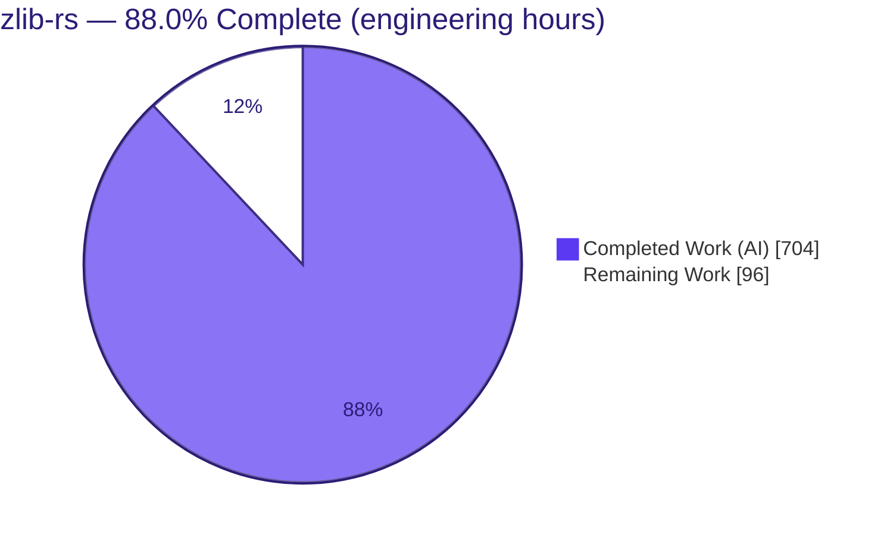
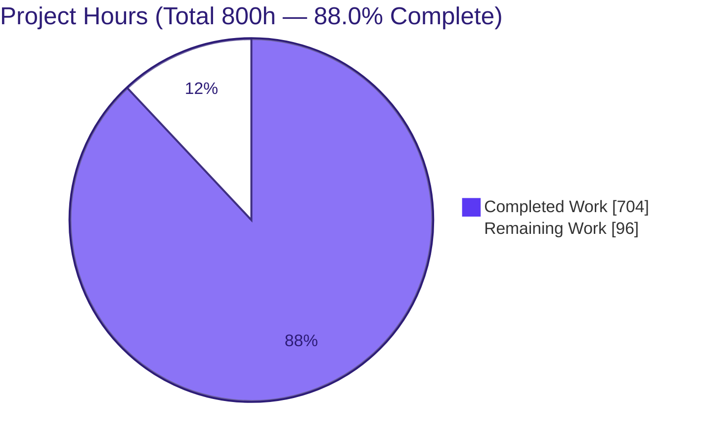
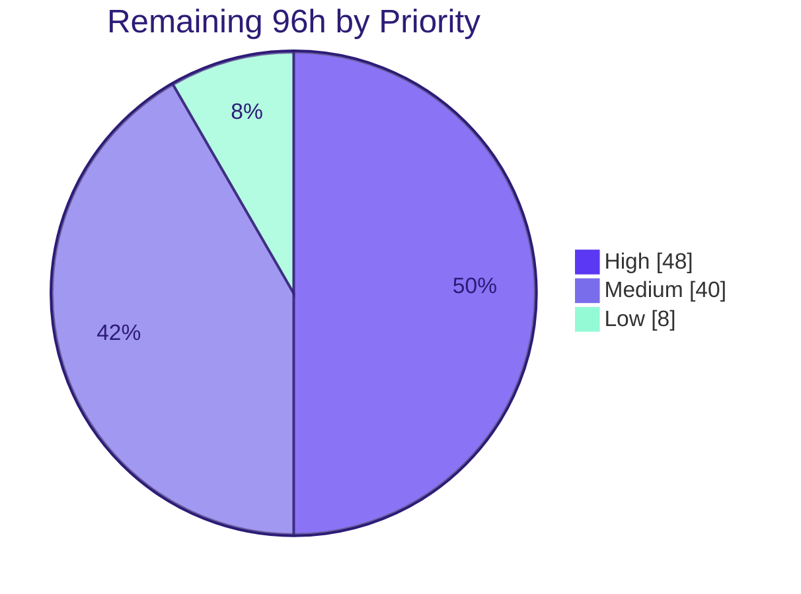
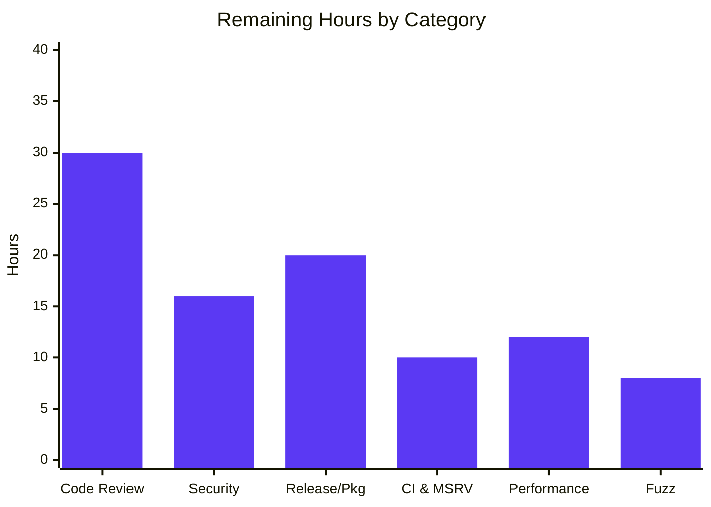

# Blitzy Project Guide — `zlib-rs`

> **Project:** `zlib-rs` — a memory-safe, idiomatic Rust rewrite of the zlib `1.3.2.1-motley` C compression library, delivered as a byte-compatible, exact-ABI **C drop-in** (`libzlib_rs.{rlib,so,a}`).
> **Branch:** `blitzy-6f6b036f-a6c8-400b-a287-4326c3c23dbc` · **HEAD:** `502cea9` · **Working tree:** clean
> **Brand legend:** <span style="color:#5B39F3">■ Completed / AI Work (#5B39F3)</span> · <span style="color:#B23AF2">■ Headings / Accents (#B23AF2)</span> · ☐ Remaining / Not Completed (#FFFFFF)

---

## 1. Executive Summary

### 1.1 Project Overview

`zlib-rs` reimplements the venerable zlib C compression library as an idiomatic, memory-safe Rust crate (`zlib_rs`) that preserves **byte-exact** DEFLATE wire output and an **exact C ABI** — so existing C/C++ consumers link against `libzlib_rs` with no source changes. The full functional surface is covered: DEFLATE compress/decompress; the zlib, gzip, and raw framings; Adler-32 and CRC-32 checksums; the `gz*` file-I/O API; and one-shot `compress`/`uncompress` helpers — across all levels (`-1..=9`) and five strategies. Manual `zcalloc`/`zcfree` memory management is replaced by Rust ownership and RAII, with every `unsafe` operation isolated to one `src/ffi/` C-ABI boundary. It targets systems integrators wanting zlib's behavior with memory safety.

### 1.2 Completion Status



**Completion: 88.0%** — computed on AAP-scoped work only: `704 / (704 + 96) = 704 / 800 = 88.0%`.

| Metric | Hours |
|---|---:|
| **Total Hours** | **800** |
| **Completed Hours (AI + Manual)** | **704** (AI 704 + Manual 0) |
| **Remaining Hours** | **96** |
| **Percent Complete** | **88.0%** |

*All functional AAP requirements are complete and validated; the remaining 96 hours are exclusively path-to-production (human review, security sign-off, release/packaging, and CI-on-real-infrastructure).*

### 1.3 Key Accomplishments

- ✅ **Full zlib functional surface reimplemented in safe Rust** — deflate (levels `-1..=9`, 5 strategies), inflate (streaming + `inflateBack`), Adler-32 & CRC-32 (+ combine family), gzip file I/O, and one-shot helpers.
- ✅ **Exact C ABI drop-in** — 106 `#[unsafe(no_mangle)] extern "C"` shims, `#[repr(C)]` `z_stream`/`gz_header` mirrors, opaque `internal_state`; a real C program using the standard `zlib.h` links against **both** the shared `.so` and static `.a` and passes all checks.
- ✅ **Byte-identity vs reference zlib** — validated against precomputed C-oracle vectors across every level, strategy, and framing; bidirectional interop with `flate2`/`miniz_oxide`.
- ✅ **Zero `unsafe` in core compression logic** — compiler-enforced via `#![deny(unsafe_code)]`; all `unsafe` confined to `src/ffi/` with 267 `// SAFETY:` justifications and `catch_unwind` + `panic = "abort"` FFI containment.
- ✅ **100% test pass** — 493 tests (default) and 365 (no_std), 0 failed / 0 ignored; independently reproduced this session.
- ✅ **Fuzzing clean** — 5 libFuzzer targets, ~869K executions, 0 crashes / panics / leaks.
- ✅ **`no_std`-capable, zero C dependencies** in the shipped artifact; build-time CRC-table codegen via `build.rs`.
- ✅ **Docs + rule-mandated executive deck** delivered and rendering (reveal.js/Mermaid/Lucide).

### 1.4 Critical Unresolved Issues

*No functional defects are outstanding. The items below are production-readiness gates, not code failures.*

| Issue | Impact | Owner | ETA |
|---|---|---|---|
| Unsafe FFI boundary not yet human-audited (106 shims / 267 SAFETY invariants) | Correctness/security assurance for the sole `unsafe` surface | Senior Rust + Security reviewer | 1–2 days |
| Security audit not run (offline): `cargo-audit`/`cargo-deny` | Supply-chain/vuln sign-off | Security engineer | 1 day |
| MSRV 1.85.0 verified only via stable 1.97.0 locally | CI MSRV gate unconfirmed on real toolchain | Build/CI engineer | 0.5 day |
| Performance not baselined vs C zlib | Perf-parity claim ungated | Performance engineer | 1–2 days |
| CI workflows never executed on real GitHub runners | First live run may surface env/network issues | DevOps | 1 day |

### 1.5 Access Issues

| System/Resource | Type of Access | Issue Description | Resolution Status | Owner |
|---|---|---|---|---|
| Public Rust toolchain (rustup/dl) | Network egress | Offline validation env cannot install the pinned MSRV `1.85.0` toolchain | Open — use CI MSRV job on connected infra | Build/CI engineer |
| crates.io advisory DB | Network egress | `cargo-audit`/`cargo-deny` cannot fetch advisories offline | Open — run in connected CI | Security engineer |
| GitHub Actions runners | CI execution | Workflows authored but never executed on real runners (offline) | Open — trigger first live run | DevOps |
| crates.io / distro registries | Publish credentials | Publish/packaging not yet performed | Open — provision release credentials | Release manager |

*Repository and source access were fully available; no permission or credential issues affected the source code itself.*

### 1.6 Recommended Next Steps

1. **[High]** Conduct the senior code review of the safe core and the `src/ffi/` unsafe boundary (validate all 267 `// SAFETY:` invariants).
2. **[High]** Run `cargo-audit` + `cargo-deny` on connected CI and threat-model the untrusted-input inflate path.
3. **[High]** Verify MSRV by installing real Rust `1.85.0` and confirming the CI `msrv` job is green.
4. **[Medium]** Execute the full CI matrix on real runners; establish a performance baseline vs C zlib and wire regression thresholds.
5. **[Medium]** Stand up the release/publish pipeline (crates.io + versioned `.so`/SONAME aligned to `zlib.map` for true drop-in `.so` replacement).

---

## 2. Project Hours Breakdown

### 2.1 Completed Work Detail

| Component | Hours | Description |
|---|---:|---|
| DEFLATE compression engine (`src/deflate/`) | 130 | 6,990 LOC / 9 files. `deflate()` driver, greedy/lazy/RLE/stored/huffman match finders, Huffman trees, `CompressFunc` strategy dispatch; levels `-1..=9` + 5 strategies. Zero-unsafe (`#![deny(unsafe_code)]`). |
| INFLATE decompression engine (`src/inflate/`) | 120 | 6,573 LOC / 6 files. `inflate()` driver, `InflateMode` enum state machine, fast decode loop, `inflateBack`, fixed & dynamic decode tables. |
| Checksums (`src/checksum/`) | 26 | 874 LOC. Adler-32 + `adler32_combine`; CRC-32/IEEE + `crc32_combine`/`_gen`/`_op`; SIMD (`crc32fast`) + scalar fallback; build-time tables. |
| gzip file I/O (`src/gz/`) | 68 | 5,345 LOC / 6 files. `gzopen`/`gzread`/`gzwrite`/`gzclose` family + state, over `std` I/O; `gz-io` feature. Zero-unsafe. |
| One-shot helpers + version (`src/util/`) | 20 | 1,376 LOC. `compress`/`compress2`/`compressBound`, `uncompress`/`uncompress2`, `zlibVersion`/`zlibCompileFlags`/`zError` → `"1.3.2.1-motley"`. |
| Shared types & ownership model | 46 | 3,508 LOC (`lib.rs`, `stream.rs`, `error.rs`, `constants.rs`, `gz_header.rs`). `ZStream` + `Allocator` trait (RAII replaces `zcalloc`/`zcfree`), `ReturnCode`/`ZlibError`, `no_std` switch. |
| C-ABI FFI boundary (`src/ffi/`) | 104 | 8,092 LOC / 7 files. 106 `extern "C"` shims (deflate 18, inflate 22, gz 34, util 25, +7), `#[repr(C)]` mirrors, opaque handle, `catch_unwind`, `zalloc`/`zfree` bridge, 267 `// SAFETY:` comments. |
| Integration test suite (`tests/`) | 58 | 4,292 LOC. 70 `#[test]` (checksum 18, interop 14, regression 13, round_trip 12, inflate_coverage 7, gzip_compat 6) + C-oracle byte-identity vectors + `flate2` interop. |
| Benchmarks (`benches/`) | 8 | 294 LOC. 3 Criterion benches (checksum, deflate, inflate), `harness = false`. |
| Fuzz targets (`fuzz/`) | 14 | 247 LOC. 5 libFuzzer targets (inflate, deflate_roundtrip, gzip, checksum, ffi_roundtrip) + `fuzz/Cargo.toml`. |
| Build system & CRC codegen | 22 | `Cargo.toml`/`Cargo.lock` (crate-type triad, 6 features, `panic=abort` profiles), `build.rs` regenerating CRC-32 tables into `OUT_DIR`. |
| Interop & service config | 10 | `BUILD.bazel`, `MODULE.bazel`, `catalog-info.yaml` (Backstage), `mkdocs.yml` (TechDocs). |
| CI workflow authoring | 14 | `.github/workflows/ci.yml` (matrix build/test + no_std + lint + MSRV) and `fuzz.yml` (nightly cargo-fuzz). |
| Documentation | 22 | 1,510 LOC. `README.md`, `doc/{index,project-guide,technical-specifications}.md`, `docs/index.md`. |
| Executive presentation | 14 | `blitzy-deck/executive-summary.html` — self-contained reveal.js deck, 16 slides, Blitzy theme, Mermaid + Lucide. |
| Validation, hardening & finalization | 28 | 5-gate validation + 16 finalization commits (zero-unsafe enforcement, FFI export parity, `gzdopen` fd fix, regression guards, `rust_eh_personality`, metric sync). |
| **Total Completed** | **704** | |

### 2.2 Remaining Work Detail

| Category | Hours | Priority |
|---|---:|---|
| Senior code review — safe core (deflate/inflate/checksum/gz/util + shared) | 12 | High |
| Security review of `src/ffi/` unsafe boundary (106 shims, 267 SAFETY invariants) | 18 | High |
| `cargo-audit` + `cargo-deny` online; triage advisories; supply-chain policy | 8 | High |
| Threat-model inflate untrusted-input path + consumer decompression-bomb guidance | 8 | High |
| MSRV 1.85.0 verification on real toolchain; confirm CI `msrv` job green | 2 | High |
| crates.io publish prep (license, metadata, docs.rs, `cargo publish --dry-run`) | 6 | Medium |
| Versioned `.so` packaging: SONAME + `zlib.map` symbol-versioning, drop-in `libz.so.1`, distro notes | 10 | Medium |
| Drop-in rollout runbook + rollback plan for a target consumer | 4 | Medium |
| Execute full CI matrix on real GitHub runners (online deps, first green run) | 8 | Medium |
| Performance baseline vs C zlib (Criterion vs system zlib) across levels/strategies | 8 | Medium |
| Wire performance regression thresholds into CI bench gate | 4 | Medium |
| Seed + commit reproducible fuzz corpus for the 5 targets | 4 | Low |
| Enable/verify scheduled long-run fuzz campaign on CI + triage workflow | 4 | Low |
| **Total Remaining** | **96** | |

*Priority rollup: **High 48h · Medium 40h · Low 8h**. Total (2.1 + 2.2) = 704 + 96 = **800h** = Total Project Hours (§1.2).*

### 2.3 Hours Basis & Confidence

Estimates use the PA2 framework (LOC/complexity proxies for a byte-exact, ABI-compatible, `no_std` systems port; testing counted as an explicit deliverable). Confidence: **High** for completed functional work (independently re-verified — build, 493/365 tests, C drop-in); **Medium** for remaining human-review/release hours (scope well-defined but effort varies by reviewer depth and target-consumer count).

---

## 3. Test Results

All results below originate from Blitzy's autonomous validation logs and were independently reproduced this session (stable `rustc`/`cargo` 1.97.0).

| Test Category | Framework | Total Tests | Passed | Failed | Coverage % | Notes |
|---|---|---:|---:|---:|---|---|
| Unit (library, in-module) | Rust libtest | 403 | 403 | 0 | Not measured | Default feature config; `#[cfg(test)]` modules |
| Integration | Rust libtest | 70 | 70 | 0 | Not measured | 6 files; byte-identity oracle + `flate2` interop |
| Doctests | rustdoc | 20 | 20 | 0 | Not measured | Executed documentation examples |
| **Default total** | **libtest + rustdoc** | **493** | **493** | **0** | Not measured | Reproduced this session, exit 0 |
| `no_std` suite | Rust libtest | 365 | 365 | 0 | Not measured | `--no-default-features [--features no-std]` |
| Fuzz | libFuzzer / cargo-fuzz | 5 targets | 5 (0 crashes) | 0 | n/a | ~869K executions; 0 panics/leaks (nightly) |
| Property-based | quickcheck | (within integration) | — | — | n/a | Randomized inputs in the integration suite |

**Integration test breakdown:** `checksum.rs` 18 · `interop.rs` 14 · `regression.rs` 13 · `round_trip.rs` 12 · `inflate_coverage.rs` 7 · `gzip_compat.rs` 6 = **70**.

**Feature-config matrix (all 100% pass, 0 failed/ignored):** default 493 · `--all-features` 493 · `std,gzip,gz-io` 493 · `std,gzip,gz-io,simd` 493 · `--no-default-features` (no_std) 365 · `no-std` feature 365.

**Correctness gates verified executing (not ignored):** byte-identity vs reference zlib; bidirectional `flate2`/`miniz_oxide` interop (6 tests); `crc32(0,"123456789") == 0xCBF43926`; `adler32(1,"123456789") == 0x091E01DE`.

> *Line-coverage instrumentation was not run in the offline environment; adding a coverage gate is folded into the remaining CI work (§2.2).* 

---

## 4. Runtime Validation & UI Verification

**Runtime health (library artifacts)**
- ✅ **Operational** — `cargo build --locked` (default, no_std, `--release --all-features`) all succeed; emits `target/release/libzlib_rs.{rlib,so,a}` (crate-type triad).
- ✅ **Operational** — C ABI drop-in: a real C program using the standard `zlib.h`, linked against **both** `libzlib_rs.so` (shared) and `libzlib_rs.a` (static), exits 0 — `zlibVersion()=="1.3.2.1-motley"`, `compress2(level 9)` + `uncompress` byte-identical, streaming `deflate`→`inflate` round-trip byte-identical, gzip framing emits `1f 8b`.
- ✅ **Operational** — checksum known-answers correct through the C ABI (`adler32=0x091E01DE`, `crc32=0xCBF43926`).
- ✅ **Operational** — symbol export: `.so` exports the full public zlib API; `zlib.map` `local:` symbols correctly hidden; `"1.3.2.1-motley"` embedded.
- ✅ **Operational** — fuzzing: 5 libFuzzer targets, ~869K executions, 0 crashes/panics/leaks.

**UI verification (rule-mandated executive deck — the project's only "UI")**
- ✅ **Operational** — `blitzy-deck/executive-summary.html` renders in headless Chrome: reveal.js, Mermaid, and Lucide all load; 39/39 Lucide icons render; all 3 Mermaid diagrams render; 16 conforming slides.

**API integration**
- ✅ **Operational** — safe Rust API surface (`compress`/`uncompress`, `ZStream`, checksums, version) and the 106-symbol C ABI both link and execute.
- ⚠ **Partial** — real-world consumer integration validated for a representative API subset; the full 106-symbol surface across diverse third-party consumers is not yet exhaustively integration-tested (see Risk I1).

*(This is a headless systems library — there is no web/GUI/CLI product surface; the executive deck is the only rendered artifact.)*

---

## 5. Compliance & Quality Review

Cross-mapping of AAP deliverables and hard constraints to quality benchmarks, including fixes applied during autonomous validation.

| Benchmark / AAP Requirement | Status | Progress | Evidence / Notes |
|---|---|---|---|
| **C1** — Binary/wire byte-identity vs zlib streams | ✅ Pass | 100% | `tests/interop.rs` C-oracle vectors across all levels/strategies/framings; C drop-in byte-identical |
| **C2** — FFI matches zlib C API signatures exactly | ✅ Pass | 100% | 106 `extern "C"` shims, `#[repr(C)]` mirrors, `zlib.map` symbol parity; C program links unchanged |
| **C3** — Zero `unsafe` in core compression logic | ✅ Pass | 100% | `#![deny(unsafe_code)]` in engine modules (compiler-enforced); all `unsafe` isolated to `src/ffi/` |
| **C4** — Passes official zlib test vectors | ✅ Pass | 100% | KAT checksums + byte-identity + layered validation (unit/integration/doctest/fuzz/property) |
| DEFLATE levels `-1..=9` + 5 strategies | ✅ Pass | 100% | `CompressFunc` enum + `select_compress_func`; `round_trip.rs` |
| `no_std` capability (Z_SOLO equivalent) | ✅ Pass | 100% | `--no-default-features` build + 365 tests; custom `rust_eh_personality` |
| Panic never crosses FFI (UB safety) | ✅ Pass | 100% | `catch_unwind` on fallible shims + global `panic = "abort"` |
| Zero C dependencies in shipped artifact | ✅ Pass | 100% | Runtime deps `cfg-if` + `crc32fast` (pure Rust); `flate2` uses pure-Rust `miniz_oxide` |
| Lint/format quality gates | ✅ Pass | 100% | `cargo clippy --locked --all-targets -- -D warnings` + `cargo fmt --check` clean (reproduced) |
| Rule-mandated executive presentation | ✅ Pass | 100% | 16-slide reveal.js deck, Blitzy theme, CDN-pinned, renders headless |
| MSRV 1.85.0 conformance | ⚠ Partial | 90% | Builds on stable 1.97.0 (> MSRV); CI `msrv` job defined but unrun on real 1.85.0 (offline) |
| Dependency vulnerability scan | ☐ Pending | 0% | `cargo-audit`/`cargo-deny` require network; run on CI (§2.2) |
| Human code-review sign-off | ☐ Pending | 0% | Safe-core + unsafe FFI review outstanding (§2.2) |

**Fixes applied during autonomous validation (this session, 16 commits):** enforced zero-unsafe invariant in engine/state modules; FFI C-ABI export parity corrections; `gzdopen` fd-lifecycle fix; added `deflateBound`/sliding-window-wrap regression guards; defined `rust_eh_personality` for the freestanding `no_std` build; promoted 6 doctests to executed examples; synchronized stale documentation/deck LOC metrics to measured ground truth (`502cea9`).

---

## 6. Risk Assessment

| Risk | Category | Severity | Probability | Mitigation | Status |
|---|---|---|---|---|---|
| S1 — Unsafe FFI boundary (106 shims / 707 unsafe ops / 267 SAFETY invariants) is the entire attack surface and is not yet human-audited | Security | High | Low–Med | `catch_unwind` + `panic=abort` + 869K-exec fuzzing (0 crashes); requires formal unsafe review (H2/H3) | Open |
| S3 — Untrusted-input inflate (classic zlib CVE surface: decompression bombs, malformed streams) | Security | Medium | Low | Extensively fuzzed; bounds-checked safe Rust; `inflate_strict` feature; add continuous fuzzing + consumer guidance | Mitigated |
| S2 — Dependency vuln scan (`cargo-audit`/`deny`) not run offline | Security | Low | Low | Minimal pure-Rust dep surface; run audit on connected CI | Open |
| T3 — Performance parity vs C zlib not baselined/gated | Technical | Medium | Medium | Run Criterion vs system zlib; wire regression thresholds (M5/M6) | Open |
| T4 — `no_std` cdylib/staticlib relies on custom `rust_eh_personality` + `panic=abort`; freestanding path less exercised | Technical | Low–Med | Low | 8/8 build configs pass; add an embedded smoke test | Mitigated |
| T1 — MSRV 1.85.0 verified only via stable 1.97.0 locally | Technical | Low | Low | CI `msrv` job defined; run on real toolchain (H5) | Open |
| T2 — Byte-identity gate uses precomputed C-oracle constants (no live C encoder in CI) | Technical | Low | Low | Vectors span all levels/strategies/framings + fuzz + `flate2` interop | Mitigated |
| O1 — CI workflows never executed on real GitHub runners (authored offline) | Operational | Medium | Medium | Trigger a first live run; fix env/network issues (M4) | Open |
| O2 — cdylib SONAME / symbol-versioning vs `zlib.map` for true distro `.so` replacement not yet packaged | Operational | Medium | Medium | Release/packaging pipeline (M2) | Open |
| O3 — No committed fuzz corpus for reproducible regression fuzzing | Operational | Low | Low | Seed + persist corpus (L1) | Open |
| I1 — Drop-in ABI validated for a representative consumer subset; full 106-symbol surface across diverse consumers not exhaustively tested | Integration | Medium | Low–Med | `zlib.map` symbol parity verified; expand consumer matrix; link real projects | Mitigated |
| I2 — Bidirectional interop vs `flate2`/`miniz_oxide` (pure-Rust), not live C zlib at test time | Integration | Low | Low | Precomputed C-oracle byte-identity vectors cover the C direction | Mitigated |
| I3 — gz file-I/O requires `std` (`gz-io`); `no_std` consumers lose it by design | Integration | Low | n/a | Documented feature-gating (by design) | Accepted |

---

## 7. Visual Project Status

**Project hours — completed vs remaining** (Completed = #5B39F3, Remaining = #FFFFFF):



**Remaining work by priority** (High = #5B39F3, Medium = #7A6DEC, Low = #94FAD5):



**Remaining hours by category (bar view):**



*Category rollup (96h): Code Review 30 (H1+H2) · Security 16 (H3+H4) · Release/Packaging 20 (M1+M2+M3) · CI & MSRV 10 (M4+H5) · Performance 12 (M5+M6) · Fuzz 8 (L1+L2). Sum = 30+16+20+10+12+8 = **96h**, equal to §1.2 Remaining and the §2.2 total.*

---

## 8. Summary & Recommendations

**Achievements.** `zlib-rs` is a functionally complete, independently validated C→Rust migration of zlib `1.3.2.1-motley`. Every AAP functional requirement (deflate, inflate, checksums, gzip I/O, one-shot helpers, the shared ownership model, and the 106-symbol C ABI) is implemented and passing, and all four hard constraints are satisfied: byte-identity with reference zlib, exact FFI signatures, compiler-enforced zero-`unsafe` in core logic, and official test-vector conformance. This session independently reproduced a clean build, 493/493 (and 365/365 no_std) passing tests, clean clippy/rustfmt, and a C drop-in that links against both the shared and static libraries with byte-identical output.

**Remaining gaps.** The outstanding 96 hours are **path-to-production, not feature work**: human code review (especially the `src/ffi/` unsafe boundary and its 267 SAFETY invariants), a security audit (`cargo-audit`/`cargo-deny` + threat modeling), MSRV verification on a real 1.85.0 toolchain, first execution of the CI matrix on real runners, a performance baseline vs C zlib with regression gates, release/packaging (crates.io + versioned SONAME `.so`), and an extended fuzz campaign with a committed corpus.

**Critical path to production.** (1) Safe-core + FFI unsafe review → (2) security audit & threat model → (3) MSRV + full CI green on real infra → (4) performance baseline & gates → (5) release/packaging & drop-in rollout.

**Success metrics for sign-off.** Reviewer approval of the unsafe boundary; clean `cargo-audit`/`cargo-deny`; green CI matrix incl. `msrv`; documented perf within target of C zlib; published, versioned drop-in `.so`.

**Production readiness.** **88.0% complete.** The library is feature-complete and validation-green; it is **not yet production-signed-off** pending human review, security audit, and release hardening. Recommendation: proceed to the High-priority review/audit tasks immediately — they are the gating items on the critical path.

| Assessment | Value |
|---|---|
| AAP-scoped completion | **88.0%** (704 / 800 h) |
| Functional AAP requirements | 15 / 15 complete |
| Hard constraints satisfied | 4 / 4 |
| Remaining (path-to-production) | 96 h (High 48 · Medium 40 · Low 8) |
| Production sign-off | Pending human review + security + release |

---

## 9. Development Guide

A headless systems library — **no ports, servers, or databases**. All commands were executed and verified this session (exit 0) unless explicitly noted.

### 9.1 System Prerequisites

- **Rust** ≥ `1.85.0` (MSRV; edition 2024). Verified toolchains: stable `rustc`/`cargo 1.97.0` (build/test/lint), `nightly 1.99.0` (fuzz only).
- **C compiler** (`gcc`/`cc`) — only for the optional C drop-in linkage demo (+ `libpthread`, `libdl`, `libm` for static linking).
- **No C zlib toolchain required** — byte-identity uses precomputed oracle vectors.
- **Headless Chrome** — only to view the executive deck.
- Works fully **offline** with `--locked` (`Cargo.lock` v4, 89 packages).

### 9.2 Environment Setup

```bash
# Put cargo/rustc on PATH (this environment)
source /etc/profile.d/rust-env.sh

# Recommended non-interactive env
export CI=true
export CARGO_TERM_COLOR=never

# Confirm toolchain
rustc --version   # rustc 1.97.0
cargo --version   # cargo 1.97.0
```

### 9.3 Dependency Installation

```bash
# All dependencies resolve offline from the committed lockfile
cargo fetch --locked
```

*No system packages are needed for the Rust library. `flate2` (dev) uses the pure-Rust `miniz_oxide` backend — no C is compiled.*

### 9.4 Build

```bash
# Default features (std, gzip, gz-io, simd)
cargo build --locked

# Release, all features — produces the C-ABI artifacts
cargo build --locked --release --all-features
ls target/release/libzlib_rs.*        # libzlib_rs.rlib  libzlib_rs.so  libzlib_rs.a

# no_std / freestanding (Z_SOLO equivalent)
cargo build --locked --no-default-features
```

### 9.5 Test & Quality Gates

```bash
cargo test  --locked                                            # default: 493 passed, 0 failed
cargo test  --locked --no-default-features --features no-std    # no_std: 365 passed
cargo clippy --locked --all-targets -- -D warnings              # zero warnings
cargo fmt --all -- --check                                      # formatting clean
cargo bench --locked --no-run                                   # compiles 3 Criterion benches
```

### 9.6 Fuzzing (nightly)

```bash
cd fuzz
cargo +nightly fuzz build
# targets: fuzz_inflate  fuzz_deflate_roundtrip  fuzz_gzip  fuzz_checksum  fuzz_ffi_roundtrip
cargo +nightly fuzz run fuzz_inflate -- -max_total_time=60
```

### 9.7 Example Usage — C Drop-in (verified)

Compile a standard C program against the project `zlib.h` and link the Rust library:

```bash
# Shared library
gcc -I. app.c -L target/release -lzlib_rs -o app
LD_LIBRARY_PATH=target/release ./app

# Static library
gcc -I. app.c target/release/libzlib_rs.a -lpthread -ldl -lm -o app
./app
```

Minimal `app.c` (round-trip + checksums, both verified byte-identical / exit 0):

```c
#include <string.h>
#include <stdio.h>
#include <assert.h>
#include "zlib.h"
int main(void){
    printf("zlibVersion=%s\n", zlibVersion());   /* 1.3.2.1-motley */
    const char *m = "The quick brown fox. 123456789";
    uLong sl = (uLong)strlen(m)+1; uLongf cl=512, dl=512;
    unsigned char c[512], d[512];
    assert(compress2(c,&cl,(const Bytef*)m,sl,9)==Z_OK);
    assert(uncompress(d,&dl,c,cl)==Z_OK);
    assert(dl==sl && memcmp(m,d,sl)==0);
    assert(crc32(0L,(const Bytef*)"123456789",9)==0xCBF43926UL);
    printf("C drop-in OK\n"); return 0;
}
```

### 9.8 Verification Checklist

- `cargo build --locked --release --all-features` → the three `libzlib_rs.{rlib,so,a}` artifacts exist.
- `cargo test --locked` → `493 passed; 0 failed; 0 ignored`.
- The C drop-in prints `zlibVersion=1.3.2.1-motley` and `C drop-in OK`, exit 0.

### 9.9 Troubleshooting

- **`.so` not found at runtime** → `export LD_LIBRARY_PATH=target/release`.
- **`no_std` under `cargo test`** → Cargo forces `panic = "unwind"`, so CI builds no_std cdylib/staticlib as *build-only* and tests the rlib separately; use the documented flags in §9.5.
- **MSRV can't be installed offline** → rely on the CI `msrv` job (real 1.85.0); locally, stable > MSRV builds satisfy intent.
- **Fuzz build fails on stable** → fuzzing requires `nightly` + `cargo-fuzz` (sanitizer/coverage instrumentation).
- **`externally-managed-environment` pip error** → irrelevant here; the library is pure Rust and needs no pip.

---

## 10. Appendices

### A. Command Reference

| Purpose | Command |
|---|---|
| Env setup | `source /etc/profile.d/rust-env.sh` |
| Fetch deps (offline) | `cargo fetch --locked` |
| Build (default) | `cargo build --locked` |
| Build (release, all features) | `cargo build --locked --release --all-features` |
| Build (no_std) | `cargo build --locked --no-default-features` |
| Test (default) | `cargo test --locked` |
| Test (no_std) | `cargo test --locked --no-default-features --features no-std` |
| Lint | `cargo clippy --locked --all-targets -- -D warnings` |
| Format check | `cargo fmt --all -- --check` |
| Bench (compile) | `cargo bench --locked --no-run` |
| Fuzz (nightly) | `cd fuzz && cargo +nightly fuzz build` |
| C drop-in (shared) | `gcc -I. app.c -L target/release -lzlib_rs -o app && LD_LIBRARY_PATH=target/release ./app` |
| C drop-in (static) | `gcc -I. app.c target/release/libzlib_rs.a -lpthread -ldl -lm -o app && ./app` |

### B. Port Reference

Not applicable — `zlib-rs` is a headless library with **no listening ports, servers, or network services**.

### C. Key File Locations

| Area | Path |
|---|---|
| Crate manifest / lockfile | `Cargo.toml`, `Cargo.lock` |
| Build-time CRC codegen | `build.rs` → `$OUT_DIR/crc32_tables.rs` |
| Safe core engines | `src/{deflate,inflate,checksum,gz,util}/` |
| Shared types & ownership | `src/{lib,stream,error,constants,gz_header}.rs` |
| C-ABI boundary (sole `unsafe`) | `src/ffi/{mod,types,alloc,deflate,inflate,gz,util}.rs` |
| ABI contract | `zlib.h`, `zlib.map` |
| C reference sources (oracle) | root `*.c` / `*.h` |
| Integration tests | `tests/*.rs` |
| Benchmarks / Fuzz | `benches/*.rs`, `fuzz/fuzz_targets/*.rs` |
| CI | `.github/workflows/{ci,fuzz}.yml` |
| Executive deck | `blitzy-deck/executive-summary.html` |
| Docs | `README.md`, `doc/*.md`, `docs/index.md` |

### D. Technology Versions

| Component | Version |
|---|---|
| Rust edition / MSRV | 2024 / `1.85.0` |
| Toolchain (verified) | stable `1.97.0`; nightly `1.99.0` (fuzz) |
| Library identity | `zlib_rs` v`1.3.2`; `zlibVersion()` → `1.3.2.1-motley` |
| Runtime deps | `cfg-if 1.0.4`, `crc32fast 1.5.0` (optional, `simd`) |
| Dev deps | `criterion 0.5.1`, `flate2 1.1.9`, `quickcheck 1.1.0`, `rand 0.9.4` |
| Fuzz dep | `libfuzzer-sys 0.4` |
| Crate types | `["lib", "cdylib", "staticlib"]` |
| Lockfile | `Cargo.lock` v4 (89 packages) |

### E. Environment Variable Reference

| Variable | Purpose |
|---|---|
| `CI=true` | Non-interactive tool behavior |
| `CARGO_TERM_COLOR=never` | Plain-text cargo output |
| `LD_LIBRARY_PATH=target/release` | Runtime path for the shared `.so` (C drop-in) |
| `OUT_DIR` | Cargo-set build dir where `build.rs` emits `crc32_tables.rs` |
| `RUSTFLAGS` | Optional codegen flags (e.g., `-C target-cpu=native`) |

### F. Developer Tools Guide

| Tool | Role |
|---|---|
| `cargo` / `rustc` (stable) | Build, test, doc, bench-compile |
| `cargo +nightly fuzz` (cargo-fuzz + libFuzzer) | Fuzz harnesses (requires nightly) |
| `cargo clippy` / `cargo fmt` | Lint & formatting gates |
| `criterion` | Statistical benchmarking (`harness = false`) |
| `quickcheck` | Property-based testing |
| `flate2` / `miniz_oxide` | Independent codec for interop cross-checks (pure Rust) |
| Bazel (`BUILD.bazel`, `MODULE.bazel`) | Optional interop build (retained) |
| Backstage / MkDocs (`catalog-info.yaml`, `mkdocs.yml`) | Service registration & TechDocs |

### G. Glossary

| Term | Meaning |
|---|---|
| **DEFLATE** | The LZ77 + Huffman compression algorithm (RFC 1951) underlying zlib/gzip |
| **zlib / gzip / raw** | Stream framings: RFC 1950 / RFC 1952 / RFC 1951 (no header/trailer) |
| **C ABI / FFI** | Application Binary Interface / Foreign Function Interface — the C-callable boundary |
| **drop-in replacement** | A library linkable in place of the original with no consumer source changes |
| **`no_std` / Z_SOLO** | Freestanding build without the Rust/C standard library |
| **RAII** | Resource Acquisition Is Initialization — ownership-driven automatic cleanup (`Drop`) |
| **SONAME** | Shared-object version name used by the dynamic linker for ABI versioning |
| **KAT** | Known-Answer Test (e.g., `crc32(0,"123456789")==0xCBF43926`) |
| **MSRV** | Minimum Supported Rust Version (`1.85.0`) |
| **byte-identity** | Compressed output byte-for-byte identical to reference zlib for the same inputs |

---

*Generated by the Blitzy Platform. Completion (88.0%) reflects AAP-scoped and path-to-production work only. Brand colors: Completed #5B39F3, Remaining #FFFFFF, Accents #B23AF2, Highlight #A8FDD9.*