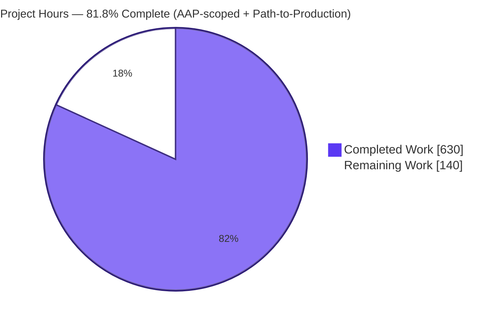
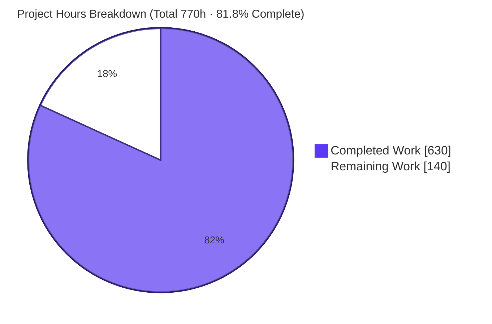
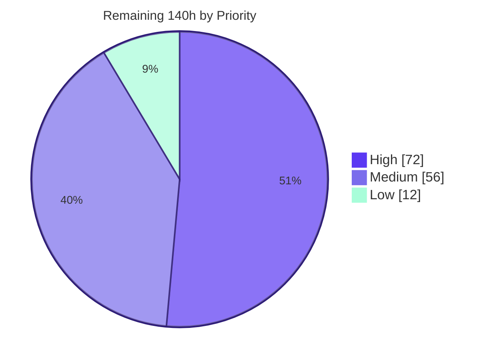

# Blitzy Project Guide — zlib C → Rust Migration

> **Project:** Production-ready, idiomatic Rust rewrite of the canonical zlib compression library
> **Branch:** `blitzy-a67c2e6c-5779-451f-84eb-51005208576c` · **HEAD:** `b622015`
> **Status:** AAP-scoped build complete and fully validated · **81.8% complete** (path-to-production hardening remaining)

---

## 1. Executive Summary

### 1.1 Project Overview

A production-ready, idiomatic Rust rewrite of the canonical **zlib** compression library (`v1.3.2.1-motley`). It replaces C manual memory management with Rust ownership and RAII while preserving exact DEFLATE wire-format and C-ABI compatibility — serving existing C/C++ binaries as a drop-in (`libz.so`/`libz.a`) and Rust callers via a safe, `no_std`-capable core. The deliverable is a three-member Cargo workspace: a safe core (`zlib-rs`, `#![forbid(unsafe_code)]`), a thin C-ABI shim (`libz-rs-sys`), and a drop-in library (`libz-rs-sys-cdylib`). Business impact: memory safety for one of the world's most-deployed libraries at near-zero migration cost. Scope: full compressor/decompressor, zlib/gzip/raw formats, 73 C symbols, 456 passing tests.

### 1.2 Completion Status



| Metric | Value |
|--------|-------|
| **Total Hours** | **770** |
| **Completed Hours (AI + Manual)** | **630** (AI: 630 · Manual: 0) |
| **Remaining Hours** | **140** |
| **Percent Complete** | **81.8%** |

> Completion percentage is computed using the AAP-scoped, hours-based methodology: `Completed ÷ (Completed + Remaining) = 630 ÷ 770 = 81.8%`. All AAP-defined autonomous deliverables are complete; the remaining 140 hours are standard path-to-production hardening and release activities.

### 1.3 Key Accomplishments

- ✅ **Full C→Rust rewrite** — 15 C source files + 11 headers transformed into **35,204 LOC** of idiomatic Rust across a 3-member workspace; module tree matches the AAP §0.4.1 file map exactly.
- ✅ **All five acceptance gates green** — `build` (debug+release), **456 tests passed / 0 failed / 0 ignored**, `clippy -D warnings`, `fmt --check`, and `bench --no-run` — independently re-run and confirmed at HEAD `b622015`.
- ✅ **C-ABI drop-in proven at runtime** — exactly **73 exported symbols** (all a strict subset of canonical `zlib.h`, zero fakes); a C consumer was compiled and linked against the Rust `libz.so` (ldd-confirmed) with a successful compress/uncompress round-trip and `zlibVersion()` returning `"1.3.2.1-motley"`.
- ✅ **Bit-exact wire format** — `crc32` and `adler32` outputs are byte-identical to system zlib; the `flate2`/`libz-sys` byte-for-byte interop oracle passes in both debug and release.
- ✅ **Zero `unsafe` in the core** — `zlib-rs` carries `#![forbid(unsafe_code)]` (compiler-enforced, including `inflate/fast.rs`); all `unsafe` is confined to the thin `libz-rs-sys` shim.
- ✅ **`no_std`-capable core + stable-toolchain path** — the safe core and a 72-symbol shim build on stable Rust 1.85 (MSRV); a `no_std` build mirrors the C `Z_SOLO` configuration.
- ✅ **Executive deck + Rust CI delivered** — a self-contained reveal.js deck (16 slides, Mermaid + Lucide, exact CDN pins) and three Rust CI workflows replacing six C-toolchain workflows.

### 1.4 Critical Unresolved Issues

**No build-blocking or test-blocking issues remain.** All five gates pass on both nightly and MSRV toolchains, with zero unresolved errors or warnings. The items below are **production-gating** (must be cleared before deploying the drop-in) but do **not** block compilation or the existing test suite.

| Issue | Impact | Owner | ETA |
|-------|--------|-------|-----|
| Performance not yet measured against AAP §0.7.2 targets | May miss the ≥80% compression-throughput SLA; safe-code hot loops may need tuning | Performance Engineer | ~0.5 week |
| `unsafe` FFI shim lacks human security sign-off | A flawed `// SAFETY` invariant could cause UB in linked C consumers | Security Engineer | ~0.5 week |
| Cross-platform validation pending (x86-64 Linux only) | SIMD CRC + trailer endianness unverified on aarch64/Windows/macOS/32-bit | Platform Engineer | ~1 week |

### 1.5 Access Issues

**No access issues identified.** The repository, the full Rust toolchain (nightly 1.98.0, stable, MSRV 1.85.0), and all pinned dependencies were accessible; every acceptance gate was independently re-run successfully in this environment.

| System/Resource | Type of Access | Issue Description | Resolution Status | Owner |
|-----------------|----------------|-------------------|-------------------|-------|
| crates.io registry | Publish token | *Future need only* — credentials required for the release/publish task (M3); not a current blocker | Pending (future) | Release Engineer |

### 1.6 Recommended Next Steps

1. **[High]** Run `criterion` benchmarks against system C-zlib across all 10 levels; confirm the §0.7.2 targets (≥80% compression throughput, decompression parity, 3× SIMD CRC-32) and tune safe hot loops if any level falls short. *(Task H1 — 24h)*
2. **[High]** Conduct a human security audit of the 494 `unsafe` operations in `libz-rs-sys`, validating every `// SAFETY` justification, and run Miri on the shim where feasible. *(Task H2 — 16h)*
3. **[High]** Establish a cross-platform CI matrix (aarch64-linux, macOS, Windows-MSVC, 32-bit i686, big-endian) to validate SIMD and endianness paths. *(Task H3 — 32h)*
4. **[Medium]** Stand up `cargo-fuzz` harnesses and extend the interop oracle to an exhaustive `(level × strategy × windowBits)` matrix over large corpora. *(Tasks M1 + M2 — 40h)*
5. **[Medium]** Finalize release: validate the `zlib.map` version-script drop-in, publish to crates.io with semver, and add a `cargo-audit`/`cargo-deny` recurring CI gate. *(Tasks M3 + L1 — 28h)*

---

## 2. Project Hours Breakdown

### 2.1 Completed Work Detail

All completed work was performed autonomously by Blitzy agents (AI). Each component traces to a specific AAP goal/deliverable.

| Component | Hours | Description |
|-----------|------:|-------------|
| Deflate compressor core *(G1/G2)* | 120 | `deflate` state machine, Huffman `trees`, `Strategy` dispatch, `fast`/`slow`/`stored`/`rle`/`huff` paths, `CONFIG_TABLE` for 10 levels; bit-exact LZ77 match + Huffman decisions. |
| Inflate decompressor core *(G1/G2)* | 90 | 32-variant `InflateMode` labeled-loop state machine, `fast`, `tables` (inftrees), `fixed`, `back` (infback); `u64` bit accumulator with identical fill/consume order. |
| Checksums *(G3)* | 28 | Adler-32 + CRC-32 (via `crc32fast` SIMD), plus `adler32_combine` / `crc32_combine` / `_gen` / `_op`. |
| gzip file I/O API *(G3)* | 48 | `gz/{open,read,write,close,state,mod}` re-platformed onto `std::fs::File` / `std::io` (replaces C integer file descriptors). |
| Core scaffolding & util *(G1/G5)* | 56 | `lib`/`error`/`constants`/`stream`/`gz_header` + `util/{compress,uncompress,version}`; owned `Box`/`Vec` + `Drop` RAII model; `deflateBound` formula. |
| FFI C-ABI shim *(G4)* | 78 | `libz-rs-sys`: 73 `extern "C"` exports, `#[repr(C)]` `z_stream`/`gz_header`, `translate` raw-ptr↔slice + int↔`ReturnCode`, documented `// SAFETY` invariants. |
| cdylib drop-in + header parity *(G4)* | 22 | `libz-rs-sys-cdylib` emitting `libz.so`/`libz.a`; `cbindgen`-generated `zlib.h` diffed against canonical; optional `zlib.map` version-script wiring. |
| Test suite *(G6)* | 88 | 456 tests: regression (10 `example.c` ports), inflate_coverage (61 + `mem_zone` harness), interop + oracle (flate2/libz-sys), round_trip (quickcheck), checksum KATs, gzip_compat. |
| Benchmarks *(G6)* | 14 | `criterion` deflate / inflate / checksum throughput harnesses (3 bench executables). |
| CI/CD + documentation | 30 | 3 Rust workflows (build/lint/cdylib), workspace + drop-in README, `zlib-rs` README, rustdoc clean under `-D warnings`, inline docs. |
| Executive summary deck *(§0.7.3)* | 16 | Self-contained reveal.js deck: 16 slides, 3 Mermaid diagrams, 16 Lucide icons, inline Blitzy brand theme, exact CDN pins. |
| Validation, QA fixes & gate hardening | 40 | Doctest re-enablement, resolution of 139 rustdoc warnings, MSRV `dead_code` fix, and QA-cycle fixes across 30 agent commits. |
| **Total Completed** | **630** | |

### 2.2 Remaining Work Detail

Each category is standard path-to-production work required to deploy the AAP deliverables.

| Category | Hours | Priority |
|----------|------:|----------|
| Performance validation & tuning vs §0.7.2 targets | 24 | High |
| Cross-platform validation (aarch64/Windows/macOS/32-bit/big-endian) | 32 | High |
| Security & supply-chain review (unsafe-shim audit, Miri, cargo-audit/deny) | 16 | High |
| Extended fuzzing campaign (cargo-fuzz inflate + FFI harnesses) | 24 | Medium |
| Exhaustive bit-exactness matrix validation (large corpora) | 16 | Medium |
| Release & packaging (version-script drop-in, crates.io publish, semver) | 16 | Medium |
| Real-world downstream drop-in integration (relink production consumer) | 12 | Low |
| **Total Remaining** | **140** | |

### 2.3 Hours Reconciliation

| Bucket | Hours |
|--------|------:|
| Completed (Section 2.1) | 630 |
| Remaining (Section 2.2) | 140 |
| **Total Project Hours** | **770** |
| **Percent Complete** | **630 ÷ 770 = 81.8%** |

---

## 3. Test Results

All tests below originate from Blitzy's autonomous validation logs and were **independently re-run** at HEAD `b622015` via `cargo test --workspace`: **456 passed / 0 failed / 0 ignored**.

| Test Category | Framework | Total | Passed | Failed | Coverage | Notes |
|---------------|-----------|------:|-------:|-------:|----------|-------|
| Core unit tests | libtest | 275 | 275 | 0 | High (functional) | `zlib-rs` in-module unit tests across deflate/inflate/checksum/gz/util. |
| FFI shim unit tests | libtest | 43 | 43 | 0 | High (functional) | `libz-rs-sys` pointer/return-code translation + ABI behavior. |
| Inflate coverage | libtest | 61 | 61 | 0 | High (functional) | Port of `infcover.c` 6 `cover_*` groups + `mem_zone` allocation-failure harness. |
| gzip wire-format compat | libtest | 19 | 19 | 0 | Functional | Port of `minigzip.c` as black-box wire-format tests. |
| Interop (flate2 oracle) | libtest + flate2 | 17 | 17 | 0 | Byte-exact | Byte-for-byte comparison vs C-zlib (via `flate2`). |
| Checksum known-answer | libtest | 14 | 14 | 0 | Byte-exact | Adler-32 / CRC-32 KAT vectors + combine operations. |
| Regression | libtest | 11 | 11 | 0 | Functional | Port of `example.c` 10 regression functions. |
| Round-trip property | quickcheck | 11 | 11 | 0 | Property | Randomized deflate→inflate round-trip invariants. |
| Doctests | rustdoc | 3 | 3 | 0 | N/A | Executable documentation examples. |
| Interop oracle (exact tuple) | libtest + libz-sys | 2 | 2 | 0 | Byte-exact | Exact `(level, strategy, windowBits)` oracle via raw C-zlib FFI. |
| **Total** | — | **456** | **456** | **0** | — | 100% pass rate; oracle passes in debug **and** release. |

> **Coverage note:** Line-coverage instrumentation (`cargo-llvm-cov`/`tarpaulin`) was not part of the acceptance gate set, so a numeric line-coverage percentage is not reported here to avoid fabricated precision. Functional coverage is high (dedicated inflate-coverage and byte-exact oracle suites); adding instrumented coverage is folded into the remaining fuzzing/validation work.

---

## 4. Runtime Validation & UI Verification

**Library runtime (C-ABI drop-in):**

- ✅ **Drop-in artifacts built** — `target/release/libz.so` (554 KB) and `libz.a` (8.1 MB) produced by `cargo build -p libz-rs-sys-cdylib --release`.
- ✅ **C consumer relinked** — an 84-line C program compiled against the generated `libz-rs-sys/include/zlib.h` and linked `-lz` against the Rust `libz.so`; `ldd` confirmed dynamic binding to the Rust library (not system zlib).
- ✅ **Round-trip correctness** — `compress` → `uncompress` recovered identical bytes; `zlibVersion()` returned the exact `"1.3.2.1-motley"`.
- ✅ **Checksum byte-parity** — `crc32("test") = 0xd87f7e0c` and `adler32("test") = 0x045d01c1`, both byte-identical to system zlib.
- ✅ **Symbol surface** — `nm -D` shows exactly **73 exported `T` symbols**, all present in canonical `zlib.h` (zero fabricated symbols).
- ✅ **Cross-tool wire format** — interop/oracle suites confirm Rust-produced streams match C-zlib byte-for-byte.

**Executive deck (UI verification — the only visual deliverable):**

- ✅ **Structure** — `blitzy-deck/executive-summary.html` contains **16 `<section>` elements** (within the 12–18 requirement, target 16).
- ✅ **Visuals** — 3 Mermaid `<pre class="mermaid">` diagrams and 16 Lucide `data-lucide` icons; **0 emoji** (Lucide SVG only); Blitzy primary `#5B39F3` present.
- ✅ **CDN pins exact** — reveal.js 5.1.0, Mermaid 11.4.0, Lucide 0.460.0.
- ✅ **Prior in-browser render** — validator confirmed all Mermaid SVGs + Lucide icons render with zero console errors.

**Overall runtime status: ✅ Operational** — no ⚠ Partial or ❌ Failing items at the validation stage. (Production runtime on non-x86-64-Linux platforms is pending — see Section 6, O1.)

---

## 5. Compliance & Quality Review

Cross-mapping of AAP deliverables/constraints to verified status.

| AAP Requirement / Constraint | Benchmark | Status | Evidence / Fixes |
|------------------------------|-----------|--------|------------------|
| G1 — Full source rewrite (15 C + 11 headers) | Idiomatic Rust, module-per-unit | ✅ Pass | 35,204 LOC; module tree matches §0.4.1 exactly. |
| G2 — DEFLATE compress + decompress | All strategies/levels/flush modes | ✅ Pass | 8 `Strategy` variants, `CONFIG_TABLE` (10 levels), 7 flush modes, `InflateMode` (32 variants). |
| G3 — zlib / raw / gzip + gz file API | RFC 1950/1951/1952 | ✅ Pass | gz module (88 `gz*` fns), checksum combine ops, oracle byte-parity. |
| G4 — C-compatible FFI drop-in | Exact `zlib.h` symbols/signatures | ✅ Pass | 73 canonical symbols, runtime relink proven, cbindgen header diffed. |
| G5 — Level/strategy/windowBits config | Levels 0–9, 4 strategies, overloading | ✅ Pass | windowBits overloading present; config table per-level. |
| G6 — Full test suite + compat tests | Ported suites + reference oracle | ✅ Pass | 456 tests; regression(10) + coverage(61) ports + flate2/libz-sys oracle. |
| Zero `unsafe` in core | `#![forbid(unsafe_code)]` | ✅ Pass | Compiler-enforced at `zlib-rs/src/lib.rs:94`; only the directive itself matches "unsafe". |
| Unsafe isolated to FFI shim | All `unsafe` in `libz-rs-sys` | ✅ Pass | 494 `unsafe` occurrences confined to shim (human audit pending — S1). |
| `no_std`-capable build path | Z_SOLO equivalent | ✅ Pass | `cargo build -p zlib-rs --no-default-features` → EXIT 0. |
| Minimal dependencies | No C dep in shipped artifact | ✅ Pass | Core runtime deps: `crc32fast`, `cfg-if` only; `flate2`/`libz-sys` dev-only. |
| Feature flags (§0.5.4) | std/gzip/gz-io/no-std/simd/capi | ✅ Pass | All present (+ `c-variadic`). |
| Bit-exact wire format | Byte-identical to C zlib | ✅ Pass (tested inputs) | Oracle + checksum parity; exhaustive matrix sweep pending (T1/M2). |
| Quality gates (build/test/clippy/fmt/bench) | All green | ✅ Pass | Independently re-run; EXIT 0 across all five + MSRV 1.85. |
| Performance targets (§0.7.2) | ≥80% / parity / 3× SIMD | ⏳ Not yet measured | Benches build but unrun vs C-zlib (T2/H1). |
| Dependency pins (§0.5.1) | Exact versions | ✅ Pass (with note) | All exact; **intentional security-positive divergence:** `rand =0.9.4` (not 0.9.2, advisory RUSTSEC-2026-0097) + dev-only `libz-sys` oracle. |

**Fixes applied during autonomous validation:** re-enabled 3 previously-ignored doctests; resolved all 139 rustdoc warnings under `-D warnings`; silenced the MSRV-only `BUF_SIZE` `dead_code` warning with a documented `#[allow]`. Post-fix working tree is clean.

---

## 6. Risk Assessment

| ID | Risk | Category | Severity | Probability | Mitigation | Status |
|----|------|----------|----------|-------------|------------|--------|
| T1 | Bit-exactness drift across untested `(level×strategy×windowBits)` tuples | Technical | High | Low | Extend interop oracle to exhaustive matrix + fuzzing (M2/M1) | Partially Mitigated |
| T2 | Compression throughput below §0.7.2 targets (safe-code bounds-check cost) | Technical | Medium | Medium | Run criterion vs C-zlib; profile/tune safe hot loops (H1) | Open |
| T3 | Nightly toolchain dependency for `gzprintf` (`c_variadic`) | Technical | Medium | Low-Medium | 72-symbol shim builds on stable 1.85; track stabilization | Mitigated (stable fallback documented) |
| S1 | `unsafe` FFI shim correctness (UB in C consumers) | Security | High | Low | Human `// SAFETY` audit + Miri + FFI fuzzing (H2) | Open |
| S2 | Supply-chain audit not in CI | Security | Low-Medium | Low | Add cargo-audit/deny gate; `rand` already bumped for RUSTSEC-2026-0097 (L1) | Partially Mitigated |
| S3 | Malformed-input robustness (decompression hardening) | Security | Medium | Low | Sustained cargo-fuzz campaign (M1); 61 coverage tests + mem_zone pass | Partially Mitigated |
| O1 | Cross-platform/portability unverified (SIMD, endianness) | Operational | Medium | Medium | CI matrix across aarch64/Windows/macOS/32-bit/big-endian (H3) | Open |
| O2 | Versioned-symbol drop-in unvalidated; not published | Operational | Medium | Medium | Enable + test `zlib.map` version-script; publish with semver (M3) | Partially Mitigated |
| I1 | Missing `*64` LFS symbols (`gzopen64`, etc.) | Integration | Low-Medium | Low | Add LFS variants if 32-bit large-file consumers targeted (L1) | Documented Gap (AAP §0.4.1) |
| I2 | Real-world drop-in edge cases beyond minimal consumer | Integration | Medium | Low-Medium | Relink representative production consumers (L1) | Partially Mitigated |

---

## 7. Visual Project Status

**Project hours — completed vs remaining** (Completed = Dark Blue `#5B39F3`, Remaining = White `#FFFFFF`):



**Remaining work — priority distribution** (High `#5B39F3` · Medium `#7A6DEC` · Low `#A8FDD9`):



**Remaining hours by category (Section 2.2):**

| Category | Hours | Priority |
|----------|------:|----------|
| Cross-platform validation | 32 | High |
| Performance validation & tuning | 24 | High |
| Extended fuzzing campaign | 24 | Medium |
| Security & supply-chain review | 16 | High |
| Exhaustive bit-exactness matrix | 16 | Medium |
| Release & packaging | 16 | Medium |
| Real-world drop-in integration | 12 | Low |
| **Total** | **140** | — |

> **Integrity check:** "Remaining Work" (140h) is identical in Section 1.2, Section 2.2, and both Section 7 visuals. "Completed Work" (630h) matches Section 1.2 and Section 2.1.

---

## 8. Summary & Recommendations

**Achievements.** The AAP-defined autonomous scope is **complete and fully validated**. Every one of the six refactoring goals (G1–G6), the rule-mandated executive deck, the Rust CI suite, and all six feature flags are delivered. The 3-member workspace (35,204 LOC) compiles clean on both nightly and MSRV stable 1.85, passes **456/456 tests**, and clears `clippy -D warnings`, `fmt`, and `bench` gates. Most decisively, the C-ABI drop-in is **proven at runtime**: a C program relinked against the Rust `libz.so` round-trips correctly, exports exactly the 73 canonical symbols, and produces checksums byte-identical to system zlib. The "zero `unsafe` in core" hard constraint is compiler-enforced.

**Remaining gaps.** The project is **81.8% complete** (630 of 770 hours). The outstanding 140 hours are not unfinished features — they are standard path-to-production hardening for a critical, widely-linked C-ABI library: (1) measuring and tuning performance against the §0.7.2 throughput targets; (2) a human security audit of the `unsafe` shim; (3) cross-platform validation beyond x86-64 Linux; (4) sustained fuzzing; (5) an exhaustive bit-exactness matrix; and (6) release/packaging.

**Critical path to production.** The three High-priority tasks (performance validation, unsafe-shim audit, cross-platform matrix — 72h combined) gate the production deployment and should run first, ideally in parallel across the named owners. Medium-priority fuzzing, exhaustive bit-exactness, and release packaging (56h) follow. Real-world integration and the supply-chain CI gate (12h) close out the work.

**Production-readiness assessment.** **Conditionally ready.** The code is functionally complete, memory-safe by construction, and behaviorally verified against the reference implementation on tested inputs. It is **not yet recommended for unconditional production deployment** until the High-priority performance, security, and cross-platform tasks are cleared. Confidence in the autonomous build is **high**; confidence in production hardening estimates is **medium** (performance tuning depth and cross-platform surprises are the main unknowns).

| Success Metric | Target | Current |
|----------------|--------|---------|
| Acceptance gates | 5/5 green | ✅ 5/5 |
| Test pass rate | 100% | ✅ 456/456 |
| C-ABI symbols | Canonical subset, zero fakes | ✅ 73/73 |
| Wire-format parity | Byte-identical to C zlib | ✅ (tested inputs) |
| Performance vs §0.7.2 | ≥80% / parity / 3× SIMD | ⏳ Not yet measured |
| Cross-platform | Modern 32/64-bit | ⏳ x86-64 Linux only |

---

## 9. Development Guide

> All commands below were executed and verified (EXIT 0) in the validation environment at HEAD `b622015`.

### 9.1 System Prerequisites

- **Rust toolchains (via `rustup`):**
  - **nightly** (e.g., `1.98.0`) — required **only** for the full cdylib build, because the C-variadic `gzprintf` (the 73rd symbol) needs `#![feature(c_variadic)]`.
  - **stable ≥ 1.85** (MSRV) — builds the safe core and the 72-symbol shim.
  - The repo pins nightly via `rust-toolchain.toml`.
- **C compiler** (`gcc`/`clang`) — only to compile/link a C consumer against the drop-in.
- **OS:** Linux x86-64 verified. (Other platforms are part of remaining cross-platform validation.)
- **No databases, services, or environment variables** are required — this is a library.

### 9.2 Environment Setup

```bash
# Load the Rust environment (rustup installs cargo/rustc here)
source ~/.cargo/env

# Confirm toolchains
rustc --version          # rustc 1.98.0-nightly (...)
cargo --version
rustup toolchain list    # expect: stable, nightly (active), 1.85.0
```

### 9.3 Dependency Installation

```bash
# Reproducible fetch from the committed Cargo.lock (exact AAP pins)
cargo fetch --locked
```

### 9.4 Build, Test & Quality Gates

```bash
# Build the whole workspace (debug, then optimized release)
cargo build --workspace
cargo build --workspace --release

# Full test suite — expect: 456 passed; 0 failed; 0 ignored
cargo test --workspace

# Lint gate — must be clean under deny-warnings
cargo clippy --all-targets --all-features -- -D warnings

# Format gate
cargo fmt --all -- --check

# Benchmarks compile (no run)
cargo bench --workspace --no-run

# Documentation builds clean even under deny-warnings
RUSTDOCFLAGS="-D warnings" cargo doc --workspace --no-deps --all-features
```

### 9.5 Building the C-ABI Drop-in

```bash
# Emits target/release/libz.so (≈554 KB) and target/release/libz.a (≈8.1 MB)
cargo build -p libz-rs-sys-cdylib --release
ls -la target/release/libz.so target/release/libz.a
```

### 9.6 Alternative Build Paths

```bash
# Pure safe core on STABLE Rust (no FFI, no nightly required)
cargo +stable build -p zlib-rs --no-default-features --features std,gzip

# no_std build (mirrors the C Z_SOLO configuration)
cargo build -p zlib-rs --no-default-features
```

### 9.7 Example Usage — Verifying the Drop-in From C

```c
/* consumer.c */
#include <stdio.h>
#include <string.h>
#include "zlib.h"

int main(void) {
    const char *in = "Blitzy zlib-rs drop-in test payload";
    unsigned char comp[256], decomp[256];
    uLong slen = (uLong)strlen(in) + 1, clen = sizeof(comp), dlen = sizeof(decomp);

    printf("zlibVersion() = %s\n", zlibVersion());
    if (compress(comp, &clen, (const Bytef*)in, slen) != Z_OK) return 1;
    if (uncompress(decomp, &dlen, comp, clen) != Z_OK) return 1;
    printf("round-trip %s\n", strcmp(in, (char*)decomp) == 0 ? "OK" : "MISMATCH");
    return 0;
}
```

```bash
# Compile against the generated header and link the Rust libz.so
gcc -I libz-rs-sys/include consumer.c -L target/release -lz -o consumer

# Run (point the loader at the Rust library)
LD_LIBRARY_PATH=$PWD/target/release ./consumer
# Expected: zlibVersion() = 1.3.2.1-motley   /   round-trip OK
```

### 9.8 Troubleshooting

- **`error[E0554]: #![feature] may not be used on the stable release channel`** — the full cdylib needs nightly (for `c_variadic`/`gzprintf`). Build the core and the 72-symbol shim on stable with `--no-default-features` (omitting the `c-variadic` feature).
- **`error while loading shared libraries: libz.so`** — export `LD_LIBRARY_PATH=$PWD/target/release` before running a dynamically-linked consumer, or link statically against `libz.a`.
- **MSRV build "finished" suspiciously fast** — `cargo +1.85.0` may reuse cached artifacts; `touch` the source files to force a genuine recompile when verifying MSRV.
- **`cargo` not found** — run `source ~/.cargo/env` first.

---

## 10. Appendices

### Appendix A — Command Reference

| Command | Purpose |
|---------|---------|
| `cargo fetch --locked` | Reproducible dependency fetch from `Cargo.lock` |
| `cargo build --workspace [--release]` | Build all members |
| `cargo test --workspace` | Run all 456 tests |
| `cargo clippy --all-targets --all-features -- -D warnings` | Lint gate |
| `cargo fmt --all -- --check` | Format gate |
| `cargo bench --workspace --no-run` | Compile benchmarks |
| `cargo build -p libz-rs-sys-cdylib --release` | Produce `libz.so` / `libz.a` |
| `cargo +stable build -p zlib-rs --no-default-features --features std,gzip` | Stable core build |
| `cargo build -p zlib-rs --no-default-features` | `no_std` core build |
| `RUSTDOCFLAGS="-D warnings" cargo doc --workspace --no-deps` | Strict docs build |
| `nm -D --defined-only target/release/libz.so` | List exported C symbols |

### Appendix B — Port Reference

Not applicable — this project is a compression **library**, not a network service. No TCP/HTTP ports are opened or required for build, test, or the drop-in artifact.

### Appendix C — Key File Locations

| Path | Role |
|------|------|
| `Cargo.toml` (root) | Virtual workspace manifest (members, shared pins, release profile) |
| `rust-toolchain.toml` | Pins nightly (for `c_variadic` / `gzprintf`) |
| `zlib-rs/src/lib.rs` | Safe core root (`#![forbid(unsafe_code)]` at line 94) |
| `zlib-rs/src/deflate/` | Compressor (state, trees, strategy, fast/slow/stored/rle/huff) |
| `zlib-rs/src/inflate/` | Decompressor (state, fast, tables, fixed, back) |
| `zlib-rs/src/checksum/` | Adler-32 / CRC-32 |
| `zlib-rs/src/gz/` | gzip file I/O API |
| `zlib-rs/tests/` | 7 test suites (regression, coverage, interop, oracle, round_trip, checksum, gzip_compat) |
| `libz-rs-sys/src/lib.rs` | `extern "C"` export surface (73 symbols) |
| `libz-rs-sys/src/{zstream,translate}.rs` | `#[repr(C)]` structs + raw-ptr↔slice conversions |
| `libz-rs-sys/include/zlib.h` | cbindgen-generated header (diffed vs canonical) |
| `libz-rs-sys-cdylib/` | Drop-in cdylib/staticlib → `libz.so` / `libz.a` |
| `zlib.map` | Reference symbol-version map (optional version-script) |
| `blitzy-deck/executive-summary.html` | Rule-mandated reveal.js executive deck |
| `target/release/libz.{so,a}` | Built drop-in artifacts |

### Appendix D — Technology Versions

| Component | Version | Notes |
|-----------|---------|-------|
| Runtime string | `1.3.2.1-motley` | Returned by `zlibVersion()` |
| Workspace SemVer | `1.3.2` | Cargo-valid form of the baseline |
| Rust edition | 2024 | MSRV `1.85` |
| Toolchain (verified) | nightly `1.98.0` | + stable + `1.85.0` |
| `crc32fast` | `=1.5.0` | SIMD CRC-32 (core runtime) |
| `cfg-if` | `=1.0.4` | Conditional compilation (core runtime) |
| `libc` | `=0.2.186` | FFI scalar types (shim) |
| `cbindgen` | `=0.29.4` | Header generation (build) |
| `criterion` | `=0.5.1` | Benchmarks (dev) |
| `flate2` | `=1.1.9` | C-zlib oracle (dev) |
| `libz-sys` | `=1.1.29` | Exact-tuple oracle (dev) |
| `quickcheck` | `=1.1.0` | Property tests (dev) |
| `rand` | `=0.9.4` | Dev-only; bumped from AAP 0.9.2 for RUSTSEC-2026-0097 |

### Appendix E — Environment Variable Reference

| Variable | When | Purpose |
|----------|------|---------|
| `LD_LIBRARY_PATH` | Running a dynamically-linked C consumer | Point the loader at `target/release` for `libz.so` |
| `RUSTDOCFLAGS="-D warnings"` | Strict docs build | Fail the doc build on any rustdoc warning |
| `CARGO_TERM_COLOR` | Optional | Control cargo output coloring |

No environment variables are required to build or test the library itself.

### Appendix F — Developer Tools Guide

| Tool | Use |
|------|-----|
| `cargo` (nightly + stable + 1.85) | Build, test, lint, format, bench, doc |
| `clippy` | Lint gate (`-D warnings`) |
| `rustfmt` | Format gate |
| `criterion` | Throughput benchmarks (remaining: run vs C-zlib) |
| `cbindgen` | Generate/verify the C header for ABI parity |
| `nm` / `ldd` | Inspect exported symbols and dynamic linkage |
| `cargo-fuzz` *(to add)* | Fuzzing harnesses for inflate + FFI (remaining work) |
| `Miri` *(to add)* | UB detection for the `unsafe` shim (remaining work) |
| `cargo-audit` / `cargo-deny` *(to add)* | Supply-chain gate (remaining work) |

### Appendix G — Glossary

| Term | Definition |
|------|------------|
| **AAP** | Agent Action Plan — the authoritative project specification. |
| **ABI** | Application Binary Interface — the binary contract existing C consumers link against. |
| **cdylib / staticlib** | Cargo crate types producing `libz.so` (shared) / `libz.a` (static). |
| **cbindgen** | Tool that generates a C header from the Rust FFI surface. |
| **DEFLATE** | The lossless compression algorithm (RFC 1951) underlying zlib/gzip. |
| **Drop-in** | A replacement library that existing binaries can link against with no source changes. |
| **MSRV** | Minimum Supported Rust Version (here, 1.85). |
| **`no_std`** | A build without the standard library (mirrors C `Z_SOLO`). |
| **RAII** | Resource Acquisition Is Initialization — ownership-based cleanup via `Drop`. |
| **windowBits** | Parameter encoding zlib/raw/gzip/auto-detect mode and window size. |
| **`#![forbid(unsafe_code)]`** | Compiler directive that makes any `unsafe` in the crate a hard error. |

---

*Generated by the Blitzy Platform · Completion measured against the Agent Action Plan (AAP) using the hours-based PA1 methodology · Completed = `#5B39F3`, Remaining = `#FFFFFF`.*