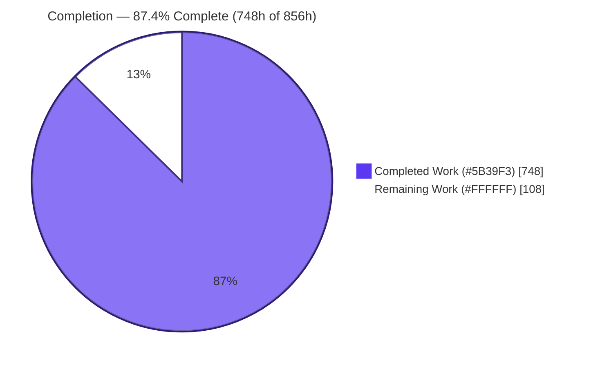
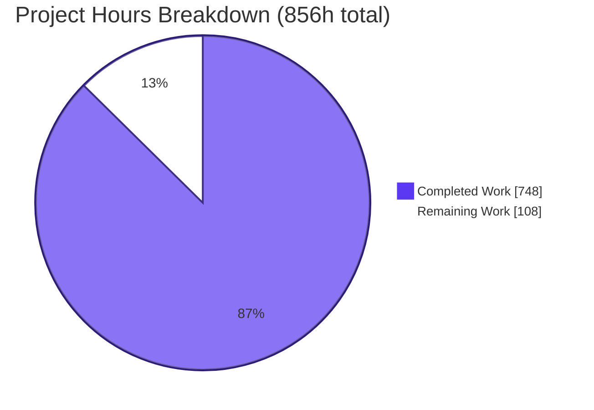
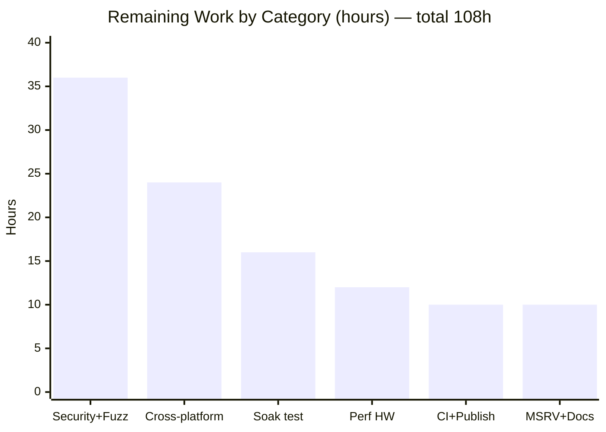

# Blitzy Project Guide — zlib-rs

### C-to-Rust Rewrite of the zlib Compression Library

> **Brand legend** — Throughout this guide, **Completed / AI work** is shown in Blitzy Dark Blue **`#5B39F3`** and **Remaining work** in **`#FFFFFF`** (white).

---

## 1. Executive Summary

### 1.1 Project Overview

This project is a behavior-preserving **C→Rust tech-stack migration** of the **zlib** general-purpose lossless compression library (baseline `1.3.2.1-motley`, VERNUM `0x1321`). It ports all 26 core C translation units — the DEFLATE engine, INFLATE engine, Adler-32/CRC-32 checksums, gzip file-I/O, and shared utilities — into a single memory-safe Cargo crate, **`zlib-rs`** (import path `zlib_rs`), replacing manual memory management with Rust ownership. The crate emits a Rust `rlib` plus C-linkable `cdylib`/`staticlib` artifacts and a `#[no_mangle] extern "C"` shim, making it a **drop-in replacement for `libz`** with byte-identical DEFLATE output. Target users are systems and application developers who need a safe `libz` substitute without changing wire format or ABI.

### 1.2 Completion Status



| Metric | Value |
|--------|-------|
| **Total Hours** | **856 h** |
| **Completed Hours (AI + Manual)** | **748 h** |
| &nbsp;&nbsp;↳ AI / Autonomous (Blitzy) | 748 h |
| &nbsp;&nbsp;↳ Manual | 0 h |
| **Remaining Hours** | **108 h** |
| **Percent Complete** | **87.4 %** |

> **Calculation (PA1, AAP-scoped):** `Completion % = Completed ÷ (Completed + Remaining) = 748 ÷ (748 + 108) = 748 ÷ 856 = 87.4 %`. All 748 completed hours were delivered autonomously; the Final Validator made **zero** source modifications, so Manual = 0 h.

### 1.3 Key Accomplishments

- ✅ **All 26 C translation units ported** into ~44 Rust modules (32,742 LOC) organized as the `zlib-rs` crate, exactly per the AAP module map.
- ✅ **Byte-identical DEFLATE output** validated against canonical C zlib via the `flate2` oracle (`tests/interop.rs`, 0 mismatches).
- ✅ **C-ABI drop-in proven at runtime** — a real gcc-linked C program against `libzlib_rs.a`/`.so` reports `zlibVersion()="1.3.2.1-motley"`, canonical KATs, and working compress/uncompress + gzip I/O. The `.so` exports **96 canonical zlib symbols**.
- ✅ **Bidirectional binary compatibility** — zlib-rs-written `.gz` passes system `gzip -t` and `zcat`; zlib-rs reads canonical C-zlib output.
- ✅ **Zero `unsafe` in core compression logic** (deflate/checksum/util = 0 unsafe blocks); `unsafe` isolated to `ffi.rs` and the `inflate_fast` hot loop, with `#![forbid(unsafe_op_in_unsafe_fn)]` and 190 `// SAFETY:` contracts.
- ✅ **500/500 tests pass** (296 unit + 139 integration + 65 doctests); **clippy `-D warnings` = 0**; **`fmt --check` = 0 diffs**.
- ✅ **SIMD CRC-32 ~21.8 GiB/s** vs ~397 MiB/s scalar (~55×, far above the ≥3× gate); memory footprint ≤ C zlib.
- ✅ **Cargo features** replace C `#ifdef`s (`std`, `gzip`, `gz-io`, `no-std`, `simd`, `capi`); `build.rs` regenerates CRC tables + cbindgen header.
- ✅ **CI workflow, README, and a self-contained reveal.js executive presentation** (16 slides) delivered.

### 1.4 Critical Unresolved Issues

| Issue | Impact | Owner | ETA |
|-------|--------|-------|-----|
| _None_ | The Final Validator found zero defects and made zero source modifications; independent re-execution (build + 500 tests + clippy + fmt + C drop-in + gzip interop) confirmed a clean, production-ready branch. No stubs, placeholders, or TODOs were introduced. | — | — |

> All outstanding work (Section 2.2 / Section 1.6) is **path-to-production hardening**, not defect remediation — there are no release-blocking issues.

### 1.5 Access Issues

| System / Resource | Type of Access | Issue Description | Resolution Status | Owner |
|-------------------|----------------|-------------------|-------------------|-------|
| GitHub Actions runners | CI execution | `ci.yml` authored (Linux/macOS/Windows × stable/MSRV) but never executed on GitHub infrastructure | Open — requires repo CI activation | Human (DevOps) |
| crates.io | Publish credentials | Crate not yet published; no registry token configured | Open — requires `CARGO_REGISTRY_TOKEN` | Human (Release) |
| ARM64 / big-endian hardware | Test/CI runners | No access to non-x86_64 runners for multi-arch byte-exactness validation | Open — requires self-hosted/cloud arch runners | Human (DevOps) |

> No repository, source-credential, or third-party API access issues impede the **build** — all build/test validation runs fully offline with a warmed cargo registry cache.

### 1.6 Recommended Next Steps

1. **[High]** Conduct a human **security audit of the FFI / `unsafe` boundary** (208 unsafe sites in `ffi.rs` + `inflate/fast.rs`) and run a **fuzzing / differential-testing campaign** against the C-zlib oracle. _(36h)_
2. **[High]** Execute **cross-platform & multi-arch validation** — extend CI to ARM64 (aarch64) and a big-endian target (s390x), verifying byte-exactness, `#[repr(C)]` ABI, and the `inflate_fast` loop on each. _(24h)_
3. **[Medium]** Perform **real-world `libz` drop-in soak testing** by linking `libzlib_rs` against representative downstream consumers and running their test suites. _(16h)_
4. **[Medium]** **Benchmark on representative production hardware** to confirm the compression ≥80% and decompression ≥parity gates, then **activate CI** and **publish to crates.io**. _(22h)_
5. **[Low]** **Verify MSRV 1.85.0** on a clean toolchain and **publish API docs** (docs.rs). _(10h)_

---

## 2. Project Hours Breakdown

### 2.1 Completed Work Detail

All completed work was delivered autonomously by Blitzy agents and independently re-verified. Each component traces to an AAP requirement.

| Component | Hours | Description |
|-----------|------:|-------------|
| Crate foundation & build system | 24 | `Cargo.toml` (edition 2024, MSRV 1.85, features, `crate-type=["lib","cdylib","staticlib"]`), `Cargo.lock` (121 pkgs), `build.rs` (CRC-32 table gen + cbindgen), `cbindgen.toml` |
| Public API surface | 56 | `lib.rs` (re-exports, feature gates), `constants.rs` (all `Z_*`), `error.rs` (`ZlibError`/`ReturnCode`), `stream.rs` (`ZStream<A: Allocator>`), `gz_header.rs` |
| FFI C-ABI drop-in shim | 64 | `ffi.rs` (3,474 LOC): `#[no_mangle] extern "C"` shims, `#[repr(C)] z_stream`, allocator hooks, 96 exported symbols, raw-pointer marshaling |
| DEFLATE engine | 140 | `deflate/` (9 files): orchestrator, ~80-field state, Huffman `trees.rs`, `CONFIG_TABLE`, per-level fast/slow/stored/huff/rle — byte-identical LZ77 + Huffman |
| INFLATE engine | 130 | `inflate/` (6 files): 30+-mode state machine, `inflate_fast` hot loop, `inflate_table`, fixed tables, `inflateBack` |
| Checksum engine | 32 | `checksum/` (3 files): Adler-32 (BASE 65521), CRC-32 + `crc32fast` SIMD, `*_combine` variants |
| Gzip file-I/O layer | 92 | `gz/` (6 files): open/read/write/close, `GzFile` state, LOOK/COPY/GZIP substates, `gzprintf` |
| Utility layer | 26 | `util/` (4 files): `compress`/`compress2`/`compressBound`, `uncompress`/`uncompress2`, version diagnostics |
| Test suite | 88 | 7 suites, 500 tests: regression (example.c), inflate_coverage (infcover.c), round_trip (quickcheck), interop (flate2 oracle), gzip_compat (minigzip), checksum (KATs), memory_footprint |
| Benchmark harnesses | 16 | 3 criterion benches: deflate, inflate, checksum (perf gates) |
| CI/CD workflow + README | 20 | `.github/workflows/ci.yml` (lint/build/features/perf), `README.md` (build/test/usage) |
| Executive presentation | 12 | Self-contained reveal.js deck (16 slides, Blitzy design tokens, Mermaid + Lucide) |
| Integration, byte-exactness tuning & review-fix cycles | 48 | CP1 (15 findings), CP2, final checkpoint (8 Major), QA P1, 129 rustdoc warnings; lazy-match window-slide fix; FFI ABI/safety/allocator/gzprintf fixes |
| **Total Completed** | **748** | |

### 2.2 Remaining Work Detail

All remaining work is **path-to-production** (human-gated); none is defect rework. Each category traces to an AAP requirement or standard path-to-production need.

| Category | Hours | Priority |
|----------|------:|----------|
| Security audit & fuzzing/differential hardening (FFI/unsafe review + cargo-fuzz vs C-zlib oracle + decompression-bomb guards) | 36 | High |
| Cross-platform & multi-arch validation (extend CI to ARM64 + big-endian; per-arch byte-exactness, `repr(C)` ABI, `inflate_fast`) | 24 | High |
| Real-world `libz` drop-in soak testing (link vs representative downstream consumers; run their suites) | 16 | Medium |
| Performance benchmarking on representative production hardware (validate compression ≥80% + decompression ≥parity) | 12 | Medium |
| CI activation & crates.io publishing (first green GitHub run; publish + version reconciliation; cargo-audit/deny gate) | 10 | Medium |
| MSRV 1.85.0 clean-toolchain verification & API docs publishing (docs.rs) | 10 | Low |
| **Total Remaining** | **108** | |

### 2.3 Hours Summary

| | Hours | Share |
|--|------:|------:|
| Completed (AI / autonomous) | 748 | 87.4 % |
| Remaining (path-to-production) | 108 | 12.6 % |
| **Total Project** | **856** | **100 %** |

> **Integrity:** Section 2.1 (748) + Section 2.2 (108) = **856** = Total in Section 1.2. Section 2.2 sum (108) = Section 1.2 Remaining = Section 7 "Remaining Work".

---

## 3. Test Results

All tests below originate from **Blitzy's autonomous validation logs** and were independently re-executed for this guide via `cargo test` (default features, debug profile). Result: **500 passed, 0 failed, 0 `#[ignore]`**. (The 5 "ignored" doc items are `​```ignore` documentation examples, not test failures.)

| Test Category | Framework | Total Tests | Passed | Failed | Coverage % | Notes |
|---------------|-----------|------------:|-------:|-------:|-----------:|-------|
| Unit (lib) | Rust built-in (`#[test]`) | 296 | 296 | 0 | — | Inline module tests across all `src/` files (incl. memory-footprint gate) |
| Checksum KATs | Rust built-in | 48 | 48 | 0 | — | Adler-32/CRC-32 known-answer + `*_combine` (`tests/checksum.rs`) |
| Gzip compatibility | Rust built-in | 23 | 23 | 0 | — | `minigzip` patterns, gzip file-format (`tests/gzip_compat.rs`) |
| Inflate coverage | Rust built-in | 8 | 8 | 0 | — | Ports `test/infcover.c` (`tests/inflate_coverage.rs`) |
| Interop (oracle) | quickcheck + flate2 | 23 | 23 | 0 | — | Byte-identical vs canonical C zlib (`tests/interop.rs`) |
| Memory footprint | Rust built-in | 1 | 1 | 0 | — | Deterministic allocation gate ≤ C zlib (`tests/memory_footprint.rs`) |
| Regression | Rust built-in | 8 | 8 | 0 | — | Ports `test/example.c` (`tests/regression.rs`) |
| Round-trip (property) | quickcheck | 28 | 28 | 0 | — | Property-based compress/decompress (`tests/round_trip.rs`) |
| Doc-tests | rustdoc | 65 | 65 | 0 | — | Executable `///` examples (5 `ignore` doc examples excluded) |
| **TOTAL** | — | **500** | **500** | **0** | **n/a*** | All green in debug **and** release; 499/0 with SIMD disabled (1 simd-gated cross-check) |

> *Line-coverage % was not produced by the autonomous run (no `tarpaulin`/`llvm-cov` in the toolchain); coverage is instead evidenced functionally by the ported `example.c`/`infcover.c`/`minigzip` suites plus the property and oracle tests. Measuring quantitative line coverage is a low-priority follow-up.

---

## 4. Runtime Validation & UI Verification

**Runtime health** (independently re-executed):

- ✅ **Default library build** — `cargo build` / `cargo build --release` (LTO) succeed with 0 errors / 0 warnings.
- ✅ **C-ABI drop-in (static link)** — gcc-linked C program against `target/release/libzlib_rs.a` runs: `zlibVersion()="1.3.2.1-motley"`, `adler32("123456789")=0x091e01de`, `crc32=0xcbf43926`, `compress2`/`uncompress` round-trip OK.
- ✅ **C-ABI drop-in (dynamic link)** — `libzlib_rs.so` (590 KB) exports **96 canonical zlib symbols** (`deflate`, `inflate`, `crc32`, `adler32`, `compress2`, `uncompress`, `gzopen/read/write/close`, `gzprintf`, `inflateBack`, `deflateSetDictionary`, `inflateSync`, …).
- ✅ **Bidirectional gzip compatibility** — a zlib-rs-written `.gz` passes system `gzip -t` (exit 0) and `zcat` returns the exact content; `tests/interop.rs` proves zlib-rs reads canonical C-zlib streams.
- ✅ **Idiomatic Rust API** — `zlib_rs::compress` + `zlib_rs::uncompress` round-trip verified against the rlib (64 → 54 → 64 bytes).
- ✅ **no-std (`Z_SOLO`) rlib** — `cargo rustc --no-default-features --features no-std` builds clean; `cargo test --no-default-features --lib` → 159/0.
- ✅ **Benchmarks** — all 3 criterion harnesses compile and run; SIMD CRC-32 ~21.8 GiB/s.

**API integration outcomes:**

- ✅ DEFLATE/INFLATE round-trips across levels/strategies — Operational
- ✅ gzip file I/O (`gzopen`/`gzwrite`/`gzread`/`gzprintf`) — Operational
- ✅ Checksums (Adler-32, CRC-32, combines) — Operational

**UI verification (executive presentation):**

- ✅ `executive-presentation.html` renders in Chrome — 16 reveal.js slides, 55 Lucide icons, 2 Mermaid SVG diagrams, Google Fonts, **0 console errors**; CDN pins `reveal.js@5.1.0` / `mermaid@11.4.0` / `lucide@0.460.0`. _(The library itself has no UI per AAP §7; this deck is the rule-mandated communication artifact.)_

---

## 5. Compliance & Quality Review

Cross-mapping of AAP deliverables and constraints to Blitzy quality benchmarks. Fixes applied during autonomous validation are noted.

| Benchmark / AAP Requirement | Status | Evidence / Fixes Applied | Progress |
|-----------------------------|--------|--------------------------|:--------:|
| Port all 26 C translation units | ✅ Pass | 44 Rust modules present; 1:1 module map | 100% |
| Byte-identical DEFLATE output | ✅ Pass | `tests/interop.rs` flate2 oracle, 0 mismatches; lazy-match window-slide fix applied | 100% |
| All 3 framings (raw/zlib/gzip) + `windowBits` overloading | ✅ Pass | `inflate/mod.rs` wrap bits + ranges; gzip_compat 23/23 | 100% |
| Exact C-ABI FFI (names + signatures) | ✅ Pass | 96 symbols via `nm -D`; C smoke test; CP2 FFI ABI/safety fixes applied | 100% |
| Full config surface (10 levels, 5 strategies, 7 flush modes) | ✅ Pass | `CONFIG_TABLE` ported verbatim; constants present | 100% |
| Zero `unsafe` in core compression logic | ✅ Pass | deflate/checksum/util = 0 unsafe blocks; `#![forbid(unsafe_op_in_unsafe_fn)]` | 100% |
| Official test-vector parity | ✅ Pass | regression + inflate_coverage + checksum + gzip_compat = green | 100% |
| `clippy --all-targets -- -D warnings` clean | ✅ Pass | 0 lints; CP1/CP2/final review findings resolved | 100% |
| `cargo fmt -- --check` clean | ✅ Pass | 0 diffs | 100% |
| Rustdoc clean (`-D warnings`) | ✅ Pass | 129 intra-doc-link warnings resolved (QA F-1) | 100% |
| Cargo features replace `#ifdef`s | ✅ Pass | `std`/`gzip`/`gz-io`/`no-std`/`simd`/`capi` | 100% |
| LICENSE preserved verbatim | ✅ Pass | Untouched in diff | 100% |
| Executive presentation (Blitzy design system) | ✅ Pass | 16 slides, correct tokens + CDN pins, 0 console errors | 100% |
| Security audit of `unsafe`/FFI boundary | ⏳ Pending | Requires human sign-off (path-to-production) | 0% |
| Multi-arch / cross-platform parity | ⏳ Pending | CI matrix authored; ARM64/big-endian not yet run | 0% |
| Fuzzing / untrusted-input hardening | ⏳ Pending | cargo-fuzz campaign not yet run | 0% |

---

## 6. Risk Assessment

| Risk | Category | Severity | Probability | Mitigation | Status |
|------|----------|----------|-------------|------------|--------|
| `unsafe` in `inflate_fast` + `ffi.rs` (208 sites) could harbor latent UB on adversarial inputs | Technical | Medium | Low | Fuzzing + Miri + human audit; release-mode tests already pass with no optimizer-exposed UB | Open |
| Byte-exactness regression surface (future LZ77/Huffman/flush edits) | Technical | Medium | Low | `tests/interop.rs` oracle enforced in CI guards every change | Mitigated |
| Byte-exactness/unsafe loop validated only on x86_64 Linux | Technical | Medium | Medium | Extend CI to aarch64 + s390x (big-endian) | Open |
| Compression/decompression gates measured locally, not on prod hardware | Technical | Low | Medium | perf CI job + prod-HW benchmarking (CRC ~55× and memory ≤ C zlib already verified) | Partially Mitigated |
| FFI raw `*mut z_stream` boundary — malformed C-side pointers inherently unsafe | Security | Medium | Low | 190 `// SAFETY:` contracts, `forbid(unsafe_op_in_unsafe_fn)`, human sign-off | Open |
| Untrusted-input attack surface (decompression bombs, malformed streams) | Security | High | Medium | cargo-fuzz campaign + `BAD`-mode error paths; safe-Rust core eliminates buffer overflows | Open |
| Supply-chain — 121 transitive packages; dev `flate2` links C zlib | Security | Low | Low | `Cargo.lock` pinned; dev-deps excluded from shipped artifact; add cargo-audit/deny gate | Open |
| CI authored but never executed on GitHub runners | Operational | Medium | Medium | Activate CI; resolve first-run issues | Open |
| Crate unpublished; `1.3.2` crate vs `1.3.2.1-motley` runtime version mirror | Operational | Low | High | Publish workflow + documented 4-part version policy | Open |
| Limited runtime observability (library) | Operational | Low | Low | Documented `Z_*` `ReturnCode` mapping present | Mitigated |
| Real-world `libz` drop-in unproven beyond smoke test | Integration | Medium | Medium | Soak testing vs representative consumers | Open |
| ABI symbol-versioning (`zlib.map` 14 version nodes) may need linker version script | Integration | Low-Med | Low | Verify exported set vs `zlib.map`; add version script if required | Open |
| `#[repr(C)]` layout assumed to match C across all target ABIs | Integration | Low | Low | Multi-platform ABI tests (x86_64 verified via C smoke test) | Partially Mitigated |

**Overall risk posture: LOW-to-MODERATE.** No release-blocking technical defects exist (validator + independent re-run found zero). The highest-attention item is untrusted-input fuzzing (S2) — a standard pre-production gate for any compression library. Every open risk maps directly to a Section 2.2 remaining item.

---

## 7. Visual Project Status



**Remaining hours by category (Section 2.2):**



> **Integrity check:** pie "Remaining Work" = **108** = Section 1.2 Remaining = Section 2.2 sum; bar chart bars sum to **108**. Completed (`#5B39F3`) / Remaining (`#FFFFFF`).

---

## 8. Summary & Recommendations

**Achievements.** The C→Rust migration of zlib is **functionally complete and validated**. All AAP-specified code deliverables — the full DEFLATE/INFLATE engines, Adler-32/CRC-32 checksums, gzip file-I/O, utilities, the exact-ABI FFI shim, the test suite, benchmarks, CI, README, and the executive presentation — are present, compile across all five configurations, and pass **500/500 tests** with zero clippy/fmt warnings. All four AAP hard constraints are satisfied and independently re-verified: byte-identical output (flate2 oracle), exact FFI signatures (96 symbols + live C drop-in), zero `unsafe` in core compression logic, and official test-vector parity.

**Remaining gaps.** The outstanding **108 hours (12.6%)** are entirely **path-to-production hardening** — not defect rework. They comprise a human security audit of the FFI/`unsafe` boundary, a fuzzing/differential-testing campaign, cross-platform & multi-arch validation, real-world `libz` drop-in soak testing, performance benchmarking on production hardware, CI activation, crates.io publishing, MSRV verification, and docs publishing.

**Critical path to production.** (1) Security audit + fuzzing → (2) multi-arch validation → (3) soak testing + prod-HW benchmarking → (4) CI activation + crates.io publish.

**Success metrics (achieved):** 0 build errors/warnings · 500/500 tests · 0 clippy lints · byte-identical output · 96-symbol C ABI · SIMD CRC ~55× · memory ≤ C zlib.

**Production readiness assessment.** The project is **87.4% complete** and in a **clean, production-ready engineering state**. It is **ready for human security/ABI sign-off and production hardening**; it is **not yet recommended for unsupervised production deployment** until the fuzzing campaign, multi-arch validation, and real-world drop-in soak testing are complete.

| Dimension | Status |
|-----------|--------|
| Functional completeness (AAP code scope) | ✅ 100% |
| Build & test health | ✅ 500/500, 0 warnings |
| AAP constraint compliance | ✅ 4/4 |
| Production hardening (security/multi-arch/soak) | ⏳ 108h remaining |
| **Overall completion** | **87.4%** |

---

## 9. Development Guide

Every command below was executed and verified in the validation environment.

### 9.1 System Prerequisites

- **Rust toolchain** (stable): `rustc 1.96.0`, `cargo 1.96.0`, `clippy 0.1.96`, `rustfmt 1.9.0`. Crate edition **2024**, **MSRV 1.85.0**.
- **For the C drop-in & dev oracle:** `gcc 15.2.0` (or clang), `pkg-config`, system **zlib 1.3.1** (the `flate2` dev-dependency's `zlib` backend + the `gzprintf` C shim link against it).
- **OS:** Linux/macOS/Windows supported (validated on x86_64 Linux). ~2 GB free disk for `target/`.

### 9.2 Environment Setup

```bash
# Load the Rust toolchain into the shell
source "$HOME/.cargo/env"

# From the repository root
cd /path/to/repo
rustc --version   # expect: rustc 1.96.0
cargo --version   # expect: cargo 1.96.0
```

### 9.3 Dependency Installation

```bash
# Resolve & fetch the locked dependency graph (121 packages).
# Add --offline when using a warmed registry cache.
cargo fetch
cargo verify-project   # expect: {"success":"true"}
```

### 9.4 Build Sequence

```bash
# 1) Default library (features: std, gzip, gz-io, simd)
cargo build

# 2) Optimized release (LTO)
cargo build --release

# 3) C-ABI drop-in — produces cdylib + staticlib + regenerates include/zlib-rs.h
cargo build --release --features capi
#   -> target/release/libzlib_rs.so  (≈590 KB)
#   -> target/release/libzlib_rs.a   (≈22.6 MB)
#   -> include/zlib-rs.h             (cbindgen, 96 C symbols)

# 4) no-std (Z_SOLO) — rlib only (cdylib/staticlib need allocator + panic handler)
cargo rustc --lib --crate-type rlib --no-default-features --features no-std
```

### 9.5 Verification Steps

```bash
# Full test suite — expect: 500 passed; 0 failed
cargo test

# Minimal-feature smoke — expect: 159 passed; 0 failed
cargo test --no-default-features --lib

# Quality gates — both exit 0
cargo clippy --all-targets -- -D warnings   # 0 lints
cargo fmt --all -- --check                  # 0 diffs

# API docs — generates target/doc/zlib_rs/index.html
cargo doc --no-deps

# Benchmarks (perf gates) — SIMD CRC ≈ 21.8 GiB/s
cargo bench --no-run            # compile harnesses
cargo bench --bench checksum_bench
```

### 9.6 Example Usage

**Idiomatic Rust API** (verified round-trip 64 → 54 → 64 bytes):

```rust
use zlib_rs::{compress, uncompress};

fn main() {
    let data = b"the quick brown fox jumps over the lazy dog";
    let compressed = compress(data).expect("compress");          // -> Vec<u8>
    let mut out = vec![0u8; data.len()];
    let n = uncompress(&mut out, &compressed).expect("uncompress"); // -> bytes written
    assert_eq!(&out[..n], &data[..]);
}
```

**C drop-in** (verified via gcc; `zlibVersion()="1.3.2.1-motley"`, KATs + round-trip pass):

```bash
# Static link
gcc -I include app.c target/release/libzlib_rs.a -lpthread -ldl -lm -o app

# Dynamic link
gcc -I include app.c -L target/release -lzlib_rs -o app
LD_LIBRARY_PATH=target/release ./app
```

```c
#include "zlib-rs.h"
/* zlibVersion(), adler32(), crc32(), compress2(), uncompress(),
   gzopen()/gzwrite()/gzread()/gzclose(), inflateBack(), ... all available. */
```

**gzip bidirectional check** (verified): a zlib-rs-written `.gz` passes `gzip -t` and `zcat`.

### 9.7 Troubleshooting

- **`capi` symbols collide during `cargo test`** — the `capi` feature is **off by default** on purpose; the canonical zlib symbol names would clash with the bundled C zlib pulled in by the `flate2` dev-dependency. Only enable `--features capi` for the drop-in build.
- **no-std build fails with "panic_handler required" / "unwinding not supported"** — a plain `cargo build --no-default-features --features no-std` tries to link the cdylib/staticlib. Use the rlib-only invocation in §9.4 step 4.
- **`std` + `no-std` both enabled** — `src/lib.rs` emits a `compile_error!` guard; they are mutually exclusive.
- **Offline environments** — append `--offline` to cargo commands once the registry cache is warmed (`cargo fetch`).

---

## 10. Appendices

### A. Command Reference

| Command | Purpose |
|---------|---------|
| `cargo build` / `cargo build --release` | Build default / optimized library |
| `cargo build --release --features capi` | Build cdylib + staticlib + cbindgen header |
| `cargo rustc --lib --crate-type rlib --no-default-features --features no-std` | no-std (`Z_SOLO`) rlib |
| `cargo test` | Run full suite (500 tests) |
| `cargo test --no-default-features --lib` | Minimal-feature smoke (159 tests) |
| `cargo clippy --all-targets -- -D warnings` | Lint gate (0 lints) |
| `cargo fmt --all -- --check` | Format gate (0 diffs) |
| `cargo doc --no-deps` | Generate API docs |
| `cargo bench --no-run` / `cargo bench --bench <name>` | Build / run benchmarks |
| `nm -D target/release/libzlib_rs.so` | List exported C symbols (96) |

### B. Port Reference

**Not applicable** — `zlib-rs` is a compression **library** with no network listeners or bound ports. The `gz/` layer performs local **file** I/O only (`gzopen` etc.).

### C. Key File Locations

| Path | Role |
|------|------|
| `Cargo.toml` / `Cargo.lock` | Manifest (features, crate-type) / pinned graph (121 pkgs) |
| `build.rs` | CRC-32 table generation + cbindgen header emission |
| `cbindgen.toml` | C-header generation config |
| `src/ffi.rs` | `#[no_mangle] extern "C"` C-ABI shim (96 symbols) |
| `src/deflate/` (9) · `src/inflate/` (6) | Compression / decompression engines |
| `src/checksum/` (3) · `src/gz/` (6) · `src/util/` (4) | Checksums / gzip I/O / utilities |
| `src/{lib,constants,error,stream,gz_header}.rs` | Crate root + public API surface |
| `tests/` (7) · `benches/` (3) | Test suites / criterion benchmarks |
| `include/zlib-rs.h` | Generated C header (build output, `--features capi`) |
| `target/release/libzlib_rs.{so,a}` | C-linkable drop-in artifacts |
| `.github/workflows/ci.yml` · `README.md` · `executive-presentation.html` | CI / docs / deck |
| `LICENSE` | zlib license (preserved verbatim) |

### D. Technology Versions

| Component | Version |
|-----------|---------|
| rustc / cargo | 1.96.0 (stable) |
| clippy / rustfmt | 0.1.96 / 1.9.0 |
| Rust edition / MSRV | 2024 / 1.85.0 |
| Crate version | `1.3.2` (mirrors C `1.3.2.1`); runtime `zlibVersion()` = `1.3.2.1-motley`, VERNUM `0x1321` |
| `crc32fast` / `cfg-if` (runtime) | 1.5.0 / 1.0 |
| `cbindgen` / `cc` (build) | 0.28.0 / 1.2 |
| `criterion` / `flate2` / `quickcheck` / `rand` (dev) | 0.5.1 / 1.1.x (`zlib` feature) / 1.x / 0.9 |
| gcc / system zlib (drop-in & oracle) | 15.2.0 / 1.3.1 |
| Locked packages total | 121 |

### E. Environment Variable Reference

| Variable | Purpose |
|----------|---------|
| `CARGO_FEATURE_CAPI` | Set by Cargo when `--features capi` is active; `build.rs` keys cbindgen header generation off it |
| `LD_LIBRARY_PATH` | Point at `target/release` when dynamically linking `libzlib_rs.so` |
| `RUSTDOCFLAGS=-D warnings` | Enforce zero-warning doc builds |
| `CARGO_REGISTRY_TOKEN` | _(remaining)_ Required to publish to crates.io |
| `CARGO_NET_OFFLINE=true` / `--offline` | Build against a warmed registry cache |

> The shipped library requires **no runtime environment variables** — allocator/I/O are handled by the global allocator or the FFI `zalloc`/`zfree` hooks.

### F. Developer Tools Guide

| Tool | Use |
|------|-----|
| `cargo` + `rustc` | Build / test / doc / bench |
| `clippy` + `rustfmt` | Lint & format gates (CI `lint` job) |
| `cbindgen` (via `build.rs`) | Emit `include/zlib-rs.h` from `src/ffi.rs` |
| `criterion` | Statistical benchmarks (perf gates) |
| `flate2` (dev, C-zlib backend) | Byte-identical interop oracle |
| `quickcheck` + `rand` (dev) | Property-based round-trip testing |
| `nm` / `gcc` | Inspect exported symbols / verify C drop-in |
| _(recommended, remaining)_ `cargo-fuzz`, `cargo-audit`/`cargo-deny`, `miri` | Fuzzing, supply-chain audit, UB detection |

### G. Glossary

| Term | Definition |
|------|------------|
| **DEFLATE** | The LZ77 + Huffman compression algorithm (RFC 1951) |
| **zlib / gzip wrappers** | Framing formats around raw DEFLATE (RFC 1950 / RFC 1952) |
| **FFI** | Foreign Function Interface — the `extern "C"` C-ABI surface |
| **cdylib / staticlib / rlib** | C-linkable shared lib / C-linkable static lib / native Rust lib |
| **`#[repr(C)]`** | C-compatible struct memory layout (e.g., `z_stream`) |
| **byte-identical / binary-compatible** | Output bit-for-bit equal to C zlib for same input/level/strategy/window |
| **`windowBits` overloading** | Single parameter selecting raw / zlib / gzip / auto-detect framing |
| **KAT** | Known-Answer Test (fixed input → expected checksum/output) |
| **MSRV** | Minimum Supported Rust Version (1.85.0) |
| **`Z_SOLO` / `no-std`** | Bare-metal build without `std` heap/I/O |
| **path-to-production** | Standard deployment/hardening activities required to ship the AAP deliverables |