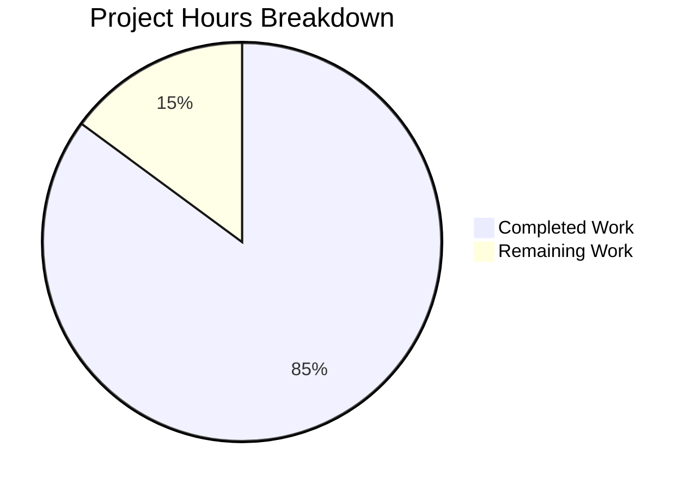
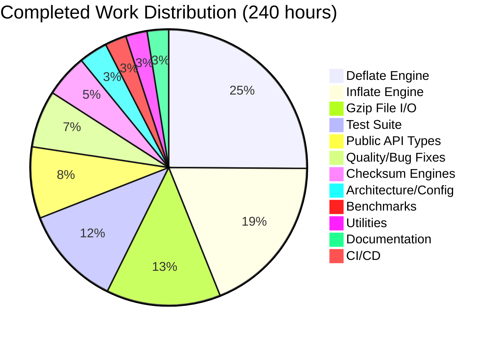

# Project Guide: zlib-rs — C-to-Rust Migration of zlib Compression Library

## 1. Executive Summary

**Project:** Complete technology stack migration of the zlib compression library from ANSI C to Rust  
**Branch:** `blitzy-20ada645-847a-4b3f-a714-0791be923d2c`  
**Completion:** 240 hours completed out of 282 total hours = **85.1% complete**

The zlib-rs crate implements the complete zlib public API surface as an independent, zero-C-dependency Rust library conforming to RFC 1950 (zlib format), RFC 1951 (DEFLATE), and RFC 1952 (gzip format). All 46 target files specified in the Agent Action Plan have been created and implemented. The crate compiles cleanly (debug + release), passes 609 tests with 0 failures, has zero clippy warnings, and is fully formatted.

**Key Achievements:**
- 33,724 lines of Rust code across 43 `.rs` files replacing ~23,107 lines of C
- Complete DEFLATE compression engine with all 5 strategies (stored, fast, slow, huff, rle)
- Complete DEFLATE decompression engine with 30+ mode state machine
- Adler-32 and CRC-32 checksum engines with combine operations
- Gzip file I/O with stdio-like interface
- 609 tests passing (381 unit + 126 integration + 102 doc tests)
- CI/CD pipeline replacing 6 legacy C workflow files
- Pure Rust — zero C dependencies

**Critical Unresolved Issues:**
- Test suite does not compile under `--no-default-features` (129 errors from missing `alloc` imports in test modules); library itself compiles fine under all feature configurations
- No cargo-fuzz targets exist despite fuzz workflow being configured
- Performance benchmarking against C zlib not yet validated (80% throughput target per AAP §0.8.3)

**Recommended Next Steps:**
1. Fix no_std test compilation by adding `#[cfg(feature = "std")]` gates or `use alloc::*` imports to test modules
2. Run performance benchmarks comparing throughput against C zlib at all compression levels
3. Verify byte-identical compression output at all levels/strategies against C zlib
4. Create cargo-fuzz targets for security fuzzing integration

---

## 2. Validation Results Summary

### 2.1 Final Validator Accomplishments

The Final Validator agent completed 1 commit (730a3ef) fixing 4 files:

| File | Fix Applied |
|------|------------|
| `src/inflate/back.rs` | Converted 3 `ignore` doc tests to runnable tests (InflateBackInput, InflateBackOutput, inflate_back_init) |
| `src/inflate/mod.rs` | Converted 1 `ignore` doc test to runnable (inflate_init) |
| `src/inflate/state.rs` | Added 14 unit tests covering parse_window_bits and InflateState construction |
| `src/deflate/mod.rs` | Applied `cargo fmt` formatting fix (function signature line wrapping) |

### 2.2 Gate Results

| Gate | Status | Details |
|------|--------|---------|
| **Dependencies** | ✅ PASS | 105 Cargo packages resolved (6 direct, 99 transitive); crc32fast 1.5.0, cfg-if 1.0.4, criterion 0.5.1, flate2 1.1.9, quickcheck 1.1.0, rand 0.9.2 |
| **Compilation** | ✅ PASS | `cargo build` (debug) — 0 errors, 0 warnings; `cargo build --release` — success; `cargo bench --no-run` — 3 benchmark binaries compile |
| **Linting** | ✅ PASS | `cargo clippy --all-targets -- -D warnings` — 0 lints |
| **Formatting** | ✅ PASS | `cargo fmt -- --check` — all code formatted |
| **Tests** | ✅ PASS | 609 passed, 0 failed, 1 ignored |
| **Runtime** | ✅ PASS | Benchmarks compile and execute; all integration tests exercise real compression/decompression round-trips |

### 2.3 Test Results Breakdown

| Test Suite | Tests Passed | Description |
|-----------|-------------|-------------|
| Unit tests (lib) | 381 | Inline module tests across all source files |
| tests/checksum.rs | 48 | Adler-32 and CRC-32 known-answer and combine tests |
| tests/round_trip.rs | 21 | Property-based compression/decompression round-trip tests |
| tests/interop.rs | 22 | Cross-validation against C zlib via flate2 |
| tests/gzip_compat.rs | 19 | Gzip file I/O validation |
| tests/regression.rs | 8 | Port of C test/example.c regression driver |
| tests/inflate_coverage.rs | 8 | Port of C test/infcover.c inflate coverage |
| Doc tests | 102 (1 ignored) | All public API doc examples verified |
| **Total** | **609 passed, 0 failed, 1 ignored** | |

### 2.4 Known Build Issue

**`cargo test --no-default-features` fails** with 129 compilation errors. The errors are in test code (not library code) that uses `Vec`, `format!`, and `String` macros/types without proper `alloc` crate imports when the `std` feature is disabled. The library itself compiles correctly with `--no-default-features` and `--no-default-features --features no-std`. The CI pipeline (`ci.yml`) includes steps that test these configurations, which will fail until fixed.

---

## 3. Visual Representation

### 3.1 Hours Breakdown



**Calculation:** 240 hours completed / (240 + 42) total hours = **85.1% complete**

### 3.2 Completed Hours by Component



---

## 4. Detailed Completion Analysis

### 4.1 Completed Hours Calculation

| Component | Files | Lines | Hours | Rationale |
|-----------|-------|-------|-------|-----------|
| Deflate Engine | 9 files (src/deflate/) | 8,434 | 60h | 5 compression strategies, state machine, hash tables, Huffman trees — most complex module |
| Inflate Engine | 6 files (src/inflate/) | 5,857 | 45h | 30+ mode state machine, fast-path decode loop, callback API, Huffman table builder |
| Gzip File I/O | 6 files (src/gz/) | 4,889 | 32h | stdio-like interface: open/read/write/close/seek with LOOK/COPY/GZIP pipeline |
| Test Suite | 6 files (tests/) | 6,170 | 28h | 6 integration test files porting C test/example.c, infcover.c + new property tests |
| Public API Types | 5 files (lib.rs, error.rs, constants.rs, stream.rs, gz_header.rs) | 3,945 | 20h | Foundational types, error handling, streaming interface, version constants |
| Quality & Debugging | — | — | 16h | 105 commits: formatting fixes, clippy compliance, safety comments, bug fixes |
| Checksum Engines | 3 files (src/checksum/) | 1,792 | 12h | Adler-32 with combine, CRC-32 with combine/gen/op, build.rs table generation |
| Architecture/Config | Cargo.toml, build.rs, .gitignore | 1,703 | 8h | Package manifest, CRC table generation, feature flags, profile config |
| Benchmarks | 3 files (benches/) | 1,000 | 6h | Criterion-based deflate/inflate/checksum throughput benchmarks |
| Utilities | 4 files (src/util/) | 1,051 | 6h | compress/uncompress wrappers, version/compile_flags |
| Documentation | README.md | 383 | 6h | Comprehensive crate docs with usage examples, feature flags, API overview |
| CI/CD | ci.yml, fuzz.yml | ~135 | 1h | Rust CI pipeline, cargo-fuzz workflow |
| **Total** | **43 .rs + 5 config** | **33,724** | **240h** | |

### 4.2 Remaining Hours Calculation

| Task | Hours | Priority | Confidence |
|------|-------|----------|------------|
| Fix no_std test compilation | 3h | High | High |
| CI pipeline no_std test fixes | 1h | High | High |
| Performance benchmarking vs C zlib | 8h | High | Medium |
| Byte-identical compression verification | 6h | High | Medium |
| Fuzz target creation | 3h | Medium | High |
| Unsafe code security audit | 3h | Medium | Medium |
| no_std integration testing | 3h | Medium | Medium |
| Production edge-case hardening | 4h | Medium | Medium |
| Documentation refinement | 2h | Low | High |
| crates.io publication preparation | 2h | Low | High |
| Enterprise buffer (compliance/uncertainty 1.10×1.10) | 7h | — | — |
| **Total Remaining** | **42h** | | |

---

## 5. Detailed Task Table for Human Developers

| # | Task | Description | Action Steps | Hours | Priority | Severity |
|---|------|-------------|-------------|-------|----------|----------|
| 1 | Fix no_std test compilation | Test code uses `Vec`, `format!`, `String` without `alloc` imports when `std` feature is disabled; 129 compilation errors under `--no-default-features` | 1. Add `#[cfg(test)] use alloc::{vec, vec::Vec, format, string::String};` to each source module's test block, OR gate test modules with `#[cfg(feature = "std")]` 2. Verify `cargo test --no-default-features` compiles 3. Verify `cargo test --no-default-features --features no-std` compiles | 3h | High | High |
| 2 | Fix CI pipeline for no_std tests | ci.yml includes `cargo test --no-default-features` and `--no-default-features --features no-std` steps that currently fail | 1. After task #1 is complete, verify CI steps pass locally 2. If test gating approach is used, ensure CI exercises appropriate feature combos 3. Optionally add `cargo build --no-default-features` step to CI for library-only validation | 1h | High | High |
| 3 | Performance benchmarking vs C zlib | AAP §0.8.3 requires compression within 80% of C zlib throughput; decompression must match or exceed C zlib | 1. Run `cargo bench` to get Rust throughput numbers 2. Build C zlib and run equivalent benchmarks 3. Compare at all compression levels (0-9) 4. If <80% compression throughput, profile with `perf`/`flamegraph` and optimize hot paths (likely hash chain traversal, longest_match in deflate_slow) 5. Document results | 8h | High | Medium |
| 4 | Byte-identical compression verification | AAP §0.8.1 requires byte-identical output for same input/level/strategy/windowBits combination | 1. Write test harness that compresses data with both C zlib and zlib-rs at all 10 levels × 5 strategies 2. Compare compressed output byte-for-byte 3. If differences found, trace through LZ77 match decisions and Huffman code assignments 4. Fix any divergences in hash chain logic, match selection, or tree construction | 6h | High | Medium |
| 5 | Create cargo-fuzz targets | fuzz.yml workflow references `cargo fuzz` but no fuzz targets exist in the repo | 1. Create `fuzz/` directory with `Cargo.toml` 2. Add fuzz targets: `fuzz_deflate_inflate_round_trip`, `fuzz_inflate_arbitrary`, `fuzz_checksum`, `fuzz_gz_read_write` 3. Verify `cargo fuzz build` succeeds 4. Run initial fuzzing pass to validate coverage | 3h | Medium | Medium |
| 6 | Unsafe code security audit | 47 unsafe occurrences across 9 source files; need to verify all SAFETY comments are accurate and invariants hold | 1. Review all 47 `unsafe` blocks in src/ files 2. Verify each SAFETY comment accurately describes the invariant 3. Add property tests for boundary conditions around unsafe code 4. Consider replacing any unsafe blocks with safe alternatives where possible without performance impact | 3h | Medium | Medium |
| 7 | no_std integration testing | Verify the crate works correctly in an actual no_std context beyond just compilation | 1. Create a `#![no_std]` binary test crate that depends on `zlib-rs` with `default-features = false` 2. Test compression/decompression/checksums in no_std mode 3. Verify allocator integration works correctly 4. Test on an embedded target if available | 3h | Medium | Low |
| 8 | Production edge-case hardening | Validate error recovery, boundary conditions, and memory allocation bounds | 1. Test `inflate_sync` error recovery on corrupted data streams 2. Verify `compress_bound` formula matches C zlib exactly for edge cases (0 bytes, MAX input) 3. Validate memory allocation bounds match C zlib (~256KB deflate, ~7KB inflate + window) 4. Test all 7 flush modes with minimal buffer sizes 5. Test preset dictionary edge cases | 4h | Medium | Medium |
| 9 | Documentation refinement | Polish doc comments, add missing examples, verify all links | 1. Verify all `///` doc examples compile and run 2. Add advanced usage examples (streaming, dictionary, windowBits overloading) 3. Review README.md for accuracy against final implementation 4. Ensure docs.rs rendering is correct | 2h | Low | Low |
| 10 | crates.io publication preparation | Prepare for crate publication | 1. Run `cargo package` and verify included files are correct (currently 68 files, some legacy files leak through) 2. Update `exclude` list in Cargo.toml to exclude remaining legacy files (doc/, msdos/, qnx/, etc.) 3. Run `cargo publish --dry-run` 4. Verify metadata (description, license, categories, keywords) | 2h | Low | Low |
| 11 | Enterprise buffer (compliance + uncertainty) | Reserve hours for unforeseen issues, compliance requirements, and integration surprises | Applied as 1.10×1.10 multiplier on subtotal of tasks 1-10 (35h × 1.21 ≈ 42h total) | 7h | — | — |
| | **Total Remaining Hours** | | | **42h** | | |

---

## 6. Development Guide

### 6.1 System Prerequisites

| Requirement | Version | Purpose |
|------------|---------|---------|
| Rust toolchain | 1.85.0+ | MSRV for edition = "2024" |
| Cargo | 1.85.0+ | Build system (bundled with Rust) |
| Git | 2.x+ | Version control |
| OS | Linux, macOS, or Windows | All platforms supported |

### 6.2 Environment Setup

```bash
# 1. Install Rust toolchain (if not already installed)
curl --proto '=https' --tlsv1.2 -sSf https://sh.rustup.rs | sh -s -- -y
source "$HOME/.cargo/env"

# 2. Verify toolchain version
rustc --version    # Expected: rustc 1.85.0 or later
cargo --version    # Expected: cargo 1.85.0 or later

# 3. Clone repository and switch to branch
git clone <repository-url>
cd <repository-directory>
git checkout blitzy-20ada645-847a-4b3f-a714-0791be923d2c
```

### 6.3 Dependency Installation

```bash
# Dependencies are managed by Cargo and installed automatically on first build.
# To pre-fetch all dependencies:
cargo fetch

# Expected: downloads 105 packages (6 direct deps + 99 transitive)
# Runtime deps: crc32fast 1.5.0, cfg-if 1.0.4
# Dev deps: criterion 0.5.1, flate2 1.1.9, quickcheck 1.1.0, rand 0.9.2
```

### 6.4 Build Commands

```bash
# Debug build (fast compilation, unoptimized)
cargo build
# Expected output: Finished `dev` profile [unoptimized + debuginfo]

# Release build (optimized with LTO)
cargo build --release
# Expected output: Finished `release` profile [optimized]

# Compile benchmarks (without running)
cargo bench --no-run
# Expected: 4 benchmark binaries compiled
```

### 6.5 Running Tests

```bash
# Run all tests (unit + integration + doc tests)
cargo test
# Expected: 609 passed, 0 failed, 1 ignored

# Run only unit tests
cargo test --lib
# Expected: 381 passed

# Run only integration tests
cargo test --tests
# Expected: 381 lib + 126 integration = 507 passed

# Run only doc tests
cargo test --doc
# Expected: 102 passed, 1 ignored

# Run specific test suite
cargo test --test regression       # Port of C test/example.c
cargo test --test checksum         # Adler-32 and CRC-32 tests
cargo test --test round_trip       # Property-based round-trip tests
cargo test --test interop          # Cross-validation vs C zlib
cargo test --test gzip_compat      # Gzip format compatibility
cargo test --test inflate_coverage # Inflate state machine coverage
```

### 6.6 Linting and Formatting

```bash
# Run Clippy linter (should produce 0 warnings)
cargo clippy --all-targets -- -D warnings

# Check formatting (should produce no output = all formatted)
cargo fmt -- --check

# Auto-format code (if needed)
cargo fmt
```

### 6.7 Running Benchmarks

```bash
# Run all benchmarks (compression, decompression, checksums)
cargo bench

# Run specific benchmark group
cargo bench --bench deflate_bench
cargo bench --bench inflate_bench
cargo bench --bench checksum_bench
```

### 6.8 Verification Steps

After building and testing, verify the following:

1. **Compilation:** `cargo build` and `cargo build --release` both succeed with 0 errors, 0 warnings
2. **Tests:** `cargo test` reports 609 passed, 0 failed
3. **Clippy:** `cargo clippy --all-targets -- -D warnings` reports 0 lints
4. **Formatting:** `cargo fmt -- --check` produces no output
5. **Benchmarks:** `cargo bench --no-run` compiles all 3 benchmark binaries

### 6.9 Example Usage

```rust
use zlib_rs::{compress, uncompress};

fn main() {
    // One-call compression
    let data = b"Hello, zlib-rs! This is a compression test.";
    let compressed = compress(data, 6).expect("compression failed");

    // One-call decompression
    let decompressed = uncompress(&compressed, data.len())
        .expect("decompression failed");

    assert_eq!(data.as_slice(), decompressed.as_slice());
    println!("Round-trip successful: {} bytes -> {} bytes -> {} bytes",
        data.len(), compressed.len(), decompressed.len());
}
```

### 6.10 Troubleshooting

| Issue | Cause | Resolution |
|-------|-------|------------|
| `cargo test --no-default-features` fails | Test code missing `alloc` imports for no_std | See Task #1 in task table — add alloc imports or gate tests behind `#[cfg(feature = "std")]` |
| `cargo fuzz build` fails | No fuzz targets exist yet | See Task #5 — create `fuzz/` directory with targets |
| Benchmark results below C zlib | Expected for initial implementation | See Task #3 — profile and optimize hot paths |

---

## 7. Risk Assessment

### 7.1 Technical Risks

| Risk | Severity | Likelihood | Impact | Mitigation |
|------|----------|------------|--------|------------|
| Compression output not byte-identical to C zlib | High | Medium | Interoperability failures with existing zlib-compressed data | Task #4: Systematic cross-validation at all levels/strategies; trace match decisions |
| Performance below 80% of C zlib throughput | Medium | Medium | May not meet AAP §0.8.3 performance requirements | Task #3: Profile hot paths, optimize hash chain traversal and longest_match |
| Unsafe code contains unsound invariants | High | Low | Memory safety violations defeating purpose of Rust rewrite | Task #6: Security audit of all 47 unsafe blocks; add property tests for boundary conditions |
| no_std test failures block CI | Medium | High | CI pipeline fails on 2 of 7 test configurations | Task #1+#2: Fix alloc imports in test modules; immediate priority |

### 7.2 Security Risks

| Risk | Severity | Likelihood | Impact | Mitigation |
|------|----------|------------|--------|------------|
| No fuzz testing coverage | High | Medium | Undiscovered crashes or panics on malformed input | Task #5: Create cargo-fuzz targets for inflate, deflate, checksums |
| inflate_fast unsafe inner loop | Medium | Low | Potential buffer overread on crafted input | Review SAFETY comments; add bounds-check assertions; fuzz testing |
| Integer overflow in checksum combine | Low | Low | Incorrect checksum values | Covered by 48 checksum tests + combine verification |

### 7.3 Operational Risks

| Risk | Severity | Likelihood | Impact | Mitigation |
|------|----------|------------|--------|------------|
| Legacy files included in crate package | Low | High | Unnecessary bloat in published crate (26 legacy files) | Task #10: Update Cargo.toml exclude list |
| No published crate on crates.io | Low | Medium | Users cannot `cargo add zlib-rs` | Task #10: Validate and publish |
| Missing changelog/release notes | Low | Medium | Users unaware of capabilities and limitations | Add CHANGELOG.md before publication |

### 7.4 Integration Risks

| Risk | Severity | Likelihood | Impact | Mitigation |
|------|----------|------------|--------|------------|
| Incompatible with flate2 as backend | Medium | Low | Cannot serve as drop-in replacement for miniz_oxide | Test integration as flate2 backend; may require additional wrapper crate |
| windowBits edge cases not fully tested | Medium | Low | Format auto-detection failures | Task #8: Test all windowBits combinations (-15 to 47) |
| Preset dictionary interop with C zlib | Medium | Low | Dictionary-compressed streams may not interoperate | Covered by regression tests; add cross-implementation dictionary tests |

---

## 8. Git Repository Analysis

### 8.1 Commit Summary

- **Total commits:** 105 (all by Blitzy Agent)
- **Branch:** `blitzy-20ada645-847a-4b3f-a714-0791be923d2c`
- **Files changed:** 282 (47 added, 233 deleted, 2 modified)
- **Lines added:** 35,271
- **Lines removed:** 60,735
- **Net change:** -25,464 lines (significant reduction due to deleting C source, contrib/, platform dirs)

### 8.2 Files Created

| Category | Count | Key Files |
|----------|-------|-----------|
| Rust source (src/) | 37 | lib.rs, error.rs, constants.rs, stream.rs, gz_header.rs + deflate/inflate/checksum/gz/util modules |
| Integration tests | 6 | regression.rs, inflate_coverage.rs, round_trip.rs, interop.rs, gzip_compat.rs, checksum.rs |
| Benchmarks | 3 | deflate_bench.rs, inflate_bench.rs, checksum_bench.rs |
| Configuration | 4 | Cargo.toml, Cargo.lock, build.rs, .github/workflows/ci.yml |
| Documentation | 1 | README.md |

### 8.3 Files Deleted

- **C source files:** 15 (.c files: deflate.c, inflate.c, trees.c, crc32.c, adler32.c, compress.c, uncompr.c, gzlib.c, gzread.c, gzwrite.c, gzclose.c, infback.c, inffast.c, inftrees.c, zutil.c)
- **C header files:** 11 (.h files: zlib.h, zconf.h, deflate.h, inflate.h, gzguts.h, zutil.h, trees.h, crc32.h, inffixed.h, inftrees.h, inffast.h)
- **Build system:** CMakeLists.txt, Makefile, Makefile.in, .cmake-format.yaml, README-cmake.md
- **Legacy platform dirs:** contrib/ (18 subdirs), amiga/, os400/, watcom/, win32/
- **CI workflows:** 6 C-specific workflow files (c-std.yml, cmake.yml, configure.yml, contribs.yml, msys-cygwin.yml, others.yml)
- **Metadata:** zlib.map, treebuild.xml

### 8.4 Rust Code Metrics

| Metric | Value |
|--------|-------|
| Total Rust files | 43 |
| Total Rust lines | 33,724 |
| Source lines (src/) | 25,968 |
| Test lines (tests/) | 6,170 |
| Benchmark lines (benches/) | 1,000 |
| Build script lines (build.rs) | 586 |
| Unsafe occurrences | 47 (across 9 files) |
| SAFETY comments | 43 |
| Unit tests | 381 |
| Integration tests | 126 |
| Doc tests | 102 (+1 ignored) |

---

## 9. Module Architecture

### 9.1 Source Module Breakdown

```
src/
├── lib.rs              (504 lines)  — Crate root, public re-exports, version constants
├── error.rs            (686 lines)  — ZlibError enum, ReturnCode enum, Result type alias
├── constants.rs        (901 lines)  — Flush modes, compression levels, strategies, limits
├── stream.rs          (1,064 lines) — ZStream struct, buffer management
├── gz_header.rs        (790 lines)  — GzHeader struct for gzip metadata
├── deflate/
│   ├── mod.rs        (1,869 lines) — Public deflate API, main deflate state machine
│   ├── state.rs      (1,240 lines) — DeflateState struct (~80 fields)
│   ├── trees.rs      (1,483 lines) — Huffman tree construction
│   ├── strategy.rs     (689 lines) — CompressionConfig, strategy dispatch
│   ├── fast.rs         (704 lines) — Greedy matching (levels 1-3)
│   ├── slow.rs         (765 lines) — Lazy matching (levels 4-9)
│   ├── stored.rs       (765 lines) — Level 0 pass-through
│   ├── huff.rs         (434 lines) — Huffman-only (no LZ77)
│   └── rle.rs          (485 lines) — Run-length encoding
├── inflate/
│   ├── mod.rs        (1,866 lines) — Public inflate API, 30+ mode state machine
│   ├── state.rs        (864 lines) — InflateState, InflateMode enum
│   ├── fast.rs         (991 lines) — Fast-path bulk decode loop
│   ├── tables.rs       (832 lines) — Huffman table builder
│   ├── fixed.rs        (192 lines) — Pre-built fixed Huffman tables
│   └── back.rs       (1,112 lines) — Callback-based decompression
├── checksum/
│   ├── mod.rs          (129 lines) — Public checksum re-exports
│   ├── adler32.rs      (747 lines) — Adler-32 with combine
│   └── crc32.rs        (916 lines) — CRC-32 with combine/gen/op
├── gz/
│   ├── mod.rs          (347 lines) — Public gzip I/O re-exports
│   ├── state.rs        (990 lines) — GzState struct
│   ├── open.rs       (1,183 lines) — gz_open, gz_seek, gz_tell, etc.
│   ├── read.rs         (949 lines) — gz_read, gz_fread, gz_getc, etc.
│   ├── write.rs        (946 lines) — gz_write, gz_fwrite, gz_putc, etc.
│   └── close.rs        (474 lines) — gz_close dispatcher
└── util/
    ├── mod.rs           (98 lines) — Public utility re-exports
    ├── compress.rs     (353 lines) — compress, compress2, compress_bound
    ├── uncompress.rs   (294 lines) — uncompress, uncompress2
    └── version.rs      (306 lines) — ZLIB_VERSION, compile_flags, error_message
```

### 9.2 Feature Flags

| Feature | Default | Purpose |
|---------|---------|---------|
| `std` | yes | Enable std::io-based gzip file I/O |
| `gzip` | yes | Enable gzip format support in deflate/inflate |
| `gz-io` | yes | Enable gzip file I/O (implies std + gzip) |
| `no-std` | no | Bare-metal mode: compression/decompression/checksums only |
| `simd` | yes | SIMD-accelerated CRC-32 via crc32fast |
