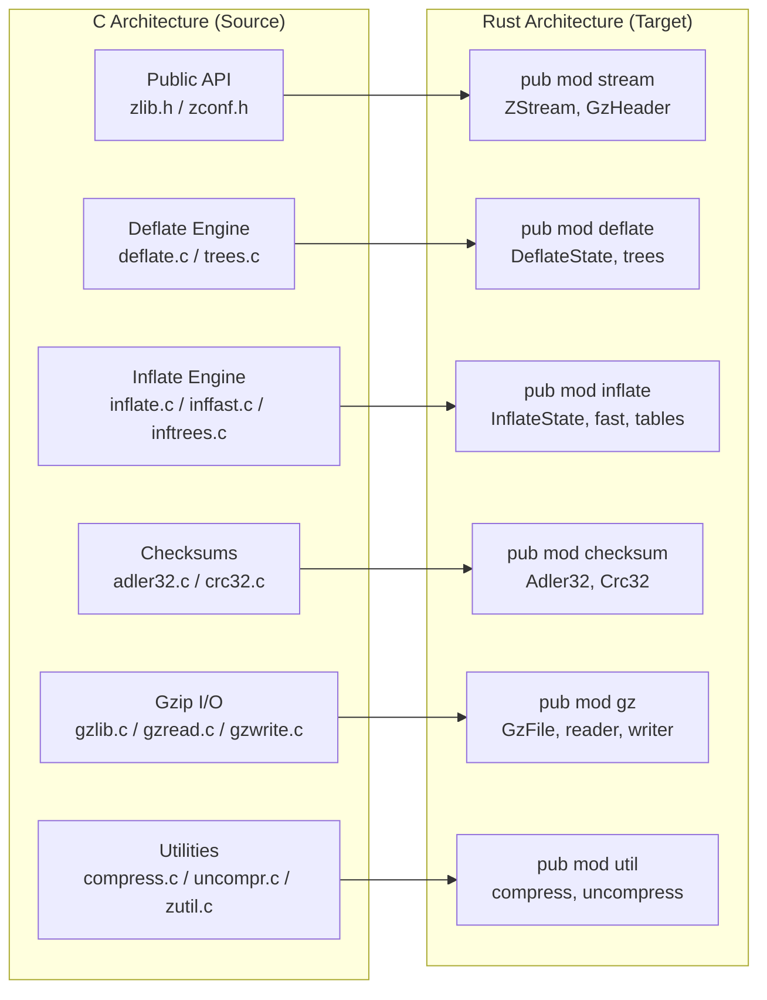
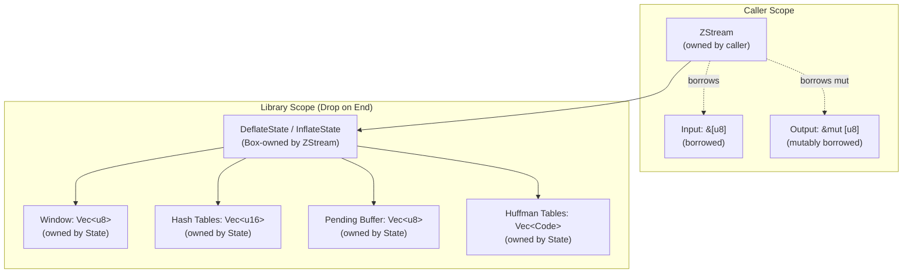

# Technical Specification

# 0. Agent Action Plan

## 0.1 Intent Clarification


### 0.1.1 Core Refactoring Objective

Based on the prompt, the Blitzy platform understands that the refactoring objective is to perform a **complete technology stack migration** of the zlib compression library from ANSI C to Rust, producing a fully independent Rust crate that replaces every C source file with idiomatic Rust modules while preserving byte-level DEFLATE compression and decompression compatibility as defined by RFC 1950 (zlib format), RFC 1951 (DEFLATE), and RFC 1952 (gzip format).

- **Refactoring type:** Tech stack migration (C → Rust)
- **Target repository:** New Rust crate repository (standalone, no C dependency)
- **Source repository:** zlib v1.3.2.1-motley (VERNUM 0x1321), ~23,107 lines of C across 26 root-level source and header files
- **Primary goal:** Replace all C implementation files with safe Rust equivalents that leverage Rust's ownership system, borrow checker, and type system to eliminate entire categories of memory safety vulnerabilities (buffer overflows, use-after-free, double-free, uninitialized memory access) without sacrificing compression fidelity or streaming semantics
- **Compatibility contract:** Any data compressed by the original C zlib must decompress identically through the Rust implementation, and vice versa — the two implementations must be fully interoperable at the wire format level
- **Implicit requirements surfaced:**
  - Maintain all 7 flush modes (Z_NO_FLUSH through Z_TREES) with identical semantics
  - Preserve all 10 compression levels (0–9) and 5 strategies (DEFAULT, FILTERED, HUFFMAN_ONLY, RLE, FIXED)
  - Support the windowBits overloading contract: 8–15 for zlib, negative for raw DEFLATE, +16 for gzip, +32 for auto-detect
  - Preserve the streaming z_stream-based API pattern where callers control buffer management
  - Maintain preset dictionary support for both compression and decompression
  - Preserve Adler-32 and CRC-32 checksum computation with combine operations
  - Support gzip file I/O with stdio-like interface (gzopen, gzread, gzwrite, gzclose, gzseek, etc.)
  - Provide one-call convenience utilities (compress, uncompress and their _z variants)
  - Maintain the compressBound formula for upper-bound estimation

### 0.1.2 Technical Interpretation

This refactoring translates to the following technical transformation strategy:

The current zlib architecture is a layered, stateless, in-process C function library organized across 6 architectural layers (Public API, Deflate Engine, Inflate Engine, Checksum Engines, Gzip File I/O, Utilities) with 12 discrete components. The transformation requires mapping each C module to an equivalent Rust module while converting C idioms to idiomatic Rust patterns:

- **C state machines** (8 deflate states from INIT_STATE=42 through FINISH_STATE=666; 30+ inflate modes from HEAD=16180 through SYNC) → **Rust enums** with exhaustive pattern matching, eliminating invalid state transitions at compile time
- **C function pointer dispatch** (5 compression functions: deflate_stored, deflate_fast, deflate_slow, deflate_huff, deflate_rle selected via `configuration_table`) → **Rust enum dispatch** or trait-based strategy pattern
- **C opaque pointers** (internal_state hidden behind void pointers) → **Rust ownership** with `Box<DeflateState>` / `Box<InflateState>` owned by the stream structure
- **C manual memory management** (zcalloc/zcfree with caller-provided allocator hooks) → **Rust allocator API** with default global allocator and optional custom allocator support via Rust's `Allocator` trait
- **C preprocessor conditionals** (#ifdef GZIP, #ifdef FASTEST, #ifndef NO_GZCOMPRESS) → **Rust feature flags** in Cargo.toml
- **C macro-based unrolling** (DO1/DO2/DO4/DO8/DO16 in adler32.c) → **Rust const generics** or inline functions with `#[inline(always)]`
- **C union types** (ct_data with freq/code and dad/len unions) → **Rust enums** or separate structs depending on usage context
- **C platform abstraction** (OS_CODE for 12+ platforms, LSEEK variants, WIDECHAR) → **Rust's std::io** and **cfg attributes** for platform-specific code
- **C error codes** (Z_OK=0, Z_STREAM_END=1, ..., Z_VERSION_ERROR=-6) → **Rust Result<T, ZlibError>** with a comprehensive error enum




## 0.2 Source Analysis


### 0.2.1 Comprehensive Source File Discovery

The zlib repository contains 73 `.c` and `.h` files distributed across the root directory and several subdirectories. The core implementation resides in 26 root-level files totaling ~23,107 lines of C code. Every file listed below has been identified through repository inspection and requires analysis for the Rust rewrite.

**Root-level source files (core implementation — 15 `.c` files):**

| File | Lines | Component | Role |
|------|-------|-----------|------|
| `deflate.c` | 2,185 | Deflate Engine | LZ77 compression with 5 strategy functions, sliding window, hash chains |
| `inflate.c` | 1,413 | Inflate Engine | 30+ mode state machine for stream decompression |
| `trees.c` | 1,119 | Deflate Engine | Huffman tree construction, dynamic/static/fixed code generation |
| `crc32.c` | 983 | Checksum | CRC-32 computation with braided, byte-wise, and hardware-accelerated paths |
| `gzwrite.c` | 700 | Gzip I/O | Gzip file write operations (gzwrite, gzputc, gzputs, gzprintf, gzfwrite) |
| `gzread.c` | 668 | Gzip I/O | Gzip file read operations (gzread, gzgetc, gzgets, gzfread, gzungetc) |
| `gzlib.c` | 609 | Gzip I/O | Common gzip functions (gzopen, gz_reset, gzbuffer, gzrewind, gzseek, gztell, gzoffset, gzerror, gzclearerr) |
| `infback.c` | 579 | Inflate Engine | Callback-based decompression (inflateBack) for raw DEFLATE streams |
| `inftrees.c` | 424 | Inflate Engine | Huffman table construction for inflate (inflate_table) |
| `inffast.c` | 321 | Inflate Engine | Fast-path decode loop requiring ≥6 input bytes and ≥258 output bytes |
| `zutil.c` | 312 | Utilities | Error messages, zlibVersion, zlibCompileFlags, zcalloc/zcfree, zmemcpy/zmemcmp/zmemzero |
| `adler32.c` | 164 | Checksum | Adler-32 computation with DO16 unrolling and combine operations |
| `uncompr.c` | 101 | Utilities | One-call decompression wrappers (uncompress, uncompress2, _z variants) |
| `compress.c` | 99 | Utilities | One-call compression wrappers (compress, compress2, compressBound, _z variants) |
| `gzclose.c` | 23 | Gzip I/O | Dispatcher routing to gzclose_r or gzclose_w based on mode |

**Root-level header files (11 `.h` files):**

| File | Lines | Role |
|------|-------|------|
| `crc32.h` | 9,446 | Generated CRC-32 lookup tables (braided table arrays) |
| `zlib.h` | 2,057 | Public API declarations, z_stream struct, gz_header struct, all function prototypes, constants |
| `zconf.h` | 551 | Platform configuration, type definitions, Z_PREFIX support, visibility macros, large file support |
| `deflate.h` | 383 | Internal deflate state (internal_state), ct_data, tree_desc, compression constants |
| `zutil.h` | 331 | Internal utilities, OS_CODE, memory macros, debug support, z_once_t |
| `gzguts.h` | 216 | Internal gzip state (gz_state), mode/how constants, platform I/O abstractions |
| `trees.h` | 128 | Static tree data declarations (static_ltree, static_dtree, distance/length codes) |
| `inflate.h` | 126 | Inflate state machine (inflate_mode enum with 30+ modes, inflate_state struct) |
| `inffixed.h` | 94 | Pre-built fixed Huffman tables (lenfix, distfix arrays) |
| `inftrees.h` | 64 | Huffman code structure (code type) and inflate_table prototype |
| `inffast.h` | 11 | inflate_fast function prototype |

### 0.2.2 Current Structure Mapping

```
Current zlib repository:
.
├── adler32.c                    (164 lines - Adler-32 checksum)
├── compress.c                   (99 lines - one-call compress wrappers)
├── crc32.c                      (983 lines - CRC-32 checksum)
├── crc32.h                      (9,446 lines - generated CRC tables)
├── deflate.c                    (2,185 lines - DEFLATE compression engine)
├── deflate.h                    (383 lines - deflate internal state)
├── gzclose.c                    (23 lines - gzclose dispatcher)
├── gzguts.h                     (216 lines - gzip internal state)
├── gzlib.c                      (609 lines - gzip common operations)
├── gzread.c                     (668 lines - gzip read operations)
├── gzwrite.c                    (700 lines - gzip write operations)
├── infback.c                    (579 lines - callback decompression)
├── inffast.c                    (321 lines - fast inflate decode loop)
├── inffast.h                    (11 lines - inffast prototype)
├── inffixed.h                   (94 lines - fixed Huffman tables)
├── inflate.c                    (1,413 lines - DEFLATE decompression engine)
├── inflate.h                    (126 lines - inflate state machine)
├── inftrees.c                   (424 lines - inflate Huffman table builder)
├── inftrees.h                   (64 lines - inflate code structure)
├── trees.c                      (1,119 lines - Huffman tree construction)
├── trees.h                      (128 lines - static tree data)
├── uncompr.c                    (101 lines - one-call decompress wrappers)
├── zconf.h                      (551 lines - platform configuration)
├── zlib.h                       (2,057 lines - public API)
├── zutil.c                      (312 lines - utility functions)
├── zutil.h                      (331 lines - internal utility macros)
├── CMakeLists.txt               (build system)
├── Makefile                     (autotools build)
├── LICENSE                      (zlib license)
├── zlib.map                     (version script with 14 version nodes)
├── contrib/
│   ├── ada/                     (Ada language binding)
│   ├── blast/                   (PKWare decompressor)
│   ├── crc32vx/                 (S390X CRC hardware acceleration)
│   ├── delphi/                  (Delphi binding)
│   ├── dotzlib/                 (.NET binding)
│   ├── gcc_gvmat64/             (AMD64 longest_match assembly)
│   ├── infback9/                (DEFLATE64 decompressor)
│   ├── iostream/                (C++ iostream wrapper v1)
│   ├── iostream2/               (C++ iostream wrapper v2)
│   ├── iostream3/               (C++ iostream wrapper v3)
│   ├── minizip/                 (ZIP archive support)
│   ├── nuget/                   (NuGet packaging)
│   ├── pascal/                  (Pascal binding)
│   ├── puff/                    (standalone inflate reference)
│   ├── testzlib/                (Windows test programs)
│   ├── vstudio/                 (Visual Studio project files)
│   └── zlib1-dll/               (Windows DLL support)
├── examples/
│   ├── enough.c, fitblk.c, gun.c, gzappend.c, gzjoin.c
│   ├── gzlog.c, gzlog.h, gznorm.c, zpipe.c, zran.c, zran.h
│   └── README.examples, zlib_how.html
└── test/
    ├── CMakeLists.txt           (319 lines - test configuration)
    ├── example.c                (553 lines - canonical regression driver)
    ├── infcover.c               (673 lines - inflate coverage harness)
    └── minigzip.c               (feature-complete gzip utility)
```

### 0.2.3 Key Data Structures Requiring Translation

The following C data structures form the backbone of zlib's internal architecture and each requires careful translation to Rust with appropriate ownership semantics:

| C Structure | Defined In | Size/Complexity | Rust Translation Strategy |
|-------------|-----------|-----------------|---------------------------|
| `z_stream` | `zlib.h` | 12 fields, central exchange struct | `pub struct ZStream<A: Allocator>` with lifetime-bounded buffer references |
| `gz_header` | `zlib.h` | 13 fields, gzip metadata | `pub struct GzHeader` with `Option<String>` for optional name/comment fields |
| `internal_state` (deflate) | `deflate.h` | ~80 fields, sliding window, hash tables, pending buffer | `pub(crate) struct DeflateState` owning all buffers via `Vec<u8>` / `Box<[u16]>` |
| `inflate_state` | `inflate.h` | ~35 fields, ~7KB, mode enum, bit accumulator, Huffman tables | `pub(crate) struct InflateState` with `InflateMode` enum |
| `ct_data` | `deflate.h` | C union: freq/code + dad/len | Separate `HuffmanNode` struct with explicit fields |
| `tree_desc` | `deflate.h` | Tree descriptor linking dynamic tree to static tree | `pub(crate) struct TreeDesc` with references to static data |
| `code` | `inftrees.h` | Huffman decode entry: op/bits/val | `#[repr(C)] pub(crate) struct Code { op: u8, bits: u8, val: u16 }` |
| `gz_state` | `gzguts.h` | ~25 fields, file descriptor, buffers, embedded z_stream | `pub struct GzFile` owning `File`, buffers, and `DeflateState`/`InflateState` |
| `config` | `deflate.c` | Strategy parameters per compression level | `const CONFIG_TABLE: [CompressionConfig; 10]` |


## 0.3 Scope Boundaries


### 0.3.1 Exhaustively In Scope

**Core compression and decompression (Critical Priority):**
- `deflate.c` / `deflate.h` — Complete DEFLATE compression engine with all 5 strategy functions (deflate_stored, deflate_fast, deflate_slow, deflate_huff, deflate_rle), sliding window, hash chain management, lazy match evaluation
- `inflate.c` / `inflate.h` — Complete DEFLATE decompression engine with 30+ mode state machine (HEAD through SYNC), format auto-detection (zlib/gzip/raw via windowBits), inflateSync error recovery
- `trees.c` / `trees.h` — Huffman tree construction for dynamic, static, and fixed codes; bit-level output buffer management; block type selection (stored/static/dynamic)
- `inffast.c` / `inffast.h` — Fast-path inflate decode loop for bulk decompression
- `inftrees.c` / `inftrees.h` — Huffman table builder for inflate (inflate_table function)
- `inffixed.h` — Pre-computed fixed Huffman code tables (lenfix/distfix)
- `infback.c` — Callback-based raw DEFLATE decompression (inflateBack/inflateBackInit/inflateBackEnd)

**Checksum engines (Critical Priority):**
- `adler32.c` — Adler-32 computation with DO16 unrolling (BASE=65521, NMAX=5552), combine operations (adler32_combine, adler32_combine64)
- `crc32.c` / `crc32.h` — CRC-32 computation with braided table approach, combine operations (crc32_combine, crc32_combine_gen, crc32_combine_op)

**Gzip file I/O (High Priority):**
- `gzlib.c` — Common gzip operations: gzopen, gzdopen, gzbuffer, gzrewind, gzseek, gztell, gzoffset, gzeof, gzdirect, gzerror, gzclearerr
- `gzread.c` — Gzip read pipeline: gzread, gzfread, gzgetc, gzgets, gzungetc with LOOK/COPY/GZIP state machine
- `gzwrite.c` — Gzip write operations: gzwrite, gzfwrite, gzputc, gzputs, gzprintf, gzflush, gzsetparams
- `gzclose.c` — gzclose dispatcher routing to gzclose_r / gzclose_w
- `gzguts.h` — Internal gz_state structure and mode/how constants

**One-call utility wrappers (High Priority):**
- `compress.c` — compress, compress2, compress_z, compress2_z, compressBound, compressBound_z
- `uncompr.c` — uncompress, uncompress2, uncompress_z, uncompress2_z

**Public API surface (Critical Priority):**
- `zlib.h` — All public function prototypes, z_stream and gz_header structs, constants, macros
- `zconf.h` — Type definitions, visibility macros, large file support, Z_PREFIX namespace isolation

**Internal utilities (High Priority):**
- `zutil.c` / `zutil.h` — zlibVersion, zlibCompileFlags, zError, default allocators (zcalloc/zcfree), memory utilities, error message table

**Test infrastructure (to be rewritten as Rust tests):**
- `test/example.c` — 10 regression test functions covering all API groups
- `test/infcover.c` — Exhaustive inflate coverage harness with custom allocator tracking
- `test/minigzip.c` — Reference gzip/gunzip implementation for format validation

**Build and packaging:**
- `Cargo.toml` — New Rust package manifest (CREATE)
- `build.rs` — Build script if needed for code generation (CREATE)
- `src/lib.rs` — Crate root with public module declarations (CREATE)
- `.github/workflows/` — CI/CD workflows adapted for Rust (UPDATE/CREATE)

### 0.3.2 Explicitly Out of Scope

- **Contributed extensions** (`contrib/` directory) — Ada bindings, Delphi bindings, .NET bindings, Pascal bindings, C++ iostream wrappers, minizip, puff, blast, infback9, Visual Studio projects, NuGet packaging, S390X CRC32VX assembly, AMD64 assembly optimizations — these are language-specific bindings and platform-specific optimizations that do not apply to a Rust rewrite
- **Platform-specific assembly** — `contrib/gcc_gvmat64/` (AMD64 longest_match), `contrib/crc32vx/` (S390X CRC) — Rust SIMD intrinsics will replace these where beneficial, but the hand-written assembly is out of scope
- **16-bit platform support** — Turbo C, Microsoft C 16-bit mode, `SYS16BIT` code paths in `zutil.c`, the `FAR` pointer abstraction — Rust targets modern 32-bit and 64-bit platforms only
- **Windows CE-specific code** — `UNDER_CE` conditional paths in `gzlib.c` (gz_strwinerror), the fallback `errno = 0` definition
- **C autotools build system** — `Makefile`, `configure`, `Makefile.in` — replaced by Cargo
- **CMake build system** — `CMakeLists.txt`, `test/CMakeLists.txt`, `.cmake-format.yaml` — replaced by Cargo
- **Version script** — `zlib.map` (14 version nodes for C shared library symbol versioning) — Rust uses semantic versioning via Cargo.toml
- **Legacy platform metadata** — `amiga/`, `os400/`, `watcom/`, `win32/`, `treebuild.xml` — platform-specific build configurations for non-modern systems
- **Example programs** (`examples/` directory) — enough.c, fitblk.c, gun.c, gzappend.c, gzjoin.c, gzlog.c, gznorm.c, zpipe.c, zran.c — these demonstrate C API usage patterns and will be replaced with Rust doc examples and integration tests
- **Encryption, alternative algorithms, network protocols, GUI, database** — per zlib's own documented out-of-scope boundaries


## 0.4 Target Design


### 0.4.1 Refactored Structure Planning

The Rust rewrite produces a standalone Cargo workspace organized as a single library crate with clearly separated modules mirroring the 6-layer C architecture. Each C source file maps to a dedicated Rust module, with headers absorbed into their corresponding module's type definitions and public interface.

```
Target Rust crate:
zlib-rs/
├── Cargo.toml                           (package manifest, edition = "2024", dependencies)
├── LICENSE                              (preserved zlib license)
├── README.md                            (crate documentation with usage examples)
├── build.rs                             (build script for CRC table generation if needed)
├── src/
│   ├── lib.rs                           (crate root: public API re-exports, feature flags, crate-level docs)
│   ├── error.rs                         (ZlibError enum, ReturnCode enum, Result type alias)
│   ├── constants.rs                     (flush modes, compression levels, strategies, data types, limits)
│   ├── stream.rs                        (ZStream struct, StreamState trait, buffer management)
│   ├── gz_header.rs                     (GzHeader struct for gzip metadata)
│   ├── deflate/
│   │   ├── mod.rs                       (public deflate API: deflate_init, deflate, deflate_end, etc.)
│   │   ├── state.rs                     (DeflateState struct: sliding window, hash tables, pending buffer)
│   │   ├── trees.rs                     (Huffman tree construction, dynamic/static/fixed code generation)
│   │   ├── strategy.rs                  (CompressionStrategy enum, config table, dispatch logic)
│   │   ├── fast.rs                      (deflate_fast: greedy matching for levels 1-3)
│   │   ├── slow.rs                      (deflate_slow: lazy matching for levels 4-9)
│   │   ├── stored.rs                    (deflate_stored: level 0, no compression)
│   │   ├── huff.rs                      (deflate_huff: Huffman-only, no LZ77)
│   │   └── rle.rs                       (deflate_rle: run-length encoding strategy)
│   ├── inflate/
│   │   ├── mod.rs                       (public inflate API: inflate_init, inflate, inflate_end, etc.)
│   │   ├── state.rs                     (InflateState struct, InflateMode enum with 30+ variants)
│   │   ├── fast.rs                      (inflate_fast: fast-path bulk decode loop)
│   │   ├── tables.rs                    (inflate_table: Huffman table construction for inflate)
│   │   ├── fixed.rs                     (pre-built fixed Huffman tables: LENFIX, DISTFIX)
│   │   └── back.rs                      (inflate_back: callback-based raw DEFLATE decompression)
│   ├── checksum/
│   │   ├── mod.rs                       (public checksum API re-exports)
│   │   ├── adler32.rs                   (Adler32 struct, adler32/adler32_z/adler32_combine functions)
│   │   └── crc32.rs                     (Crc32 struct, crc32/crc32_z/crc32_combine/crc32_combine_gen/crc32_combine_op)
│   ├── gz/
│   │   ├── mod.rs                       (public gzip file I/O API re-exports)
│   │   ├── state.rs                     (GzState struct: mode, fd, buffers, embedded stream)
│   │   ├── open.rs                      (gz_open, gz_dopen, gz_buffer, gz_reset)
│   │   ├── read.rs                      (gz_read, gz_fread, gz_getc, gz_gets, gz_ungetc)
│   │   ├── write.rs                     (gz_write, gz_fwrite, gz_putc, gz_puts, gz_printf, gz_flush, gz_setparams)
│   │   └── close.rs                     (gz_close, gz_close_r, gz_close_w)
│   └── util/
│       ├── mod.rs                       (public utility API re-exports)
│       ├── compress.rs                  (compress, compress2, compress_bound functions)
│       ├── uncompress.rs                (uncompress, uncompress2 functions)
│       └── version.rs                   (zlib_version, compile_flags, error_message)
├── tests/
│   ├── regression.rs                    (port of test/example.c: 10 ordered regression tests)
│   ├── inflate_coverage.rs              (port of test/infcover.c: exhaustive inflate state machine coverage)
│   ├── round_trip.rs                    (compression/decompression round-trip property tests)
│   ├── interop.rs                       (cross-validation against C zlib output for format compatibility)
│   ├── gzip_compat.rs                   (gzip file I/O validation, port of test/minigzip.c patterns)
│   └── checksum.rs                      (Adler-32 and CRC-32 known-answer tests and combine verification)
└── benches/
    ├── deflate_bench.rs                 (compression throughput benchmarks across levels 0-9)
    ├── inflate_bench.rs                 (decompression throughput benchmarks)
    └── checksum_bench.rs                (Adler-32 and CRC-32 throughput benchmarks)
```

### 0.4.2 Web Search Research Conducted

- **Rust zlib ecosystem landscape:** The `zlib-rs` crate (v0.6.0) by Trifecta Tech Foundation exists as a memory-safe Rust zlib implementation with ~12K SLoC, based on zlib and zlib-ng, usable as a `flate2` backend. The `miniz_oxide` crate (v0.9.0) is a pure safe-Rust port of miniz.c used as flate2's default backend. The `flate2` crate provides high-level Read/Write/BufRead stream wrappers over multiple backends.
- **Rust edition and toolchain:** Rust 2024 edition was stabilized in Rust 1.85.0 (February 2025). The target crate will use `edition = "2024"` with Rust 1.85.0 as MSRV.
- **CRC-32 acceleration:** The `crc32fast` crate (v1.5.0) provides SIMD-accelerated CRC-32 with x86 SSE/PCLMULQDQ and AArch64 CRC instructions, supports `no_std`.
- **C-to-Rust rewrite patterns:** State machine translation leveraging Rust enums for exhaustive matching, `Result<T, E>` for error propagation replacing C return codes, `Box<[u8]>` and `Vec<u8>` for buffer ownership.

### 0.4.3 Design Pattern Applications

- **State Machine Pattern (Rust Enums):** The 30+ inflate modes (HEAD, FLAGS, TIME, OS, EXLEN, EXTRA, NAME, COMMENT, HCRC, DICTID, DICT, TYPE, TYPEDO, STORED, COPY_, COPY, TABLE, LENLENS, CODELENS, LEN_, LEN, LENEXT, DIST, DISTEXT, MATCH, LIT, CHECK, LENGTH, DONE, BAD, MEM, SYNC) and 8 deflate states (INIT, GZIP, EXTRA, NAME, COMMENT, HCRC, BUSY, FINISH) will each become Rust enum variants with exhaustive `match` expressions, guaranteeing no unhandled states at compile time.

- **Strategy Pattern (Enum Dispatch):** The 5 compression functions (stored, fast, slow, huff, rle) selected via `configuration_table[level].func` will be replaced by a `CompressionStrategy` enum with a `compress_block(&mut DeflateState, FlushMode) -> BlockResult` method that dispatches to the appropriate implementation.

- **Builder Pattern (Init Functions):** `deflateInit2_` and `inflateInit2_` with their multi-parameter signatures will map to builder patterns: `DeflateConfig::new().level(6).window_bits(15).mem_level(8).strategy(Strategy::Default).build()`.

- **RAII (Resource Acquisition Is Initialization):** `deflateEnd` and `inflateEnd` become `Drop` implementations on `DeflateState` and `InflateState`, automatically releasing all allocated buffers when the state goes out of scope.

- **Type-State Pattern (API Safety):** The C pattern of checking `strm->state != Z_NULL` before every operation is replaced by Rust ownership — you cannot call `deflate()` without a valid `DeflateState`, eliminating null-state errors at compile time.

- **Error Handling (Result Type):** All C functions returning `int` error codes (Z_OK, Z_STREAM_END, Z_NEED_DICT, Z_ERRNO, Z_STREAM_ERROR, Z_DATA_ERROR, Z_MEM_ERROR, Z_BUF_ERROR, Z_VERSION_ERROR) will return `Result<ReturnCode, ZlibError>` where `ReturnCode` covers success variants and `ZlibError` covers failures.


## 0.5 Transformation Mapping


### 0.5.1 File-by-File Transformation Plan

Every target Rust file is mapped to its C source counterpart. Where a target file has no direct source equivalent (new abstraction layer), it is marked CREATE with a REFERENCE source indicating the pattern to follow.

| Target File | Transformation | Source File | Key Changes |
|-------------|---------------|-------------|-------------|
| `Cargo.toml` | CREATE | `CMakeLists.txt` | Package manifest with edition="2024", dependencies, feature flags replacing CMake options |
| `build.rs` | CREATE | `crc32.h` | Build script for generating CRC-32 lookup tables as const arrays if not embedded directly |
| `README.md` | CREATE | `README-cmake.md` | Crate documentation with Rust usage examples, API overview, feature flag descriptions |
| `LICENSE` | UPDATE | `LICENSE` | Preserve original zlib license verbatim |
| `src/lib.rs` | CREATE | `zlib.h` | Crate root: pub mod declarations, public API re-exports, crate-level doc comments, version constants |
| `src/error.rs` | CREATE | `zutil.h` | ZlibError enum mapping Z_ERRNO/-1 through Z_VERSION_ERROR/-6; ReturnCode enum for Z_OK/Z_STREAM_END/Z_NEED_DICT; z_errmsg equivalents |
| `src/constants.rs` | CREATE | `zlib.h` | Flush modes (NO_FLUSH..TREES), compression levels (0-9, DEFAULT=-1, BEST_SPEED=1, BEST_COMPRESSION=9), strategies, data types, MIN_MATCH=3, MAX_MATCH=258, MAX_WBITS=15 |
| `src/stream.rs` | CREATE | `zlib.h` | ZStream struct replacing z_stream with Rust buffer references (`&[u8]`/`&mut [u8]`), owned internal state via `Option<Box<DeflateState>>` or `Option<Box<InflateState>>` |
| `src/gz_header.rs` | CREATE | `zlib.h` | GzHeader struct with `Option<Vec<u8>>` for extra, `Option<String>` for name/comment, replacing raw pointer fields |
| `src/deflate/mod.rs` | CREATE | `deflate.c` | Public deflate API: deflate_init, deflate_init2, deflate, deflate_end, deflate_reset, deflate_params, deflate_tune, deflate_bound, deflate_pending, deflate_prime, deflate_set_header, deflate_set_dictionary, deflate_get_dictionary, deflate_copy |
| `src/deflate/state.rs` | CREATE | `deflate.h` | DeflateState struct: window (`Vec<u8>` of 2×2^wbits), prev/head hash tables (`Vec<u16>`), pending buffer (`Vec<u8>`), literal/distance/bit-length trees, match state, all ~80 fields of internal_state |
| `src/deflate/trees.rs` | CREATE | `trees.c` | Huffman tree construction: init_block, build_tree, scan_tree, send_tree, build_bl_tree, send_all_trees, compress_block, set_data_type, bi_flush, bi_windup, copy_block; static tree data from trees.h |
| `src/deflate/strategy.rs` | CREATE | `deflate.c` | CompressionConfig struct and CONFIG_TABLE const array (10 entries), CompressionStrategy enum dispatch, RANK macro logic |
| `src/deflate/fast.rs` | CREATE | `deflate.c` | deflate_fast function: greedy matching for levels 1-3, INSERT_STRING hash chain operations |
| `src/deflate/slow.rs` | CREATE | `deflate.c` | deflate_slow function: lazy matching for levels 4-9, prev_match/match_available tracking |
| `src/deflate/stored.rs` | CREATE | `deflate.c` | deflate_stored function: level 0 pass-through with stored block headers |
| `src/deflate/huff.rs` | CREATE | `deflate.c` | deflate_huff function: Huffman-only compression without LZ77 matching |
| `src/deflate/rle.rs` | CREATE | `deflate.c` | deflate_rle function: run-length encoding strategy for repetitive data |
| `src/inflate/mod.rs` | CREATE | `inflate.c` | Public inflate API: inflate_init, inflate_init2, inflate, inflate_end, inflate_reset, inflate_reset2, inflate_sync, inflate_copy, inflate_prime, inflate_mark, inflate_get_header, inflate_set_dictionary, inflate_get_dictionary |
| `src/inflate/state.rs` | CREATE | `inflate.h` | InflateState struct with InflateMode enum (30+ variants: Head, Flags, Time, Os, ExLen, Extra, Name, Comment, HCrc, DictId, Dict, Type, TypeDo, Stored, Copy_, Copy, Table, LenLens, CodeLens, Len_, Len, LenExt, Dist, DistExt, Match, Lit, Check, Length, Done, Bad, Mem, Sync); fields: wbits, wsize, whave, wnext, window Vec, hold/bits accumulator, lencode/distcode, lens[320], work[288], codes[ENOUGH] |
| `src/inflate/fast.rs` | CREATE | `inffast.c` | inflate_fast function: bulk decode loop processing ≥6 input bytes and ≥258 output bytes in tight inner loop |
| `src/inflate/tables.rs` | CREATE | `inftrees.c` | inflate_table function: builds Huffman decoding tables from code length arrays, returns ENOUGH/code overflow errors |
| `src/inflate/fixed.rs` | CREATE | `inffixed.h` | LENFIX and DISTFIX const arrays: pre-computed fixed Huffman code tables (512 + 32 entries) |
| `src/inflate/back.rs` | CREATE | `infback.c` | inflate_back, inflate_back_init, inflate_back_end: callback-based decompression with in_func/out_func closures replacing C function pointers |
| `src/checksum/mod.rs` | CREATE | `zlib.h` | Public checksum API re-exports: adler32, adler32_z, adler32_combine, crc32, crc32_z, crc32_combine, crc32_combine_gen, crc32_combine_op, get_crc_table |
| `src/checksum/adler32.rs` | CREATE | `adler32.c` | Adler32 struct with update/combine methods; adler32_z with DO16-equivalent unrolled loop (BASE=65521, NMAX=5552); adler32_combine_ with MOD63 modular arithmetic |
| `src/checksum/crc32.rs` | CREATE | `crc32.c` | CRC-32 computation; const CRC_TABLE generated at build time or embedded; crc32_combine using matrix multiplication; crc32_combine_gen/crc32_combine_op for pre-computed operators |
| `src/gz/mod.rs` | CREATE | `gzguts.h` | Public gzip file I/O API re-exports; GzMode/GzHow enums replacing GZ_READ=7247/GZ_WRITE=31153/GZ_APPEND=1 and LOOK=0/COPY=1/GZIP=2 |
| `src/gz/state.rs` | CREATE | `gzguts.h` | GzState struct: mode, File handle (replacing fd), path String, in/out Vec buffers (GZBUFSIZE=8192 default), compression level/strategy, error state, embedded ZStream |
| `src/gz/open.rs` | CREATE | `gzlib.c` | gz_open (parse mode string, open file, allocate buffers), gz_dopen (from raw fd), gz_buffer (resize), gz_reset, gz_seek, gz_tell, gz_offset, gz_eof, gz_direct, gz_error, gz_clearerr |
| `src/gz/read.rs` | CREATE | `gzread.c` | gz_read, gz_fread, gz_getc, gz_gets, gz_ungetc with LOOK/COPY/GZIP read pipeline; gz_load, gz_avail, gz_look, gz_decomp, gz_fetch, gz_skip internal helpers |
| `src/gz/write.rs` | CREATE | `gzwrite.c` | gz_write, gz_fwrite, gz_putc, gz_puts, gz_printf, gz_flush, gz_setparams; gz_init, gz_comp, gz_zero internal helpers |
| `src/gz/close.rs` | CREATE | `gzclose.c` | gz_close dispatcher, gz_close_r (flush+free read state), gz_close_w (finish compression+close file) |
| `src/util/mod.rs` | CREATE | `zutil.h` | Public utility re-exports |
| `src/util/compress.rs` | CREATE | `compress.c` | compress, compress2, compress_bound functions wrapping deflate_init/deflate/deflate_end in one call |
| `src/util/uncompress.rs` | CREATE | `uncompr.c` | uncompress, uncompress2 functions wrapping inflate_init/inflate/inflate_end in one call |
| `src/util/version.rs` | CREATE | `zutil.c` | ZLIB_VERSION const, zlib_version(), compile_flags(), z_error_message() |
| `tests/regression.rs` | CREATE | `test/example.c` | Port of 10 ordered test functions: test_compress, test_gzio, test_deflate, test_inflate, test_large_deflate, test_large_inflate, test_flush, test_sync, test_dict_deflate, test_dict_inflate |
| `tests/inflate_coverage.rs` | CREATE | `test/infcover.c` | Port of 6 cover_* functions: cover_support, cover_wrap, cover_back, cover_inflate, cover_trees, cover_fast; custom allocator tracking replaced with Rust memory tracking |
| `tests/round_trip.rs` | CREATE | `test/example.c` | Property-based round-trip tests: compress→decompress identity for random data across all levels/strategies |
| `tests/interop.rs` | CREATE | `test/example.c` | Cross-validation tests ensuring Rust output decompresses correctly with C zlib and vice versa |
| `tests/gzip_compat.rs` | CREATE | `test/minigzip.c` | Gzip format compatibility tests: write gzip with Rust, verify with gunzip; decompress gzip files produced by C implementation |
| `tests/checksum.rs` | CREATE | `test/example.c` | Known-answer tests for Adler-32 and CRC-32, combine operation verification |
| `benches/deflate_bench.rs` | CREATE | — | Compression benchmarks across levels 0-9 using criterion |
| `benches/inflate_bench.rs` | CREATE | — | Decompression throughput benchmarks |
| `benches/checksum_bench.rs` | CREATE | — | Adler-32 and CRC-32 throughput benchmarks |

### 0.5.2 Cross-File Dependencies

**Import transformation rules for internal module references:**

- C internal includes → Rust `use` statements within the crate:
  - `#include "deflate.h"` → `use crate::deflate::state::DeflateState;`
  - `#include "inflate.h"` → `use crate::inflate::state::{InflateState, InflateMode};`
  - `#include "zutil.h"` → `use crate::error::ZlibError;` + `use crate::constants::*;`
  - `#include "gzguts.h"` → `use crate::gz::state::GzState;`
  - `#include "inftrees.h"` → `use crate::inflate::tables::{inflate_table, Code};`
  - `#include "inffast.h"` → `use crate::inflate::fast::inflate_fast;`
  - `#include "trees.h"` → `use crate::deflate::trees::{StaticTreeDesc, STATIC_LTREE, STATIC_DTREE};`
  - `#include "inffixed.h"` → `use crate::inflate::fixed::{LENFIX, DISTFIX};`
  - `#include "crc32.h"` → `use crate::checksum::crc32::CRC_TABLE;`

- C public API → Rust public re-exports from `lib.rs`:
  - `#include "zlib.h"` → `use zlib_rs::{ZStream, deflate, inflate, compress, uncompress, adler32, crc32, ...};`

**Configuration and documentation updates:**

- `Cargo.toml` replaces `CMakeLists.txt` for dependency management, feature flags, and build configuration
- `.github/workflows/*.yml` files need updating from C/CMake/CTest pipelines to `cargo build`, `cargo test`, `cargo bench`, `cargo clippy`, `cargo fmt`
- `README.md` replaces C-oriented documentation with Rust usage examples and API documentation links

### 0.5.3 Wildcard Patterns

- `src/deflate/*.rs` — All deflate module files (UPDATE targets for compression engine)
- `src/inflate/*.rs` — All inflate module files (UPDATE targets for decompression engine)
- `src/checksum/*.rs` — All checksum module files
- `src/gz/*.rs` — All gzip file I/O module files
- `src/util/*.rs` — All utility module files
- `tests/*.rs` — All integration test files
- `benches/*.rs` — All benchmark files

### 0.5.4 One-Phase Execution

The entire Rust rewrite will be executed by Blitzy in ONE phase. All 42+ target files listed above are created simultaneously within a single execution cycle. No multi-phase splitting is required or permitted — the crate must be compilable and testable as a complete unit upon delivery.


## 0.6 Dependency Inventory


### 0.6.1 Key Packages

The Rust rewrite aims for minimal external dependencies, consistent with zlib's zero-external-dependency philosophy in C. Only well-established, widely-adopted crates are included.

| Registry | Package | Version | Purpose |
|----------|---------|---------|---------|
| crates.io | `crc32fast` | 1.5.0 | SIMD-accelerated CRC-32 (IEEE) computation replacing hand-written braided/hardware CRC paths in crc32.c; supports x86 SSE/PCLMULQDQ and AArch64 CRC instructions; no_std compatible |
| crates.io | `cfg-if` | 1.0.0 | Ergonomic conditional compilation macros replacing C preprocessor `#if`/`#ifdef` chains for platform-specific code paths |
| crates.io (dev) | `criterion` | 0.5.1 | Statistical benchmarking framework for deflate/inflate/checksum throughput measurement |
| crates.io (dev) | `rand` | 0.9.0 | Random data generation for property-based round-trip testing |
| crates.io (dev) | `flate2` | 1.1.1 | Reference C zlib backend for interoperability cross-validation tests |
| crates.io (dev) | `quickcheck` | 1.0.3 | Property-based testing for compression/decompression round-trip verification |
| Rust std | `std::io` | — | File I/O primitives (Read, Write, BufRead, Seek) replacing gzlib.c LSEEK/open/close abstractions |
| Rust std | `std::fs::File` | — | File handle replacing C `int fd` file descriptors in gz_state |
| Rust std | `std::fmt` | — | Display/Debug formatting for error types and diagnostic output |
| Rust std | `std::alloc` | — | Global allocator interface, optionally allowing custom allocator injection mirroring zalloc/zfree hooks |

### 0.6.2 Dependency Updates

**Import refactoring — C-to-Rust module path transformations:**

All C `#include` directives across the 15 source files are replaced by Rust `use` declarations. The transformation rules are:

- Source files matching `src/deflate/*.rs` — All internal imports use `use crate::deflate::state::*;`, `use crate::deflate::trees::*;`, `use crate::constants::*;`, `use crate::error::*;`, `use crate::stream::ZStream;`
- Source files matching `src/inflate/*.rs` — All internal imports use `use crate::inflate::state::*;`, `use crate::inflate::tables::*;`, `use crate::inflate::fixed::*;`, `use crate::constants::*;`, `use crate::error::*;`
- Source files matching `src/checksum/*.rs` — Minimal internal imports; `use crate::constants::*;` for type aliases
- Source files matching `src/gz/*.rs` — Imports from `use crate::stream::ZStream;`, `use crate::deflate;`, `use crate::inflate;`, `use crate::checksum::*;`, `use crate::error::*;`, `use std::io::{Read, Write, Seek};`, `use std::fs::File;`
- Source files matching `src/util/*.rs` — Imports from `use crate::deflate;`, `use crate::inflate;`, `use crate::stream::ZStream;`, `use crate::error::*;`
- Source files matching `tests/*.rs` — External crate usage: `use zlib_rs::*;`, dev-dependency imports from `flate2`, `rand`, `quickcheck`

**External reference updates:**

| File Pattern | Update Required |
|-------------|----------------|
| `Cargo.toml` | Define all dependencies with exact versions, feature flags (std, no_std), dev-dependencies, bench configuration |
| `README.md` | Usage examples with `use zlib_rs::*;` import patterns, Cargo.toml dependency snippet |
| `.github/workflows/*.yml` | Replace `cmake`/`make`/`ctest` commands with `cargo build --release`, `cargo test`, `cargo bench`, `cargo clippy -- -D warnings`, `cargo fmt -- --check` |

### 0.6.3 Feature Flags

The following Cargo feature flags replace C preprocessor conditionals:

| Feature Flag | Default | Replaces C Macro | Purpose |
|-------------|---------|-----------------|---------|
| `std` | yes | (default C build) | Enable std::io-based gzip file I/O; disable for no_std embedded use |
| `gzip` | yes | `#ifdef GZIP` | Enable gzip format support in deflate/inflate and gzip file I/O module |
| `gz-io` | yes | `#ifndef NO_GZCOMPRESS` | Enable gzip file I/O (gzopen, gzread, gzwrite, etc.) |
| `no-std` | no | `Z_SOLO` | Bare-metal mode: no stdio, no file I/O, compression/decompression/checksums only |
| `simd` | yes | (platform detection) | Enable SIMD-accelerated checksum paths via crc32fast |


## 0.7 Special Analysis


### 0.7.1 State Machine Translation Analysis

The zlib codebase contains two critical state machines that require careful translation to Rust's type-safe enum system:

**Deflate state machine (8 states):** Defined in `deflate.h` as integer constants: `INIT_STATE=42`, `GZIP_STATE=57`, `EXTRA_STATE=69`, `NAME_STATE=73`, `COMMENT_STATE=91`, `HCRC_STATE=103`, `BUSY_STATE=113`, `FINISH_STATE=666`. In C, transitions are managed via direct integer assignment (`s->status = BUSY_STATE`). The Rust equivalent uses an enum:

```rust
enum DeflateStatus {
    Init, Gzip, Extra, Name,
    Comment, HCrc, Busy, Finish,
}
```

This eliminates the possibility of setting an invalid state value (e.g., `s->status = 999` in C would compile but corrupt behavior). All `switch`/`if` chains on `s->status` become `match` expressions with exhaustive coverage enforced by the compiler.

**Inflate state machine (30+ modes):** Defined in `inflate.h` as the `inflate_mode` enum starting at `HEAD=16180`. The initial values are arbitrary sentinel values chosen to detect memory corruption. In Rust, the mode enum uses zero-based discriminants since memory safety is guaranteed by the type system:

```rust
enum InflateMode {
    Head, Flags, Time, Os, ExLen,
    Extra, Name, Comment, /* ... */
    Done, Bad, Mem, Sync,
}
```

The main `inflate()` function in `inflate.c` is a 1,200+ line switch statement (`switch (state->mode)`) that processes each mode sequentially. In Rust, this becomes a `loop { match self.mode { ... } }` construct. The `goto inf_leave` pattern in C (used for early exit from the switch with cleanup) maps to Rust's labeled loop/break: `'inf: loop { match mode { ... Mode::Bad => break 'inf, ... } }`.

### 0.7.2 Unsafe Code Boundary Analysis

The C-to-Rust rewrite aims to maximize safe Rust code. However, certain performance-critical paths and FFI boundaries may require targeted `unsafe` blocks:

| Area | C Pattern | Rust Safe Alternative | Requires Unsafe? |
|------|-----------|----------------------|------------------|
| Sliding window access | Raw pointer arithmetic (`s->window[s->strstart]`) | Slice indexing with bounds checking (`self.window[self.strstart]`) | No — use `.get()` or bounds-checked indexing |
| Hash chain traversal | `prev[str & w_mask]` pointer chasing | `self.prev[(str & self.w_mask) as usize]` with bounds-checked Vec | No |
| Bit accumulator manipulation | Direct bit shifting on unsigned long (`hold \|= (unsigned long)(*in++) << bits`) | Rust u64 with bitwise ops | No |
| Fast inflate inner loop | Tight loop with raw pointer increments for `in`/`out` | `unsafe` pointer arithmetic for zero-overhead inner loop, guarded by precondition assertions | Yes — performance-critical path in `inflate_fast` |
| CRC-32 SIMD instructions | Inline assembly / intrinsics | Delegate to `crc32fast` crate (contains its own audited unsafe) | No (transitive) |
| Custom allocator hooks | Function pointers (`zalloc`, `zfree`) | Rust `Allocator` trait with global allocator default | No |
| gzip file I/O | POSIX open/read/write/close on `int fd` | `std::fs::File` with `Read`/`Write` traits | No |

**Estimated unsafe surface area:** Less than 2% of total code, concentrated in `src/inflate/fast.rs` inner loop where pointer-based buffer access is essential for matching C zlib's decompression throughput.

### 0.7.3 Memory Ownership Model Translation

The C zlib library uses a specific memory management contract that must be preserved in Rust:

**C pattern:** The caller provides a `z_stream` structure. Internal state is allocated at `deflateInit`/`inflateInit` time via `zalloc` (default: `zcalloc` which calls `malloc`). All internal buffers (sliding window, hash tables, pending buffer, Huffman tables) are allocated as sub-allocations from the opaque internal state. Deallocation occurs at `deflateEnd`/`inflateEnd` via `zfree`.

**Rust ownership model:**



- The `ZStream` struct holds an `Option<Box<DeflateState>>` or `Option<Box<InflateState>>` — `Some` after init, `None` before init or after end
- All internal buffers are `Vec<u8>` or `Vec<u16>` owned by the state struct
- When `DeflateState` / `InflateState` is dropped (via explicit `deflate_end()` or automatic `Drop`), all owned Vecs are automatically deallocated
- Input/output buffers are borrowed via `&[u8]` / `&mut [u8]` slice references passed per-call, matching C's `next_in`/`next_out` pointer+length pattern but with borrow checker enforcement

### 0.7.4 Bit Manipulation and Endianness Patterns

The inflate engine relies heavily on bit-level manipulation using a `hold` accumulator (unsigned long) and `bits` counter. Key patterns requiring translation:

- **Bit input:** `PULLBYTE()` macro reads one byte into `hold` at position `bits`, then increments `bits` by 8. In Rust: `hold |= (input[in_pos] as u64) << bits; in_pos += 1; bits += 8;`
- **Bit extraction:** `BITS(n)` extracts n low bits: `hold & ((1 << n) - 1)`. In Rust: `hold & ((1u64 << n) - 1)`
- **Bit consumption:** `DROPBITS(n)` shifts right: `hold >>= n; bits -= n;`. Identical in Rust.
- **Byte alignment:** `BYTEBITS()` drops bits to next byte boundary: `hold >>= bits & 7; bits -= bits & 7;`
- **Endianness:** DEFLATE and zlib formats use little-endian bit packing but big-endian byte ordering for certain header fields (gzip CRC is little-endian, zlib Adler-32 checksum is big-endian in the trailer). Rust's `u32::to_le_bytes()` / `u32::to_be_bytes()` and `from_le_bytes()` / `from_be_bytes()` handle this cleanly.

### 0.7.5 Huffman Table Construction Analysis

Both deflate and inflate construct Huffman tables, but with different structures:

**Deflate (trees.c):** Builds canonical Huffman codes from frequency counts. The `ct_data` union in C stores either `{freq, code}` during counting/code generation or `{dad, len}` during tree construction. In Rust, this dual-use is modeled as:

```rust
struct HuffmanNode {
    freq_or_code: u16,
    dad_or_len: u16,
}
```

The tree-building algorithm (`build_tree`) uses a heap for priority-queue operations on tree nodes. The `HEAP_SIZE=573 = 2*L_CODES+1` constraint defines the maximum heap size.

**Inflate (inftrees.c):** Builds two-level lookup tables from code length arrays. The `code` struct (`{op, bits, val}`) is 4 bytes and used in arrays of ENOUGH=2048 entries for length codes and ENOUGH=592 for distance codes. These map directly to a Rust `#[repr(C)] struct Code { op: u8, bits: u8, val: u16 }` maintaining the same memory layout for performance.

### 0.7.6 Compression Level Configuration Translation

The `configuration_table` in `deflate.c` maps compression levels 0-9 to strategy parameters and function pointers:

| Level | good_length | max_lazy | nice_length | max_chain | Function |
|-------|------------|----------|-------------|-----------|----------|
| 0 | 0 | 0 | 0 | 0 | deflate_stored |
| 1 | 4 | 4 | 8 | 4 | deflate_fast |
| 2 | 4 | 5 | 16 | 8 | deflate_fast |
| 3 | 4 | 6 | 32 | 32 | deflate_fast |
| 4 | 4 | 4 | 16 | 16 | deflate_slow |
| 5 | 8 | 16 | 32 | 32 | deflate_slow |
| 6 | 8 | 16 | 128 | 128 | deflate_slow |
| 7 | 8 | 32 | 128 | 256 | deflate_slow |
| 8 | 32 | 128 | 258 | 1024 | deflate_slow |
| 9 | 32 | 258 | 258 | 4096 | deflate_slow |

In Rust, this becomes a const array of `CompressionConfig` structs, and the function pointer field becomes a `CompressionStrategy` enum variant (Stored, Fast, Slow, Huff, Rle) that dispatches via `match`.


## 0.8 Refactoring Rules


### 0.8.1 Refactoring-Specific Rules

- **Full DEFLATE wire-format compatibility:** The Rust implementation must produce byte-identical output to C zlib for the same input, compression level, strategy, and windowBits combination. This means the exact same LZ77 match decisions, Huffman code assignments, and block boundaries must be reproduced. Any data compressed by C zlib must decompress through the Rust implementation to the exact original bytes, and vice versa.
- **RFC compliance:** Strict conformance to RFC 1950 (zlib compressed data format), RFC 1951 (DEFLATE compressed data format specification), and RFC 1952 (gzip file format specification). All header fields, trailer checksums, and format markers must be byte-identical.
- **Streaming semantics preservation:** The `z_stream`-based streaming API contract must be maintained — callers control buffer sizes and can feed data incrementally in arbitrarily sized chunks. All 7 flush modes (Z_NO_FLUSH, Z_PARTIAL_FLUSH, Z_SYNC_FLUSH, Z_FULL_FLUSH, Z_FINISH, Z_BLOCK, Z_TREES) must produce identical behavior to C zlib.
- **windowBits overloading contract:** The critical windowBits encoding must be preserved exactly: 8–15 for zlib format, -8 to -15 for raw DEFLATE, 24–31 (+16) for gzip format, 40–47 (+32) for auto-detection of zlib or gzip.
- **All compression levels and strategies:** Levels 0–9 and Z_DEFAULT_COMPRESSION (-1) must be supported. All 5 strategies (Z_DEFAULT_STRATEGY, Z_FILTERED, Z_HUFFMAN_ONLY, Z_RLE, Z_FIXED) must produce format-compatible output.
- **Preset dictionary support:** deflateSetDictionary, deflateGetDictionary, inflateSetDictionary, inflateGetDictionary, and the Z_NEED_DICT return code path must function identically.
- **Error recovery:** inflateSync must be able to locate the next sync point in corrupted data streams, matching C zlib behavior.
- **Memory allocation bounds:** The same memory allocation formulas must hold — deflate state ~256KB at default settings (windowBits=15, memLevel=8), inflate state ~7KB plus window allocation up to 32KB.
- **compressBound formula:** The `compressBound` function must use the same formula: `sourceLen + (sourceLen >> 12) + (sourceLen >> 14) + (sourceLen >> 25) + 13` to ensure callers can pre-allocate output buffers correctly.

### 0.8.2 Special Instructions and Constraints

- **Safe Rust maximization:** All code must be safe Rust except where performance-critical inner loops (specifically `inflate_fast`) require `unsafe` blocks. Every `unsafe` block must have a `// SAFETY:` comment documenting invariants. Target: >98% safe code by line count.
- **Rust 2024 edition:** The crate must use `edition = "2024"` in Cargo.toml, targeting Rust 1.85.0 as the minimum supported Rust version (MSRV).
- **no_std support:** The core compression, decompression, and checksum modules must compile with `#![no_std]` when the `std` feature is disabled, enabling use in embedded and kernel contexts — mirroring zlib's `Z_SOLO` mode.
- **Zero C dependency:** The final crate must not link against C zlib or any C library. It must be a pure Rust implementation. Dev-dependencies may use `flate2` with C backend for interoperability testing only.
- **Idiomatic Rust API:** While the internal algorithms must produce compatible output, the public API should follow Rust conventions — `Result` types instead of integer return codes, `Option` for nullable values, iterators where appropriate, `impl Read`/`impl Write` integration for streaming.
- **Documentation:** All public types and functions must have `///` doc comments with examples. The crate-level documentation must include quick-start examples for compression, decompression, gzip I/O, and checksum computation.
- **Testing parity:** The Rust test suite must exercise at least the same API coverage as C zlib's `test/example.c` (10 regression functions) and `test/infcover.c` (6 coverage functions targeting all 30+ inflate modes). Additional property-based tests using `quickcheck` must verify round-trip correctness.
- **Clippy compliance:** All code must pass `cargo clippy -- -D warnings` with no suppressed lints beyond justified exceptions.

### 0.8.3 Performance Expectations

- Compression throughput must be within 80% of C zlib at equivalent compression levels
- Decompression throughput must match or exceed C zlib due to Rust's bounds-checking elision optimizations
- Checksum computation must leverage SIMD acceleration via `crc32fast` crate for CRC-32, matching or exceeding C zlib's braided table performance
- Memory usage must not exceed C zlib's allocation bounds (controlled by windowBits and memLevel parameters)


## 0.9 References


### 0.9.1 Codebase Files and Folders Searched

**Root-level source files examined:**

| File | Purpose | Analysis Performed |
|------|---------|-------------------|
| `zlib.h` (lines 1–400) | Public API declarations, z_stream, gz_header, all function prototypes | Read via `read_file` — extracted struct definitions, constant values, all 80+ ZEXPORT function signatures |
| `deflate.h` (lines 1–100) | Internal deflate state, ct_data, state constants | Read via `read_file` — extracted state constants (INIT=42 through FINISH=666), type definitions |
| `inflate.h` (full, 126 lines) | Inflate mode enum, inflate_state struct | Read via `read_file` — extracted all 30+ mode values, all 35 state fields including lens[320], work[288], codes[ENOUGH] |
| `zutil.h` (full, 331 lines) | Internal utilities, OS_CODE, memory macros, z_once_t | Read via `read_file` — extracted type aliases, platform detection, block type constants, debug macros |
| `gzguts.h` (full, 216 lines) | Internal gzip state, gz_state struct, mode/how constants | Read via `read_file` — extracted GZ_READ/WRITE/APPEND values, LOOK/COPY/GZIP states, gz_state fields |
| `deflate.c` (lines 1–250) | DEFLATE compression engine | Read via `bash` — extracted algorithm documentation, configuration_table (10 levels), compress_func typedef, UPDATE_HASH, INSERT_STRING, slide_hash, read_buf |
| `adler32.c` (full, 164 lines) | Adler-32 checksum | Read via `bash` — extracted complete implementation: DO16 unrolling, NMAX/BASE constants, adler32_z, adler32_combine_ |
| `compress.c` (full, 99 lines) | One-call compression wrappers | Read via `bash` — extracted compress2_z implementation pattern with uInt chunking loop |
| `uncompr.c` (full, 101 lines) | One-call decompression wrappers | Read via `bash` — extracted uncompress2_z implementation with inflate loop |
| `zutil.c` (full, 312 lines) | Utility functions, default allocators | Read via `bash` — extracted zlibVersion, zlibCompileFlags, zError, zcalloc/zcfree, zmemcpy/zmemcmp/zmemzero |
| `gzclose.c` (full, 23 lines) | gzclose dispatcher | Read via `bash` — extracted mode-based routing to gzclose_r/gzclose_w |
| `gzlib.c` (lines 1–80) | Common gzip operations | Read via `bash` — extracted LSEEK platform abstraction, gz_strwinerror, gz_reset |

**Folders explored:**

| Folder | Contents | Tool Used |
|--------|----------|-----------|
| Root (`""`) | 26 source/header files, build files, metadata, 8 subdirectories | `get_source_folder_contents` |
| `test/` | CMakeLists.txt, example.c (553 lines), infcover.c (673 lines), minigzip.c | `get_source_folder_contents` |
| `contrib/` | 18 subdirectories (ada, blast, crc32vx, delphi, dotzlib, gcc_gvmat64, infback9, iostream, iostream2, iostream3, minizip, nuget, pascal, puff, testzlib, vstudio, zlib1-dll) | `bash ls` |
| `examples/` | 12 files (enough.c, fitblk.c, gun.c, gzappend.c, gzjoin.c, gzlog.c/.h, gznorm.c, zpipe.c, zran.c/.h, README.examples, zlib_how.html) | `bash ls` |

**All 73 .c/.h files enumerated** via `bash find` across root, contrib/, examples/, and test/ directories.

**Line count analysis** via `bash wc -l` — 23,107 total lines across all root .c/.h files, with largest files: crc32.h (9,446), deflate.c (2,185), zlib.h (2,057), inflate.c (1,413), trees.c (1,119).

### 0.9.2 Tech Spec Sections Retrieved

| Section | Key Information Extracted |
|---------|--------------------------|
| 1.1 Executive Summary | Project identity (v1.3.2.1-motley, VERNUM 0x1321), core problem domain (data integrity, streaming, thread safety), value proposition (patent-free, portable format, predictable memory) |
| 1.2 System Overview | 4 capability domains, LZ77+Huffman approach, container format selection via windowBits, competitive landscape |
| 1.3 Scope | In-scope: 6 core capabilities, contributed extensions; Out-of-scope: encryption, alternative algorithms, network protocols |
| 2.1 Feature Catalog | 14 features (F-001 through F-014) with detailed specifications for compression, decompression, checksums, gzip I/O, utilities, testing, CI/CD |
| 3.1 Programming Languages | C (ANSI C89 through C2x) as primary language with justification; assembly optimizations; contributed language bindings |
| 3.2 Frameworks and Libraries | Standard C library as sole runtime dependency; CMake 3.12–3.31 as primary build system; feature detection system |
| 5.1 High-Level Architecture | Layered library architecture with 6 layers, 12 components; windowBits overloading; streaming-first design; no global mutable state |
| 5.2 Component Details | Comprehensive details for all components: Public API (7 API groups), Deflate Engine (5 compression functions, 8 states), Inflate Engine (30+ modes, 5 phases), Checksum Engines (Adler-32/CRC-32), Gzip File I/O (3 read states), Utilities |
| 6.6 Testing Strategy | Multi-layered testing: regression (example.c), coverage (infcover.c), security fuzzing (OSS-Fuzz), integration (CMake consumers), cross-platform (30+ configurations), quality metrics |

### 0.9.3 External Research Conducted

| Search Query | Key Findings |
|-------------|-------------|
| Rust zlib implementation crate 2025 | zlib-rs v0.6.0 by Trifecta Tech Foundation — 12K SLoC, memory-safe, based on zlib/zlib-ng, available as flate2 backend; miniz_oxide v0.9.0 — pure safe Rust, flate2 default backend |
| Rust flate2 miniz_oxide deflate crate | flate2 provides Read/Write/BufRead streaming wrappers over multiple backends (miniz_oxide, zlib-rs, C zlib, zlib-ng); zlib-rs identified as fastest Rust backend |
| Rust edition 2024 stable version | Rust 2024 edition stabilized in Rust 1.85.0 (February 20, 2025); includes RPIT lifetime improvements, unsafe extern blocks, async closures |
| crc32fast crate latest version 2025 | crc32fast v1.5.0 (July 2025) — SIMD-accelerated CRC-32 with x86 SSE/PCLMULQDQ and AArch64 CRC instructions; MIT/Apache-2.0; no_std compatible; 335M+ total downloads |

### 0.9.4 Attachments and External Resources

No attachments were provided for this project. No Figma URLs were referenced. The analysis is derived entirely from the zlib source repository contents and public web research into the Rust crate ecosystem.


