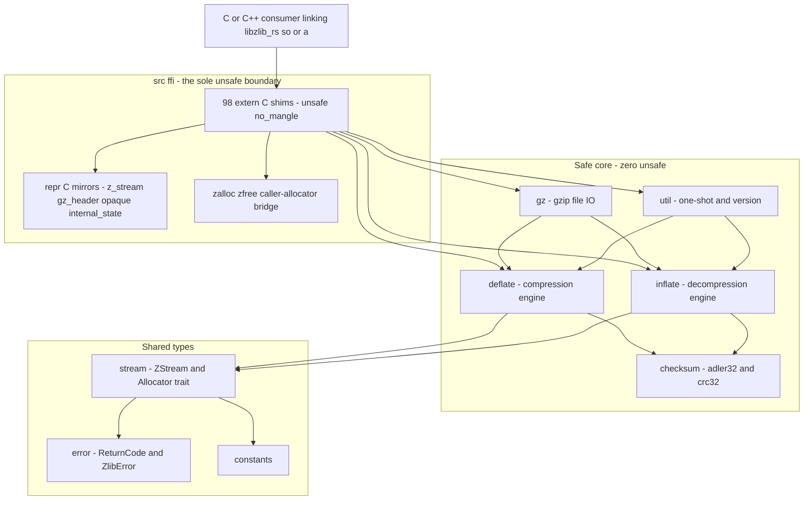

# Technical Specifications

`zlib-rs` is a memory-safe, idiomatic Rust rewrite of the **zlib 1.3.2.1**
compression library. It reimplements the DEFLATE ([RFC 1951](rfc1951.txt)),
zlib ([RFC 1950](rfc1950.txt)), and gzip ([RFC 1952](rfc1952.txt)) formats in
safe Rust, produces compressed output that is **byte-for-byte identical** to the
reference C implementation, and ships as both an idiomatic Rust crate
(`zlib_rs`) and a C-ABI drop-in replacement for the C `libz` shared and static
libraries.

This document is the technical reference for the crate as it actually exists in
this repository. For a narrative overview and usage examples see the
[Home](index.md) page and the [Project Guide](project-guide.md); this page
focuses on architecture, the C-ABI boundary, the wire-format guarantees, and the
validation strategy.

!!! note "Status: experimental — active migration"
    The crate is being brought up as a faithful Rust reimplementation and its
    Rust API surface may still shift while parity work continues. It tracks
    upstream `zlib 1.3.2.1-motley` (`ZLIB_VERNUM 0x1321`). Compression and
    decompression correctness together with byte-identical format compatibility
    are the primary acceptance criteria and are validated by default. The core
    codecs are functionally complete and validated, but the project is not yet
    labelled unqualified "production-ready" (Backstage `spec.lifecycle:
    experimental`).

This is a **same-repository** migration. The complete upstream zlib C sources
(`deflate.c`, `inflate.c`, `crc32.c`, `zlib.h`, `zlib.map`, and peers) are
**retained in-repo** as the authoritative behavioral and ABI reference — the
oracle against which the Rust port is measured. They are **not deleted**; the
`Cargo.toml` `exclude` list simply keeps the C files, the legacy platform
directories, and the C build scripts out of the *published* `.crate` package
(`exclude` never affects `cargo build`, `test`, or `bench` in the workspace).

---

## 1. Scope and objectives

The migration reimplements the full zlib functional surface in safe Rust while
preserving three hard guarantees:

- **Binary / wire-format compatibility** — for a given input, compression level,
  strategy, and framing, the compressed output is byte-identical to reference C
  zlib `1.3.2.1-motley`.
- **Exact C ABI** — `extern "C"` shims mirror every `zlib.h` prototype, with
  `#[repr(C)]` mirrors of `z_stream` and `gz_header`, classic integer return
  codes, and an exported-symbol set governed by the `zlib.map` version script.
- **Zero `unsafe` in the compression core** — the deflate, inflate, checksum,
  gzip-I/O, and utility engines are 100% safe Rust; all `unsafe` is confined to
  the C-ABI boundary in `src/ffi/`.

Only the DEFLATE family (raw DEFLATE, zlib, and gzip framings) is in scope.
Other formats and algorithms (bzip2, lzma, zstd) and any standalone GUI or CLI
product are explicitly out of scope.

---

## 2. Architecture overview

The crate is organized as a **safe core** wrapped by a thin **unsafe boundary**.
Every C idiom (manual allocation, integer-tagged state, function-pointer
dispatch, preprocessor conditionals) is replaced by a safe Rust equivalent, and
the only place raw C pointers are handled is a single dedicated FFI tree.

- **Safe core** — `deflate/`, `inflate/`, `checksum/`, `gz/`, and `util/`
  contain **zero actual `unsafe`**. The inflate fast path (`src/inflate/fast.rs`)
  is included in this guarantee: it is written entirely in safe Rust with no raw
  pointer arithmetic. Several core modules additionally carry an explicit
  `#![deny(unsafe_code)]` / `#![forbid(unsafe_code)]` attribute to enforce the
  invariant at compile time.
- **Unsafe boundary** — `src/ffi/` holds every `extern "C"` shim, the
  `#[repr(C)]` struct mirrors, and the caller-allocator bridge. It is the sole
  location of `unsafe` in the default `std` build. A `no_std` build adds exactly
  one more location: a small libc-backed `#[global_allocator]` and
  `#[panic_handler]` in `src/lib.rs`, plus the `AllocHook` / `ForeignBuffer`
  allocator bridge in `src/stream.rs`.
- **Shared types** — `stream.rs` (the `ZStream` handle and the `Allocator`
  trait), `error.rs` (`ReturnCode` / `ZlibError`), and `constants.rs` are used
  by both layers.
- **One-way dependency** — the dependency direction is strictly `ffi → core`;
  the safe core never imports from `ffi`. This keeps `unsafe` from leaking
  inward. Every `unsafe` operation in shipped code carries an adjacent
  `// SAFETY:` justification (283 in total), and Clippy's
  `undocumented_unsafe_blocks` lint is clean.



The arrows flow one way: a C consumer calls into the `src/ffi/` shims; the shims
convert raw pointers into safe references and delegate to the safe core; the
core builds on the shared types. The core has **no** dependency on `src/ffi/`.

---

## 3. Module reference

The crate is a layered `src/` module tree (40 Rust source files) that mirrors
the functional decomposition of the C baseline. Each Rust module (or group) is a
semantic port of one or more C translation units; the C file is the behavioral
oracle, not a mechanical transpilation source.

| Rust module | Ported from (C reference) | Responsibility |
|-------------|---------------------------|----------------|
| `lib.rs` | `zlib.h` | Crate root, `no_std` switch, module declarations, public re-exports |
| `constants.rs` | `zconf.h`, `zlib.h` | Flush modes, levels, strategies, `windowBits`, method / data-type constants |
| `error.rs` | `zlib.h` | `ReturnCode` / `ZlibError` from the `Z_OK` … `Z_VERSION_ERROR` codes |
| `stream.rs` | `z_stream`, `zalloc` / `zfree` (`zutil.c` / `zutil.h`) | `ZStream` handle plus the `Allocator` trait and `DefaultAllocator` |
| `gz_header.rs` | `zlib.h`, `gzguts.h` | `GzHeader` safe representation of the RFC 1952 gzip header |
| `deflate/` (`mod`, `state`, `fast`, `slow`, `rle`, `stored`, `huff`, `strategy`, `trees`) | `deflate.c`, `deflate.h`, `trees.c`, `trees.h` | Compression engine, match finders, block producers, Huffman trees |
| `inflate/mod`, `inflate/state` | `inflate.c`, `inflate.h` | `inflate()` driver and the `InflateMode` / `InflateState` machine |
| `inflate/fast` | `inffast.c`, `inffast.h` | The `inflate_fast` decode loop (safe Rust, zero `unsafe`) |
| `inflate/back` | `infback.c` | `inflateBack` / `inflateBackInit` / `inflateBackEnd` |
| `inflate/fixed` | `inffixed.h` | The `LENFIX` / `DISTFIX` fixed Huffman tables |
| `inflate/tables` | `inftrees.c`, `inftrees.h` | The `inflate_table` builder and the `Code` decode-table type |
| `checksum/adler32` | `adler32.c` | Adler-32 and `adler32_combine` |
| `checksum/crc32` | `crc32.c`, `crc32.h` | CRC-32/IEEE and the `crc32_combine` family |
| `gz/` (`mod`, `open`, `read`, `write`, `close`, `state`) | `gzlib.c`, `gzread.c`, `gzwrite.c`, `gzclose.c`, `gzguts.h` | gzip file-I/O layer (the `gz*` API) |
| `util/compress` | `compress.c` | `compress` / `compress2` / `compressBound` |
| `util/uncompress` | `uncompr.c` | `uncompress` / `uncompress2` |
| `util/version` | `zutil.c` | `zlibVersion` / `zlibCompileFlags` / `zError` |
| `ffi/` (`mod`, `types`, `alloc`, `deflate`, `inflate`, `gz`, `util`) | `zlib.h` prototypes | The C-ABI boundary and the sole `unsafe` tree |

---

## 4. Design patterns

Each C idiom maps to a specific safe-Rust pattern. This is a semantic
reimplementation: observable behavior (wire output, return codes, error
conditions) is preserved while the internal structure becomes idiomatic Rust.

| C idiom | Rust replacement |
|---------|------------------|
| Manual `zcalloc` / `zcfree` and raw pointers | RAII / ownership — engine state held as `Option<Box<InflateState>>` (and the deflate equivalent); dropping the handle frees the window buffer automatically, so there is no explicit free path |
| `zalloc` / `zfree` function-pointer hooks | An `Allocator` trait plus `DefaultAllocator` (dependency injection); caller-supplied C allocators are bridged at the FFI boundary |
| Integer-tagged state (`inflate_mode`) | Exhaustively-matched `enum`s — `InflateMode` for the inflate state machine and `BlockState` for the deflate block lifecycle |
| The `configuration_table` of function pointers | A `CompressFunc` tag enum plus `select_compress_func(level, strategy)` — the strategy pattern **without function pointers** |
| Bare integer return values | Typed `ReturnCode` / `ZlibError`, converted to the classic zlib integers **only** at the FFI boundary |
| `#ifdef GZIP` / `NO_GZCOMPRESS` / `Z_SOLO` / `INFLATE_STRICT` | Cargo feature flags (`gzip`, `gz-io`, `no-std`, `inflate_strict`) resolved with `cfg-if` |
| The checked-in `crc32.h` lookup tables | Build-time codegen — `build.rs` reimplements `make_crc_table()` and emits `crc32_tables.rs` into `OUT_DIR`, which `checksum/crc32.rs` pulls in with `include!` |

---

## 5. FFI / C-ABI boundary

The entire C-ABI surface lives in `src/ffi/` and is the sole `unsafe` tree in
the default build. It is a thin adapter: it validates and converts raw C
pointers into safe Rust references, delegates to the safe core, and converts
typed Rust errors back into classic zlib integer return codes.

- **Exported shims.** There are **98** `#[unsafe(no_mangle)] extern "C"` shim
  definitions, each mirroring a `zlib.h` prototype. They are declared with the
  Rust 2024-edition `#[unsafe(no_mangle)]` attribute (the edition-2024 form of
  `#[no_mangle]`) and as `pub unsafe extern "C" fn`. The breakdown by file is:
  `deflate.rs` 17, `inflate.rs` 22, `gz.rs` 34, `util.rs` 25 (`mod.rs` and
  `types.rs` carry no exports — `mod.rs` is a pure re-export facade and
  `types.rs` only defines the `#[repr(C)]` mirrors). These 98 definitions
  compile to **96 unique exported symbols** per build, because `gzdopen` and
  `inflateGetHeader` each have two `cfg`-gated variants of which exactly one is
  selected per configuration.
- **`#[repr(C)]` mirrors.** `types.rs` defines layout-compatible mirrors of the
  C `z_stream` and `gz_header` structs, reproducing the C field order and type
  widths so the emitted object can substitute for `libz` without recompiling
  downstream code.
- **Opaque handle.** `internal_state` is an **opaque** `#[repr(C)]` type — a
  private, zero-sized marker with no public constructor — so C callers can
  neither fabricate nor inspect engine state. The public handle type is
  `z_streamp = *mut z_stream`.
- **Panic containment.** A Rust panic must never unwind across an `extern "C"`
  boundary (that is undefined behavior). Every fallible shim wraps its safe call
  in `catch_unwind` (gated on the `std` feature) as the first line of defense.
  As a second, always-on line of defense, `panic = "abort"` is set globally in
  both build profiles, so a genuine internal panic aborts the process rather
  than unwinding into C.
- **Return codes.** The classic integer contract (`Z_OK = 0` …
  `Z_VERSION_ERROR = -6`), buffer bounds, and streaming semantics are surfaced
  at the boundary exactly as C callers expect, even though the internal
  implementation uses Rust `Result` types.

!!! note "Variadic `gzprintf` / `gzvprintf`"
    Both symbols are always exported so the artifact presents the complete zlib
    symbol table. Because rendering a C `va_list` requires the unstable nightly
    `c_variadic` feature — which would break the stable build and the MSRV
    contract — the two FFI shims ship the documented no-`vsnprintf` zlib build
    variant: they return `Z_STREAM_ERROR`, and `zlibCompileFlags` reports this
    by setting bit 27. The idiomatic Rust `gzprintf` (which takes
    `core::fmt::Arguments` instead of a C `va_list`) formats fully.

---

## 6. ABI contract (`zlib.map`)

`zlib.map` is the linker **version script** — the exported-symbol visibility and
versioning contract retained from the C build (the C CMake build linked the
shared and static objects against it via `--version-script`). It is a
first-class part of the specification, not an out-of-scope artifact.

The script is organized into 16 versioned nodes (`ZLIB_1.2.0` through
`ZLIB_1.3.2`). Its `ZLIB_1.2.0` … `ZLIB_1.2.12` nodes codify the **canonical
47-symbol zlib ABI** — the classic public zlib symbol set (`compressBound`,
`deflateBound`, `inflateBack`, `inflateCopy`, the `adler32_combine` /
`crc32_combine` family, the `gz*` entry points, and their peers). This crate
exports that canonical set and extends it with a small number of additional
versioned symbols in the `ZLIB_1.3.1.2` and `ZLIB_1.3.2` nodes (`deflateUsed`
and the `_z`-suffixed one-call aliases). Internal helpers that must never be
exported (`deflate_copyright`, `inflate_copyright`, `inflate_fast`,
`inflate_table`, `zcalloc`, `zcfree`, and peers) are hidden behind the script's
`local:` sections plus a `_*` catch-all.

**Relationship to the FFI shims (do not conflate the two counts):** the 98
`#[unsafe(no_mangle)] extern "C"` shims in `src/ffi/` *implement* the `zlib.h`
prototypes; `zlib.map` is the version script that *governs which symbols are
exported* from the `cdylib` / `staticlib` and how they are version-tagged. The
shim count (implementation surface) and the version-script entry count
(visibility contract) are different views of the same C-ABI drop-in guarantee.

ABI-level identity is anchored by `zlibVersion()`, which returns the full
upstream string `"1.3.2.1-motley"` at runtime (the Cargo package `version`
field is the SemVer-legal `1.3.2`, deliberately separate from that runtime
string).

---

## 7. Byte-identity and wire-format compatibility

The strongest guarantee of the migration is **byte-identity**: for a given
`(input, level, strategy, framing)` tuple, the compressed output is
byte-for-byte identical to reference C zlib `1.3.2.1-motley` — a stronger
property than mere round-trip correctness.

- **Strict byte-identity gate.** `tests/interop.rs` checks zlib-rs output
  against **deterministic C-oracle vectors** baked from the genuine C encoder
  (`deflateInit2` + `deflate(Z_FINISH)`, `memLevel = 8`). The vectors (300 baked
  vectors) span every compression level (`-1..=9`), all five deflate strategies,
  and the zlib, raw-DEFLATE, gzip, and small-`windowBits` framings. Because the
  reference bytes are precomputed constants, this gate runs in CI with **no C
  toolchain**.
- **Bidirectional decode compatibility.** The crate's zlib (RFC 1950), raw
  DEFLATE (RFC 1951), and gzip (RFC 1952) streams interoperate in both
  directions with the independently authored `flate2` crate (using its pure-Rust
  `miniz_oxide` backend) across every framing. Decompression accepts any valid
  zlib, raw-DEFLATE, or gzip stream, including streams produced by other
  implementations.

The data formats are specified by the vendored RFCs and the classic algorithm
notes, all retained under `doc/`:

- [RFC 1950](rfc1950.txt) — ZLIB Compressed Data Format.
- [RFC 1951](rfc1951.txt) — DEFLATE Compressed Data Format.
- [RFC 1952](rfc1952.txt) — GZIP File Format.
- [DEFLATE algorithm notes](algorithm.txt) — the compression algorithm summary.

---

## 8. Checksums

Both stream-trailer checksums are ported to match the reference bit-for-bit:

- **Adler-32** — the RFC 1950 zlib trailer, in `checksum/adler32.rs`.
- **CRC-32/IEEE** — the RFC 1952 gzip trailer, in `checksum/crc32.rs`.

The canonical known-answer test holds: `crc32(0, b"123456789") == 0xCBF4_3926`
(asserted in `tests/checksum.rs`). The stream-combining operations that
reference implementations rely on for parallel and segmented checksums are
present and parity-checked against the reference:

- `adler32_combine`;
- `crc32_combine`, plus the `crc32_combine_gen` / `crc32_combine_op` pair;
- the 32- and 64-bit FFI variants `adler32_combine` / `adler32_combine64`.

The CRC-32 hot path is SIMD-accelerated through the optional `crc32fast`
dependency (measured at roughly **1.6× C throughput**), with a portable scalar
fallback when the `simd` feature is off. The lookup tables consumed by the
scalar path are regenerated at build time by `build.rs` (a faithful Rust port of
the C `make_crc_table()` routine), emitted into `OUT_DIR` as `crc32_tables.rs`
and pulled in with `include!` — replacing the checked-in `crc32.h` table header
from the C baseline.

---

## 9. Feature flags

Cargo features replace the C preprocessor conditionals. The names and defaults
below are the authoritative contract and are kept in sync with `Cargo.toml` and
the project `README.md`. The default set is `std`, `gzip`, `gz-io`, `simd`.

| Feature | Default | C conditional | Effect |
|---------|:-------:|---------------|--------|
| `std` | Yes | — | Standard-library build: enables `std::io` / `std::fs` for the gz layer and the `catch_unwind` panic guards. When off, the crate is `#![no_std]` + `alloc`. |
| `gzip` | Yes | `#ifdef GZIP` | gzip framing within the deflate / inflate engines. |
| `gz-io` | Yes | `#ifndef NO_GZCOMPRESS` | gzip **file**-I/O layer (the `gz*` API); implies `std` + `gzip`. |
| `no-std` | No | `Z_SOLO` | Convenience marker for a core-only, bare-metal build with no gz file I/O (built via `--no-default-features`). |
| `simd` | Yes | — | SIMD-accelerated CRC-32 via the optional `crc32fast` dependency (`dep:crc32fast`). |
| `inflate_strict` | No | `INFLATE_STRICT` | Stricter inflate distance validation. Off by default so the default build stays byte-exact with reference zlib; enable only to reject out-of-window distances early. |

The genuine `no_std` switch in `src/lib.rs` is
`#![cfg_attr(all(not(feature = "std"), not(test), panic = "abort"), no_std)]`:
the shipped artifact (`cargo build --no-default-features`) is genuinely
`#![no_std]` + `alloc`, while `cargo test --no-default-features` keeps the
libtest harness linked yet still exercises every `not(feature = "std")` code
path.

---

## 10. Build and artifacts

The crate builds with a stock Cargo toolchain — no CMake, `./configure`, or
`make` required. `Cargo.toml` and `build.rs` together replace the C project's
CMake / autotools build; the Bazel files (`BUILD.bazel`, `MODULE.bazel`) are
retained for interop but excluded from the published crate.

- **Crate type.** `crate-type = ["lib", "cdylib", "staticlib"]` emits the Rust
  library plus the C dynamic and static libraries:
  `target/release/libzlib_rs.rlib`, `libzlib_rs.so`, and `libzlib_rs.a`. The
  `cdylib` is the drop-in `libz` replacement (it can be injected via
  `LD_PRELOAD`); the `staticlib` is for static linking.
- **Toolchain.** Edition **2024**; minimum supported Rust version (MSRV)
  **1.85.0** (the release that stabilized the 2024 edition).
- **Build profiles.** Both `[profile.release]` and `[profile.dev]` set
  `panic = "abort"`. This is required — not merely preferred — because a
  `no_std` `cdylib` / `staticlib` cannot be code-generated with an unwinding
  panic runtime on stable Rust, and it also makes the abort-at-FFI-boundary
  guarantee concrete. The release profile additionally sets `opt-level = 3`,
  `lto = true`, and `codegen-units = 1`.
- **Build script.** `build.rs` regenerates the CRC-32 lookup tables into
  `OUT_DIR` at build time, replacing the checked-in `crc32.h` tables from the C
  baseline.

Common commands:

```sh
# Build (debug / optimized); release emits libzlib_rs.{rlib,so,a}
cargo build
cargo build --release

# Core-only, no-standard-library configuration
cargo build --no-default-features

# Full test suite (unit, integration, and doc tests)
cargo test
cargo test --no-default-features

# Lint and formatting gates
cargo clippy --all-targets -- -D warnings
cargo fmt -- --check
```

---

## 11. Validation and testing strategy

Correctness and byte-identical compatibility are the primary acceptance
criteria, validated by a layered strategy:

- **Integration tests** — 68 `#[test]` functions across six files in `tests/`.
- **Unit tests and doctests** — colocated with the modules and re-exported API.
- **Fuzzing** — a detached `cargo-fuzz` crate under `fuzz/` ships five libFuzzer
  targets (`fuzz_inflate`, `fuzz_deflate_roundtrip`, `fuzz_gzip`,
  `fuzz_checksum`, `fuzz_ffi_roundtrip`) driven by `libfuzzer-sys`.
- **Property tests** — randomized round-trip properties via `quickcheck`.
- **C drop-in linkage** — the emitted `cdylib` / `staticlib` are exercised as a
  `libz` replacement.

The integration suite breaks down as follows:

| Test file | `#[test]` count | Focus |
|-----------|:---------------:|-------|
| `tests/checksum.rs` | 18 | Adler-32 / CRC-32 known-answer tests and `*_combine` parity |
| `tests/interop.rs` | 14 | Byte-identity vs the C oracle plus bidirectional `flate2` compatibility |
| `tests/round_trip.rs` | 12 | Compress then decompress across levels and strategies |
| `tests/regression.rs` | 11 | Regression guards |
| `tests/inflate_coverage.rs` | 7 | Inflate edge-case coverage (from `infcover.c`) |
| `tests/gzip_compat.rs` | 6 | gzip framing compatibility |

Beyond the integration suite, the aggregate default-configuration run reports
487/487 tests passing, and the `no_std` configuration reports 363/363 passing.
Continuous integration runs the build, test, and quality gates in
`.github/workflows/ci.yml` (including the `no_std` suite as a blocking gate), and
`.github/workflows/fuzz.yml` builds every fuzz target and runs each for a bounded
budget.

Measured performance against C zlib `1.3.2.1-motley` (single Linux host, 8 MiB
inputs, release build), with byte-identical output confirmed in every case, is
approximately 77–90% of C for compression, 78–115% of C for decompression, and
1.6× C for CRC-32 via the SIMD hot path. These figures vary by workload and
hardware; closing the remaining compression gap is ongoing.

---

## 12. Dependencies

The C baseline linked only the C standard library. The Rust target replaces that
with a minimal, pure-Rust dependency set, and the **shipped artifact carries
zero C dependencies**.

| Package | Version | Scope | Purpose |
|---------|---------|-------|---------|
| `cfg-if` | 1.0.4 | Runtime (always) | Ergonomic compile-time `cfg` branching |
| `crc32fast` | 1.5.0 | Runtime (optional, `simd`) | SIMD-accelerated CRC-32 hot path (`default-features = false`) |
| `criterion` | 0.5.1 | Dev | Statistical benchmarking (all benches `harness = false`) |
| `flate2` | 1.1.9 | Dev | Independent codec for interop cross-checks (pure-Rust `miniz_oxide` backend) |
| `quickcheck` | 1.1.0 | Dev | Property-based testing |
| `rand` | 0.9.4 | Dev | Randomized test-input generation |
| `libfuzzer-sys` | 0.4 | Fuzz (detached) | libFuzzer harness for the `fuzz/` targets |

The runtime dependency surface of the shipped library is only `cfg-if` (always)
plus `crc32fast` (when the `simd` feature is enabled) — both pure Rust. `flate2`
resolves its pure-Rust `miniz_oxide` backend (`0.8.9`) for the interop tests, so
the test graph needs no C toolchain either.

---

## 13. References

- [Home](index.md) — documentation home and quick overview.
- [Project Guide](project-guide.md) — developer and onboarding guide.
- [RFC 1950](rfc1950.txt) — ZLIB Compressed Data Format.
- [RFC 1951](rfc1951.txt) — DEFLATE Compressed Data Format.
- [RFC 1952](rfc1952.txt) — GZIP File Format.
- [DEFLATE algorithm notes](algorithm.txt) — compression algorithm summary.
- [Text-vs-binary detection notes](txtvsbin.txt) — the heuristic behind the
  `Z_TEXT` / `Z_BINARY` data-type reporting.
- The retained root C sources (`deflate.c`, `inflate.c`, `crc32.c`, and peers)
  together with `zlib.h` and `zlib.map` — the behavioral and ABI reference for
  the port.

